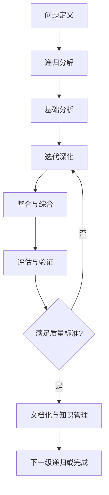
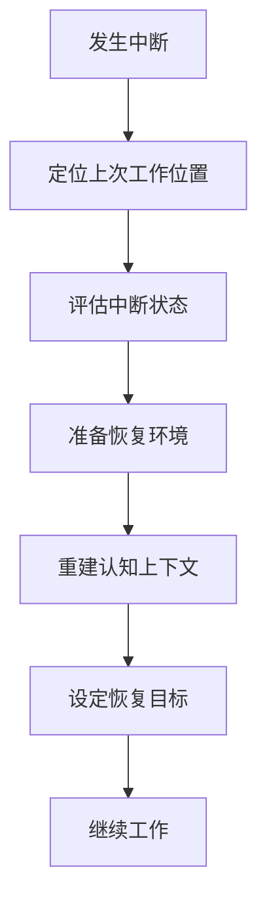
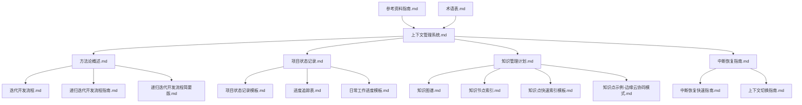

# IoT行业软件架构分析项目 - 上下文管理指南

## 1. 上下文管理系统概述

上下文管理系统是IoT行业软件架构分析项目的核心支持系统，旨在保持项目分析工作的连续性和一致性，确保在中断后能够快速恢复工作状态，减少上下文切换成本，提高研究效率。本系统通过结构化文档、状态跟踪和知识关联，建立完整的项目上下文，支持多层次的项目导航和状态恢复。

### 1.1 系统目标

1. **保持认知连续性**：减少工作中断造成的上下文丢失
2. **加速恢复进度**：提供快速重新进入工作状态的机制
3. **维护知识一致性**：确保分析过程中概念和方法的一致应用
4. **支持递进式研究**：为基于已有成果的深入研究提供基础
5. **降低协作成本**：为多人协作提供共享的上下文环境

### 1.2 系统架构

上下文管理系统由以下核心组件构成：

- **项目状态管理**：记录和跟踪项目整体进度和状态
- **知识结构管理**：维护项目知识体系和关联关系
- **过程管理**：支持分析方法和流程的一致应用
- **资源管理**：组织和索引项目相关资源
- **恢复机制**：提供中断后的快速恢复路径

## 2. 核心文档体系

### 2.1 系统概述文档

| 文件名 | 用途 | 更新频率 |
|--------|------|----------|
| [上下文管理系统.md](./上下文管理系统.md) | 系统总体说明和组件索引 | 重大变更时 |
| [上下文管理系统更新版.md](./上下文管理系统更新版.md) | 系统最新版本和增强功能 | 主要版本更新时 |
| [上下文管理文件索引.md](./上下文管理文件索引.md) | 提供所有上下文管理文件的集中索引 | 文件结构变更时 |

### 2.2 方法与流程文档

| 文件名 | 用途 | 更新频率 |
|--------|------|----------|
| [方法论概述.md](./方法论概述.md) | 概述项目采用的研究方法论 | 方法调整时 |
| [迭代开发流程.md](./迭代开发流程.md) | 详细描述递归迭代开发流程 | 流程优化时 |
| [递归迭代开发流程指南.md](./递归迭代开发流程指南.md) | 提供完整的递归迭代开发指导 | 重大方法变更时 |
| [递归迭代开发流程简要版.md](./递归迭代开发流程简要版.md) | 提供简化版开发流程 | 主流程变更时 |

### 2.3 状态管理文档

| 文件名 | 用途 | 更新频率 |
|--------|------|----------|
| [项目状态记录.md](./项目状态记录.md) | 记录当前项目状态和进展 | 每次工作结束时 |
| [项目状态记录模板.md](./项目状态记录模板.md) | 提供状态记录标准模板 | 模板调整时 |
| [进度追踪表.md](./进度追踪表.md) | 详细记录各模块完成情况 | 模块状态变更时 |
| [日常工作进度模板.md](./日常工作进度模板.md) | 提供日常工作记录模板 | 模板调整时 |

### 2.4 知识管理文档

| 文件名 | 用途 | 更新频率 |
|--------|------|----------|
| [知识管理计划.md](./知识管理计划.md) | 定义知识获取和组织策略 | 季度审核 |
| [知识图谱.md](./知识图谱.md) | 可视化展示知识体系和关联 | 知识结构变更时 |
| [知识节点索引.md](./知识节点索引.md) | 提供知识点快速检索 | 新增知识点时 |
| [术语表.md](./术语表.md) | 统一项目术语定义和使用 | 新术语出现时 |
| [知识点快速索引模板.md](./知识点快速索引模板.md) | 创建知识点索引的标准模板 | 模板调整时 |

### 2.5 中断恢复文档

| 文件名 | 用途 | 更新频率 |
|--------|------|----------|
| [中断恢复指南.md](./中断恢复指南.md) | 提供工作中断后的恢复步骤 | 恢复机制变更时 |
| [中断恢复快速指南.md](./中断恢复快速指南.md) | 提供简化的快速恢复步骤 | 随主指南更新 |
| [上下文切换指南.md](./上下文切换指南.md) | 指导不同研究主题间的切换 | 切换机制优化时 |

### 2.6 参考资源文档

| 文件名 | 用途 | 更新频率 |
|--------|------|----------|
| [参考资料指南.md](./参考资料指南.md) | 组织项目参考资源和引用方式 | 添加新资源时 |
| [知识点示例-边缘云协同模式.md](./知识点示例-边缘云协同模式.md) | 展示知识点记录的标准格式 | 不定期更新 |

## 3. 递归迭代开发流程

### 3.1 核心流程模型

### 3.2 递归层次结构

IoT软件架构分析项目采用以下递归层次结构：

1. **L1: 行业架构层** - 行业趋势、标准规范、生态系统
2. **L2: 企业架构层** - 业务架构、应用架构、数据架构、技术架构
3. **L3: 系统架构层** - 系统分解、组件关系、接口定义、质量属性
4. **L4: 子系统架构层** - 子系统设计、模块组织、交互模式、技术选择
5. **L5: 模块设计层** - 模块内部结构、算法选择、数据结构、实现考虑

### 3.3 迭代类型

1. **微迭代**：1-2天，适用于单一概念或组件的快速分析
2. **标准迭代**：1周，适用于中等复杂度的分析任务
3. **扩展迭代**：2-4周，适用于复杂系统或跨领域分析

## 4. 中断恢复机制

### 4.1 恢复流程概述

### 4.2 恢复深度判断

| 中断时长 | 恢复深度 | 主要恢复文档 |
|---------|---------|------------|
| < 1天（短暂） | 浅层恢复 | 项目状态记录、进度追踪表 |
| 1-7天（中等） | 中层恢复 | 上述文档 + 知识图谱、知识节点索引、相关模块文档 |
| > 7天（长期） | 深层恢复 | 上述文档 + 方法论概述、术语表、参考资料指南 |

### 4.3 不同类型中断的恢复策略

1. **短暂中断恢复 (< 1天)**
   - 快速浏览项目状态记录和进度追踪表
   - 查看中断前的笔记和最后编辑的文档
   - 设定明确的短期目标立即开始工作

2. **中等中断恢复 (1-7天)**
   - 全面回顾项目状态记录和当前模块文档
   - 参考知识图谱重建知识关联
   - 通过知识节点索引快速找到相关知识点
   - 设定渐进式的恢复计划

3. **长期中断恢复 (> 7天)**
   - 系统性回顾整个上下文管理系统的文档
   - 深入复习方法论概述和术语表
   - 重新学习项目的核心概念和架构
   - 制定详细的多阶段恢复计划

## 5. 知识管理体系

### 5.1 知识结构

IoT软件架构分析项目的知识体系分为六个核心层次：

- **应用层**: 设备管理、数据分析、可视化、业务逻辑
- **服务层**: API网关、微服务、工作流引擎、事件处理
- **数据层**: 数据存储、流处理、批处理、数据集成
- **通信层**: 消息协议、API协议、连接管理、网络安全
- **边缘层**: 边缘计算、本地存储、设备协议、OTA更新
- **感知层**: 传感器、执行器、设备驱动、固件

### 5.2 知识点组织

每个知识点应包含以下要素：

1. **基本信息**: 名称、类别、创建日期、更新日期
2. **定义**: 清晰简洁的概念定义
3. **形式化表示**: 数学或形式化定义（如适用）
4. **关键属性**: 重要特性和属性
5. **关系网络**: 与其他知识点的关系
6. **实现技术**: 相关的技术实现方案
7. **应用场景**: 典型应用场景和案例
8. **参考资料**: 相关参考资源

### 5.3 知识导航路径

本系统提供多种知识导航路径：

1. **结构化导航**：通过知识节点索引的分类体系导航
2. **关联导航**：通过知识图谱的关联关系探索相关概念
3. **术语导航**：通过术语表理解概念定义和关系
4. **资源导航**：通过参考资料指南查找相关资源
5. **方法导航**：通过方法论概述理解分析方法和流程

## 6. 日常工作流程

### 6.1 开始工作流程

1. **状态回顾**:
   - 查阅项目状态记录了解当前状态
   - 检查进度追踪表确认待完成任务
   - 参考知识图谱理解相关知识上下文

2. **工作规划**:
   - 确定当天工作目标和重点
   - 创建日常工作进度记录
   - 准备必要的参考资料和工具

3. **环境准备**:
   - 打开相关文档和工具
   - 设置适合的工作环境
   - 确保所需资源可用

### 6.2 工作过程中

1. **方法应用**:
   - 遵循递归迭代开发流程的步骤和方法
   - 参考术语表确保术语使用一致
   - 使用知识节点索引快速查找相关知识点

2. **进度记录**:
   - 定期更新日常工作进度
   - 记录重要发现和决策
   - 标记完成的任务和新出现的问题

3. **质量控制**:
   - 应用质量标准评估工作成果
   - 进行自我审查和验证
   - 必要时寻求同行评审

### 6.3 结束工作流程

1. **成果整理**:
   - 整理当天的工作成果
   - 确保文档已保存和版本控制
   - 更新相关知识点和索引

2. **状态更新**:
   - 更新项目状态记录记录当前进度
   - 更新进度追踪表标记完成的任务
   - 必要时扩展知识图谱和知识节点索引

3. **下次计划**:
   - 记录未完成的工作和思路
   - 设定下次工作的起点和目标
   - 准备必要的过渡笔记

## 7. 质量保证体系

### 7.1 质量属性

递归迭代开发过程中应关注以下分析质量属性：

1. **完整性**：分析是否涵盖所有相关方面
2. **一致性**：不同部分之间是否保持一致
3. **正确性**：分析结果是否准确反映实际
4. **清晰性**：分析是否清晰易懂
5. **可追溯性**：分析决策是否可追溯
6. **可验证性**：分析结果是否可验证

### 7.2 质量控制活动

在递归迭代过程中应执行以下质量控制活动：

1. **同行评审**：每个迭代结束时进行技术准确性和完整性评审
2. **一致性检查**：检查跨层次和跨领域的一致性
3. **形式化验证**：对关键属性进行形式化验证
4. **文档标准检查**：确保文档符合项目标准
5. **知识整合验证**：验证新知识与现有知识的整合

### 7.3 持续改进机制

上下文管理系统采用以下机制持续改进：

1. **使用反馈收集**：记录系统使用中的问题和改进建议
2. **效率度量**：评估恢复速度和上下文保持程度
3. **完整性检查**：定期审核系统是否覆盖所有必要信息
4. **一致性验证**：确保各组件之间信息的一致性
5. **易用性优化**：基于使用体验改进导航和查询机制

## 8. 项目当前状态

### 8.1 总体进展

当前项目处于**系统化分析阶段**，已完成核心分析模块的开发，正在进行高级分析模块的设计与实现。

- **总体完成度**：38%
- **核心模块**：15/15 (100%)
- **高级模块**：8/25 (32%)
- **应用案例**：3/10 (30%)

### 8.2 关键里程碑

| 里程碑 | 状态 | 完成日期 |
|--------|------|---------|
| 项目初始化 | ✅ 已完成 | 2024-10-15 |
| 基础框架构建 | ✅ 已完成 | 2024-11-01 |
| 核心模块完成 | ✅ 已完成 | 2024-12-10 |
| 高级模块完成 | ⏳ 进行中 | 预计2025-03-15 |
| 应用案例分析 | ⏳ 进行中 | 预计2025-04-20 |
| 系统验证与评估 | 📅 计划中 | 预计2025-05-15 |
| 项目总结与发布 | 📅 计划中 | 预计2025-06-01 |

### 8.3 当前焦点

- **重点领域**：边缘计算架构分析、微服务设计模式、安全架构设计
- **关键任务**：完成边缘-云协同模式的形式化描述
- **优先资源**：边缘计算参考架构、微服务设计模式案例

## 9. 未来发展规划

### 9.1 短期目标 (1-3个月)

1. **内容整合与结构优化**
   - 统一数学符号与定义系统
   - 优化目录结构
   - 补充跨领域引用

2. **质量提升计划**
   - 代码实现质量审核
   - 术语表完善

### 9.2 中期目标 (4-12个月)

1. **专题深化研究**
   - 边缘智能研究
   - 安全架构研究
   - 高级通信模型研究

2. **行业领域应用研究**
   - 工业物联网参考架构
   - 智慧城市物联网平台
   - 医疗物联网安全架构
   - 车联网系统架构

3. **工程实践工具开发**
   - 架构评估框架
   - 性能建模工具
   - 架构图自动生成工具
   - 代码生成工具

### 9.3 长期目标 (1-3年)

1. **理论突破方向**
   - 形式化IoT系统理论
   - 可组合架构模型
   - 时空计算模型
   - IoT系统自适应理论

2. **新兴技术融合**
   - 量子安全IoT架构
   - 区块链与IoT融合架构
   - 自主系统架构
   - 分子与生物计算在IoT中的应用

3. **标准化与开源社区建设**
   - 提出架构描述标准
   - 参与国际标准制定
   - 建立开源参考实现
   - 构建社区生态

## 10. 文件关系图

## 11. 分层递归导航与交叉引用

- 本系统支持五层递归分解导航：行业、企业、系统、子系统、模块
- 各层级内容均可通过本地交叉引用跳转，详见[上下文管理系统](../context_management.md)
- 递归分层导航与交叉引用自动同步到[知识图谱](./知识图谱.md)、[术语表](./术语表.md)

## 12. 递归迭代开发流程与知识图谱集成

- 递归分解与迭代改进结合，详见[递归迭代开发流程指南](./递归迭代开发流程指南.md)
- 每次递归/迭代均自动记录进度、状态、决策、未完成事项，便于中断恢复
- 进度、状态、知识点、术语、引用全部自动同步到相关文档
- 详见[上下文切换指南](./上下文切换指南.md)

## 13. 多表征内容生成规范

- 每个主题/子主题均需包含：定义、理论、模型、图表（Mermaid/表格）、数学表达式（LaTeX）、形式化证明、Rust/Go代码、行业最佳实践、开源组件推荐
- 代码示例优先Rust/Go，注释中英双语
- 目录、内容、引用全部本地化，外部材料给出网络链接
- 语义合并、去重、分类、重构，保证内容不重复、不遗漏、不交叉，层次清晰

---

**文档版本**: v1.0  
**创建日期**: 2024年12月28日  
**最后更新**: 2024年12月28日  
**状态**: 正式发布
