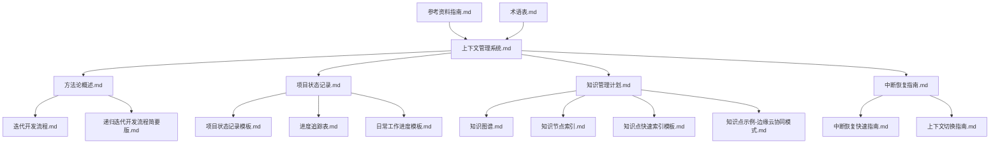

# IoT行业软件架构分析项目 - 上下文管理文件索引

## 1. 索引目的

本文档提供IoT行业软件架构分析项目中所有上下文管理系统文件的集中索引，便于快速查找和使用相应的文件模板和指南，确保项目工作的连续性和知识的完整性。

## 2. 核心系统文件

| 文件名 | 类别 | 用途 | 使用时机 | 更新频率 |
|--------|------|-----|---------|----------|
| [上下文管理系统.md](./上下文管理系统.md) | 系统概述 | 提供上下文管理系统的整体框架和组件说明 | 初次使用系统或需要全局了解 | 系统变更时 |
| [上下文管理系统更新版.md](./上下文管理系统更新版.md) | 系统概述 | 提供上下文管理系统的最新版本和增强功能 | 需要了解系统最新特性和用法 | 主要版本更新时 |
| [方法论概述.md](./方法论概述.md) | 方法指南 | 概述项目采用的研究方法论和分析框架 | 开始新的分析任务或方法审查 | 方法调整时 |
| [迭代开发流程.md](./迭代开发流程.md) | 流程指南 | 详细描述递归迭代开发的完整流程 | 规划开发周期和工作流程 | 流程优化时 |
| [递归迭代开发流程简要版.md](./递归迭代开发流程简要版.md) | 流程指南 | 提供迭代开发流程的简化版本 | 快速回顾或新成员入门 | 主流程变更时 |

## 3. 状态管理文件

| 文件名 | 类别 | 用途 | 使用时机 | 更新频率 |
|--------|------|-----|---------|----------|
| [项目状态记录.md](./项目状态记录.md) | 状态跟踪 | 记录当前项目总体状态、进展和计划 | 每次工作开始或结束时 | 状态变更时 |
| [项目状态记录模板.md](./项目状态记录模板.md) | 模板 | 提供标准化的项目状态记录模板 | 创建新的状态记录时 | 模板调整时 |
| [进度追踪表.md](./进度追踪表.md) | 进度管理 | 详细记录各个模块和任务的完成情况 | 需要了解具体进度或规划工作 | 进度更新时 |
| [日常工作进度模板.md](./日常工作进度模板.md) | 模板 | 提供日常工作记录的标准模板 | 每个工作日开始时 | 模板调整时 |

## 4. 知识管理文件

| 文件名 | 类别 | 用途 | 使用时机 | 更新频率 |
|--------|------|-----|---------|----------|
| [知识管理计划.md](./知识管理计划.md) | 规划 | 描述项目知识管理的策略和方法 | 规划知识管理活动 | 季度 |
| [知识图谱.md](./知识图谱.md) | 知识组织 | 可视化展示知识体系和关联关系 | 需要理解知识结构和关联 | 知识结构变更时 |
| [知识节点索引.md](./知识节点索引.md) | 索引 | 提供结构化的知识点快速检索 | 查找特定知识点 | 新增知识点时 |
| [知识点示例-边缘云协同模式.md](./知识点示例-边缘云协同模式.md) | 示例 | 展示知识点记录的标准格式和内容 | 学习知识点记录方法 | 不定期更新 |
| [知识点快速索引模板.md](./知识点快速索引模板.md) | 模板 | 提供创建知识点索引的标准模板 | 创建新的知识点索引时 | 模板调整时 |

## 5. 中断恢复文件

| 文件名 | 类别 | 用途 | 使用时机 | 更新频率 |
|--------|------|-----|---------|----------|
| [中断恢复指南.md](./中断恢复指南.md) | 恢复指南 | 提供工作中断后的详细恢复流程 | 长时间中断后恢复工作 | 恢复机制变更时 |
| [中断恢复快速指南.md](./中断恢复快速指南.md) | 恢复指南 | 提供简化的快速恢复步骤 | 短时间中断后快速恢复 | 随主指南更新 |
| [上下文切换指南.md](./上下文切换指南.md) | 切换指南 | 指导在不同研究主题间切换的最佳实践 | 需要切换工作主题时 | 切换机制优化时 |

## 6. 参考与支持文件

| 文件名 | 类别 | 用途 | 使用时机 | 更新频率 |
|--------|------|-----|---------|----------|
| [术语表.md](./术语表.md) | 参考 | 统一项目术语定义和使用规范 | 需要理解或统一术语使用 | 新术语出现时 |
| [参考资料指南.md](./参考资料指南.md) | 参考 | 组织项目参考资源和引用方式 | 寻找参考资料或添加引用 | 添加新资源时 |

## 7. 使用指南

### 7.1 文件使用流程

根据工作阶段和需求，选择适当的文件：

1. **开始新工作日时**：
   - 查阅 [项目状态记录.md](./项目状态记录.md) 了解当前状态
   - 使用 [日常工作进度模板.md](./日常工作进度模板.md) 创建今日工作记录

2. **开始新分析任务时**：
   - 参考 [方法论概述.md](./方法论概述.md) 理解分析方法
   - 遵循 [递归迭代开发流程简要版.md](./递归迭代开发流程简要版.md) 进行分析

3. **记录新知识点时**：
   - 使用 [知识点快速索引模板.md](./知识点快速索引模板.md) 创建知识点记录
   - 更新 [知识节点索引.md](./知识节点索引.md) 添加新知识点

4. **工作中断时**：
   - 更新 [项目状态记录.md](./项目状态记录.md) 记录当前状态
   - 更新当日 [日常工作进度模板.md](./日常工作进度模板.md) 记录中断点

5. **恢复工作时**：
   - 参考 [中断恢复快速指南.md](./中断恢复快速指南.md) 或 [中断恢复指南.md](./中断恢复指南.md)
   - 查阅 [项目状态记录.md](./项目状态记录.md) 确认恢复点

### 7.2 文件维护建议

为保持上下文管理系统的有效性，请遵循以下维护建议：

1. **定期更新**：
   - 每日更新 [日常工作进度](./日常工作进度模板.md)
   - 每周更新 [进度追踪表](./进度追踪表.md)
   - 每月审核 [知识图谱](./知识图谱.md) 和 [术语表](./术语表.md)

2. **版本控制**：
   - 所有文档使用版本号和更新日期
   - 重大变更时创建新版本，保留历史记录

3. **一致性维护**：
   - 确保术语使用一致
   - 保持文档结构和格式统一
   - 维护知识点之间的关联关系

## 8. 文件关系图

---

**文档版本**: v1.0  
**创建日期**: 2024年12月27日  
**最后更新**: 2024年12月27日  
**更新人员**: [姓名]
