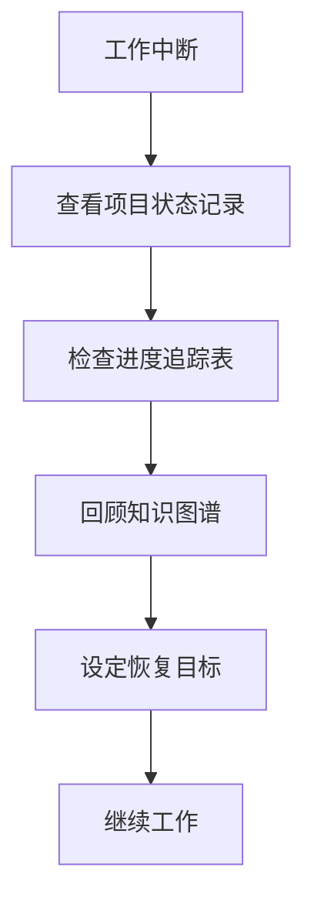

# IoT行业软件架构分析项目 - 中断恢复快速指南

## 1. 快速恢复流程概述

当工作中断后，按照以下步骤快速恢复项目上下文：

## 2. 三分钟恢复指南

### 步骤1: 定位上次工作位置 (60秒)

- 打开 [项目状态记录.md](./项目状态记录.md)
- 快速查看"当前状态"和"下一步计划"部分
- 定位中断前正在处理的具体任务

### 步骤2: 检查进度状态 (30秒)

- 查看 [进度追踪表.md](./进度追踪表.md)
- 确认当前模块的完成状态
- 识别待完成的关键任务

### 步骤3: 重建知识上下文 (60秒)

- 打开 [知识图谱.md](./知识图谱.md)
- 定位当前工作的知识区域
- 快速回顾相关知识节点和关联

### 步骤4: 设定恢复目标 (30秒)

- 设定当前工作时段的明确目标
- 分解为可立即开始的小步骤
- 确定优先级和时间分配

## 3. 不同中断类型的快速恢复

### 短暂中断 (< 2小时)

- 直接查看项目状态记录的"当前状态"部分
- 立即继续中断前的任务

### 中等中断 (2小时 - 1天)

- 完成上述四步恢复流程
- 回顾中断前编辑的具体文档
- 从简单任务开始重新进入状态

### 长时中断 (> 1天)

- 完成标准恢复流程
- 额外查阅 [术语表.md](./术语表.md) 复习关键概念
- 参考 [中断恢复指南.md](./中断恢复指南.md) 进行更深入的恢复

## 4. 快速恢复核对清单

### 状态确认

- [ ] 我知道当前项目的总体进度
- [ ] 我明确中断前正在处理的具体任务
- [ ] 我了解下一步需要完成的工作

### 知识准备

- [ ] 我已回顾与当前任务相关的核心概念
- [ ] 我已重新建立知识关联
- [ ] 我已准备好所需的参考资料

### 环境准备

- [ ] 我已打开必要的工具和文档
- [ ] 我已准备好工作环境
- [ ] 我已排除可能的干扰因素

## 5. 快速恢复技巧

1. **从简单开始**: 从简单、明确的任务着手，逐步建立工作节奏
2. **可视化进度**: 使用知识图谱或思维导图重建视觉上下文
3. **限时回顾**: 严格限制恢复时间，避免过度准备
4. **主动回忆**: 先尝试主动回忆关键内容，再查阅文档验证
5. **小步前进**: 将恢复后的首个任务分解为更小的步骤

---

**注意**: 本指南为快速恢复设计，深度恢复请参考完整的[中断恢复指南.md](./中断恢复指南.md)

**最后更新**: 2024年12月25日  
**文档版本**: v1.0
