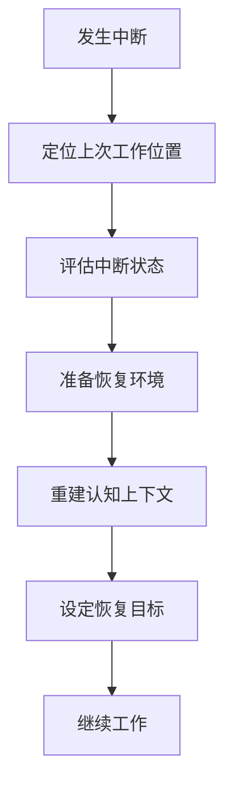

# IoT行业软件架构分析项目 - 中断恢复指南

## 1. 指南目的

本指南旨在提供一套系统化的流程和方法，帮助项目参与者在工作中断后快速恢复研究上下文，重新进入工作状态，减少认知负担和时间损失。无论是短暂中断（数小时至数天）还是长期中断（数周至数月），本指南都提供相应的恢复策略。

## 2. 恢复流程概述

### 2.1 快速恢复流程

以下是工作中断后快速恢复的基本步骤：



### 2.2 恢复深度判断

根据中断时间长度，判断需要的恢复深度：

| 中断时长 | 恢复深度 | 主要恢复文档 |
|---------|---------|------------|
| < 1天（短暂） | 浅层恢复 | 项目状态记录、进度追踪表 |
| 1-7天（中等） | 中层恢复 | 上述文档 + 知识图谱、知识节点索引、相关模块文档 |
| > 7天（长期） | 深层恢复 | 上述文档 + 方法论概述、术语表、参考资料指南 |

## 3. 详细恢复步骤

### 3.1 定位上次工作位置

1. **查阅项目状态记录**：
   - 打开 [项目状态记录](./项目状态记录.md) 文档
   - 查看最后更新日期和当前状态概述
   - 确认中断前的工作重点和进展

2. **检查进度追踪表**：
   - 查阅 [进度追踪表](./进度追踪表.md) 了解模块完成情况
   - 识别当前正在进行的模块和任务
   - 确认中断前的具体工作项目

3. **查看最近修改的文件**：
   - 检查项目文档库中最近修改的文件
   - 确认中断前最后编辑的文档
   - 浏览这些文档的最新变更

### 3.2 评估中断状态

1. **中断时长评估**：
   - 计算从上次工作到现在的时间间隔
   - 根据间隔长度确定恢复深度（参考2.2节表格）

2. **工作完成度评估**：
   - 确认中断前任务的完成程度
   - 评估是否有未完成的关键思路需要优先恢复
   - 检查是否有临时笔记或记录需要整理

3. **环境变化评估**：
   - 检查在中断期间项目是否有重大更新
   - 评估是否有新的需求或方向变化
   - 确认团队其他成员是否有相关进展

### 3.3 准备恢复环境

1. **工作空间准备**：
   - 打开相关的开发和分析工具
   - 恢复到上次的工作配置
   - 准备必要的参考资料和文档

2. **资源获取**：
   - 查阅 [参考资料指南](./参考资料指南.md) 确认需要的资源
   - 获取与当前任务相关的文献和资料
   - 准备必要的工具和环境

3. **协作同步**：
   - 与团队成员同步最新进展（如适用）
   - 了解中断期间的变更和决策
   - 调整工作计划以适应新情况

### 3.4 重建认知上下文

1. **知识结构回顾**：
   - 查阅 [知识图谱](./知识图谱.md) 了解相关知识的整体结构
   - 通过 [知识节点索引](./知识节点索引.md) 快速定位关键知识点
   - 重新建立相关概念的认知关联

2. **术语与概念复习**：
   - 复习 [术语表](./术语表.md) 中的关键术语
   - 确保对核心概念的理解一致
   - 重新熟悉项目特定的术语用法

3. **方法论回顾**：
   - 查阅 [方法论概述](./方法论概述.md) 复习研究方法
   - 重新理解分析框架和评估标准
   - 确认当前任务适用的方法和工具

4. **上下文阅读**：
   - 阅读当前模块的完整文档
   - 复习相关的分析结果和论证
   - 重建对问题域的整体认知

### 3.5 设定恢复目标

1. **短期目标设定**：
   - 设定恢复当天可完成的小目标
   - 从简单、明确的任务开始
   - 为自己设定明确的期望

2. **路径规划**：
   - 参考 [迭代开发流程](./迭代开发流程.md) 制定工作路径
   - 将大任务分解为可管理的小步骤
   - 确定优先级和执行顺序

3. **时间规划**：
   - 为恢复活动分配适当的时间
   - 预留充足的思考和回顾时间
   - 制定适当的休息和切换策略

### 3.6 继续工作

1. **迭代工作模式**：
   - 遵循 [迭代开发流程](./迭代开发流程.md) 中的步骤
   - 采用小步快跑的工作节奏
   - 频繁保存和记录思考过程

2. **恢复状态跟踪**：
   - 记录恢复过程中的发现和理解
   - 标记需要进一步探索的问题
   - 评估恢复效果和速度

3. **适应性调整**：
   - 根据恢复进展调整计划
   - 必要时寻求协作或帮助
   - 灵活应对恢复过程中的挑战

## 4. 不同类型中断的恢复策略

### 4.1 短暂中断恢复 (< 1天)

适用于午休、会议、当天其他工作等导致的短暂中断。

**核心策略**：

- 快速浏览 [项目状态记录](./项目状态记录.md) 和 [进度追踪表](./进度追踪表.md)
- 查看中断前的笔记和最后编辑的文档
- 设定明确的短期目标立即开始工作

**推荐流程**：

1. 花5分钟回顾中断前的工作内容
2. 重新阅读最后编辑的段落或代码
3. 继续之前的工作，尽快恢复思路

### 4.2 中等中断恢复 (1-7天)

适用于周末、短假期、生病等导致的中等时长中断。

**核心策略**：

- 全面回顾 [项目状态记录](./项目状态记录.md) 和当前模块文档
- 参考 [知识图谱](./知识图谱.md) 重建知识关联
- 通过 [知识节点索引](./知识节点索引.md) 快速找到相关知识点
- 设定渐进式的恢复计划

**推荐流程**：

1. 花30分钟回顾项目状态和进度
2. 通过知识图谱和索引重建上下文（30-60分钟）
3. 复习当前模块的关键内容（1小时）
4. 从简单任务开始，逐步恢复到复杂任务

### 4.3 长期中断恢复 (> 7天)

适用于长假期、出差、项目暂停等导致的长期中断。

**核心策略**：

- 系统性回顾整个上下文管理系统的文档
- 深入复习 [方法论概述](./方法论概述.md) 和 [术语表](./术语表.md)
- 重新学习项目的核心概念和架构
- 制定详细的多阶段恢复计划

**推荐流程**：

1. 第一天专注于重建知识结构和上下文（3-4小时）
   - 全面回顾 [知识图谱](./知识图谱.md)
   - 通过 [知识节点索引](./知识节点索引.md) 系统性复习核心知识点
   - 复习项目方法论和术语
2. 第二天进行具体模块和任务的回顾（3-4小时）
   - 详细复习当前模块文档
   - 回顾相关的参考资料
3. 第三天开始渐进式工作
   - 从小任务开始逐步恢复

## 5. 恢复效果评估

### 5.1 恢复质量指标

使用以下指标评估恢复效果：

1. **认知清晰度**：对当前工作的理解程度是否恢复
2. **工作效率**：恢复后的工作速度与正常状态对比
3. **决策质量**：做出的决策是否与项目目标一致
4. **上下文连贯性**：与之前工作的连贯程度
5. **不确定性水平**：对下一步工作的不确定感

### 5.2 自我评估问题

通过回答以下问题进行自我评估：

1. 我能清晰描述当前任务的目标和意义吗？
2. 我了解这项任务与整体项目的关系吗？
3. 我记得关键的决策理由和背景吗？
4. 我对下一步工作有明确的规划吗？
5. 我觉得回到了中断前的思维状态吗？

### 5.3 恢复不足的补救措施

如果评估发现恢复不充分，可采取以下措施：

1. **深度回顾**：花更多时间深入阅读相关文档
2. **再结构化**：重新整理当前任务的结构和要点
3. **同行讨论**：与团队成员讨论以填补认知空缺
4. **简化任务**：暂时处理较简单的子任务
5. **创建辅助文档**：编写个人理解文档帮助重建上下文

## 6. 预防措施与最佳实践

### 6.1 中断前的准备

为减轻未来中断的影响，在每次工作结束时：

1. **状态记录**：更新 [项目状态记录](./项目状态记录.md) 和 [进度追踪表](./进度追踪表.md)
2. **思路记录**：记录当前的思考过程和未完成的想法
3. **下一步计划**：明确记录下次工作的起点和计划
4. **问题标记**：标记未解决的问题和需要进一步思考的点
5. **资料整理**：确保参考资料和相关文档有清晰的引用

### 6.2 恢复效率的最佳实践

1. **渐进式恢复**：从简单任务开始，逐步过渡到复杂任务
2. **视觉辅助**：使用 [知识图谱](./知识图谱.md) 等视觉工具帮助快速重建认知结构
3. **结构化复习**：按照知识结构而非时间顺序进行复习
4. **主动回忆**：不仅阅读文档，也尝试主动回忆关键内容
5. **情境重建**：尽可能恢复与上次工作相似的环境
6. **恢复仪式**：建立个人的恢复仪式，形成条件反射
7. **专注时间块**：为恢复活动预留不受打扰的专注时间

### 6.3 长期习惯培养

培养这些习惯可减轻中断影响：

1. **定期总结**：每周进行工作总结和整理
2. **知识外化**：将思考过程和决策理由明确记录
3. **结构化笔记**：采用结构化的笔记方法记录想法
4. **关联建立**：主动建立不同知识点之间的关联
5. **文档习惯**：养成详细记录和更新文档的习惯

## 7. 特殊场景恢复指南

### 7.1 多任务并行中断

当同时处理多个模块或任务时的恢复策略：

1. **任务梳理**：使用 [进度追踪表](./进度追踪表.md) 梳理所有并行任务
2. **优先级重评**：重新评估各任务优先级
3. **单点突破**：选择一个最重要或最简单的任务首先恢复
4. **渐进式扩展**：成功恢复一个任务后再扩展到其他任务
5. **知识地图使用**：利用 [知识图谱](./知识图谱.md) 了解任务间的关联

### 7.2 深度思考中断

当复杂问题分析或创造性思考被中断时：

1. **思考轨迹恢复**：尝试回忆和重建思考轨迹
2. **关键问题识别**：识别核心问题和思考方向
3. **思维图表绘制**：重新绘制思维导图或概念图
4. **假设重述**：重新陈述当时的假设和推理
5. **退一步策略**：从更基础的层面重新思考问题

### 7.3 团队协作中断

团队协作过程中成员工作中断的恢复：

1. **同步会议**：召开简短的同步会议
2. **状态共享**：共享 [项目状态记录](./项目状态记录.md) 和进展
3. **知识共享**：通过 [知识图谱](./知识图谱.md) 和 [知识节点索引](./知识节点索引.md) 共享知识结构
4. **任务再分配**：必要时重新分配任务
5. **渐进式协作**：从小规模协作逐步恢复到全面协作

## 8. 恢复工具与模板

### 8.1 快速恢复检查清单

使用以下检查清单指导恢复过程：

- [ ] 查阅 [项目状态记录](./项目状态记录.md) 了解当前状态
- [ ] 检查 [进度追踪表](./进度追踪表.md) 确认具体进度
- [ ] 通过 [知识图谱](./知识图谱.md) 重建知识结构
- [ ] 使用 [知识节点索引](./知识节点索引.md) 查找关键知识点
- [ ] 复习 [术语表](./术语表.md) 中的相关术语
- [ ] 回顾 [方法论概述](./方法论概述.md) 中的适用方法
- [ ] 查阅当前模块的详细文档
- [ ] 检查中断前的最后编辑内容
- [ ] 设定恢复目标和计划
- [ ] 准备必要的工具和资源
- [ ] 创建今日工作的小目标清单
- [ ] 安排适当的休息和反思时间

### 8.2 恢复记录模板

使用以下模板记录恢复过程：

```text
# 工作恢复记录

## 基本信息
- 恢复日期：[日期]
- 中断时长：[天数/小时]
- 中断前任务：[任务描述]

## 恢复准备
- 已查阅文档：[列出已查阅的文档]
- 关键发现：[记录重要发现和提醒]
- 环境变化：[记录期间的变化]

## 当前状态
- 任务完成度：[估计百分比]
- 待解决问题：[列出关键问题]
- 下一步计划：[具体行动项]

## 恢复评估
- 认知清晰度：[1-5分]
- 不确定性领域：[列出不确定的方面]
- 需要帮助：[是/否，具体需求]

## 反思与改进
- 恢复中的挑战：[描述]
- 有效的策略：[描述]
- 未来改进：[行动项]
```

### 8.3 辅助恢复工具

以下工具可辅助恢复过程：

1. **知识图谱导航器**：直观展示知识结构和关联
2. **进度可视化面板**：展示任务进度和依赖关系
3. **术语快速检索工具**：快速查找项目术语定义
4. **上下文快照工具**：保存和恢复工作上下文状态
5. **思维导图软件**：重建思考结构和关联

## 9. 持续改进机制

### 9.1 恢复经验记录

每次经历重要的恢复过程后：

1. 记录恢复策略的有效性
2. 识别恢复过程中的困难和挑战
3. 总结可改进的地方和经验教训
4. 分享有效的恢复技巧和方法

### 9.2 恢复指南更新

本恢复指南将定期更新，纳入：

1. 新发现的有效恢复策略
2. 团队成员的反馈和建议
3. 特定类型中断的专门指南
4. 新工具和方法的应用指导

### 9.3 防中断策略研究

持续研究减少中断影响的策略：

1. 工作组织方式优化
2. 文档结构和管理改进
3. 认知工具和方法探索
4. 协作模式和通信优化

---

**最后更新**: 2024年12月22日  
**文档版本**: v1.2  
**状态**: 正式发布  
**下一次计划更新**: 2025年1月22日
