# IoT行业软件架构分析项目 - 知识图谱

## 1. 知识图谱概述

本知识图谱旨在构建IoT行业软件架构知识的系统化表示，展现核心概念、架构模式、技术组件及其相互关系，为项目研究提供结构化的知识导航和关联分析工具。

### 1.1 知识图谱目标

1. 建立IoT架构知识的系统化表示
2. 揭示知识点之间的关联和依赖关系
3. 支持知识的快速定位和上下文理解
4. 指导知识获取的路径和重点
5. 促进跨领域知识的融合与创新

### 1.2 知识图谱结构

本知识图谱采用多层次、多维度的结构：

- **核心层**：基础概念和原理
- **模式层**：架构模式和设计方法
- **技术层**：实现技术和工具
- **应用层**：行业应用和案例
- **关联层**：各层次间的关联关系

## 2. 核心知识节点

### 2.1 基础概念节点

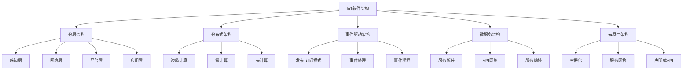

### 2.2 质量属性节点

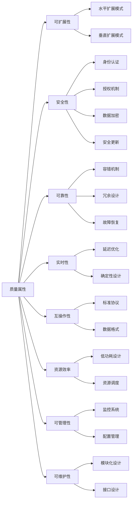

## 3. 架构模式关系图

### 3.1 边缘-云协同模式

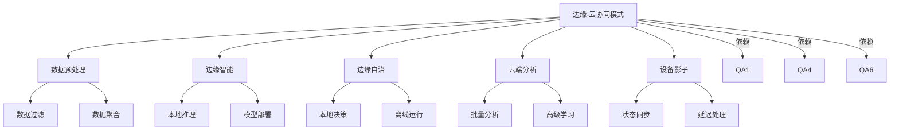

### 3.2 设备管理模式

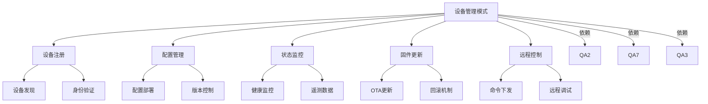

## 4. 技术组件映射

### 4.1 通信协议技术

```mermaid
graph TD
    CP[通信协议] --> CP1[MQTT]
    CP --> CP2[CoAP]
    CP --> CP3[HTTP/REST]
    CP --> CP4[WebSocket]
    CP --> CP5[AMQP]
    CP --> CP6[DDS]
    CP --> CP7[LoRaWAN]
    CP --> CP8[Zigbee]
    CP --> CP9[蓝牙BLE]
    
    CP1 --适用--> F1[资源受限设备]
    CP1 --适用--> F2[发布-订阅模式]
    CP1 --提供--> F3[QoS级别]
    
    CP2 --适用--> F1
    CP2 --适用--> F4[请求-响应模式]
    CP2 --提供--> F5[URI寻址]
    
    CP3 --适用--> F6[云服务集成]
    CP3 --适用--> F4
    CP3 --提供--> F7[无状态通信]
    
    CP4 --适用--> F8[实时双向通信]
    CP4 --提供--> F9[全双工通道]
    
    CP5 --适用--> F10[高可靠消息传递]
    CP5 --提供--> F11[事务支持]
    
    CP6 --适用--> F12[数据分发控制]
    CP6 --适用--> F13[实时系统]
    CP6 --提供--> F14[发布-订阅QoS]
    
    CP7 --适用--> F15[广域低功耗]
    CP7 --提供--> F16[长距离通信]
    
    CP8 --适用--> F17[本地网络]
    CP8 --提供--> F18[网状网络]
    
    CP9 --适用--> F19[短距离通信]
    CP9 --提供--> F20[低功耗连接]
```

### 4.2 数据处理技术

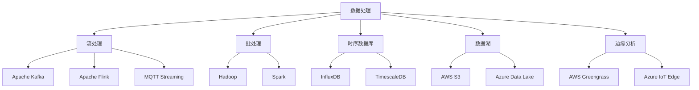

## 5. 行业应用映射

### 5.1 行业领域关系

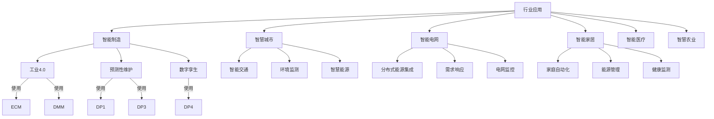

## 6. 分层递归导航与交叉引用

- 行业层（L1）：[上下文管理系统](../context_management.md)
- 企业层（L2）：[IoT项目上下文管理指南](./IoT项目上下文管理指南.md)
- 系统层（L3）：[递归迭代开发流程指南](./递归迭代开发流程指南.md)
- 子系统层（L4）：[上下文切换指南](./上下文切换指南.md)
- 模块层（L5）：[术语表](./术语表.md)

### 行业层（L1）核心关系
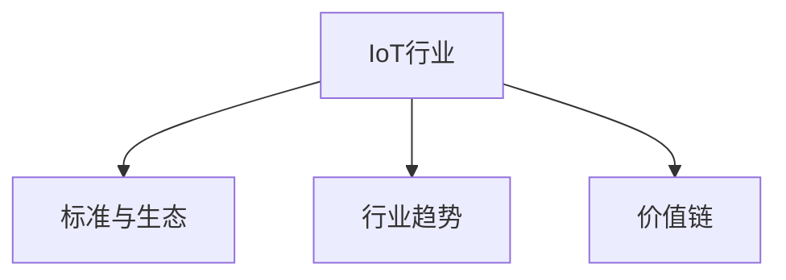

### 企业层（L2）核心关系
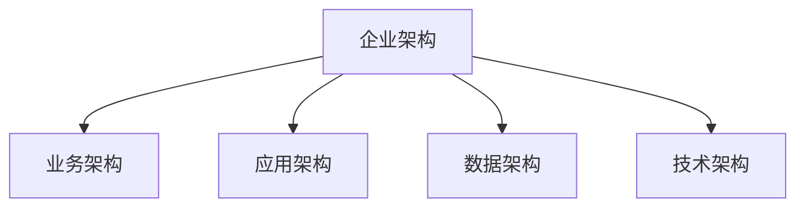

### 系统层（L3）核心关系
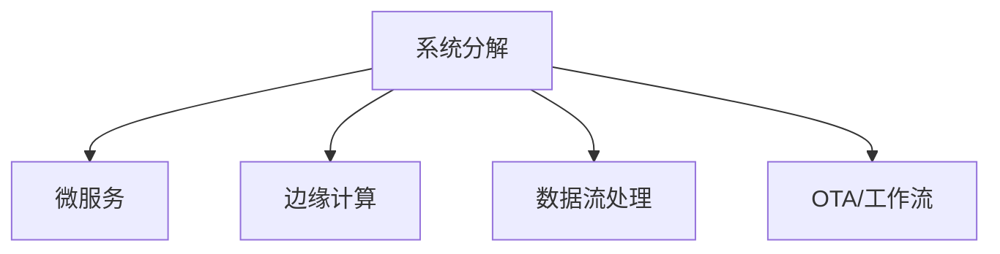

### 子系统层（L4）核心关系
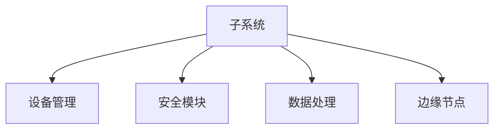

### 模块层（L5）核心关系
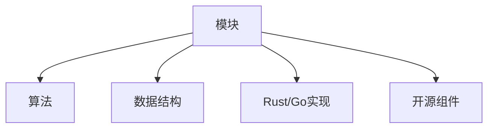

## 7. 知识依赖关系

### 7.1 技术栈依赖

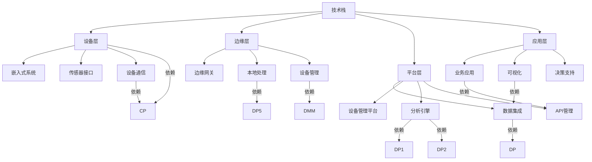

### 7.2 学习路径图

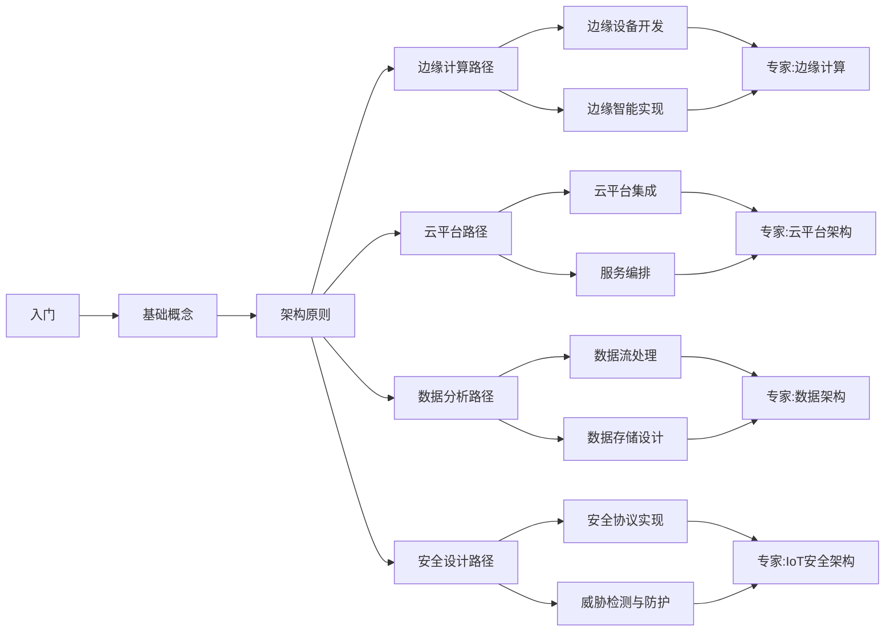

## 8. 知识图谱应用指南

### 8.1 导航方法

1. **概念探索**：从基础概念节点开始，了解IoT架构的基本原理和组成
2. **质量关注**：基于关注的质量属性，探索相关的架构决策和模式
3. **技术选型**：从技术组件映射了解各技术的适用场景和关系
4. **行业应用**：从行业应用出发，了解特定领域的架构特点
5. **学习路径**：按照学习路径图的指导，系统性地学习知识

### 8.2 图谱更新机制

本知识图谱将根据项目进展不断更新和完善：

1. **定期审核**：每月审核知识图谱的准确性和完整性
2. **增量更新**：新的研究发现将及时添加到图谱中
3. **关系重构**：定期重新评估知识点之间的关系
4. **视图优化**：根据使用反馈优化图谱的可视化表示
5. **深度扩展**：选择关键节点进行深度扩展和详细说明

## 9. 领域特化图谱

### 9.1 智能制造架构图谱

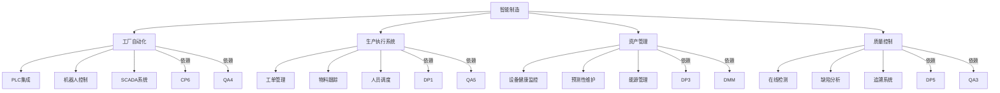

### 9.2 智慧城市架构图谱

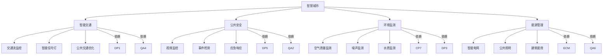

## 10. 知识图谱与其他文档的关联

1. **与术语表的关联**：本图谱中的节点应与术语表中的术语保持一致
2. **与方法论的关联**：图谱结构体现了方法论中的多视角分析法和分层递进法
3. **与参考资料的关联**：各知识节点可追溯到参考资料指南中的相关资源
4. **与进度追踪的关联**：图谱扩展应与项目进度同步，反映最新研究成果
5. **与知识管理计划的关联**：图谱是知识组织和可视化的核心工具

## 11. 未来扩展计划

1. **交互式知识图谱**：开发交互式工具，支持动态浏览和查询
2. **深度知识点关联**：增加更细粒度的知识点及其关联关系
3. **案例映射层**：添加具体案例与架构模式的映射关系
4. **决策支持视图**：增加架构决策与质量属性的权衡分析视图
5. **技术演进图**：展示IoT架构技术的演进趋势和发展路径

---

**最后更新**: 2024年12月22日  
**文档版本**: v1.0  
**状态**: 正式发布  
**下一次计划更新**: 2025年1月22日
