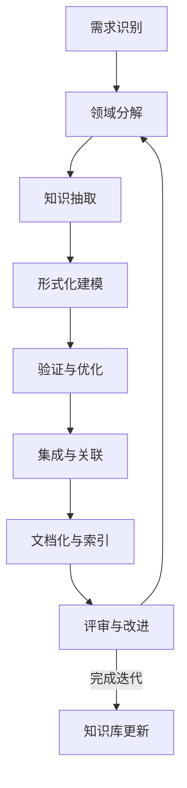

# IoT行业软件架构分析项目 - 递归迭代开发流程简要版

## 1. 简介

本文档提供IoT行业软件架构分析项目的递归迭代开发流程简要指南，旨在指导分析人员通过系统化的方法递归地分析、形式化和组织IoT软件架构知识，确保分析过程的严谨性、系统性和可追踪性。

递归迭代开发是一种自顶向下分解问题，并在不同层次反复应用相同分析模式的方法，同时通过迭代方式不断深化和完善结果。

## 2. 开发流程概览



## 3. 关键步骤详解

### 3.1 需求识别 (1-2天)

1. **明确分析目标**：确定当前迭代的具体分析目标和范围
2. **确定优先级**：根据项目整体目标，确定各分析任务的优先级
3. **资源准备**：收集必要的资源、工具和参考材料

**输出**：分析任务清单、优先级排序、资源清单

### 3.2 领域分解 (1-3天)

1. **自顶向下分解**：将分析领域分解为可管理的子领域
2. **边界识别**：明确各子领域的边界和接口
3. **关系映射**：识别子领域之间的关系和依赖

**输出**：领域结构图、子领域清单、关系矩阵

### 3.3 知识抽取 (3-7天)

1. **内容提取**：从原始资料中提取相关知识点
2. **概念识别**：识别核心概念、原则和模式
3. **去重整合**：消除冗余，整合相似概念
4. **分类组织**：按照概念类型和层次组织知识

**输出**：概念清单、知识点摘要、初始分类体系

### 3.4 形式化建模 (5-10天)

1. **数学定义**：为核心概念建立严格的数学定义
2. **关系定义**：形式化描述概念间关系
3. **属性规约**：定义概念的关键属性和约束
4. **定理提出**：提出关键性质并形式化证明

**输出**：形式化定义、定理及证明、数学模型

### 3.5 验证与优化 (3-5天)

1. **一致性检验**：验证定义与模型的内部一致性
2. **完备性检验**：确保覆盖领域的关键方面
3. **代码实现**：使用Rust/Go实现关键算法和模型
4. **性能评估**：分析实现的性能特征和限制

**输出**：验证报告、代码实现、性能分析

### 3.6 集成与关联 (2-4天)

1. **水平集成**：与同层次其他模块建立关联
2. **垂直集成**：与上下层次模块建立关联
3. **知识图谱更新**：更新项目整体知识图谱
4. **冲突解决**：解决与现有知识的冲突和不一致

**输出**：集成报告、关联矩阵、更新的知识图谱

### 3.7 文档化与索引 (2-3天)

1. **标准化文档**：按照项目模板创建标准文档
2. **多表征呈现**：使用文本、公式、图表多种形式表达知识
3. **索引更新**：更新知识索引和目录
4. **引用建立**：建立内部和外部引用关系

**输出**：标准化文档、更新的索引、引用关系表

### 3.8 评审与改进 (1-2天)

1. **同行评审**：进行内部或外部同行评审
2. **质量检查**：检查是否符合项目质量标准
3. **反馈收集**：收集评审意见和改进建议
4. **迭代规划**：基于反馈规划下一轮迭代

**输出**：评审报告、改进计划、下一轮迭代任务

## 4. 递归应用策略

递归策略是将相同的分析流程应用于不同层次的问题，有以下几种递归模式：

### 4.1 深度递归

将分析流程应用于越来越深的细节层次：

```text
系统层次 → 子系统层次 → 组件层次 → 模块层次
```

### 4.2 广度递归

将相同流程应用于同一层次的不同领域：

```text
架构领域 → 系统领域 → 算法领域 → 技术领域
```

### 4.3 概念递归

围绕核心概念展开递归分析：

```text
概念定义 → 属性分析 → 关系分析 → 应用场景分析
```

## 5. 迭代策略

### 5.1 迭代深度

根据项目阶段和资源确定适当的迭代深度：

- **浅层迭代**：1-2周，完成基本分析和初步形式化
- **标准迭代**：2-4周，完成全面分析和详细形式化
- **深度迭代**：4-8周，进行深入研究和综合创新

### 5.2 迭代优先级

按以下因素确定迭代优先级：

1. **业务价值**：对IoT行业实践的影响程度
2. **创新度**：知识的创新性和独特性
3. **依赖关系**：其他模块对该知识的依赖程度
4. **资源可用性**：可投入的时间和专业知识

### 5.3 迭代规模控制

控制每次迭代的范围，确保可在预定时间内完成：

- 每次迭代专注于1-3个关键概念
- 控制文档规模在10-30页之间
- 管理代码实现规模在500-2000行之间

## 6. 质量控制措施

### 6.1 形式化严谨性

- 使用统一的数学符号系统
- 确保定义精确、无歧义
- 提供完整的证明过程
- 验证数学模型的一致性

### 6.2 工程实用性

- 提供可运行的代码实现
- 包含性能和资源分析
- 讨论实际应用场景
- 提出工程实施建议

### 6.3 文档完整性

- 遵循标准文档模板
- 包含摘要、正文、结论、参考文献
- 使用多种表征形式（文本、公式、图表）
- 提供内部和外部链接

## 7. 常见问题与解决方法

| 问题 | 解决方法 |
|------|---------|
| 领域知识碎片化 | 使用知识图谱建立关联，定期进行知识整合 |
| 形式化程度不足 | 引入同行评审，检查数学定义的严谨性 |
| 迭代周期过长 | 缩小迭代范围，增加中间检查点 |
| 知识冗余重复 | 建立中央知识库，实施严格的去重机制 |
| 实现与理论脱节 | 确保代码实现直接映射理论模型 |

## 8. 工具与模板

### 8.1 推荐工具

- **知识抽取**：文本分析工具、思维导图软件
- **形式化建模**：数学符号编辑器、定理证明辅助工具
- **代码实现**：Rust和Go开发环境、单元测试框架
- **文档创建**：Markdown编辑器、LaTeX系统
- **版本控制**：Git和相关管理平台

### 8.2 核心模板

- [知识点快速索引模板.md](./知识点快速索引模板.md)
- [项目状态记录模板.md](./项目状态记录模板.md)
- [术语表.md](./术语表.md)

## 9. 快速开始指南

1. 选择一个明确的分析主题
2. 收集相关资料和参考文献
3. 应用领域分解，创建初步结构
4. 按"知识抽取→形式化建模→验证"顺序进行分析
5. 创建标准文档，包含定义、证明和代码实现
6. 请求同行评审
7. 迭代改进文档
8. 更新知识图谱和索引

## 10. 小贴士

- 从简单概念开始，逐步构建复杂知识体系
- 定期回顾整体知识结构，避免碎片化
- 保持数学符号和术语的一致性
- 使用具体实例说明抽象概念
- 平衡理论深度和工程实用性
- 记录分析过程中的见解和决策理由

---

**文档版本**: v1.0  
**创建日期**: 2024年12月26日  
**最后更新**: 2024年12月26日  
**参考文档**: [迭代开发流程.md](./迭代开发流程.md)
