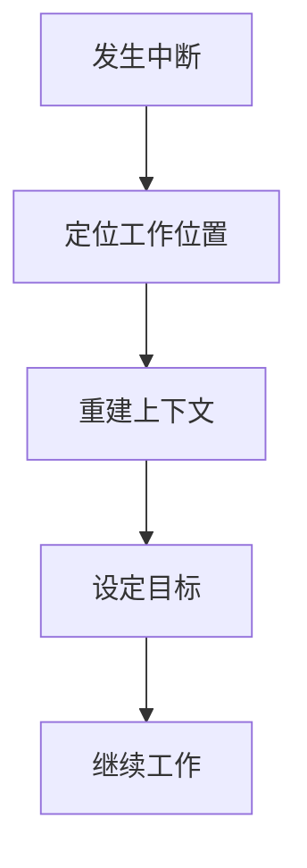

# IoT行业软件架构分析项目 - 中断恢复快速指南

## 1. 快速恢复流程

本指南提供工作中断后快速恢复的简化步骤，帮助您迅速重建工作上下文，恢复工作状态。

## 2. 不同中断类型的快速恢复

### 2.1 短暂中断恢复 (< 1天)

**步骤 (5-10分钟)**:

1. **定位**:
   - 查看 [项目状态记录.md](./项目状态记录.md) 中最后更新的内容
   - 检查最后编辑的文档和位置

2. **重建**:
   - 快速浏览中断前的工作内容
   - 回顾当前任务的目标和进展

3. **继续**:
   - 设定明确的短期目标
   - 立即开始工作，从简单任务入手

### 2.2 中等中断恢复 (1-7天)

**步骤 (30-60分钟)**:

1. **定位**:
   - 查阅 [项目状态记录.md](./项目状态记录.md) 和 [进度追踪表.md](./进度追踪表.md)
   - 确认当前模块和任务状态

2. **重建**:
   - 查看 [知识图谱.md](./知识图谱.md) 重建知识关联
   - 通过 [知识节点索引.md](./知识节点索引.md) 找到相关知识点
   - 复习当前模块的关键文档

3. **继续**:
   - 设定渐进式工作计划
   - 从简单到复杂逐步恢复

### 2.3 长期中断恢复 (> 7天)

**步骤 (2-3小时)**:

1. **定位**:
   - 全面回顾 [项目状态记录.md](./项目状态记录.md) 和 [进度追踪表.md](./进度追踪表.md)
   - 确认项目整体状态和当前位置

2. **重建**:
   - 查阅 [方法论概述.md](./方法论概述.md) 复习研究方法
   - 通过 [知识图谱.md](./知识图谱.md) 和 [术语表.md](./术语表.md) 重建知识体系
   - 系统性复习当前模块文档

3. **继续**:
   - 制定多阶段恢复计划
   - 第一天专注于知识重建
   - 第二天开始具体任务

## 3. 快速检查清单

### 3.1 恢复前检查

- [ ] 确认中断时长，判断恢复深度
- [ ] 准备必要的参考文档
- [ ] 设置适合的工作环境

### 3.2 恢复中检查

- [ ] 是否清晰理解当前任务目标？
- [ ] 是否记得关键的决策理由？
- [ ] 是否了解任务与整体项目的关系？

### 3.3 恢复后检查

- [ ] 是否已恢复到合适的工作状态？
- [ ] 是否对下一步工作有明确规划？
- [ ] 是否需要调整工作计划？

## 4. 恢复效率提升技巧

1. **渐进式恢复**: 从简单任务开始，逐步过渡到复杂任务
2. **视觉辅助**: 使用知识图谱等视觉工具帮助快速重建认知结构
3. **主动回忆**: 尝试主动回忆关键内容，而不仅是阅读文档
4. **环境重建**: 尽可能恢复与上次工作相似的环境
5. **明确边界**: 为恢复活动设定明确的时间边界

## 5. 预防措施

为减轻未来中断的影响，每次工作结束时：

1. **记录状态**: 更新项目状态记录和进度追踪表
2. **记录思路**: 简要记录当前思考过程和未完成的想法
3. **明确下一步**: 记录下次工作的起点和计划
4. **整理资料**: 确保参考资料和文档位置明确

---

**文档版本**: v1.0  
**创建日期**: 2024年12月28日  
**最后更新**: 2024年12月28日
