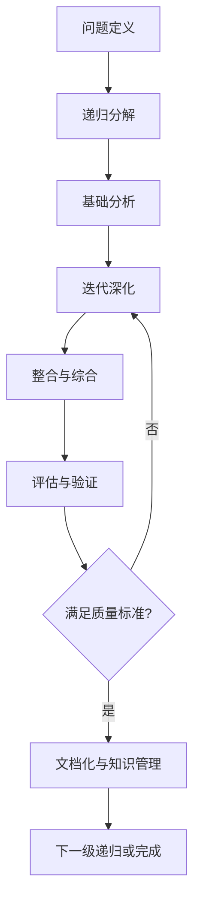

# IoT行业软件架构分析项目 - 递归迭代开发流程指南

## 1. 概述

本指南提供IoT行业软件架构分析项目的递归迭代开发方法，旨在通过系统化、渐进式的方法，确保分析工作的深度、广度和质量。递归迭代开发结合了递归分解和迭代改进两种思想，特别适合处理IoT领域复杂的软件架构分析任务。

## 2. 递归迭代开发的核心原则

### 2.1 递归原则

- **分解复杂性**：将复杂问题分解为更小、更易管理的子问题
- **自相似性**：对子问题应用与原问题相同的分析方法
- **边界条件**：明确定义递归终止的条件
- **合并结果**：将子问题的解决方案整合为原问题的解决方案

### 2.2 迭代原则

- **增量发展**：通过小步快跑，逐步构建和完善结果
- **持续改进**：基于反馈不断优化和调整
- **早期验证**：尽早验证假设和结果
- **适应变化**：灵活调整以适应新的发现和需求

### 2.3 结合优势

递归迭代开发结合了两种方法的优势：

- 递归提供了处理复杂问题的结构化方法
- 迭代提供了持续改进和适应变化的灵活性
- 两者结合确保了分析的深度和广度
- 支持在任何层次上应用相同的方法论

## 3. 递归迭代开发流程模型

### 3.1 总体流程



### 3.2 流程阶段说明

#### 3.2.1 问题定义

- **明确分析目标**：确定当前分析任务的具体目标和范围
- **定义成功标准**：建立评估分析结果的明确标准
- **识别约束条件**：明确时间、资源和技术约束
- **确定分析层次**：确定当前处于哪个抽象层次

#### 3.2.2 递归分解

- **识别子问题**：将当前问题分解为相对独立的子问题
- **建立子问题关系**：明确子问题之间的依赖和关联
- **定义接口**：确定子问题之间的交互接口
- **设定边界条件**：明确何时停止进一步分解

#### 3.2.3 基础分析

- **收集信息**：获取解决当前层次问题所需的信息
- **应用基础方法**：使用适当的分析方法进行初步分析
- **建立基本模型**：创建问题的初始模型或框架
- **识别关键问题**：确定需要在迭代中重点关注的问题

#### 3.2.4 迭代深化

- **增量改进**：基于前一次迭代的结果进行改进
- **探索替代方案**：考虑不同的解决方案和方法
- **应用专业知识**：引入领域专业知识深化分析
- **解决关键问题**：重点解决已识别的关键问题

#### 3.2.5 整合与综合

- **合并子问题结果**：将各子问题的分析结果整合
- **解决冲突**：处理子问题结果之间的冲突和不一致
- **建立整体视图**：创建当前层次的综合性视图
- **确保一致性**：验证整合结果的内部一致性

#### 3.2.6 评估与验证

- **应用质量标准**：根据预定标准评估分析结果
- **同行评审**：邀请其他专家评审结果
- **验证假设**：检查分析中的假设是否成立
- **识别改进机会**：确定需要在下一迭代中改进的方面

#### 3.2.7 文档化与知识管理

- **标准化文档**：按照项目规范创建文档
- **更新知识库**：将新知识整合到项目知识库
- **建立关联**：创建与其他知识点的关联
- **准备下一步**：为下一级递归或下一个问题做准备

## 4. 递归层次与抽象级别

IoT软件架构分析项目采用以下递归层次结构：

### 4.1 层次结构

1. **L1: 行业架构层**
   - 行业趋势和模式
   - 标准和规范
   - 生态系统和价值链

2. **L2: 企业架构层**
   - 业务架构
   - 应用架构
   - 数据架构
   - 技术架构

3. **L3: 系统架构层**
   - 系统分解
   - 组件关系
   - 接口定义
   - 质量属性

4. **L4: 子系统架构层**
   - 子系统设计
   - 模块组织
   - 交互模式
   - 技术选择

5. **L5: 模块设计层**
   - 模块内部结构
   - 算法选择
   - 数据结构
   - 实现考虑

### 4.2 层次间关系

- 每个层次为下一层次提供约束和上下文
- 每个层次的决策影响下层的选择空间
- 下层实现为上层提供反馈和验证
- 跨层次一致性是架构质量的关键

## 5. 迭代周期与节奏

### 5.1 迭代类型

根据分析任务的复杂性和重要性，可以采用不同类型的迭代周期：

1. **微迭代**：1-2天
   - 适用于单一概念或组件的快速分析
   - 重点在于快速验证想法
   - 产出简洁的工作笔记或概念模型

2. **标准迭代**：1周
   - 适用于中等复杂度的分析任务
   - 包含完整的分析-评估-改进循环
   - 产出结构化的分析文档

3. **扩展迭代**：2-4周
   - 适用于复杂系统或跨领域分析
   - 包含深度研究和多方验证
   - 产出全面的分析报告和模型

### 5.2 迭代计划

每个迭代应包含以下要素：

- **目标声明**：明确当前迭代要达成的具体目标
- **工作项列表**：需要完成的具体任务
- **依赖关系**：与其他迭代或任务的依赖
- **评估标准**：判断迭代成功的标准
- **时间分配**：各任务的时间预算
- **风险识别**：可能的障碍和应对策略

## 6. 实践技术与工具

### 6.1 递归分解技术

1. **功能分解**：基于功能或责任进行分解
   - 识别主要功能和子功能
   - 明确功能间的依赖关系
   - 建立功能层次结构

2. **领域分解**：基于业务领域或技术领域进行分解
   - 识别相关的业务或技术领域
   - 明确领域边界和交叉点
   - 建立领域模型

3. **质量属性分解**：基于质量关注点进行分解
   - 识别关键质量属性（如性能、安全性）
   - 分解为具体质量场景
   - 分析质量属性之间的权衡

### 6.2 迭代改进技术

1. **增量分析**：逐步深化分析
   - 从核心概念开始
   - 逐步添加细节和考虑因素
   - 保持分析的连贯性

2. **并行探索**：同时考虑多种方案
   - 开发多个候选解决方案
   - 比较评估各方案优劣
   - 整合最佳元素

3. **反馈驱动**：基于反馈调整方向
   - 收集多方反馈
   - 快速应用反馈进行调整
   - 验证调整效果

### 6.3 支持工具

1. **知识管理工具**
   - [知识图谱](./知识图谱.md)：可视化知识结构
   - [知识节点索引](./知识节点索引.md)：快速检索知识点
   - [术语表](./术语表.md)：统一术语定义

2. **过程管理工具**
   - [项目状态记录](./项目状态记录.md)：跟踪项目状态
   - [进度追踪表](./进度追踪表.md)：监控完成情况
   - [日常工作进度模板](./日常工作进度模板.md)：记录日常进展

3. **分析辅助工具**
   - 架构建模工具：创建架构模型
   - 形式化验证工具：验证关键属性
   - 文档生成工具：自动生成标准文档

## 7. 质量保证机制

### 7.1 分析质量属性

递归迭代开发过程中应关注以下分析质量属性：

1. **完整性**：分析是否涵盖所有相关方面
2. **一致性**：不同部分之间是否保持一致
3. **正确性**：分析结果是否准确反映实际
4. **清晰性**：分析是否清晰易懂
5. **可追溯性**：分析决策是否可追溯
6. **可验证性**：分析结果是否可验证

### 7.2 质量控制活动

在递归迭代过程中应执行以下质量控制活动：

1. **同行评审**：
   - 每个迭代结束时进行
   - 关注技术准确性和完整性
   - 提供改进建议

2. **一致性检查**：
   - 检查跨层次和跨领域的一致性
   - 识别和解决冲突
   - 确保术语使用一致

3. **形式化验证**：
   - 对关键属性进行形式化验证
   - 使用数学模型验证关键假设
   - 确保逻辑推理的正确性

4. **专家咨询**：
   - 针对特定领域问题咨询专家
   - 获取外部视角和建议
   - 验证分析方向和结果

### 7.3 持续改进

建立以下机制确保分析过程的持续改进：

1. **经验教训收集**：
   - 记录每个迭代中的经验教训
   - 识别有效和无效的实践
   - 分享和讨论改进机会

2. **方法论调整**：
   - 基于实践经验调整方法论
   - 优化递归和迭代的平衡
   - 改进分析技术和工具

3. **知识积累**：
   - 将新发现整合到知识库
   - 更新最佳实践指南
   - 完善分析模板和工具

## 8. 常见挑战与解决策略

### 8.1 递归陷阱

1. **过度分解**：
   - 症状：分解层次过多，失去整体视角
   - 解决策略：设定明确的递归终止条件，定期进行整体回顾

2. **不平衡分解**：
   - 症状：某些分支过度详细，其他分支过于粗略
   - 解决策略：建立分解平衡标准，定期评估各分支深度

3. **循环依赖**：
   - 症状：子问题之间存在循环依赖，难以独立分析
   - 解决策略：识别并打破循环依赖，引入接口或抽象层

### 8.2 迭代陷阱

1. **无限迭代**：
   - 症状：持续改进而不达成结论
   - 解决策略：设定明确的完成标准，时间盒限制

2. **改进停滞**：
   - 症状：迭代未带来实质性改进
   - 解决策略：引入新视角，尝试不同方法，咨询外部专家

3. **范围蔓延**：
   - 症状：迭代过程中不断扩大分析范围
   - 解决策略：严格的范围管理，推迟非核心问题到未来迭代

### 8.3 整合挑战

1. **结果不一致**：
   - 症状：子问题分析结果之间存在矛盾
   - 解决策略：建立明确的冲突解决机制，追溯冲突根源

2. **接口不匹配**：
   - 症状：子系统间接口定义不兼容
   - 解决策略：早期定义和验证接口，建立接口一致性检查

3. **整合复杂性**：
   - 症状：子问题结果难以整合为连贯整体
   - 解决策略：建立清晰的整合框架，使用适当的抽象级别

## 9. 实践案例

### 9.1 案例：边缘-云协同架构分析

以下是应用递归迭代开发方法分析IoT边缘-云协同架构的简化案例：

#### 第1次递归：系统级分析

1. **问题定义**：分析IoT边缘-云协同架构模式
2. **递归分解**：
   - 边缘计算子系统
   - 云平台子系统
   - 网络通信子系统
   - 数据管理子系统
3. **基础分析**：建立系统级协同模型
4. **迭代深化**：3次迭代完善系统级模型
5. **整合与综合**：创建系统级架构视图
6. **评估与验证**：系统级质量属性评估
7. **文档化**：系统架构文档

#### 第2次递归：边缘计算子系统分析

1. **问题定义**：分析边缘计算子系统架构
2. **递归分解**：
   - 边缘设备管理
   - 边缘计算框架
   - 边缘安全机制
   - 边缘-云接口
3. **基础分析**：建立边缘计算参考模型
4. **迭代深化**：2次迭代完善边缘计算模型
5. **整合与综合**：创建边缘计算架构视图
6. **评估与验证**：边缘计算质量属性评估
7. **文档化**：边缘计算架构文档

#### 第3次递归：边缘设备管理分析

1. **问题定义**：分析边缘设备管理架构
2. **递归分解**：
   - 设备注册与认证
   - 设备监控与诊断
   - 设备配置管理
   - 设备更新管理
3. **基础分析**：建立设备管理模型
4. **迭代深化**：2次迭代完善设备管理模型
5. **整合与综合**：创建设备管理架构视图
6. **评估与验证**：设备管理质量属性评估
7. **文档化**：设备管理架构文档

### 9.2 经验教训

从案例中总结的关键经验教训：

1. **适当的分解粒度**：
   - 每次递归应关注特定抽象层次
   - 避免过早深入技术细节
   - 保持子问题间的平衡

2. **迭代次数灵活调整**：
   - 复杂问题可能需要更多迭代
   - 简单问题可能只需1-2次迭代
   - 基于质量评估决定是否继续迭代

3. **跨层次一致性维护**：
   - 定期回顾上层约束和决策
   - 确保下层实现符合上层要求
   - 及时向上层提供反馈

## 10. 工具与模板

### 10.1 递归计划模板

使用以下模板规划递归分析：

```
# 递归分析计划

## 基本信息
- 分析主题：[主题名称]
- 抽象层次：[L1-L5]
- 计划开始日期：[日期]
- 计划完成日期：[日期]

## 问题定义
- 分析目标：[具体目标]
- 成功标准：[评估标准]
- 约束条件：[限制因素]

## 递归分解
- 子问题1：[描述]
- 子问题2：[描述]
- 子问题3：[描述]
...

## 分析方法
- 主要分析方法：[方法名称]
- 辅助技术：[技术列表]
- 需要工具：[工具列表]

## 迭代计划
- 迭代1：[目标和时间]
- 迭代2：[目标和时间]
...

## 依赖关系
- 上层依赖：[依赖项]
- 平行依赖：[依赖项]
- 外部依赖：[依赖项]

## 风险评估
- 主要风险：[风险列表]
- 缓解策略：[策略列表]
```

### 10.2 迭代评估清单

使用以下清单评估每次迭代的质量：

- [ ] 分析目标是否达成
- [ ] 关键问题是否得到解答
- [ ] 分析结果是否内部一致
- [ ] 与上层分析是否保持一致
- [ ] 与平行分析是否协调
- [ ] 关键质量属性是否得到验证
- [ ] 假设是否明确并验证
- [ ] 不确定性是否得到适当处理
- [ ] 文档是否完整清晰
- [ ] 知识点是否已整合到知识库

### 10.3 递归终止检查清单

使用以下清单判断是否应终止递归：

- [ ] 当前层次分析是否足够详细
- [ ] 进一步分解是否会产生价值
- [ ] 是否已达到预定的抽象层次
- [ ] 是否已解答所有关键问题
- [ ] 不确定性是否已降至可接受水平
- [ ] 是否满足质量要求
- [ ] 时间和资源约束是否允许进一步分析

## 11. 与其他系统的集成

### 11.1 与上下文管理系统的集成

递归迭代开发流程与[上下文管理系统](./上下文管理系统.md)紧密集成：

1. **状态记录**：
   - 每次递归和迭代的状态记录在[项目状态记录](./项目状态记录.md)中
   - 进度跟踪通过[进度追踪表](./进度追踪表.md)维护

2. **知识管理**：
   - 分析结果整合到[知识图谱](./知识图谱.md)
   - 新概念添加到[术语表](./术语表.md)
   - 知识点索引到[知识节点索引](./知识节点索引.md)

3. **中断恢复**：
   - 使用[中断恢复指南](./中断恢复指南.md)处理工作中断
   - 应用[上下文切换指南](./上下文切换指南.md)管理多任务

### 11.2 与方法论体系的关系

递归迭代开发是IoT软件架构分析项目方法论体系的核心流程：

1. **方法论基础**：
   - 基于[方法论概述](./方法论概述.md)中的原则
   - 支持多层次、多视角的分析方法

2. **技术实践支持**：
   - 为各种分析技术提供应用框架
   - 支持形式化方法与实用工程方法的结合

3. **质量保证支持**：
   - 与项目质量保证体系紧密集成
   - 支持持续验证和改进

## 12. 总结与最佳实践

### 12.1 关键成功因素

递归迭代开发的成功取决于以下因素：

1. **明确的问题定义**：清晰定义每个递归层次的目标和范围
2. **适当的分解粒度**：选择合适的分解级别和方式
3. **有效的迭代节奏**：建立高效的迭代周期和反馈机制
4. **严格的质量控制**：持续评估和验证分析质量
5. **知识的有效管理**：系统化组织和应用分析知识
6. **灵活的适应能力**：根据发现和反馈调整方向

### 12.2 最佳实践总结

1. **从整体到部分**：
   - 先建立整体框架再深入细节
   - 保持对系统整体的关注
   - 在适当抽象层次解决问题

2. **平衡深度与广度**：
   - 避免过早深入某一分支
   - 保持各方面分析的平衡
   - 根据重要性分配分析资源

3. **持续验证与整合**：
   - 尽早验证关键假设
   - 频繁整合分析结果
   - 保持跨层次和跨领域的一致性

4. **有效管理复杂性**：
   - 使用适当的抽象和模型
   - 识别和关注核心复杂性
   - 应用适当的简化策略

5. **促进知识累积**：
   - 系统化记录分析过程和结果
   - 建立可重用的分析模式
   - 促进知识共享和传播

## 13. 递归迭代与上下文管理、知识图谱、术语表集成

- 每次递归/迭代均自动记录进度、状态、决策、未完成事项，便于中断恢复
- 进度、状态、知识点、术语、引用全部自动同步到相关文档
- 递归分层导航与交叉引用详见[上下文管理系统](../context_management.md)
- 新增知识点、模型、定义自动同步到[知识图谱](./知识图谱.md)、[术语表](./术语表.md)、[知识节点索引](./知识节点索引.md)
- 详见[IoT项目上下文管理指南](./IoT项目上下文管理指南.md)与[上下文切换指南](./上下文切换指南.md)

## 14. 多表征内容生成规范

- 每个主题/子主题均需包含：定义、理论、模型、图表（Mermaid/表格）、数学表达式（LaTeX）、形式化证明、Rust/Go代码、行业最佳实践、开源组件推荐
- 代码示例优先Rust/Go，注释中英双语
- 目录、内容、引用全部本地化，外部材料给出网络链接
- 语义合并、去重、分类、重构，保证内容不重复、不遗漏、不交叉，层次清晰

---

**最后更新**: 2024年12月28日  
**文档版本**: v1.0  
**状态**: 正式发布  
**下一次计划更新**: 2025年1月28日
