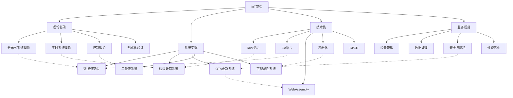

# IoT行业软件架构知识图谱

## 1. 概述

本知识图谱呈现了IoT行业软件架构的核心组件、概念层次和关系网络，作为项目分析和重构的导航地图。

## 2. 核心知识域与分类

### 2.1 分层架构视图

```text
┌─────────────────────────────────────────────────────────────────────────┐
│                           应用层 (Application Layer)                      │
│                                                                         │
│  ┌──────────────┐  ┌──────────────┐  ┌──────────────┐  ┌──────────────┐ │
│  │  设备管理    │  │  数据分析    │  │  可视化      │  │  业务逻辑    │ │
│  └──────────────┘  └──────────────┘  └──────────────┘  └──────────────┘ │
└─────────────────────────────────────────────────────────────────────────┘
┌─────────────────────────────────────────────────────────────────────────┐
│                           服务层 (Service Layer)                         │
│                                                                         │
│  ┌──────────────┐  ┌──────────────┐  ┌──────────────┐  ┌──────────────┐ │
│  │  API网关     │  │  微服务      │  │  工作流引擎  │  │  事件处理    │ │
│  └──────────────┘  └──────────────┘  └──────────────┘  └──────────────┘ │
└─────────────────────────────────────────────────────────────────────────┘
┌─────────────────────────────────────────────────────────────────────────┐
│                           数据层 (Data Layer)                            │
│                                                                         │
│  ┌──────────────┐  ┌──────────────┐  ┌──────────────┐  ┌──────────────┐ │
│  │  数据存储    │  │  流处理      │  │  批处理      │  │  数据集成    │ │
│  └──────────────┘  └──────────────┘  └──────────────┘  └──────────────┘ │
└─────────────────────────────────────────────────────────────────────────┘
┌─────────────────────────────────────────────────────────────────────────┐
│                           通信层 (Communication Layer)                   │
│                                                                         │
│  ┌──────────────┐  ┌──────────────┐  ┌──────────────┐  ┌──────────────┐ │
│  │  消息协议    │  │  API协议     │  │  连接管理    │  │  网络安全    │ │
│  └──────────────┘  └──────────────┘  └──────────────┘  └──────────────┘ │
└─────────────────────────────────────────────────────────────────────────┘
┌─────────────────────────────────────────────────────────────────────────┐
│                           边缘层 (Edge Layer)                            │
│                                                                         │
│  ┌──────────────┐  ┌──────────────┐  ┌──────────────┐  ┌──────────────┐ │
│  │  边缘计算    │  │  本地存储    │  │  设备协议    │  │  OTA更新     │ │
│  └──────────────┘  └──────────────┘  └──────────────┘  └──────────────┘ │
└─────────────────────────────────────────────────────────────────────────┘
┌─────────────────────────────────────────────────────────────────────────┐
│                           感知层 (Perception Layer)                      │
│                                                                         │
│  ┌──────────────┐  ┌──────────────┐  ┌──────────────┐  ┌──────────────┐ │
│  │  传感器      │  │  执行器      │  │  设备驱动    │  │  固件        │ │
│  └──────────────┘  └──────────────┘  └──────────────┘  └──────────────┘ │
└─────────────────────────────────────────────────────────────────────────┘
```

### 2.2 核心关系图谱



## 3. 关键概念及其关系

### 3.1 IoT系统核心概念

| 概念 | 定义 | 相关领域 | 实现技术 |
|------|------|----------|----------|
| 设备管理 | 设备的注册、配置、监控和控制 | 应用层 | Rust/Go微服务 |
| 边缘计算 | 在网络边缘处理数据以减少延迟和带宽 | 边缘层 | Rust+WebAssembly |
| 数据流处理 | 实时处理持续产生的数据流 | 数据层 | 流处理引擎 |
| 消息协议 | 设备与系统间的通信标准 | 通信层 | MQTT/CoAP/HTTP |
| OTA更新 | 远程更新设备固件和软件 | 边缘层 | 差分更新算法 |
| 微服务 | 分布式服务架构模式 | 服务层 | 容器化部署 |
| 工作流引擎 | 自动化业务流程执行 | 服务层 | 状态机模型 |

### 3.2 形式化定义示例

**定义 1 (IoT系统)** IoT系统是一个六元组 $\mathcal{S} = (D, E, C, P, S, A)$，其中：

- $D$ 是设备集合
- $E$ 是边缘节点集合
- $C$ 是通信协议集合
- $P$ 是数据处理组件集合
- $S$ 是存储组件集合
- $A$ 是应用服务集合

**定义 2 (边缘计算模型)** 边缘计算模型是三元组 $\mathcal{E} = (N, T, R)$，其中：

- $N$ 是边缘节点集合
- $T$ 是任务分配函数 $T: D \times A \rightarrow N$
- $R$ 是资源管理函数 $R: N \rightarrow 2^{Resources}$

## 4. 技术栈映射

### 4.1 Rust技术栈

```text
Rust IoT技术栈
├── 系统级
│   ├── embedded-hal - 硬件抽象层
│   ├── cortex-m - ARM Cortex-M支持
│   └── no_std - 无标准库支持
├── 网络通信
│   ├── tokio - 异步运行时
│   ├── rumqttc - MQTT客户端
│   ├── coap-rs - CoAP协议支持
│   └── reqwest - HTTP客户端
├── 数据处理
│   ├── serde - 序列化/反序列化
│   ├── sqlx - 数据库访问
│   └── rskafka - Kafka客户端
├── 安全
│   ├── ring - 密码学
│   ├── rustls - TLS实现
│   └── ed25519-dalek - 数字签名
└── 应用框架
    ├── actix-web - Web框架
    ├── embassy - 嵌入式异步框架
    └── tonic - gRPC框架
```

### 4.2 Go技术栈

```text
Go IoT技术栈
├── 系统级
│   ├── hardware - 硬件接口
│   ├── periph - 外设支持
│   └── tinygo - 小型设备支持
├── 网络通信
│   ├── paho.mqtt - MQTT客户端
│   ├── go-coap - CoAP协议支持
│   └── fasthttp - HTTP客户端
├── 数据处理
│   ├── encoding/json - JSON处理
│   ├── sqlx - 数据库访问
│   └── sarama - Kafka客户端
├── 安全
│   ├── crypto - 密码学
│   ├── autocert - 证书管理
│   └── jwt-go - JWT支持
└── 应用框架
    ├── gin - Web框架
    ├── echo - Web框架
    └── grpc-go - gRPC框架
```

## 5. 应用领域分类

### 5.1 垂直行业应用

- **工业物联网**
  - 工厂自动化
  - 预测性维护
  - 供应链优化

- **智能家居**
  - 家庭自动化
  - 能源管理
  - 安全监控

- **智慧城市**
  - 智能交通
  - 环境监测
  - 公共安全

- **智慧医疗**
  - 远程监护
  - 医疗设备管理
  - 患者追踪

### 5.2 技术范式分类

- **云-边-端协同**
  - 云中心架构
  - 边缘增强架构
  - 分布式自治架构

- **数据处理范式**
  - 批处理模式
  - 流处理模式
  - 混合处理模式

- **连接范式**
  - 直连模式
  - 网关聚合模式
  - 网格网络模式

## 6. 知识图谱更新记录

| 日期 | 版本 | 更新内容 |
|------|------|----------|
| 2024-12-20 | v1.0 | 初始版本创建，包含核心架构视图和关系图谱 |
| | | 添加形式化定义和技术栈映射 |
| | | 建立应用领域分类 |

---

*注：本知识图谱是对IoT行业软件架构的概念化表达，实际系统实现可能有所变化。图谱将随项目进展持续更新和完善。*
