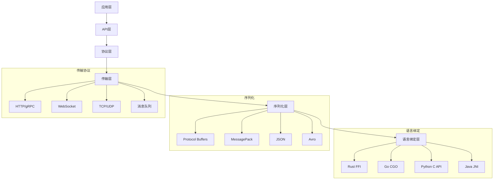

# 跨语言互操作指南

## 概述

本文档详细阐述IoT系统中不同编程语言间的互操作方案，包括FFI、RPC、消息队列、共享内存、Web服务等，为构建多语言IoT系统提供技术指导。

## 1. 跨语言互操作架构

### 1.1 互操作层次



### 1.2 互操作模式

| 模式 | 适用场景 | 性能 | 复杂度 | 语言支持 |
|------|---------|------|--------|---------|
| FFI调用 | 系统级集成 | 极高 | 高 | 所有语言 |
| RPC服务 | 服务间通信 | 高 | 中等 | 主流语言 |
| 消息队列 | 异步通信 | 中等 | 低 | 所有语言 |
| 共享内存 | 高性能数据交换 | 极高 | 高 | 系统语言 |
| Web服务 | 跨平台集成 | 中等 | 低 | 所有语言 |

## 2. FFI (Foreign Function Interface)

### 2.1 Rust FFI

```rust
// Rust库导出C接口
use std::ffi::{CString, CStr};
use std::os::raw::{c_char, c_int};

#[no_mangle]
pub extern "C" fn iot_device_create(device_id: *const c_char) -> *mut IoTDevice {
    let device_id_str = unsafe {
        CStr::from_ptr(device_id).to_string_lossy()
    };
    
    let device = IoTDevice::new(device_id_str.to_string());
    Box::into_raw(Box::new(device))
}

#[no_mangle]
pub extern "C" fn iot_device_send_data(
    device: *mut IoTDevice,
    data: *const c_char,
    len: c_int
) -> c_int {
    let device = unsafe { &mut *device };
    let data_slice = unsafe {
        std::slice::from_raw_parts(data as *const u8, len as usize)
    };
    
    match device.send_data(data_slice) {
        Ok(_) => 0,
        Err(_) => -1,
    }
}

#[no_mangle]
pub extern "C" fn iot_device_destroy(device: *mut IoTDevice) {
    unsafe {
        Box::from_raw(device);
    }
}

// C头文件生成
#[repr(C)]
pub struct IoTDevice {
    device_id: CString,
    status: c_int,
}

impl IoTDevice {
    pub fn new(device_id: String) -> Self {
        Self {
            device_id: CString::new(device_id).unwrap(),
            status: 0,
        }
    }
    
    pub fn send_data(&mut self, data: &[u8]) -> Result<(), String> {
        // 发送数据逻辑
        Ok(())
    }
}
```

### 2.2 Python调用Rust

```python
# Python使用ctypes调用Rust库
import ctypes
from ctypes import c_char_p, c_int, c_void_p, POINTER

# 加载Rust编译的动态库
lib = ctypes.CDLL('./libiot_device.so')

# 定义函数签名
lib.iot_device_create.argtypes = [c_char_p]
lib.iot_device_create.restype = c_void_p

lib.iot_device_send_data.argtypes = [c_void_p, c_char_p, c_int]
lib.iot_device_send_data.restype = c_int

lib.iot_device_destroy.argtypes = [c_void_p]
lib.iot_device_destroy.restype = None

class IoTDeviceWrapper:
    def __init__(self, device_id: str):
        device_id_bytes = device_id.encode('utf-8')
        self.device_ptr = lib.iot_device_create(device_id_bytes)
    
    def send_data(self, data: bytes) -> bool:
        result = lib.iot_device_send_data(
            self.device_ptr,
            data,
            len(data)
        )
        return result == 0
    
    def __del__(self):
        if hasattr(self, 'device_ptr'):
            lib.iot_device_destroy(self.device_ptr)

# 使用示例
device = IoTDeviceWrapper("device_001")
success = device.send_data(b"Hello from Python")
print(f"Data sent: {success}")
```

### 2.3 Go调用Rust

```go
// Go使用CGO调用Rust库
package main

/*
#cgo LDFLAGS: -L. -liot_device
#include <stdlib.h>

typedef struct IoTDevice IoTDevice;

IoTDevice* iot_device_create(const char* device_id);
int iot_device_send_data(IoTDevice* device, const char* data, int len);
void iot_device_destroy(IoTDevice* device);
*/
import "C"
import (
    "fmt"
    "unsafe"
)

type IoTDevice struct {
    ptr unsafe.Pointer
}

func NewIoTDevice(deviceID string) *IoTDevice {
    cDeviceID := C.CString(deviceID)
    defer C.free(unsafe.Pointer(cDeviceID))
    
    ptr := C.iot_device_create(cDeviceID)
    return &IoTDevice{ptr: ptr}
}

func (d *IoTDevice) SendData(data []byte) bool {
    cData := C.CString(string(data))
    defer C.free(unsafe.Pointer(cData))
    
    result := C.iot_device_send_data(d.ptr, cData, C.int(len(data)))
    return result == 0
}

func (d *IoTDevice) Close() {
    C.iot_device_destroy(d.ptr)
}

// 使用示例
func main() {
    device := NewIoTDevice("device_001")
    defer device.Close()
    
    success := device.SendData([]byte("Hello from Go"))
    fmt.Printf("Data sent: %v\n", success)
}
```

## 3. RPC服务互操作

### 3.1 gRPC跨语言服务

```protobuf
// device_service.proto
syntax = "proto3";

package iot.device;

service DeviceService {
    rpc RegisterDevice(RegisterDeviceRequest) returns (RegisterDeviceResponse);
    rpc GetDevice(GetDeviceRequest) returns (GetDeviceResponse);
    rpc SendData(SendDataRequest) returns (SendDataResponse);
    rpc StreamData(StreamDataRequest) returns (stream DataResponse);
}

message RegisterDeviceRequest {
    string device_id = 1;
    string name = 2;
    string device_type = 3;
    map<string, string> metadata = 4;
}

message RegisterDeviceResponse {
    bool success = 1;
    string message = 2;
}

message SendDataRequest {
    string device_id = 1;
    repeated SensorData data = 2;
}

message SensorData {
    string sensor_type = 1;
    double value = 2;
    int64 timestamp = 3;
}

message SendDataResponse {
    bool success = 1;
    string message = 2;
}
```

### 3.2 Rust gRPC服务端

```rust
// Rust gRPC服务端
use tonic::{transport::Server, Request, Response, Status};
use iot_device::device_service_server::{DeviceService, DeviceServiceServer};
use iot_device::{RegisterDeviceRequest, RegisterDeviceResponse, SendDataRequest, SendDataResponse};

pub mod iot_device {
    tonic::include_proto!("iot.device");
}

#[derive(Debug, Default)]
pub struct DeviceServiceImpl {
    devices: std::collections::HashMap<String, Device>,
}

#[tonic::async_trait]
impl DeviceService for DeviceServiceImpl {
    async fn register_device(
        &self,
        request: Request<RegisterDeviceRequest>,
    ) -> Result<Response<RegisterDeviceResponse>, Status> {
        let req = request.into_inner();
        
        let device = Device {
            device_id: req.device_id.clone(),
            name: req.name,
            device_type: req.device_type,
            metadata: req.metadata,
        };
        
        // 注册设备逻辑
        println!("Registering device: {}", req.device_id);
        
        let response = RegisterDeviceResponse {
            success: true,
            message: "Device registered successfully".to_string(),
        };
        
        Ok(Response::new(response))
    }
    
    async fn send_data(
        &self,
        request: Request<SendDataRequest>,
    ) -> Result<Response<SendDataResponse>, Status> {
        let req = request.into_inner();
        
        // 处理传感器数据
        for sensor_data in req.data {
            println!("Received data from {}: {} = {}", 
                req.device_id, sensor_data.sensor_type, sensor_data.value);
        }
        
        let response = SendDataResponse {
            success: true,
            message: "Data processed successfully".to_string(),
        };
        
        Ok(Response::new(response))
    }
}

#[tokio::main]
async fn main() -> Result<(), Box<dyn std::error::Error>> {
    let addr = "[::1]:50051".parse()?;
    let device_service = DeviceServiceImpl::default();
    
    Server::builder()
        .add_service(DeviceServiceServer::new(device_service))
        .serve(addr)
        .await?;
    
    Ok(())
}
```

### 3.3 Python gRPC客户端

```python
# Python gRPC客户端
import grpc
from iot_device_pb2 import RegisterDeviceRequest, SendDataRequest, SensorData
from iot_device_pb2_grpc import DeviceServiceStub

class IoTDeviceClient:
    def __init__(self, server_address: str = "localhost:50051"):
        self.channel = grpc.insecure_channel(server_address)
        self.stub = DeviceServiceStub(self.channel)
    
    def register_device(self, device_id: str, name: str, device_type: str, metadata: dict = None):
        request = RegisterDeviceRequest(
            device_id=device_id,
            name=name,
            device_type=device_type,
            metadata=metadata or {}
        )
        
        response = self.stub.RegisterDevice(request)
        return response.success, response.message
    
    def send_sensor_data(self, device_id: str, sensor_data: list):
        sensor_data_proto = [
            SensorData(
                sensor_type=data['sensor_type'],
                value=data['value'],
                timestamp=data['timestamp']
            )
            for data in sensor_data
        ]
        
        request = SendDataRequest(
            device_id=device_id,
            data=sensor_data_proto
        )
        
        response = self.stub.SendData(request)
        return response.success, response.message
    
    def close(self):
        self.channel.close()

# 使用示例
client = IoTDeviceClient()

# 注册设备
success, message = client.register_device(
    "device_001",
    "Temperature Sensor",
    "sensor",
    {"location": "room_1", "zone": "building_a"}
)
print(f"Registration: {success}, {message}")

# 发送传感器数据
sensor_data = [
    {"sensor_type": "temperature", "value": 25.5, "timestamp": 1234567890},
    {"sensor_type": "humidity", "value": 60.0, "timestamp": 1234567890}
]

success, message = client.send_sensor_data("device_001", sensor_data)
print(f"Data sent: {success}, {message}")

client.close()
```

### 3.4 Go gRPC客户端

```go
// Go gRPC客户端
package main

import (
    "context"
    "log"
    "time"
    
    "google.golang.org/grpc"
    pb "path/to/iot_device"
)

type IoTDeviceClient struct {
    conn   *grpc.ClientConn
    client pb.DeviceServiceClient
}

func NewIoTDeviceClient(address string) (*IoTDeviceClient, error) {
    conn, err := grpc.Dial(address, grpc.WithInsecure())
    if err != nil {
        return nil, err
    }
    
    client := pb.NewDeviceServiceClient(conn)
    return &IoTDeviceClient{
        conn:   conn,
        client: client,
    }, nil
}

func (c *IoTDeviceClient) RegisterDevice(deviceID, name, deviceType string, metadata map[string]string) (bool, string, error) {
    ctx, cancel := context.WithTimeout(context.Background(), time.Second)
    defer cancel()
    
    req := &pb.RegisterDeviceRequest{
        DeviceId:   deviceID,
        Name:       name,
        DeviceType: deviceType,
        Metadata:   metadata,
    }
    
    resp, err := c.client.RegisterDevice(ctx, req)
    if err != nil {
        return false, "", err
    }
    
    return resp.Success, resp.Message, nil
}

func (c *IoTDeviceClient) SendSensorData(deviceID string, sensorData []SensorData) (bool, string, error) {
    ctx, cancel := context.WithTimeout(context.Background(), time.Second)
    defer cancel()
    
    var protoData []*pb.SensorData
    for _, data := range sensorData {
        protoData = append(protoData, &pb.SensorData{
            SensorType: data.SensorType,
            Value:      data.Value,
            Timestamp:  data.Timestamp,
        })
    }
    
    req := &pb.SendDataRequest{
        DeviceId: deviceID,
        Data:     protoData,
    }
    
    resp, err := c.client.SendData(ctx, req)
    if err != nil {
        return false, "", err
    }
    
    return resp.Success, resp.Message, nil
}

func (c *IoTDeviceClient) Close() {
    c.conn.Close()
}

type SensorData struct {
    SensorType string
    Value      float64
    Timestamp  int64
}

// 使用示例
func main() {
    client, err := NewIoTDeviceClient("localhost:50051")
    if err != nil {
        log.Fatal(err)
    }
    defer client.Close()
    
    // 注册设备
    success, message, err := client.RegisterDevice(
        "device_001",
        "Temperature Sensor",
        "sensor",
        map[string]string{"location": "room_1"},
    )
    if err != nil {
        log.Fatal(err)
    }
    log.Printf("Registration: %v, %s", success, message)
    
    // 发送传感器数据
    sensorData := []SensorData{
        {SensorType: "temperature", Value: 25.5, Timestamp: time.Now().Unix()},
        {SensorType: "humidity", Value: 60.0, Timestamp: time.Now().Unix()},
    }
    
    success, message, err = client.SendSensorData("device_001", sensorData)
    if err != nil {
        log.Fatal(err)
    }
    log.Printf("Data sent: %v, %s", success, message)
}
```

## 4. 消息队列互操作

### 4.1 Apache Kafka跨语言集成

```rust
// Rust Kafka生产者
use rdkafka::config::ClientConfig;
use rdkafka::producer::{FutureProducer, FutureRecord};
use rdkafka::util::Timeout;
use serde::{Deserialize, Serialize};

#[derive(Serialize, Deserialize)]
struct IoTMessage {
    device_id: String,
    sensor_type: String,
    value: f64,
    timestamp: i64,
}

pub struct IoTKafkaProducer {
    producer: FutureProducer,
    topic: String,
}

impl IoTKafkaProducer {
    pub fn new(brokers: &str, topic: &str) -> Result<Self, Box<dyn std::error::Error>> {
        let producer: FutureProducer = ClientConfig::new()
            .set("bootstrap.servers", brokers)
            .set("message.timeout.ms", "5000")
            .create()?;
        
        Ok(Self {
            producer,
            topic: topic.to_string(),
        })
    }
    
    pub async fn send_message(&self, message: IoTMessage) -> Result<(), Box<dyn std::error::Error>> {
        let json = serde_json::to_string(&message)?;
        let record = FutureRecord::to(&self.topic)
            .key(&message.device_id)
            .payload(&json);
        
        self.producer
            .send(record, Timeout::After(std::time::Duration::from_secs(5)))
            .await?;
        
        Ok(())
    }
}

#[tokio::main]
async fn main() -> Result<(), Box<dyn std::error::Error>> {
    let producer = IoTKafkaProducer::new("localhost:9092", "iot-sensor-data")?;
    
    let message = IoTMessage {
        device_id: "device_001".to_string(),
        sensor_type: "temperature".to_string(),
        value: 25.5,
        timestamp: chrono::Utc::now().timestamp(),
    };
    
    producer.send_message(message).await?;
    println!("Message sent successfully");
    
    Ok(())
}
```

```python
# Python Kafka消费者
from kafka import KafkaConsumer
import json
from typing import Dict, Any

class IoTKafkaConsumer:
    def __init__(self, brokers: list, topic: str, group_id: str):
        self.consumer = KafkaConsumer(
            topic,
            bootstrap_servers=brokers,
            group_id=group_id,
            value_deserializer=lambda x: json.loads(x.decode('utf-8')),
            auto_offset_reset='earliest',
            enable_auto_commit=True
        )
    
    def consume_messages(self, callback):
        """消费消息并调用回调函数处理"""
        for message in self.consumer:
            try:
                data = message.value
                callback(data)
            except Exception as e:
                print(f"Error processing message: {e}")
    
    def close(self):
        self.consumer.close()

def process_iot_message(data: Dict[str, Any]):
    """处理IoT消息"""
    print(f"Received data from {data['device_id']}: "
          f"{data['sensor_type']} = {data['value']} at {data['timestamp']}")
    
    # 数据处理逻辑
    if data['sensor_type'] == 'temperature' and data['value'] > 30:
        print("High temperature alert!")

# 使用示例
consumer = IoTKafkaConsumer(
    brokers=['localhost:9092'],
    topic='iot-sensor-data',
    group_id='iot-processor'
)

try:
    consumer.consume_messages(process_iot_message)
except KeyboardInterrupt:
    print("Stopping consumer...")
finally:
    consumer.close()
```

```go
// Go Kafka生产者
package main

import (
    "encoding/json"
    "log"
    "time"
    
    "github.com/Shopify/sarama"
)

type IoTMessage struct {
    DeviceID   string  `json:"device_id"`
    SensorType string  `json:"sensor_type"`
    Value      float64 `json:"value"`
    Timestamp  int64   `json:"timestamp"`
}

type IoTKafkaProducer struct {
    producer sarama.SyncProducer
    topic    string
}

func NewIoTKafkaProducer(brokers []string, topic string) (*IoTKafkaProducer, error) {
    config := sarama.NewConfig()
    config.Producer.RequiredAcks = sarama.WaitForAll
    config.Producer.Retry.Max = 5
    config.Producer.Return.Successes = true
    
    producer, err := sarama.NewSyncProducer(brokers, config)
    if err != nil {
        return nil, err
    }
    
    return &IoTKafkaProducer{
        producer: producer,
        topic:    topic,
    }, nil
}

func (p *IoTKafkaProducer) SendMessage(message IoTMessage) error {
    jsonData, err := json.Marshal(message)
    if err != nil {
        return err
    }
    
    msg := &sarama.ProducerMessage{
        Topic: p.topic,
        Key:   sarama.StringEncoder(message.DeviceID),
        Value: sarama.StringEncoder(jsonData),
    }
    
    _, _, err = p.producer.SendMessage(msg)
    return err
}

func (p *IoTKafkaProducer) Close() error {
    return p.producer.Close()
}

// 使用示例
func main() {
    producer, err := NewIoTKafkaProducer(
        []string{"localhost:9092"},
        "iot-sensor-data",
    )
    if err != nil {
        log.Fatal(err)
    }
    defer producer.Close()
    
    message := IoTMessage{
        DeviceID:   "device_001",
        SensorType: "temperature",
        Value:      25.5,
        Timestamp:  time.Now().Unix(),
    }
    
    err = producer.SendMessage(message)
    if err != nil {
        log.Fatal(err)
    }
    
    log.Println("Message sent successfully")
}
```

## 5. 共享内存互操作

### 5.1 跨进程共享内存

```rust
// Rust共享内存实现
use std::sync::{Arc, Mutex};
use std::collections::HashMap;
use serde::{Serialize, Deserialize};

#[derive(Serialize, Deserialize, Clone)]
pub struct SharedIoTData {
    pub device_id: String,
    pub sensor_data: HashMap<String, f64>,
    pub timestamp: u64,
}

pub struct SharedMemoryManager {
    data: Arc<Mutex<HashMap<String, SharedIoTData>>>,
}

impl SharedMemoryManager {
    pub fn new() -> Self {
        Self {
            data: Arc::new(Mutex::new(HashMap::new())),
        }
    }
    
    pub fn update_device_data(&self, device_id: &str, sensor_type: &str, value: f64) {
        let mut data = self.data.lock().unwrap();
        let entry = data.entry(device_id.to_string()).or_insert_with(|| SharedIoTData {
            device_id: device_id.to_string(),
            sensor_data: HashMap::new(),
            timestamp: 0,
        });
        
        entry.sensor_data.insert(sensor_type.to_string(), value);
        entry.timestamp = std::time::SystemTime::now()
            .duration_since(std::time::UNIX_EPOCH)
            .unwrap()
            .as_secs();
    }
    
    pub fn get_device_data(&self, device_id: &str) -> Option<SharedIoTData> {
        let data = self.data.lock().unwrap();
        data.get(device_id).cloned()
    }
    
    pub fn get_all_devices(&self) -> Vec<SharedIoTData> {
        let data = self.data.lock().unwrap();
        data.values().cloned().collect()
    }
}

// 导出C接口供其他语言调用
use std::ffi::{CString, CStr};
use std::os::raw::{c_char, c_double};

static mut SHARED_MANAGER: Option<SharedMemoryManager> = None;

#[no_mangle]
pub extern "C" fn init_shared_memory() {
    unsafe {
        SHARED_MANAGER = Some(SharedMemoryManager::new());
    }
}

#[no_mangle]
pub extern "C" fn update_sensor_data(
    device_id: *const c_char,
    sensor_type: *const c_char,
    value: c_double,
) -> i32 {
    unsafe {
        if let Some(ref manager) = SHARED_MANAGER {
            let device_id_str = CStr::from_ptr(device_id).to_string_lossy();
            let sensor_type_str = CStr::from_ptr(sensor_type).to_string_lossy();
            
            manager.update_device_data(&device_id_str, &sensor_type_str, value);
            0
        } else {
            -1
        }
    }
}
```

```python
# Python调用共享内存
import ctypes
from ctypes import c_char_p, c_double, c_int
import json

# 加载Rust编译的动态库
lib = ctypes.CDLL('./libshared_memory.so')

# 定义函数签名
lib.init_shared_memory.argtypes = []
lib.init_shared_memory.restype = None

lib.update_sensor_data.argtypes = [c_char_p, c_char_p, c_double]
lib.update_sensor_data.restype = c_int

class SharedMemoryClient:
    def __init__(self):
        lib.init_shared_memory()
    
    def update_sensor_data(self, device_id: str, sensor_type: str, value: float) -> bool:
        device_id_bytes = device_id.encode('utf-8')
        sensor_type_bytes = sensor_type.encode('utf-8')
        
        result = lib.update_sensor_data(device_id_bytes, sensor_type_bytes, value)
        return result == 0

# 使用示例
client = SharedMemoryClient()
success = client.update_sensor_data("device_001", "temperature", 25.5)
print(f"Sensor data updated: {success}")
```

## 6. Web服务互操作

### 6.1 RESTful API跨语言调用

```rust
// Rust Web服务
use warp::Filter;
use serde::{Deserialize, Serialize};
use std::collections::HashMap;

#[derive(Serialize, Deserialize)]
struct DeviceData {
    device_id: String,
    sensor_type: String,
    value: f64,
    timestamp: u64,
}

#[derive(Serialize, Deserialize)]
struct ApiResponse<T> {
    success: bool,
    data: Option<T>,
    message: String,
}

async fn handle_device_data(data: DeviceData) -> Result<impl warp::Reply, warp::Rejection> {
    println!("Received data: {:?}", data);
    
    let response = ApiResponse {
        success: true,
        data: Some(data),
        message: "Data processed successfully".to_string(),
    };
    
    Ok(warp::reply::json(&response))
}

#[tokio::main]
async fn main() {
    let device_data = warp::path("api")
        .and(warp::path("devices"))
        .and(warp::path("data"))
        .and(warp::post())
        .and(warp::body::json())
        .and_then(handle_device_data);
    
    let routes = device_data.with(warp::cors()
        .allow_any_origin()
        .allow_headers(vec!["content-type"])
        .allow_methods(vec!["GET", "POST", "DELETE"]));
    
    warp::serve(routes)
        .run(([127, 0, 0, 1], 3030))
        .await;
}
```

```python
# Python REST客户端
import requests
import json
from typing import Dict, Any

class IoTRestClient:
    def __init__(self, base_url: str):
        self.base_url = base_url.rstrip('/')
        self.session = requests.Session()
    
    def send_device_data(self, device_id: str, sensor_type: str, value: float) -> Dict[str, Any]:
        url = f"{self.base_url}/api/devices/data"
        data = {
            "device_id": device_id,
            "sensor_type": sensor_type,
            "value": value,
            "timestamp": int(time.time())
        }
        
        response = self.session.post(url, json=data)
        response.raise_for_status()
        return response.json()
    
    def get_device_status(self, device_id: str) -> Dict[str, Any]:
        url = f"{self.base_url}/api/devices/{device_id}/status"
        response = self.session.get(url)
        response.raise_for_status()
        return response.json()

# 使用示例
client = IoTRestClient("http://localhost:3030")

# 发送设备数据
response = client.send_device_data("device_001", "temperature", 25.5)
print(f"Response: {response}")

# 获取设备状态
status = client.get_device_status("device_001")
print(f"Device status: {status}")
```

```go
// Go REST客户端
package main

import (
    "bytes"
    "encoding/json"
    "fmt"
    "net/http"
    "time"
)

type DeviceData struct {
    DeviceID   string  `json:"device_id"`
    SensorType string  `json:"sensor_type"`
    Value      float64 `json:"value"`
    Timestamp  int64   `json:"timestamp"`
}

type ApiResponse struct {
    Success bool        `json:"success"`
    Data    interface{} `json:"data"`
    Message string      `json:"message"`
}

type IoTRestClient struct {
    baseURL string
    client  *http.Client
}

func NewIoTRestClient(baseURL string) *IoTRestClient {
    return &IoTRestClient{
        baseURL: baseURL,
        client: &http.Client{
            Timeout: 10 * time.Second,
        },
    }
}

func (c *IoTRestClient) SendDeviceData(deviceID, sensorType string, value float64) (*ApiResponse, error) {
    data := DeviceData{
        DeviceID:   deviceID,
        SensorType: sensorType,
        Value:      value,
        Timestamp:  time.Now().Unix(),
    }
    
    jsonData, err := json.Marshal(data)
    if err != nil {
        return nil, err
    }
    
    url := fmt.Sprintf("%s/api/devices/data", c.baseURL)
    resp, err := c.client.Post(url, "application/json", bytes.NewBuffer(jsonData))
    if err != nil {
        return nil, err
    }
    defer resp.Body.Close()
    
    var apiResp ApiResponse
    err = json.NewDecoder(resp.Body).Decode(&apiResp)
    return &apiResp, err
}

// 使用示例
func main() {
    client := NewIoTRestClient("http://localhost:3030")
    
    resp, err := client.SendDeviceData("device_001", "temperature", 25.5)
    if err != nil {
        fmt.Printf("Error: %v\n", err)
        return
    }
    
    fmt.Printf("Response: %+v\n", resp)
}
```

## 7. 总结

跨语言互操作是构建复杂IoT系统的关键技术：

1. **FFI调用**：适合系统级集成，性能最高但复杂度高
2. **RPC服务**：适合服务间通信，平衡性能和复杂度
3. **消息队列**：适合异步通信，解耦系统组件
4. **共享内存**：适合高性能数据交换，需要系统级支持
5. **Web服务**：适合跨平台集成，简单易用

选择合适的互操作方案需要考虑性能要求、系统复杂度、维护成本等因素，通常采用多种方案组合的方式构建完整的IoT系统。
