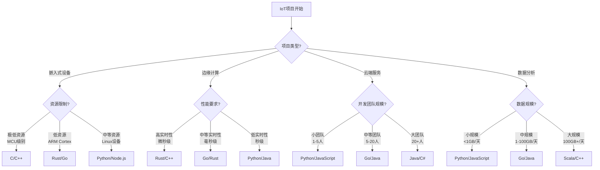
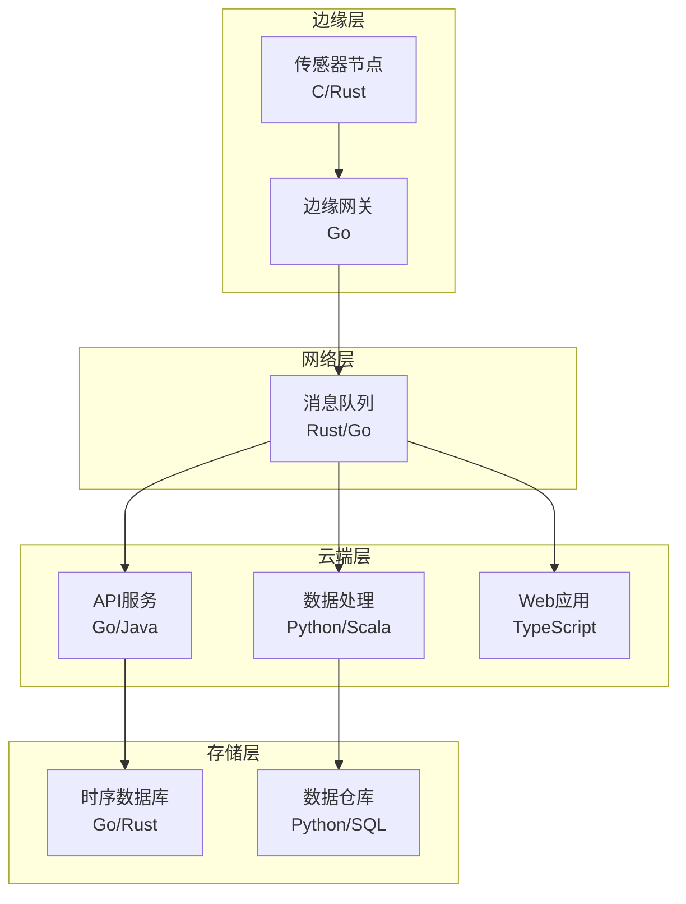

# 语言选择决策树

## 目录

- [语言选择决策树](#语言选择决策树)
  - [目录](#目录)
  - [概述](#概述)
  - [1. 决策树结构](#1-决策树结构)
  - [2. 详细决策矩阵](#2-详细决策矩阵)
    - [2.1 项目类型维度](#21-项目类型维度)
    - [2.2 性能要求维度](#22-性能要求维度)
    - [2.3 团队技能维度](#23-团队技能维度)
  - [3. 具体选择指南](#3-具体选择指南)
    - [3.1 嵌入式设备开发](#31-嵌入式设备开发)
    - [3.2 边缘计算网关](#32-边缘计算网关)
    - [3.3 云端数据分析](#33-云端数据分析)
  - [4. 混合架构语言选择](#4-混合架构语言选择)
    - [4.1 微服务架构](#41-微服务架构)
    - [4.2 边缘到云端架构](#42-边缘到云端架构)
  - [5. 性能对比分析](#5-性能对比分析)
    - [5.1 基准测试结果](#51-基准测试结果)
    - [5.2 适用场景矩阵](#52-适用场景矩阵)
  - [6. 决策建议](#6-决策建议)
    - [6.1 新项目选择](#61-新项目选择)
    - [6.2 现有项目迁移](#62-现有项目迁移)
    - [6.3 混合使用策略](#63-混合使用策略)
  - [7. 总结](#7-总结)

## 概述

本文档提供IoT系统开发中编程语言选择的决策树，帮助开发者根据项目需求、团队技能、性能要求等因素选择最适合的编程语言。

## 1. 决策树结构



## 2. 详细决策矩阵

### 2.1 项目类型维度

| 项目类型 | 推荐语言 | 理由 | 适用场景 |
|---------|---------|------|---------|
| 嵌入式设备 | C/C++, Rust | 内存效率高，直接硬件控制 | 传感器节点，MCU开发 |
| 边缘计算 | Go, Rust, C++ | 并发性能好，资源占用低 | 边缘网关，数据预处理 |
| 云端服务 | Python, Java, Go | 开发效率高，生态丰富 | 设备管理，数据分析 |
| 数据分析 | Python, Scala | 科学计算库丰富 | 机器学习，数据挖掘 |
| Web应用 | JavaScript, Python | 快速开发，丰富框架 | 监控面板，API服务 |

### 2.2 性能要求维度

| 性能要求 | 推荐语言 | 延迟要求 | 吞吐量要求 |
|---------|---------|---------|-----------|
| 极高性能 | C/C++, Rust | <1ms | >100K ops/s |
| 高性能 | Go, Rust | <10ms | >10K ops/s |
| 中等性能 | Java, C# | <100ms | >1K ops/s |
| 标准性能 | Python, JavaScript | <1s | >100 ops/s |

### 2.3 团队技能维度

| 团队规模 | 推荐语言 | 学习曲线 | 维护成本 |
|---------|---------|---------|---------|
| 小团队(1-5人) | Python, JavaScript | 平缓 | 低 |
| 中等团队(5-20人) | Go, Java | 中等 | 中等 |
| 大团队(20+人) | Java, C# | 陡峭 | 高 |

## 3. 具体选择指南

### 3.1 嵌入式设备开发

```rust
// Rust - 内存安全的高性能嵌入式开发
#![no_std]
#![no_main]

use cortex_m_rt::entry;
use stm32f4xx_hal::{
    gpio::{gpioa::PA5, Output, PushPull},
    pac,
    prelude::*,
};

#[entry]
fn main() -> ! {
    let dp = pac::Peripherals::take().unwrap();
    let cp = cortex_m::Peripherals::take().unwrap();
    
    let rcc = dp.RCC.constrain();
    let clocks = rcc.cfgr.freeze();
    
    let gpioa = dp.GPIOA.split();
    let mut led = gpioa.pa5.into_push_pull_output();
    
    let mut delay = cp.SYST.delay(&clocks);
    
    loop {
        led.set_high();
        delay.delay_ms(1000u32);
        led.set_low();
        delay.delay_ms(1000u32);
    }
}
```

**选择Rust的理由：**

- 内存安全，避免缓冲区溢出
- 零成本抽象，性能接近C
- 丰富的嵌入式生态系统
- 现代语言特性，开发效率高

### 3.2 边缘计算网关

```go
// Go - 高并发边缘网关
package main

import (
    "context"
    "fmt"
    "log"
    "net/http"
    "sync"
    "time"
)

type EdgeGateway struct {
    devices    map[string]*Device
    dataChan   chan SensorData
    httpServer *http.Server
    mutex      sync.RWMutex
}

func (gw *EdgeGateway) Start() error {
    // 启动HTTP服务器
    go gw.startHTTPServer()
    
    // 启动数据处理
    go gw.processData()
    
    // 启动设备监控
    go gw.monitorDevices()
    
    return nil
}

func (gw *EdgeGateway) processData() {
    for data := range gw.dataChan {
        // 并发处理数据
        go gw.handleSensorData(data)
    }
}

func (gw *EdgeGateway) handleSensorData(data SensorData) {
    // 数据预处理
    processed := gw.preprocessData(data)
    
    // 发送到云端
    go gw.sendToCloud(processed)
    
    // 本地存储
    go gw.storeLocally(processed)
}
```

**选择Go的理由：**

- 优秀的并发模型（Goroutines）
- 快速编译，部署简单
- 内存占用低
- 丰富的网络库

### 3.3 云端数据分析

```python
# Python - 数据分析和机器学习
import pandas as pd
import numpy as np
from sklearn.ensemble import IsolationForest
import asyncio
import aiohttp

class IoTDataAnalyzer:
    def __init__(self):
        self.anomaly_detector = IsolationForest(contamination=0.1)
        self.data_cache = {}
    
    async def analyze_device_data(self, device_id: str, data: List[SensorData]):
        """异步分析设备数据"""
        # 数据预处理
        df = pd.DataFrame([{
            'timestamp': d.timestamp,
            'sensor_type': d.sensor_type,
            'value': d.value
        } for d in data])
        
        # 异常检测
        anomalies = self.detect_anomalies(df)
        
        # 趋势分析
        trends = self.analyze_trends(df)
        
        # 预测分析
        predictions = await self.predict_future_values(df)
        
        return {
            'device_id': device_id,
            'anomalies': anomalies,
            'trends': trends,
            'predictions': predictions
        }
    
    def detect_anomalies(self, df: pd.DataFrame) -> List[Dict]:
        """检测异常值"""
        features = df.pivot_table(
            index='timestamp', 
            columns='sensor_type', 
            values='value'
        ).fillna(0)
        
        predictions = self.anomaly_detector.fit_predict(features)
        anomalies = features[predictions == -1]
        
        return anomalies.to_dict('records')
```

**选择Python的理由：**

- 丰富的数据科学库（pandas, numpy, scikit-learn）
- 强大的机器学习生态系统
- 快速原型开发
- 丰富的可视化库

## 4. 混合架构语言选择

### 4.1 微服务架构

```yaml
# 微服务语言选择策略
services:
  device-management:
    language: Go
    reason: 高并发设备连接管理
    port: 8080
    
  data-processing:
    language: Python
    reason: 复杂数据分析算法
    port: 8081
    
  api-gateway:
    language: Go
    reason: 高性能请求路由
    port: 8082
    
  web-frontend:
    language: TypeScript
    reason: 现代Web开发
    port: 3000
    
  message-broker:
    language: Rust
    reason: 高性能消息处理
    port: 9092
```

### 4.2 边缘到云端架构



## 5. 性能对比分析

### 5.1 基准测试结果

| 语言 | 启动时间 | 内存占用 | CPU使用率 | 开发效率 | 维护成本 |
|------|---------|---------|----------|---------|---------|
| C++ | 极快 | 极低 | 极低 | 低 | 高 |
| Rust | 快 | 低 | 低 | 中等 | 中等 |
| Go | 快 | 低 | 低 | 高 | 低 |
| Java | 中等 | 中等 | 中等 | 高 | 中等 |
| Python | 慢 | 高 | 高 | 极高 | 低 |
| JavaScript | 中等 | 中等 | 中等 | 高 | 低 |

### 5.2 适用场景矩阵

| 场景 | C++ | Rust | Go | Java | Python | JS |
|------|-----|------|----|----- |--------|----|
| 嵌入式开发 | ⭐⭐⭐⭐⭐ | ⭐⭐⭐⭐ | ⭐⭐ | ⭐ | ⭐ | ⭐ |
| 系统编程 | ⭐⭐⭐⭐⭐ | ⭐⭐⭐⭐⭐ | ⭐⭐⭐ | ⭐⭐ | ⭐ | ⭐ |
| 网络服务 | ⭐⭐⭐ | ⭐⭐⭐⭐ | ⭐⭐⭐⭐⭐ | ⭐⭐⭐⭐ | ⭐⭐⭐ | ⭐⭐⭐⭐ |
| 数据分析 | ⭐⭐ | ⭐⭐ | ⭐⭐ | ⭐⭐⭐ | ⭐⭐⭐⭐⭐ | ⭐⭐ |
| Web开发 | ⭐ | ⭐ | ⭐⭐ | ⭐⭐⭐⭐ | ⭐⭐⭐⭐ | ⭐⭐⭐⭐⭐ |
| 机器学习 | ⭐⭐ | ⭐⭐ | ⭐⭐ | ⭐⭐⭐ | ⭐⭐⭐⭐⭐ | ⭐⭐ |

## 6. 决策建议

### 6.1 新项目选择

1. **嵌入式项目**：优先选择Rust，其次C++
2. **边缘计算**：优先选择Go，其次Rust
3. **云端服务**：优先选择Go，其次Java
4. **数据分析**：优先选择Python，其次Scala
5. **Web应用**：优先选择TypeScript，其次Python

### 6.2 现有项目迁移

1. **性能瓶颈**：考虑迁移到Go或Rust
2. **维护困难**：考虑迁移到Python或Go
3. **团队技能**：优先考虑团队熟悉的语言
4. **生态依赖**：评估第三方库的可用性

### 6.3 混合使用策略

1. **核心服务**：使用高性能语言（Go/Rust）
2. **业务逻辑**：使用开发效率高的语言（Python/JS）
3. **数据处理**：使用专业语言（Python/Scala）
4. **前端界面**：使用现代Web技术（TypeScript）

## 7. 总结

语言选择决策需要考虑多个维度：

1. **项目需求**：性能、实时性、资源限制
2. **团队能力**：技能水平、学习成本
3. **生态支持**：第三方库、工具链
4. **长期维护**：代码质量、可维护性
5. **部署环境**：目标平台、运行环境

通过系统性的决策分析，能够选择最适合项目需求的编程语言，确保项目的成功实施和长期维护。
