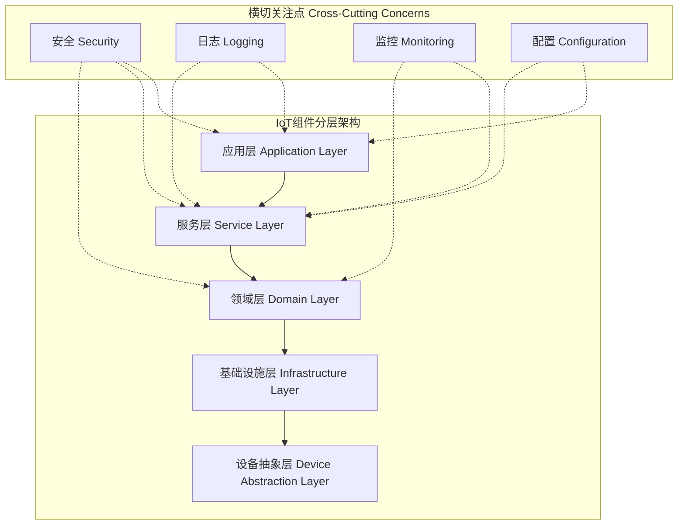

# IoT组件实现方法与接口规范

## 1. 概述

### 1.1 实现指南目标

- **标准化实现**：提供统一的组件实现方法和接口规范
- **最佳实践**：基于工业界和学术界的最佳实践经验
- **IoT优化**：针对IoT环境的特定优化和约束处理
- **可扩展性**：支持未来功能扩展和性能提升

### 1.2 适用范围

- **IoT设备组件**：传感器、执行器、通信模块
- **边缘计算组件**：数据处理、决策引擎、缓存模块
- **云端服务组件**：数据存储、分析服务、管理接口
- **跨层组件**：安全模块、日志组件、配置管理

---

## 2. 组件架构模型

### 2.1 分层架构设计



### 2.2 核心组件接口定义

#### 2.2.1 基础组件接口

```rust
use async_trait::async_trait;
use serde::{Deserialize, Serialize};
use std::collections::HashMap;
use std::time::{Duration, Instant};

/// 基础组件特征
#[async_trait]
pub trait Component: Send + Sync {
    type Config: Clone + Send + Sync;
    type Input: Send + Sync;
    type Output: Send + Sync;
    type Error: std::error::Error + Send + Sync;

    /// 组件初始化
    async fn initialize(&mut self, config: Self::Config) -> Result<(), Self::Error>;
    
    /// 组件启动
    async fn start(&mut self) -> Result<(), Self::Error>;
    
    /// 数据处理
    async fn process(&self, input: Self::Input) -> Result<Self::Output, Self::Error>;
    
    /// 批量处理
    async fn batch_process(&self, inputs: Vec<Self::Input>) -> Vec<Result<Self::Output, Self::Error>> {
        let mut results = Vec::new();
        for input in inputs {
            results.push(self.process(input).await);
        }
        results
    }
    
    /// 组件停止
    async fn stop(&mut self) -> Result<(), Self::Error>;
    
    /// 健康检查
    fn health_check(&self) -> HealthStatus;
    
    /// 获取组件元数据
    fn metadata(&self) -> ComponentMetadata;
}

/// 健康状态
#[derive(Debug, Clone, Serialize, Deserialize)]
pub enum HealthStatus {
    Healthy,
    Degraded { reason: String, severity: Severity },
    Unhealthy { reason: String, error_code: u32 },
}

/// 严重程度
#[derive(Debug, Clone, Serialize, Deserialize)]
pub enum Severity {
    Low,
    Medium,
    High,
    Critical,
}

/// 组件元数据
#[derive(Debug, Clone, Serialize, Deserialize)]
pub struct ComponentMetadata {
    pub name: String,
    pub version: String,
    pub description: String,
    pub dependencies: Vec<String>,
    pub capabilities: Vec<String>,
    pub resource_requirements: ResourceRequirements,
}

/// 资源需求
#[derive(Debug, Clone, Serialize, Deserialize)]
pub struct ResourceRequirements {
    pub min_memory_mb: u64,
    pub max_memory_mb: u64,
    pub min_cpu_cores: f32,
    pub max_cpu_cores: f32,
    pub storage_mb: u64,
    pub network_bandwidth_mbps: u64,
}
```

#### 2.2.2 IoT设备组件接口

```rust
/// IoT设备组件特征
#[async_trait]
pub trait IoTDeviceComponent: Component {
    type DeviceData: Send + Sync + Serialize + for<'de> Deserialize<'de>;
    type DeviceCommand: Send + Sync + Serialize + for<'de> Deserialize<'de>;
    
    /// 读取设备数据
    async fn read_data(&self) -> Result<Self::DeviceData, Self::Error>;
    
    /// 发送设备命令
    async fn send_command(&self, command: Self::DeviceCommand) -> Result<(), Self::Error>;
    
    /// 获取设备状态
    async fn get_device_status(&self) -> Result<DeviceStatus, Self::Error>;
    
    /// 设备校准
    async fn calibrate(&mut self) -> Result<(), Self::Error>;
    
    /// 设备重置
    async fn reset(&mut self) -> Result<(), Self::Error>;
}

/// 设备状态
#[derive(Debug, Clone, Serialize, Deserialize)]
pub struct DeviceStatus {
    pub device_id: String,
    pub online: bool,
    pub last_seen: chrono::DateTime<chrono::Utc>,
    pub battery_level: Option<f32>, // 0.0 - 1.0
    pub signal_strength: Option<f32>, // 0.0 - 1.0
    pub temperature: Option<f32>, // 摄氏度
    pub firmware_version: String,
    pub error_count: u32,
    pub uptime_seconds: u64,
}
```

#### 2.2.3 数据处理组件接口

```rust
/// 数据处理组件特征
#[async_trait]
pub trait DataProcessingComponent: Component {
    type ProcessingContext: Send + Sync;
    
    /// 流式数据处理
    async fn process_stream<S>(&self, stream: S, context: Self::ProcessingContext) -> Result<(), Self::Error>
    where
        S: futures::Stream<Item = Self::Input> + Send + Unpin;
    
    /// 实时数据处理
    async fn process_realtime(&self, input: Self::Input, deadline: Instant) -> Result<Option<Self::Output>, Self::Error>;
    
    /// 批量数据处理
    async fn process_batch_optimized(&self, inputs: Vec<Self::Input>) -> Result<Vec<Self::Output>, Self::Error>;
    
    /// 数据验证
    async fn validate_input(&self, input: &Self::Input) -> Result<(), ValidationError>;
    
    /// 数据转换
    async fn transform_output(&self, output: Self::Output) -> Result<Self::Output, Self::Error>;
}

/// 验证错误
#[derive(Debug, thiserror::Error)]
pub enum ValidationError {
    #[error("缺少必填字段: {field}")]
    MissingRequiredField { field: String },
    
    #[error("字段值超出范围: {field}, 值: {value}, 范围: {min}-{max}")]
    ValueOutOfRange { field: String, value: String, min: String, max: String },
    
    #[error("字段格式无效: {field}, 值: {value}")]
    InvalidFormat { field: String, value: String },
    
    #[error("字段类型不匹配: {field}, 期望: {expected}, 实际: {actual}")]
    TypeMismatch { field: String, expected: String, actual: String },
}
```

---

## 3. 实现模式

### 3.1 工厂模式实现

#### 3.1.1 组件工厂

```rust
use std::sync::Arc;

/// 组件工厂特征
pub trait ComponentFactory<T: Component>: Send + Sync {
    fn create(&self, config: T::Config) -> Result<Box<T>, ComponentCreationError>;
    fn create_shared(&self, config: T::Config) -> Result<Arc<T>, ComponentCreationError>;
    fn component_type(&self) -> &'static str;
    fn supported_versions(&self) -> Vec<String>;
}

/// 组件创建错误
#[derive(Debug, thiserror::Error)]
pub enum ComponentCreationError {
    #[error("配置无效: {message}")]
    InvalidConfiguration { message: String },
    
    #[error("资源不足: {resource}")]
    InsufficientResources { resource: String },
    
    #[error("依赖缺失: {dependency}")]
    MissingDependency { dependency: String },
    
    #[error("版本不兼容: {required}, 可用: {available}")]
    VersionIncompatible { required: String, available: String },
}

/// 传感器组件工厂示例
pub struct SensorComponentFactory {
    supported_sensor_types: Vec<String>,
}

impl SensorComponentFactory {
    pub fn new(supported_types: Vec<String>) -> Self {
        Self {
            supported_sensor_types: supported_types,
        }
    }
}

impl ComponentFactory<dyn IoTDeviceComponent<DeviceData = SensorData, DeviceCommand = SensorCommand, Config = SensorConfig, Input = (), Output = SensorData, Error = SensorError>> 
for SensorComponentFactory {
    fn create(&self, config: SensorConfig) -> Result<Box<dyn IoTDeviceComponent<DeviceData = SensorData, DeviceCommand = SensorCommand, Config = SensorConfig, Input = (), Output = SensorData, Error = SensorError>>, ComponentCreationError> {
        if !self.supported_sensor_types.contains(&config.sensor_type) {
            return Err(ComponentCreationError::InvalidConfiguration {
                message: format!("不支持的传感器类型: {}", config.sensor_type),
            });
        }
        
        match config.sensor_type.as_str() {
            "temperature" => Ok(Box::new(TemperatureSensor::new(config)?)),
            "humidity" => Ok(Box::new(HumiditySensor::new(config)?)),
            "pressure" => Ok(Box::new(PressureSensor::new(config)?)),
            _ => Err(ComponentCreationError::InvalidConfiguration {
                message: format!("未实现的传感器类型: {}", config.sensor_type),
            }),
        }
    }
    
    fn create_shared(&self, config: SensorConfig) -> Result<Arc<dyn IoTDeviceComponent<DeviceData = SensorData, DeviceCommand = SensorCommand, Config = SensorConfig, Input = (), Output = SensorData, Error = SensorError>>, ComponentCreationError> {
        Ok(Arc::from(self.create(config)?))
    }
    
    fn component_type(&self) -> &'static str {
        "sensor"
    }
    
    fn supported_versions(&self) -> Vec<String> {
        vec!["1.0.0".to_string(), "1.1.0".to_string()]
    }
}
```

#### 3.1.2 组件注册表

```rust
use std::collections::HashMap;
use std::sync::RwLock;

/// 组件注册表
pub struct ComponentRegistry {
    factories: RwLock<HashMap<String, Box<dyn ComponentFactoryWrapper>>>,
}

impl ComponentRegistry {
    pub fn new() -> Self {
        Self {
            factories: RwLock::new(HashMap::new()),
        }
    }
    
    pub fn register_factory<T>(&self, name: String, factory: Box<dyn ComponentFactory<T>>) -> Result<(), RegistryError>
    where
        T: Component + 'static,
    {
        let mut factories = self.factories.write().map_err(|_| RegistryError::LockError)?;
        
        if factories.contains_key(&name) {
            return Err(RegistryError::FactoryAlreadyExists { name });
        }
        
        factories.insert(name, Box::new(factory));
        Ok(())
    }
    
    pub fn create_component<T>(&self, factory_name: &str, config: T::Config) -> Result<Box<T>, ComponentCreationError>
    where
        T: Component + 'static,
    {
        let factories = self.factories.read().map_err(|_| ComponentCreationError::InvalidConfiguration {
            message: "无法获取工厂注册表读锁".to_string(),
        })?;
        
        let factory = factories.get(factory_name).ok_or_else(|| ComponentCreationError::InvalidConfiguration {
            message: format!("未找到工厂: {}", factory_name),
        })?;
        
        factory.create_component(config)
    }
    
    pub fn list_factories(&self) -> Result<Vec<String>, RegistryError> {
        let factories = self.factories.read().map_err(|_| RegistryError::LockError)?;
        Ok(factories.keys().cloned().collect())
    }
}

/// 注册表错误
#[derive(Debug, thiserror::Error)]
pub enum RegistryError {
    #[error("工厂已存在: {name}")]
    FactoryAlreadyExists { name: String },
    
    #[error("锁错误")]
    LockError,
}

/// 工厂包装器特征
trait ComponentFactoryWrapper: Send + Sync {
    fn create_component<T: Component + 'static>(&self, config: T::Config) -> Result<Box<T>, ComponentCreationError>;
    fn component_type(&self) -> &'static str;
}

impl<U: Component + 'static> ComponentFactoryWrapper for Box<dyn ComponentFactory<U>> {
    fn create_component<T: Component + 'static>(&self, config: T::Config) -> Result<Box<T>, ComponentCreationError> {
        // 类型安全的转换处理
        // 这里需要更复杂的类型检查和转换逻辑
        todo!("实现类型安全的组件创建")
    }
    
    fn component_type(&self) -> &'static str {
        ComponentFactory::component_type(self.as_ref())
    }
}
```

### 3.2 建造者模式实现

#### 3.2.1 组件建造者

```rust
/// 组件建造者特征
pub trait ComponentBuilder<T: Component> {
    type BuildError: std::error::Error;
    
    fn new() -> Self;
    fn with_config(self, config: T::Config) -> Self;
    fn with_dependency<D>(self, name: String, dependency: D) -> Self;
    fn with_middleware<M>(self, middleware: M) -> Self;
    fn build(self) -> Result<T, Self::BuildError>;
}

/// 数据处理组件建造者示例
pub struct DataProcessorBuilder {
    config: Option<ProcessorConfig>,
    dependencies: HashMap<String, Box<dyn std::any::Any + Send + Sync>>,
    middlewares: Vec<Box<dyn ProcessingMiddleware>>,
    validators: Vec<Box<dyn DataValidator>>,
}

impl ComponentBuilder<DataProcessor> for DataProcessorBuilder {
    type BuildError = ProcessorBuildError;
    
    fn new() -> Self {
        Self {
            config: None,
            dependencies: HashMap::new(),
            middlewares: Vec::new(),
            validators: Vec::new(),
        }
    }
    
    fn with_config(mut self, config: ProcessorConfig) -> Self {
        self.config = Some(config);
        self
    }
    
    fn with_dependency<D: 'static + Send + Sync>(mut self, name: String, dependency: D) -> Self {
        self.dependencies.insert(name, Box::new(dependency));
        self
    }
    
    fn with_middleware<M: ProcessingMiddleware + 'static>(mut self, middleware: M) -> Self {
        self.middlewares.push(Box::new(middleware));
        self
    }
    
    fn build(self) -> Result<DataProcessor, Self::BuildError> {
        let config = self.config.ok_or(ProcessorBuildError::MissingConfig)?;
        
        // 验证依赖
        for required_dep in &config.required_dependencies {
            if !self.dependencies.contains_key(required_dep) {
                return Err(ProcessorBuildError::MissingDependency {
                    name: required_dep.clone(),
                });
            }
        }
        
        Ok(DataProcessor {
            config,
            dependencies: self.dependencies,
            middlewares: self.middlewares,
            validators: self.validators,
        })
    }
}

impl DataProcessorBuilder {
    pub fn with_validator<V: DataValidator + 'static>(mut self, validator: V) -> Self {
        self.validators.push(Box::new(validator));
        self
    }
    
    pub fn with_retry_policy(mut self, policy: RetryPolicy) -> Self {
        self.with_middleware(RetryMiddleware::new(policy))
    }
    
    pub fn with_circuit_breaker(mut self, config: CircuitBreakerConfig) -> Self {
        self.with_middleware(CircuitBreakerMiddleware::new(config))
    }
    
    pub fn with_timeout(mut self, timeout: Duration) -> Self {
        self.with_middleware(TimeoutMiddleware::new(timeout))
    }
}

/// 建造者错误
#[derive(Debug, thiserror::Error)]
pub enum ProcessorBuildError {
    #[error("缺少配置")]
    MissingConfig,
    
    #[error("缺少依赖: {name}")]
    MissingDependency { name: String },
    
    #[error("配置验证失败: {message}")]
    ConfigValidationFailed { message: String },
}
```

#### 3.2.2 流式建造者

```rust
/// 流式建造者示例
pub struct FluentComponentBuilder<T> {
    component_type: std::marker::PhantomData<T>,
    config: serde_json::Value,
    plugins: Vec<Box<dyn Plugin>>,
}

impl<T: Component> FluentComponentBuilder<T> {
    pub fn new() -> Self {
        Self {
            component_type: std::marker::PhantomData,
            config: serde_json::Value::Object(serde_json::Map::new()),
            plugins: Vec::new(),
        }
    }
    
    pub fn configure<F>(mut self, configure_fn: F) -> Self 
    where
        F: FnOnce(&mut serde_json::Value),
    {
        configure_fn(&mut self.config);
        self
    }
    
    pub fn add_plugin<P: Plugin + 'static>(mut self, plugin: P) -> Self {
        self.plugins.push(Box::new(plugin));
        self
    }
    
    pub fn with_logging(self) -> Self {
        self.add_plugin(LoggingPlugin::new())
    }
    
    pub fn with_metrics(self) -> Self {
        self.add_plugin(MetricsPlugin::new())
    }
    
    pub fn with_security(self, security_config: SecurityConfig) -> Self {
        self.add_plugin(SecurityPlugin::new(security_config))
    }
    
    pub async fn build(self) -> Result<T, ComponentBuildError> {
        // 反序列化配置
        let config: T::Config = serde_json::from_value(self.config)
            .map_err(|e| ComponentBuildError::ConfigurationError { source: e.into() })?;
        
        // 创建组件实例
        let mut component = T::create_with_config(config).await?;
        
        // 应用插件
        for plugin in self.plugins {
            plugin.apply(&mut component).await?;
        }
        
        Ok(component)
    }
}

/// 插件特征
#[async_trait]
pub trait Plugin: Send + Sync {
    async fn apply<T: Component>(&self, component: &mut T) -> Result<(), PluginError>;
    fn name(&self) -> &'static str;
    fn version(&self) -> &'static str;
}

/// 插件错误
#[derive(Debug, thiserror::Error)]
pub enum PluginError {
    #[error("插件应用失败: {plugin_name}, 原因: {reason}")]
    ApplicationFailed { plugin_name: String, reason: String },
    
    #[error("插件配置无效: {plugin_name}")]
    InvalidConfiguration { plugin_name: String },
}

/// 组件建造错误
#[derive(Debug, thiserror::Error)]
pub enum ComponentBuildError {
    #[error("配置错误")]
    ConfigurationError {
        #[from]
        source: Box<dyn std::error::Error + Send + Sync>,
    },
    
    #[error("插件错误")]
    PluginError {
        #[from]
        source: PluginError,
    },
    
    #[error("组件创建失败")]
    CreationFailed {
        #[from]
        source: ComponentCreationError,
    },
}
```

---

## 4. 中间件和装饰器模式

### 4.1 中间件实现

#### 4.1.1 处理中间件

```rust
/// 处理中间件特征
#[async_trait]
pub trait ProcessingMiddleware: Send + Sync {
    async fn before_process<T>(&self, input: &T) -> Result<(), MiddlewareError>;
    async fn after_process<T>(&self, input: &T, output: &T) -> Result<(), MiddlewareError>;
    async fn on_error<T>(&self, input: &T, error: &dyn std::error::Error) -> Result<(), MiddlewareError>;
}

/// 中间件错误
#[derive(Debug, thiserror::Error)]
pub enum MiddlewareError {
    #[error("前置处理失败: {message}")]
    PreProcessingFailed { message: String },
    
    #[error("后置处理失败: {message}")]
    PostProcessingFailed { message: String },
    
    #[error("错误处理失败: {message}")]
    ErrorHandlingFailed { message: String },
}

/// 日志中间件
pub struct LoggingMiddleware {
    logger: slog::Logger,
    log_level: slog::Level,
}

impl LoggingMiddleware {
    pub fn new(logger: slog::Logger, log_level: slog::Level) -> Self {
        Self { logger, log_level }
    }
}

#[async_trait]
impl ProcessingMiddleware for LoggingMiddleware {
    async fn before_process<T>(&self, _input: &T) -> Result<(), MiddlewareError> {
        slog::log!(self.logger, self.log_level, "开始处理数据");
        Ok(())
    }
    
    async fn after_process<T>(&self, _input: &T, _output: &T) -> Result<(), MiddlewareError> {
        slog::log!(self.logger, self.log_level, "数据处理完成");
        Ok(())
    }
    
    async fn on_error<T>(&self, _input: &T, error: &dyn std::error::Error) -> Result<(), MiddlewareError> {
        slog::error!(self.logger, "数据处理错误: {}", error);
        Ok(())
    }
}

/// 重试中间件
pub struct RetryMiddleware {
    policy: RetryPolicy,
}

impl RetryMiddleware {
    pub fn new(policy: RetryPolicy) -> Self {
        Self { policy }
    }
}

#[async_trait]
impl ProcessingMiddleware for RetryMiddleware {
    async fn before_process<T>(&self, _input: &T) -> Result<(), MiddlewareError> {
        // 重试逻辑在包装组件中实现
        Ok(())
    }
    
    async fn after_process<T>(&self, _input: &T, _output: &T) -> Result<(), MiddlewareError> {
        // 成功时重置重试计数
        Ok(())
    }
    
    async fn on_error<T>(&self, _input: &T, _error: &dyn std::error::Error) -> Result<(), MiddlewareError> {
        // 错误时触发重试逻辑
        Ok(())
    }
}

/// 重试策略
#[derive(Debug, Clone)]
pub struct RetryPolicy {
    pub max_attempts: u32,
    pub initial_delay: Duration,
    pub max_delay: Duration,
    pub backoff_multiplier: f64,
    pub jitter: bool,
}

impl Default for RetryPolicy {
    fn default() -> Self {
        Self {
            max_attempts: 3,
            initial_delay: Duration::from_millis(100),
            max_delay: Duration::from_secs(30),
            backoff_multiplier: 2.0,
            jitter: true,
        }
    }
}
```

#### 4.1.2 中间件链

```rust
/// 中间件链
pub struct MiddlewareChain {
    middlewares: Vec<Box<dyn ProcessingMiddleware>>,
}

impl MiddlewareChain {
    pub fn new() -> Self {
        Self {
            middlewares: Vec::new(),
        }
    }
    
    pub fn add_middleware<M: ProcessingMiddleware + 'static>(mut self, middleware: M) -> Self {
        self.middlewares.push(Box::new(middleware));
        self
    }
    
    pub async fn execute_before<T>(&self, input: &T) -> Result<(), MiddlewareError> {
        for middleware in &self.middlewares {
            middleware.before_process(input).await?;
        }
        Ok(())
    }
    
    pub async fn execute_after<T>(&self, input: &T, output: &T) -> Result<(), MiddlewareError> {
        // 反向执行后置处理
        for middleware in self.middlewares.iter().rev() {
            middleware.after_process(input, output).await?;
        }
        Ok(())
    }
    
    pub async fn execute_on_error<T>(&self, input: &T, error: &dyn std::error::Error) -> Result<(), MiddlewareError> {
        for middleware in &self.middlewares {
            middleware.on_error(input, error).await?;
        }
        Ok(())
    }
}

/// 中间件包装的组件
pub struct MiddlewareWrappedComponent<T: Component> {
    inner: T,
    middleware_chain: MiddlewareChain,
}

impl<T: Component> MiddlewareWrappedComponent<T> {
    pub fn new(component: T, middleware_chain: MiddlewareChain) -> Self {
        Self {
            inner: component,
            middleware_chain,
        }
    }
}

#[async_trait]
impl<T: Component> Component for MiddlewareWrappedComponent<T> {
    type Config = T::Config;
    type Input = T::Input;
    type Output = T::Output;
    type Error = T::Error;
    
    async fn initialize(&mut self, config: Self::Config) -> Result<(), Self::Error> {
        self.inner.initialize(config).await
    }
    
    async fn start(&mut self) -> Result<(), Self::Error> {
        self.inner.start().await
    }
    
    async fn process(&self, input: Self::Input) -> Result<Self::Output, Self::Error> {
        // 执行前置中间件
        if let Err(e) = self.middleware_chain.execute_before(&input).await {
            eprintln!("前置中间件执行失败: {:?}", e);
        }
        
        // 执行核心处理逻辑
        match self.inner.process(input.clone()).await {
            Ok(output) => {
                // 执行后置中间件
                if let Err(e) = self.middleware_chain.execute_after(&input, &output).await {
                    eprintln!("后置中间件执行失败: {:?}", e);
                }
                Ok(output)
            }
            Err(error) => {
                // 执行错误处理中间件
                if let Err(e) = self.middleware_chain.execute_on_error(&input, &error).await {
                    eprintln!("错误处理中间件执行失败: {:?}", e);
                }
                Err(error)
            }
        }
    }
    
    async fn stop(&mut self) -> Result<(), Self::Error> {
        self.inner.stop().await
    }
    
    fn health_check(&self) -> HealthStatus {
        self.inner.health_check()
    }
    
    fn metadata(&self) -> ComponentMetadata {
        self.inner.metadata()
    }
}
```

### 4.2 装饰器模式实现

#### 4.2.1 性能监控装饰器

```rust
use std::sync::atomic::{AtomicU64, Ordering};
use std::sync::Arc;

/// 性能监控装饰器
pub struct PerformanceMonitorDecorator<T: Component> {
    inner: T,
    metrics: Arc<ComponentMetrics>,
}

impl<T: Component> PerformanceMonitorDecorator<T> {
    pub fn new(component: T) -> Self {
        Self {
            inner: component,
            metrics: Arc::new(ComponentMetrics::new()),
        }
    }
    
    pub fn get_metrics(&self) -> Arc<ComponentMetrics> {
        self.metrics.clone()
    }
}

#[async_trait]
impl<T: Component> Component for PerformanceMonitorDecorator<T> {
    type Config = T::Config;
    type Input = T::Input;
    type Output = T::Output;
    type Error = T::Error;
    
    async fn initialize(&mut self, config: Self::Config) -> Result<(), Self::Error> {
        self.inner.initialize(config).await
    }
    
    async fn start(&mut self) -> Result<(), Self::Error> {
        self.inner.start().await
    }
    
    async fn process(&self, input: Self::Input) -> Result<Self::Output, Self::Error> {
        let start_time = Instant::now();
        self.metrics.total_requests.fetch_add(1, Ordering::Relaxed);
        
        match self.inner.process(input).await {
            Ok(output) => {
                let duration = start_time.elapsed();
                self.metrics.successful_requests.fetch_add(1, Ordering::Relaxed);
                self.metrics.record_processing_time(duration);
                Ok(output)
            }
            Err(error) => {
                let duration = start_time.elapsed();
                self.metrics.failed_requests.fetch_add(1, Ordering::Relaxed);
                self.metrics.record_processing_time(duration);
                Err(error)
            }
        }
    }
    
    async fn stop(&mut self) -> Result<(), Self::Error> {
        self.inner.stop().await
    }
    
    fn health_check(&self) -> HealthStatus {
        let base_health = self.inner.health_check();
        
        // 基于性能指标调整健康状态
        let success_rate = self.metrics.get_success_rate();
        let avg_processing_time = self.metrics.get_average_processing_time();
        
        match base_health {
            HealthStatus::Healthy => {
                if success_rate < 0.95 {
                    HealthStatus::Degraded {
                        reason: format!("成功率较低: {:.2}%", success_rate * 100.0),
                        severity: Severity::Medium,
                    }
                } else if avg_processing_time > Duration::from_millis(1000) {
                    HealthStatus::Degraded {
                        reason: format!("处理时间较长: {}ms", avg_processing_time.as_millis()),
                        severity: Severity::Low,
                    }
                } else {
                    HealthStatus::Healthy
                }
            }
            other => other,
        }
    }
    
    fn metadata(&self) -> ComponentMetadata {
        let mut metadata = self.inner.metadata();
        metadata.capabilities.push("performance_monitoring".to_string());
        metadata
    }
}

/// 组件性能指标
pub struct ComponentMetrics {
    pub total_requests: AtomicU64,
    pub successful_requests: AtomicU64,
    pub failed_requests: AtomicU64,
    processing_times: parking_lot::Mutex<Vec<Duration>>,
}

impl ComponentMetrics {
    pub fn new() -> Self {
        Self {
            total_requests: AtomicU64::new(0),
            successful_requests: AtomicU64::new(0),
            failed_requests: AtomicU64::new(0),
            processing_times: parking_lot::Mutex::new(Vec::new()),
        }
    }
    
    pub fn get_success_rate(&self) -> f64 {
        let total = self.total_requests.load(Ordering::Relaxed);
        if total == 0 {
            return 1.0;
        }
        
        let successful = self.successful_requests.load(Ordering::Relaxed);
        successful as f64 / total as f64
    }
    
    pub fn record_processing_time(&self, duration: Duration) {
        let mut times = self.processing_times.lock();
        times.push(duration);
        
        // 保持最近1000次记录
        if times.len() > 1000 {
            times.drain(0..500);
        }
    }
    
    pub fn get_average_processing_time(&self) -> Duration {
        let times = self.processing_times.lock();
        if times.is_empty() {
            return Duration::from_millis(0);
        }
        
        let total: Duration = times.iter().sum();
        total / times.len() as u32
    }
    
    pub fn get_percentile(&self, percentile: f64) -> Duration {
        let mut times = self.processing_times.lock();
        if times.is_empty() {
            return Duration::from_millis(0);
        }
        
        times.sort();
        let index = ((times.len() as f64 * percentile).ceil() as usize).min(times.len() - 1);
        times[index]
    }
}
```

---

## 5. 异步和并发实现

### 5.1 异步组件实现

#### 5.1.1 异步处理流水线

```rust
use tokio::sync::{mpsc, Semaphore};
use std::sync::Arc;

/// 异步处理流水线
pub struct AsyncProcessingPipeline<T, U> {
    stages: Vec<Box<dyn AsyncProcessingStage<T, U>>>,
    buffer_size: usize,
    concurrency_limit: Arc<Semaphore>,
}

impl<T, U> AsyncProcessingPipeline<T, U>
where
    T: Send + Sync + 'static,
    U: Send + Sync + 'static,
{
    pub fn new(buffer_size: usize, max_concurrency: usize) -> Self {
        Self {
            stages: Vec::new(),
            buffer_size,
            concurrency_limit: Arc::new(Semaphore::new(max_concurrency)),
        }
    }
    
    pub fn add_stage<S: AsyncProcessingStage<T, U> + 'static>(mut self, stage: S) -> Self {
        self.stages.push(Box::new(stage));
        self
    }
    
    pub async fn process_stream<S>(&self, input_stream: S) -> Result<mpsc::Receiver<U>, PipelineError>
    where
        S: futures::Stream<Item = T> + Send + 'static,
    {
        let (output_tx, output_rx) = mpsc::channel(self.buffer_size);
        
        let stages = self.stages.clone();
        let concurrency_limit = self.concurrency_limit.clone();
        
        tokio::spawn(async move {
            let mut input_stream = std::pin::Pin::from(Box::new(input_stream));
            
            while let Some(input) = futures::StreamExt::next(&mut input_stream).await {
                let permit = concurrency_limit.acquire().await.unwrap();
                let stages = stages.clone();
                let output_tx = output_tx.clone();
                
                tokio::spawn(async move {
                    let _permit = permit; // 持有许可直到任务完成
                    
                    let mut current_data = input;
                    
                    // 依次通过所有阶段
                    for stage in &stages {
                        match stage.process(current_data).await {
                            Ok(result) => current_data = result,
                            Err(e) => {
                                eprintln!("处理阶段错误: {:?}", e);
                                return;
                            }
                        }
                    }
                    
                    if let Err(e) = output_tx.send(current_data).await {
                        eprintln!("发送结果失败: {:?}", e);
                    }
                });
            }
        });
        
        Ok(output_rx)
    }
}

/// 异步处理阶段特征
#[async_trait]
pub trait AsyncProcessingStage<T, U>: Send + Sync {
    async fn process(&self, input: T) -> Result<U, StageError>;
    fn stage_name(&self) -> &'static str;
}

/// 阶段错误
#[derive(Debug, thiserror::Error)]
pub enum StageError {
    #[error("处理超时")]
    Timeout,
    
    #[error("资源不足")]
    ResourceExhausted,
    
    #[error("数据无效: {message}")]
    InvalidData { message: String },
    
    #[error("外部服务错误: {service}")]
    ExternalServiceError { service: String },
}

/// 流水线错误
#[derive(Debug, thiserror::Error)]
pub enum PipelineError {
    #[error("初始化失败")]
    InitializationFailed,
    
    #[error("阶段错误")]
    StageError {
        #[from]
        source: StageError,
    },
}
```

#### 5.1.2 背压处理

```rust
use tokio::sync::mpsc;
use tokio::time::{sleep, Duration, timeout};

/// 带背压的异步组件
pub struct BackpressureAwareComponent<T: Component> {
    inner: T,
    input_buffer: mpsc::Receiver<T::Input>,
    output_buffer: mpsc::Sender<T::Output>,
    buffer_size: usize,
    processing_timeout: Duration,
}

impl<T: Component> BackpressureAwareComponent<T> {
    pub fn new(
        component: T,
        buffer_size: usize,
        processing_timeout: Duration,
    ) -> (Self, mpsc::Sender<T::Input>, mpsc::Receiver<T::Output>) {
        let (input_tx, input_rx) = mpsc::channel(buffer_size);
        let (output_tx, output_rx) = mpsc::channel(buffer_size);
        
        let component = Self {
            inner: component,
            input_buffer: input_rx,
            output_buffer: output_tx,
            buffer_size,
            processing_timeout,
        };
        
        (component, input_tx, output_rx)
    }
    
    pub async fn run(&mut self) -> Result<(), ComponentError> {
        loop {
            match self.input_buffer.recv().await {
                Some(input) => {
                    match timeout(self.processing_timeout, self.inner.process(input)).await {
                        Ok(Ok(output)) => {
                            if let Err(_) = self.output_buffer.send(output).await {
                                // 输出通道已关闭，退出处理循环
                                break;
                            }
                        }
                        Ok(Err(e)) => {
                            eprintln!("处理错误: {:?}", e);
                            // 根据错误类型决定是否继续处理
                        }
                        Err(_) => {
                            eprintln!("处理超时");
                            // 记录超时并继续处理下一个输入
                        }
                    }
                }
                None => {
                    // 输入通道已关闭，退出处理循环
                    break;
                }
            }
        }
        
        Ok(())
    }
    
    pub async fn run_with_adaptive_backpressure(&mut self) -> Result<(), ComponentError> {
        let mut adaptive_delay = Duration::from_millis(1);
        let max_delay = Duration::from_millis(100);
        
        loop {
            let input = match self.input_buffer.try_recv() {
                Ok(input) => {
                    // 有输入可处理，重置延迟
                    adaptive_delay = Duration::from_millis(1);
                    input
                }
                Err(mpsc::error::TryRecvError::Empty) => {
                    // 没有输入，适应性等待
                    sleep(adaptive_delay).await;
                    adaptive_delay = std::cmp::min(adaptive_delay * 2, max_delay);
                    continue;
                }
                Err(mpsc::error::TryRecvError::Disconnected) => {
                    // 输入通道已关闭，退出处理循环
                    break;
                }
            };
            
            match timeout(self.processing_timeout, self.inner.process(input)).await {
                Ok(Ok(output)) => {
                    match self.output_buffer.try_send(output) {
                        Ok(_) => {
                            // 成功发送
                        }
                        Err(mpsc::error::TrySendError::Full(_)) => {
                            // 输出缓冲区满，等待一段时间
                            sleep(Duration::from_millis(10)).await;
                        }
                        Err(mpsc::error::TrySendError::Closed(_)) => {
                            // 输出通道已关闭，退出处理循环
                            break;
                        }
                    }
                }
                Ok(Err(e)) => {
                    eprintln!("处理错误: {:?}", e);
                }
                Err(_) => {
                    eprintln!("处理超时");
                }
            }
        }
        
        Ok(())
    }
}
```

### 5.2 并发控制实现

#### 5.2.1 工作池模式

```rust
use tokio::sync::{mpsc, oneshot};
use std::sync::Arc;

/// 工作项
pub struct WorkItem<T, U> {
    input: T,
    response_channel: oneshot::Sender<Result<U, WorkerError>>,
}

/// 工作者
pub struct Worker<T: Component> {
    id: usize,
    component: T,
    work_receiver: mpsc::Receiver<WorkItem<T::Input, T::Output>>,
}

impl<T: Component> Worker<T> {
    pub async fn run(mut self) {
        while let Some(work_item) = self.work_receiver.recv().await {
            let result = self.component.process(work_item.input).await;
            
            let _ = work_item.response_channel.send(
                result.map_err(|e| WorkerError::ProcessingFailed {
                    worker_id: self.id,
                    source: Box::new(e),
                })
            );
        }
    }
}

/// 工作池
pub struct WorkerPool<T: Component> {
    workers: Vec<mpsc::Sender<WorkItem<T::Input, T::Output>>>,
    next_worker: std::sync::atomic::AtomicUsize,
}

impl<T: Component + Clone> WorkerPool<T> {
    pub async fn new(component_template: T, pool_size: usize) -> Result<Self, WorkerPoolError> {
        let mut workers = Vec::new();
        
        for worker_id in 0..pool_size {
            let (work_sender, work_receiver) = mpsc::channel(100);
            let component = component_template.clone();
            
            let worker = Worker {
                id: worker_id,
                component,
                work_receiver,
            };
            
            tokio::spawn(worker.run());
            workers.push(work_sender);
        }
        
        Ok(Self {
            workers,
            next_worker: std::sync::atomic::AtomicUsize::new(0),
        })
    }
    
    pub async fn process(&self, input: T::Input) -> Result<T::Output, WorkerPoolError> {
        let (response_tx, response_rx) = oneshot::channel();
        
        let work_item = WorkItem {
            input,
            response_channel: response_tx,
        };
        
        // 轮询分配工作
        let worker_index = self.next_worker.fetch_add(1, std::sync::atomic::Ordering::Relaxed) % self.workers.len();
        
        self.workers[worker_index]
            .send(work_item)
            .await
            .map_err(|_| WorkerPoolError::WorkerUnavailable)?;
        
        response_rx
            .await
            .map_err(|_| WorkerPoolError::ResponseChannelClosed)?
            .map_err(WorkerPoolError::WorkerError)
    }
    
    pub async fn process_batch(&self, inputs: Vec<T::Input>) -> Vec<Result<T::Output, WorkerPoolError>> {
        let futures: Vec<_> = inputs.into_iter()
            .map(|input| self.process(input))
            .collect();
        
        futures::future::join_all(futures).await
    }
}

/// 工作者错误
#[derive(Debug, thiserror::Error)]
pub enum WorkerError {
    #[error("工作者 {worker_id} 处理失败")]
    ProcessingFailed {
        worker_id: usize,
        source: Box<dyn std::error::Error + Send + Sync>,
    },
}

/// 工作池错误
#[derive(Debug, thiserror::Error)]
pub enum WorkerPoolError {
    #[error("工作者不可用")]
    WorkerUnavailable,
    
    #[error("响应通道已关闭")]
    ResponseChannelClosed,
    
    #[error("工作者错误")]
    WorkerError {
        #[from]
        source: WorkerError,
    },
}
```

---

## 6. 配置管理

### 6.1 分层配置系统

#### 6.1.1 配置层次结构

```rust
use serde::{Deserialize, Serialize};
use std::collections::HashMap;

/// 配置层次结构
#[derive(Debug, Clone, Serialize, Deserialize)]
pub struct LayeredConfiguration {
    /// 默认配置
    pub defaults: serde_json::Value,
    /// 环境特定配置
    pub environment: HashMap<String, serde_json::Value>,
    /// 用户自定义配置
    pub user: serde_json::Value,
    /// 运行时覆盖配置
    pub runtime: serde_json::Value,
}

impl LayeredConfiguration {
    pub fn new() -> Self {
        Self {
            defaults: serde_json::Value::Object(serde_json::Map::new()),
            environment: HashMap::new(),
            user: serde_json::Value::Object(serde_json::Map::new()),
            runtime: serde_json::Value::Object(serde_json::Map::new()),
        }
    }
    
    pub fn merge(&self, env: &str) -> serde_json::Value {
        let mut result = self.defaults.clone();
        
        // 合并环境配置
        if let Some(env_config) = self.environment.get(env) {
            merge_json_values(&mut result, env_config);
        }
        
        // 合并用户配置
        merge_json_values(&mut result, &self.user);
        
        // 合并运行时配置
        merge_json_values(&mut result, &self.runtime);
        
        result
    }
    
    pub fn get_typed_config<T>(&self, env: &str) -> Result<T, ConfigError>
    where
        T: for<'de> Deserialize<'de>,
    {
        let merged = self.merge(env);
        serde_json::from_value(merged).map_err(|e| ConfigError::DeserializationFailed {
            source: e,
        })
    }
}

/// 合并JSON值
fn merge_json_values(target: &mut serde_json::Value, source: &serde_json::Value) {
    match (target, source) {
        (serde_json::Value::Object(target_map), serde_json::Value::Object(source_map)) => {
            for (key, value) in source_map {
                match target_map.get_mut(key) {
                    Some(target_value) => {
                        merge_json_values(target_value, value);
                    }
                    None => {
                        target_map.insert(key.clone(), value.clone());
                    }
                }
            }
        }
        _ => {
            *target = source.clone();
        }
    }
}

/// 配置错误
#[derive(Debug, thiserror::Error)]
pub enum ConfigError {
    #[error("配置反序列化失败")]
    DeserializationFailed {
        #[from]
        source: serde_json::Error,
    },
    
    #[error("配置文件不存在: {path}")]
    FileNotFound { path: String },
    
    #[error("配置验证失败: {message}")]
    ValidationFailed { message: String },
}
```

#### 6.1.2 动态配置更新

```rust
use tokio::sync::watch;
use std::sync::Arc;

/// 动态配置管理器
pub struct DynamicConfigManager<T> {
    config_sender: watch::Sender<T>,
    config_receiver: watch::Receiver<T>,
    file_watcher: Option<notify::RecommendedWatcher>,
}

impl<T> DynamicConfigManager<T>
where
    T: Clone + Send + Sync + for<'de> Deserialize<'de> + 'static,
{
    pub fn new(initial_config: T) -> Self {
        let (config_sender, config_receiver) = watch::channel(initial_config);
        
        Self {
            config_sender,
            config_receiver,
            file_watcher: None,
        }
    }
    
    pub fn get_config(&self) -> T {
        self.config_receiver.borrow().clone()
    }
    
    pub fn subscribe(&self) -> watch::Receiver<T> {
        self.config_receiver.clone()
    }
    
    pub async fn update_config(&self, new_config: T) -> Result<(), ConfigError> {
        self.config_sender.send(new_config).map_err(|_| ConfigError::ValidationFailed {
            message: "配置更新失败，接收者已关闭".to_string(),
        })?;
        Ok(())
    }
    
    pub async fn watch_file(&mut self, config_file_path: &str) -> Result<(), ConfigError> {
        use notify::{Watcher, RecursiveMode, Event, EventKind};
        use std::path::Path;
        
        let config_path = Path::new(config_file_path);
        let config_sender = self.config_sender.clone();
        let config_path_clone = config_path.to_path_buf();
        
        let mut watcher = notify::recommended_watcher(move |result: Result<Event, notify::Error>| {
            match result {
                Ok(event) => {
                    if let EventKind::Modify(_) = event.kind {
                        if let Ok(content) = std::fs::read_to_string(&config_path_clone) {
                            if let Ok(new_config) = serde_json::from_str::<T>(&content) {
                                let _ = config_sender.send(new_config);
                            }
                        }
                    }
                }
                Err(e) => eprintln!("配置文件监控错误: {:?}", e),
            }
        }).map_err(|_| ConfigError::ValidationFailed {
            message: "无法创建文件监控器".to_string(),
        })?;
        
        watcher.watch(config_path, RecursiveMode::NonRecursive).map_err(|_| ConfigError::ValidationFailed {
            message: "无法监控配置文件".to_string(),
        })?;
        
        self.file_watcher = Some(watcher);
        Ok(())
    }
}

/// 可配置组件特征
#[async_trait]
pub trait ConfigurableComponent: Component {
    type ConfigType: Clone + Send + Sync + for<'de> Deserialize<'de>;
    
    async fn update_config(&mut self, config: Self::ConfigType) -> Result<(), Self::Error>;
    async fn validate_config(&self, config: &Self::ConfigType) -> Result<(), ConfigError>;
}

/// 动态可配置组件包装器
pub struct DynamicallyConfigurableComponent<T> {
    inner: Arc<tokio::sync::RwLock<T>>,
    config_manager: DynamicConfigManager<T::ConfigType>,
}

impl<T> DynamicallyConfigurableComponent<T>
where
    T: ConfigurableComponent + Send + Sync + 'static,
    T::ConfigType: Clone + Send + Sync + for<'de> Deserialize<'de> + 'static,
{
    pub fn new(component: T, initial_config: T::ConfigType) -> Self {
        let inner = Arc::new(tokio::sync::RwLock::new(component));
        let config_manager = DynamicConfigManager::new(initial_config);
        
        // 启动配置更新监听
        let inner_clone = inner.clone();
        let mut config_receiver = config_manager.subscribe();
        
        tokio::spawn(async move {
            while config_receiver.changed().await.is_ok() {
                let new_config = config_receiver.borrow().clone();
                
                if let Ok(mut component) = inner_clone.write().await {
                    if let Err(e) = component.update_config(new_config).await {
                        eprintln!("配置更新失败: {:?}", e);
                    }
                }
            }
        });
        
        Self {
            inner,
            config_manager,
        }
    }
    
    pub async fn update_config(&self, config: T::ConfigType) -> Result<(), ConfigError> {
        // 验证配置
        {
            let component = self.inner.read().await;
            component.validate_config(&config).await?;
        }
        
        // 更新配置
        self.config_manager.update_config(config).await
    }
    
    pub fn get_current_config(&self) -> T::ConfigType {
        self.config_manager.get_config()
    }
}
```

---

## 7. 实现总结

### 7.1 关键实现要点

1. **类型安全**：使用Rust的类型系统确保编译时安全
2. **异步优先**：基于async/await的异步编程模型
3. **错误处理**：分层的错误处理和恢复机制
4. **性能优化**：零拷贝、内存池、批量处理等优化技术
5. **可观测性**：内置监控、日志、指标收集
6. **配置管理**：分层、动态、类型安全的配置系统

### 7.2 最佳实践总结

- **接口设计**：小而专一，易于测试和组合
- **依赖管理**：依赖注入，避免硬编码依赖
- **生命周期**：明确的初始化、启动、停止、清理阶段
- **错误处理**：可重试性标识，优雅降级机制
- **资源管理**：RAII模式，自动资源清理

### 7.3 扩展指南

- **插件系统**：基于trait的插件架构
- **热更新**：运行时组件替换和升级
- **分布式部署**：组件的分布式协调和通信
- **安全加固**：访问控制、数据加密、审计日志
