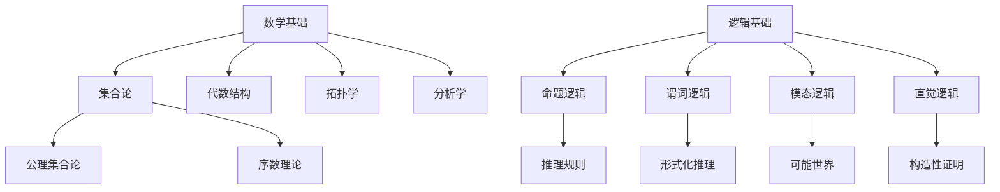
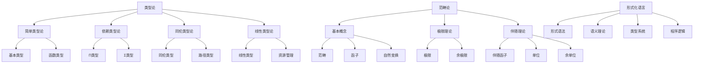
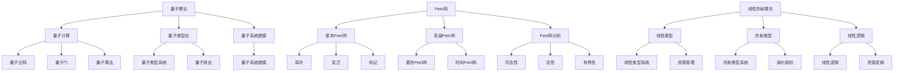
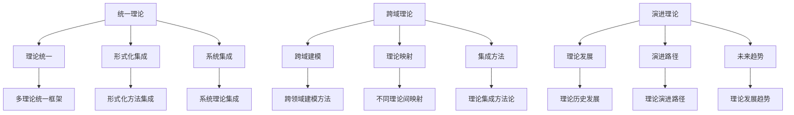
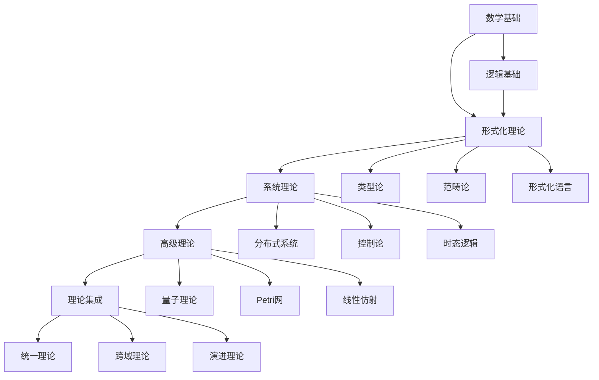
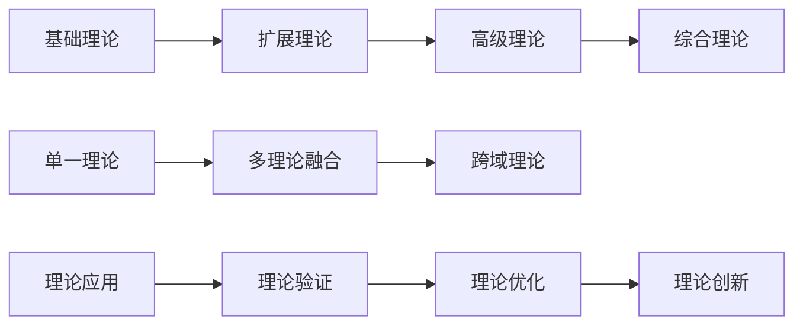
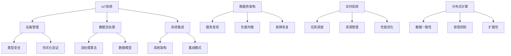
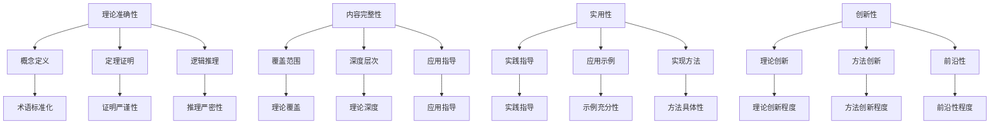

# Theory关联关系图

## 概述

**文档名称**：Theory关联关系图
**创建目的**：建立理论间的关联关系和依赖关系
**适用范围**：docs/Matter/Theory文件夹
**创建时间**：2024年12月

## 一、理论关联关系总览

### 1.1 关联关系类型

#### 基础关联关系

- **依赖关系**：理论A是理论B的基础
- **扩展关系**：理论B在理论A基础上扩展
- **应用关系**：理论A在理论B中的应用
- **融合关系**：理论A与理论B的融合

#### 层次关联关系

- **基础层**：数学基础、逻辑基础、集合论
- **形式化层**：类型论、范畴论、形式化语言
- **系统层**：分布式系统、控制论、时态逻辑
- **高级层**：量子理论、Petri网、线性仿射
- **集成层**：统一理论、跨域理论、演进理论

## 二、详细关联关系图

### 2.1 基础理论关联关系

### 2.2 形式化理论关联关系

### 2.3 系统理论关联关系

```mermaid
graph TD
    A[分布式系统] --> B[系统模型]
    A --> C[一致性理论]
    A --> D[共识算法]
    A --> E[分布式算法]
    
    F[控制论] --> G[线性控制]
    F --> H[非线性控制]
    F --> I[自适应控制]
    
    J[时态逻辑] --> K[线性时态逻辑]
    J --> L[分支时态逻辑]
    J --> M[实时逻辑]
    
    B --> N[节点模型]
    B --> O[网络模型]
    B --> P[故障模型]
    
    C --> Q[强一致性]
    C --> R[最终一致性]
    C --> S[因果一致性]
    
    D --> T[Raft]
    D --> U[Paxos]
    D --> V[拜占庭容错]
    
    E --> W[分布式锁]
    E --> X[分布式计数器]
    
    G --> Y[线性系统]
    G --> Z[状态空间]
    G --> AA[控制器设计]
    
    H --> BB[非线性系统]
    H --> CC[李雅普诺夫稳定性]
    
    I --> DD[参数估计]
    I --> EE[自适应算法]
    
    K --> FF[LTL]
    K --> GG[时序算子]
    K --> HH[模型检验]
    
    L --> II[CTL]
    L --> JJ[计算树逻辑]
    
    M --> KK[实时系统]
    M --> LL[时间约束]
```

### 2.4 高级理论关联关系

### 2.5 理论集成关联关系

## 三、理论依赖关系图

### 3.1 依赖层次结构

### 3.2 理论演进路径

## 四、理论应用关系图

### 4.1 理论到应用映射

```mermaid
graph TD
    A[类型论] --> B[编程语言设计]
    A --> C[类型安全]
    A --> D[程序验证]
    
    E[范畴论] --> F[抽象建模]
    E --> G[函数式编程]
    E --> H[代数结构]
    
    I[分布式系统] --> J[微服务架构]
    I --> K[共识算法]
    I --> L[容错机制]
    
    M[控制论] --> N[系统控制]
    M --> O[自适应系统]
    M --> P[鲁棒控制]
    
    Q[时态逻辑] --> R[实时系统]
    Q --> S[模型检验]
    Q --> T[系统验证]
    
    U[量子理论] --> V[量子计算]
    U --> W[量子通信]
    U --> X[量子密码]
    
    Y[Petri网] --> Z[并发系统]
    Y --> AA[工作流建模]
    Y --> BB[系统分析]
```

### 4.2 跨域应用关系

## 五、理论质量关系图

### 5.1 质量评估关系

## 六、理论关联优化建议

### 6.1 关联关系优化

#### 强关联关系

- **类型论 ↔ 形式化语言**：类型系统是形式化语言的核心
- **分布式系统 ↔ 控制论**：分布式控制系统的理论基础
- **时态逻辑 ↔ 控制论**：时态逻辑在控制系统中的应用
- **量子理论 ↔ 类型论**：量子类型论的发展

#### 弱关联关系

- **数学基础 ↔ 高级理论**：通过中间理论建立关联
- **形式化理论 ↔ 应用理论**：通过系统理论建立关联
- **理论集成 ↔ 具体应用**：通过跨域理论建立关联

### 6.2 依赖关系优化

#### 直接依赖

- **基础理论** → **形式化理论**：直接依赖关系
- **形式化理论** → **系统理论**：直接依赖关系
- **系统理论** → **高级理论**：直接依赖关系

#### 间接依赖

- **基础理论** → **高级理论**：通过中间理论间接依赖
- **形式化理论** → **应用理论**：通过系统理论间接依赖

### 6.3 应用关系优化

#### 直接应用

- **类型论** → **编程语言设计**：直接应用关系
- **分布式系统** → **微服务架构**：直接应用关系
- **控制论** → **系统控制**：直接应用关系

#### 间接应用

- **数学基础** → **具体应用**：通过中间理论间接应用
- **形式化理论** → **实践应用**：通过系统理论间接应用

## 七、总结

本关联关系图建立了Theory文件夹中各个理论之间的关联关系、依赖关系和应用关系，为理论体系的整合和优化提供了清晰的指导。

**关联关系特点**：

- **层次清晰**：五层理论层次结构
- **关联明确**：理论间的关联关系明确
- **依赖清晰**：理论间的依赖关系清晰
- **应用导向**：理论到应用的映射明确

**优化建议**：

- **强关联优化**：加强强关联关系的建设
- **弱关联建立**：建立必要的弱关联关系
- **依赖关系优化**：优化理论间的依赖关系
- **应用关系强化**：强化理论到应用的映射

---

**关联图版本**：v1.0
**创建时间**：2024年12月
**负责人**：AI助手
**审核人**：用户
