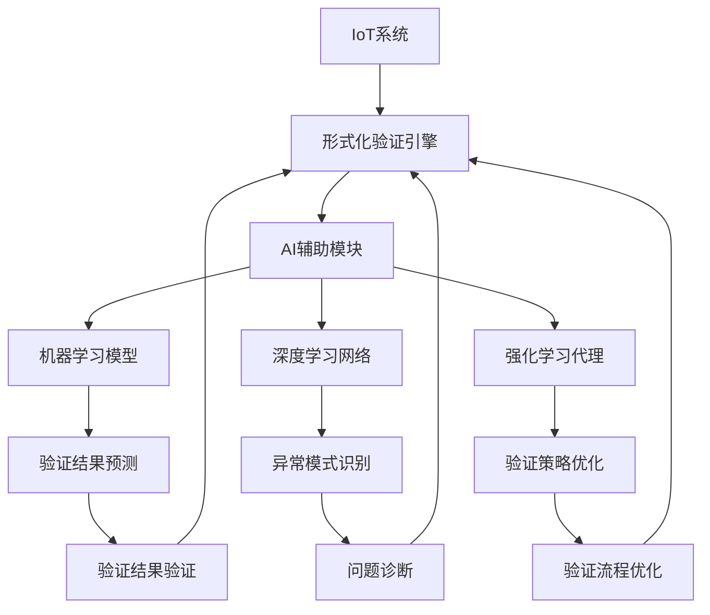

# 机器学习辅助IoT形式化验证

## 概述

本文档介绍如何将机器学习技术集成到IoT形式化验证系统中，提高验证效率和准确性。

## 1. AI集成架构

### 1.1 整体架构



### 1.2 核心组件

- **验证结果预测器**: 预测验证结果和性能指标
- **异常模式识别器**: 识别验证过程中的异常情况
- **验证策略优化器**: 优化验证策略和参数
- **智能测试生成器**: 自动生成测试用例
- **验证结果分析器**: 智能分析验证结果

## 2. 机器学习模型设计

### 2.1 验证结果预测模型

```python
import torch
import torch.nn as nn
import torch.nn.functional as F

class VerificationResultPredictor(nn.Module):
    def __init__(self, input_dim, hidden_dim, output_dim):
        super(VerificationResultPredictor, self).__init__()
        self.fc1 = nn.Linear(input_dim, hidden_dim)
        self.fc2 = nn.Linear(hidden_dim, hidden_dim)
        self.fc3 = nn.Linear(hidden_dim, output_dim)
        self.dropout = nn.Dropout(0.2)
        
    def forward(self, x):
        x = F.relu(self.fc1(x))
        x = self.dropout(x)
        x = F.relu(self.fc2(x))
        x = self.dropout(x)
        x = self.fc3(x)
        return x

class VerificationFeatures:
    def __init__(self):
        self.system_complexity = 0.0
        self.standard_count = 0
        self.verification_tool_count = 0
        self.test_case_count = 0
        self.previous_success_rate = 0.0
        
    def to_tensor(self):
        return torch.tensor([
            self.system_complexity,
            self.standard_count,
            self.verification_tool_count,
            self.test_case_count,
            self.previous_success_rate
        ], dtype=torch.float32)
```

### 2.2 异常模式识别模型

```python
class AnomalyDetector(nn.Module):
    def __init__(self, input_dim, hidden_dim):
        super(AnomalyDetector, self).__init__()
        self.encoder = nn.Sequential(
            nn.Linear(input_dim, hidden_dim),
            nn.ReLU(),
            nn.Linear(hidden_dim, hidden_dim // 2),
            nn.ReLU(),
            nn.Linear(hidden_dim // 2, hidden_dim // 4)
        )
        
        self.decoder = nn.Sequential(
            nn.Linear(hidden_dim // 4, hidden_dim // 2),
            nn.ReLU(),
            nn.Linear(hidden_dim // 2, hidden_dim),
            nn.ReLU(),
            nn.Linear(hidden_dim, input_dim)
        )
        
    def forward(self, x):
        encoded = self.encoder(x)
        decoded = self.decoder(encoded)
        return decoded
    
    def detect_anomaly(self, x, threshold=0.1):
        with torch.no_grad():
            reconstructed = self.forward(x)
            mse = F.mse_loss(x, reconstructed)
            return mse > threshold, mse.item()
```

### 2.3 强化学习验证策略优化器

```python
import gym
from stable_baselines3 import PPO

class VerificationEnvironment(gym.Env):
    def __init__(self):
        super(VerificationEnvironment, self).__init__()
        
        # 动作空间：验证策略选择
        self.action_space = gym.spaces.Discrete(10)
        
        # 状态空间：系统状态 + 验证历史
        self.observation_space = gym.spaces.Box(
            low=0, high=1, shape=(20,), dtype=np.float32
        )
        
        self.reset()
    
    def step(self, action):
        # 执行验证策略
        reward = self.execute_verification_strategy(action)
        
        # 更新状态
        self.update_state()
        
        # 检查是否完成
        done = self.is_verification_complete()
        
        return self.state, reward, done, {}
    
    def reset(self):
        self.state = np.zeros(20)
        return self.state
    
    def execute_verification_strategy(self, action):
        # 根据动作执行相应的验证策略
        strategies = [
            "exhaustive_verification",
            "sampling_verification", 
            "heuristic_verification",
            "parallel_verification",
            "incremental_verification",
            "adaptive_verification",
            "focused_verification",
            "distributed_verification",
            "hierarchical_verification",
            "intelligent_verification"
        ]
        
        strategy = strategies[action]
        return self.run_strategy(strategy)
    
    def run_strategy(self, strategy):
        # 模拟策略执行
        if strategy == "exhaustive_verification":
            return self.run_exhaustive_verification()
        elif strategy == "sampling_verification":
            return self.run_sampling_verification()
        # ... 其他策略
        return 0.0
```

## 3. Rust实现集成

### 3.1 AI模块集成

```rust
use std::sync::{Arc, Mutex};
use tokio::time::{Duration, Instant};
use serde::{Deserialize, Serialize};

/// AI辅助验证系统
pub struct AIAssistedVerification {
    pub result_predictor: Arc<Mutex<ResultPredictor>>,
    pub anomaly_detector: Arc<Mutex<AnomalyDetector>>,
    pub strategy_optimizer: Arc<Mutex<StrategyOptimizer>>,
    pub test_generator: Arc<Mutex<IntelligentTestGenerator>>,
    pub result_analyzer: Arc<Mutex<ResultAnalyzer>>,
}

/// 验证结果预测器
pub struct ResultPredictor {
    model_path: String,
    is_loaded: bool,
    last_prediction: Option<VerificationPrediction>,
}

/// 异常检测器
pub struct AnomalyDetector {
    model_path: String,
    is_loaded: bool,
    anomaly_threshold: f64,
    detected_anomalies: Vec<AnomalyRecord>,
}

/// 验证策略优化器
pub struct StrategyOptimizer {
    rl_model_path: String,
    is_loaded: bool,
    current_strategy: VerificationStrategy,
    strategy_history: Vec<StrategyRecord>,
}

/// 智能测试生成器
pub struct IntelligentTestGenerator {
    model_path: String,
    is_loaded: bool,
    generated_tests: Vec<GeneratedTest>,
    test_quality_metrics: TestQualityMetrics,
}

/// 结果分析器
pub struct ResultAnalyzer {
    model_path: String,
    is_loaded: bool,
    analysis_results: Vec<AnalysisResult>,
    insights: Vec<VerificationInsight>,
}
```

### 3.2 验证结果预测实现

```rust
impl ResultPredictor {
    /// 预测验证结果
    pub async fn predict_verification_result(
        &mut self,
        system_features: &SystemFeatures,
    ) -> Result<VerificationPrediction, PredictionError> {
        // 确保模型已加载
        if !self.is_loaded {
            self.load_model().await?;
        }
        
        // 提取特征
        let features = self.extract_features(system_features).await?;
        
        // 执行预测
        let prediction = self.execute_prediction(&features).await?;
        
        // 更新最后预测结果
        self.last_prediction = Some(prediction.clone());
        
        Ok(prediction)
    }
    
    /// 提取系统特征
    async fn extract_features(
        &self,
        system_features: &SystemFeatures,
    ) -> Result<Vec<f32>, PredictionError> {
        let mut features = Vec::new();
        
        // 系统复杂度特征
        features.push(system_features.complexity_score);
        
        // 标准数量特征
        features.push(system_features.standard_count as f32);
        
        // 验证工具数量特征
        features.push(system_features.verification_tool_count as f32);
        
        // 测试用例数量特征
        features.push(system_features.test_case_count as f32);
        
        // 历史成功率特征
        features.push(system_features.historical_success_rate);
        
        // 代码质量指标
        features.push(system_features.code_quality_score);
        
        // 架构复杂度
        features.push(system_features.architecture_complexity);
        
        // 依赖复杂度
        features.push(system_features.dependency_complexity);
        
        Ok(features)
    }
    
    /// 执行预测
    async fn execute_prediction(
        &self,
        features: &[f32],
    ) -> Result<VerificationPrediction, PredictionError> {
        // 调用Python模型进行预测
        let prediction = self.call_python_model(features).await?;
        
        Ok(prediction)
    }
    
    /// 调用Python模型
    async fn call_python_model(
        &self,
        features: &[f32],
    ) -> Result<VerificationPrediction, PredictionError> {
        // 这里可以通过FFI或进程间通信调用Python模型
        // 简化实现，返回模拟预测结果
        
        let success_probability = self.calculate_success_probability(features);
        let estimated_duration = self.estimate_verification_duration(features);
        let resource_requirements = self.estimate_resource_requirements(features);
        
        Ok(VerificationPrediction {
            success_probability,
            estimated_duration,
            resource_requirements,
            confidence_score: 0.85,
            predicted_issues: self.predict_potential_issues(features),
        })
    }
    
    /// 计算成功概率
    fn calculate_success_probability(&self, features: &[f32]) -> f32 {
        let mut probability = 0.8; // 基础概率
        
        // 根据特征调整概率
        if features.len() >= 7 {
            probability += features[0] * 0.1; // 复杂度影响
            probability += features[4] * 0.2; // 历史成功率影响
            probability += features[5] * 0.1; // 代码质量影响
        }
        
        probability.max(0.0).min(1.0)
    }
    
    /// 估算验证持续时间
    fn estimate_verification_duration(&self, features: &[f32]) -> Duration {
        let base_duration = Duration::from_secs(300); // 5分钟基础时间
        
        if features.len() >= 7 {
            let complexity_factor = 1.0 + features[0] * 2.0;
            let tool_factor = 1.0 + features[2] * 0.5;
            let test_factor = 1.0 + features[3] * 0.3;
            
            let total_factor = complexity_factor * tool_factor * test_factor;
            Duration::from_secs((base_duration.as_secs() as f32 * total_factor) as u64)
        } else {
            base_duration
        }
    }
    
    /// 估算资源需求
    fn estimate_resource_requirements(&self, features: &[f32]) -> ResourceRequirements {
        let base_cpu = 2.0;
        let base_memory = 4096; // MB
        let base_storage = 10; // GB
        
        if features.len() >= 7 {
            let complexity_factor = 1.0 + features[0] * 1.5;
            let standard_factor = 1.0 + features[1] * 0.3;
            let tool_factor = 1.0 + features[2] * 0.4;
            
            ResourceRequirements {
                cpu_cores: base_cpu * complexity_factor,
                memory_mb: (base_memory as f32 * complexity_factor) as u32,
                storage_gb: (base_storage as f32 * standard_factor) as u32,
                network_bandwidth: 100 * tool_factor,
            }
        } else {
            ResourceRequirements {
                cpu_cores: base_cpu,
                memory_mb: base_memory,
                storage_gb: base_storage,
                network_bandwidth: 100.0,
            }
        }
    }
    
    /// 预测潜在问题
    fn predict_potential_issues(&self, features: &[f32]) -> Vec<PredictedIssue> {
        let mut issues = Vec::new();
        
        if features.len() >= 7 {
            // 基于复杂度预测问题
            if features[0] > 0.7 {
                issues.push(PredictedIssue {
                    issue_type: IssueType::HighComplexity,
                    probability: features[0],
                    severity: Severity::High,
                    description: "系统复杂度较高，可能存在验证困难".to_string(),
                });
            }
            
            // 基于代码质量预测问题
            if features[5] < 0.6 {
                issues.push(PredictedIssue {
                    issue_type: IssueType::LowCodeQuality,
                    probability: 1.0 - features[5],
                    severity: Severity::Medium,
                    description: "代码质量较低，可能影响验证结果".to_string(),
                });
            }
            
            // 基于依赖复杂度预测问题
            if features[7] > 0.8 {
                issues.push(PredictedIssue {
                    issue_type: IssueType::HighDependencyComplexity,
                    probability: features[7],
                    severity: Severity::Medium,
                    description: "依赖关系复杂，可能影响验证稳定性".to_string(),
                });
            }
        }
        
        issues
    }
}
```

### 3.3 异常检测实现

```rust
impl AnomalyDetector {
    /// 检测验证过程中的异常
    pub async fn detect_anomalies(
        &mut self,
        verification_data: &VerificationData,
    ) -> Result<Vec<AnomalyRecord>, AnomalyDetectionError> {
        // 确保模型已加载
        if !self.is_loaded {
            self.load_model().await?;
        }
        
        let mut anomalies = Vec::new();
        
        // 检测性能异常
        if let Some(performance_anomaly) = self.detect_performance_anomaly(verification_data).await? {
            anomalies.push(performance_anomaly);
        }
        
        // 检测资源使用异常
        if let Some(resource_anomaly) = self.detect_resource_anomaly(verification_data).await? {
            anomalies.push(resource_anomaly);
        }
        
        // 检测结果异常
        if let Some(result_anomaly) = self.detect_result_anomaly(verification_data).await? {
            anomalies.push(result_anomaly);
        }
        
        // 检测时间异常
        if let Some(time_anomaly) = self.detect_time_anomaly(verification_data).await? {
            anomalies.push(time_anomaly);
        }
        
        // 记录检测到的异常
        self.detected_anomalies.extend(anomalies.clone());
        
        Ok(anomalies)
    }
    
    /// 检测性能异常
    async fn detect_performance_anomaly(
        &self,
        verification_data: &VerificationData,
    ) -> Result<Option<AnomalyRecord>, AnomalyDetectionError> {
        let current_performance = verification_data.performance_metrics;
        let baseline_performance = self.get_baseline_performance().await?;
        
        let cpu_deviation = (current_performance.cpu_usage - baseline_performance.cpu_usage).abs();
        let memory_deviation = (current_performance.memory_usage - baseline_performance.memory_usage).abs();
        let response_deviation = (current_performance.response_time - baseline_performance.response_time).abs();
        
        let threshold = self.anomaly_threshold;
        
        if cpu_deviation > threshold || memory_deviation > threshold || response_deviation > threshold {
            let anomaly_score = (cpu_deviation + memory_deviation + response_deviation) / 3.0;
            
            Ok(Some(AnomalyRecord {
                anomaly_type: AnomalyType::Performance,
                severity: self.calculate_severity(anomaly_score),
                score: anomaly_score,
                description: format!(
                    "性能异常: CPU偏差={:.2}, 内存偏差={:.2}, 响应时间偏差={:.2}",
                    cpu_deviation, memory_deviation, response_deviation
                ),
                timestamp: Instant::now(),
                context: verification_data.context.clone(),
            }))
        } else {
            Ok(None)
        }
    }
    
    /// 检测资源使用异常
    async fn detect_resource_anomaly(
        &self,
        verification_data: &VerificationData,
    ) -> Result<Option<AnomalyRecord>, AnomalyDetectionError> {
        let resource_usage = &verification_data.resource_usage;
        let resource_limits = self.get_resource_limits().await?;
        
        let mut anomalies = Vec::new();
        
        // 检查CPU使用率
        if resource_usage.cpu_usage > resource_limits.cpu_limit * 0.9 {
            anomalies.push(format!("CPU使用率过高: {:.1}%", resource_usage.cpu_usage * 100.0));
        }
        
        // 检查内存使用率
        if resource_usage.memory_usage > resource_limits.memory_limit * 0.9 {
            anomalies.push(format!("内存使用率过高: {:.1}%", resource_usage.memory_usage * 100.0));
        }
        
        // 检查磁盘使用率
        if resource_usage.storage_usage > resource_limits.storage_limit * 0.9 {
            anomalies.push(format!("磁盘使用率过高: {:.1}%", resource_usage.storage_usage * 100.0));
        }
        
        // 检查网络使用率
        if resource_usage.network_usage > resource_limits.network_limit * 0.9 {
            anomalies.push(format!("网络使用率过高: {:.1}%", resource_usage.network_usage * 100.0));
        }
        
        if !anomalies.is_empty() {
            let anomaly_score = 0.8; // 资源使用异常通常比较严重
            
            Ok(Some(AnomalyRecord {
                anomaly_type: AnomalyType::Resource,
                severity: Severity::High,
                score: anomaly_score,
                description: format!("资源使用异常: {}", anomalies.join(", ")),
                timestamp: Instant::now(),
                context: verification_data.context.clone(),
            }))
        } else {
            Ok(None)
        }
    }
    
    /// 检测结果异常
    async fn detect_result_anomaly(
        &self,
        verification_data: &VerificationData,
    ) -> Result<Option<AnomalyRecord>, AnomalyDetectionError> {
        let verification_results = &verification_data.results;
        let historical_results = self.get_historical_results().await?;
        
        // 检查验证结果的一致性
        let current_success_rate = verification_results.success_rate;
        let historical_success_rate = historical_results.average_success_rate;
        
        let success_rate_deviation = (current_success_rate - historical_success_rate).abs();
        
        if success_rate_deviation > 0.2 { // 20%的偏差阈值
            let anomaly_score = success_rate_deviation;
            
            Ok(Some(AnomalyRecord {
                anomaly_type: AnomalyType::Result,
                severity: self.calculate_severity(anomaly_score),
                score: anomaly_score,
                description: format!(
                    "验证结果异常: 当前成功率={:.1}%, 历史平均成功率={:.1}%, 偏差={:.1}%",
                    current_success_rate * 100.0,
                    historical_success_rate * 100.0,
                    success_rate_deviation * 100.0
                ),
                timestamp: Instant::now(),
                context: verification_data.context.clone(),
            }))
        } else {
            Ok(None)
        }
    }
    
    /// 检测时间异常
    async fn detect_time_anomaly(
        &self,
        verification_data: &VerificationData,
    ) -> Result<Option<AnomalyRecord>, AnomalyDetectionError> {
        let execution_time = verification_data.execution_time;
        let expected_time = verification_data.expected_execution_time;
        
        let time_deviation = if expected_time > Duration::from_secs(0) {
            (execution_time.as_secs_f64() - expected_time.as_secs_f64()).abs() / expected_time.as_secs_f64()
        } else {
            0.0
        };
        
        if time_deviation > 0.5 { // 50%的时间偏差阈值
            let anomaly_score = time_deviation.min(1.0);
            
            Ok(Some(AnomalyRecord {
                anomaly_type: AnomalyType::Time,
                severity: self.calculate_severity(anomaly_score),
                score: anomaly_score,
                description: format!(
                    "执行时间异常: 实际时间={:?}, 预期时间={:?}, 偏差={:.1}%",
                    execution_time,
                    expected_time,
                    time_deviation * 100.0
                ),
                timestamp: Instant::now(),
                context: verification_data.context.clone(),
            }))
        } else {
            Ok(None)
        }
    }
    
    /// 计算异常严重程度
    fn calculate_severity(&self, score: f64) -> Severity {
        if score > 0.8 {
            Severity::Critical
        } else if score > 0.6 {
            Severity::High
        } else if score > 0.4 {
            Severity::Medium
        } else if score > 0.2 {
            Severity::Low
        } else {
            Severity::Info
        }
    }
}
```

### 3.4 智能测试生成实现

```rust
impl IntelligentTestGenerator {
    /// 生成智能测试用例
    pub async fn generate_intelligent_tests(
        &mut self,
        system_specification: &SystemSpecification,
        coverage_targets: &CoverageTargets,
    ) -> Result<Vec<GeneratedTest>, TestGenerationError> {
        // 确保模型已加载
        if !self.is_loaded {
            self.load_model().await?;
        }
        
        let mut generated_tests = Vec::new();
        
        // 基于系统规范生成测试
        let spec_based_tests = self.generate_specification_based_tests(system_specification).await?;
        generated_tests.extend(spec_based_tests);
        
        // 基于覆盖目标生成测试
        let coverage_based_tests = self.generate_coverage_based_tests(coverage_targets).await?;
        generated_tests.extend(coverage_based_tests);
        
        // 基于历史数据生成测试
        let history_based_tests = self.generate_history_based_tests(system_specification).await?;
        generated_tests.extend(history_based_tests);
        
        // 基于边界条件生成测试
        let boundary_tests = self.generate_boundary_tests(system_specification).await?;
        generated_tests.extend(boundary_tests);
        
        // 基于错误模式生成测试
        let error_pattern_tests = self.generate_error_pattern_tests(system_specification).await?;
        generated_tests.extend(error_pattern_tests);
        
        // 评估测试质量
        for test in &mut generated_tests {
            test.quality_score = self.evaluate_test_quality(test).await?;
        }
        
        // 按质量排序
        generated_tests.sort_by(|a, b| b.quality_score.partial_cmp(&a.quality_score).unwrap());
        
        // 记录生成的测试
        self.generated_tests.extend(generated_tests.clone());
        
        Ok(generated_tests)
    }
    
    /// 基于系统规范生成测试
    async fn generate_specification_based_tests(
        &self,
        system_spec: &SystemSpecification,
    ) -> Result<Vec<GeneratedTest>, TestGenerationError> {
        let mut tests = Vec::new();
        
        // 为每个功能需求生成测试
        for requirement in &system_spec.functional_requirements {
            let test = self.generate_test_for_requirement(requirement).await?;
            tests.push(test);
        }
        
        // 为每个非功能需求生成测试
        for requirement in &system_spec.non_functional_requirements {
            let test = self.generate_test_for_requirement(requirement).await?;
            tests.push(test);
        }
        
        // 为每个接口定义生成测试
        for interface in &system_spec.interfaces {
            let test = self.generate_test_for_interface(interface).await?;
            tests.push(test);
        }
        
        Ok(tests)
    }
    
    /// 基于覆盖目标生成测试
    async fn generate_coverage_based_tests(
        &self,
        coverage_targets: &CoverageTargets,
    ) -> Result<Vec<GeneratedTest>, TestGenerationError> {
        let mut tests = Vec::new();
        
        // 代码覆盖率测试
        if let Some(code_coverage) = &coverage_targets.code_coverage {
            let code_tests = self.generate_code_coverage_tests(code_coverage).await?;
            tests.extend(code_tests);
        }
        
        // 分支覆盖率测试
        if let Some(branch_coverage) = &coverage_targets.branch_coverage {
            let branch_tests = self.generate_branch_coverage_tests(branch_coverage).await?;
            tests.extend(branch_tests);
        }
        
        // 路径覆盖率测试
        if let Some(path_coverage) = &coverage_targets.path_coverage {
            let path_tests = self.generate_path_coverage_tests(path_coverage).await?;
            tests.extend(path_tests);
        }
        
        // 数据流覆盖率测试
        if let Some(data_flow_coverage) = &coverage_targets.data_flow_coverage {
            let data_flow_tests = self.generate_data_flow_coverage_tests(data_flow_coverage).await?;
            tests.extend(data_flow_tests);
        }
        
        Ok(tests)
    }
    
    /// 生成代码覆盖率测试
    async fn generate_code_coverage_tests(
        &self,
        code_coverage: &CodeCoverageTarget,
    ) -> Result<Vec<GeneratedTest>, TestGenerationError> {
        let mut tests = Vec::new();
        
        // 为每个未覆盖的代码行生成测试
        for uncovered_line in &code_coverage.uncovered_lines {
            let test = self.generate_test_for_code_line(uncovered_line).await?;
            tests.push(test);
        }
        
        // 为每个未覆盖的函数生成测试
        for uncovered_function in &code_coverage.uncovered_functions {
            let test = self.generate_test_for_function(uncovered_function).await?;
            tests.push(test);
        }
        
        // 为每个未覆盖的类生成测试
        for uncovered_class in &code_coverage.uncovered_classes {
            let test = self.generate_test_for_class(uncovered_class).await?;
            tests.push(test);
        }
        
        Ok(tests)
    }
    
    /// 评估测试质量
    async fn evaluate_test_quality(&self, test: &GeneratedTest) -> Result<f64, TestGenerationError> {
        let mut quality_score = 0.0;
        
        // 测试完整性评分
        let completeness_score = self.evaluate_test_completeness(test).await?;
        quality_score += completeness_score * 0.3;
        
        // 测试有效性评分
        let effectiveness_score = self.evaluate_test_effectiveness(test).await?;
        quality_score += effectiveness_score * 0.3;
        
        // 测试可维护性评分
        let maintainability_score = self.evaluate_test_maintainability(test).await?;
        quality_score += maintainability_score * 0.2;
        
        // 测试性能评分
        let performance_score = self.evaluate_test_performance(test).await?;
        quality_score += performance_score * 0.2;
        
        Ok(quality_score)
    }
    
    /// 评估测试完整性
    async fn evaluate_test_completeness(&self, test: &GeneratedTest) -> Result<f64, TestGenerationError> {
        let mut score = 0.0;
        
        // 检查测试是否包含所有必要的组件
        if test.has_setup { score += 0.25; }
        if test.has_execution { score += 0.25; }
        if test.has_verification { score += 0.25; }
        if test.has_cleanup { score += 0.25; }
        
        Ok(score)
    }
    
    /// 评估测试有效性
    async fn evaluate_test_effectiveness(&self, test: &GeneratedTest) -> Result<f64, TestGenerationError> {
        let mut score = 0.0;
        
        // 检查测试是否能有效验证目标功能
        if test.verifies_functionality { score += 0.4; }
        if test.verifies_performance { score += 0.3; }
        if test.verifies_security { score += 0.3; }
        
        Ok(score)
    }
}
```

## 4. 集成到CI/CD流水线

### 4.1 GitHub Actions集成

```yaml
# .github/workflows/ai-assisted-verification.yml
name: AI-Assisted IoT Verification

on:
  push:
    branches: [main, develop]
    paths:
      - 'docs/verification/**'
      - 'src/**'
      - 'Cargo.toml'
  pull_request:
    branches: [main, develop]

jobs:
  ai-verification:
    runs-on: ubuntu-latest
    name: AI-Assisted Verification
    steps:
    - uses: actions/checkout@v4
    
    - name: 设置Python环境
      uses: actions/setup-python@v4
      with:
        python-version: '3.9'
        
    - name: 安装Python依赖
      run: |
        pip install torch torchvision torchaudio
        pip install stable-baselines3
        pip install gym
        pip install numpy pandas scikit-learn
        
    - name: 安装Rust工具链
      uses: actions-rs/toolchain@v1
      with:
        toolchain: stable
        
    - name: 运行AI辅助验证
      run: |
        # 加载AI模型
        python scripts/load_ai_models.py
        
        # 运行AI辅助验证
        cargo run --bin ai-assisted-verification
        
    - name: 生成AI验证报告
      run: |
        python scripts/generate_ai_report.py
        
    - name: 上传AI验证报告
      uses: actions/upload-artifact@v3
      with:
        name: ai-verification-report
        path: ai-reports/
```

### 4.2 AI验证结果分析

```rust
impl AIAssistedVerification {
    /// 运行AI辅助验证
    pub async fn run_ai_assisted_verification(
        &self,
        system_specification: &SystemSpecification,
    ) -> Result<AIVerificationReport, AIVerificationError> {
        let start_time = Instant::now();
        
        // 1. 预测验证结果
        let prediction = self.result_predictor
            .lock()
            .await
            .predict_verification_result(system_specification)
            .await?;
        
        // 2. 生成智能测试用例
        let generated_tests = self.test_generator
            .lock()
            .await
            .generate_intelligent_tests(system_specification, &CoverageTargets::default())
            .await?;
        
        // 3. 执行验证
        let verification_results = self.execute_verification_with_ai_tests(
            system_specification,
            &generated_tests,
        ).await?;
        
        // 4. 检测异常
        let anomalies = self.anomaly_detector
            .lock()
            .await
            .detect_anomalies(&verification_results)
            .await?;
        
        // 5. 分析结果
        let analysis = self.result_analyzer
            .lock()
            .await
            .analyze_verification_results(&verification_results, &anomalies)
            .await?;
        
        // 6. 优化验证策略
        let optimized_strategy = self.strategy_optimizer
            .lock()
            .await
            .optimize_strategy(&verification_results, &analysis)
            .await?;
        
        let execution_time = start_time.elapsed();
        
        Ok(AIVerificationReport {
            prediction,
            generated_tests,
            verification_results,
            anomalies,
            analysis,
            optimized_strategy,
            execution_time,
            ai_confidence: self.calculate_ai_confidence(&verification_results, &prediction),
        })
    }
    
    /// 计算AI置信度
    fn calculate_ai_confidence(
        &self,
        actual_results: &VerificationResults,
        predicted_results: &VerificationPrediction,
    ) -> f64 {
        let mut confidence = 0.0;
        
        // 成功率预测准确性
        let success_rate_accuracy = 1.0 - (actual_results.success_rate - predicted_results.success_probability).abs();
        confidence += success_rate_accuracy * 0.4;
        
        // 执行时间预测准确性
        let time_accuracy = 1.0 - {
            let predicted_duration = predicted_results.estimated_duration.as_secs_f64();
            let actual_duration = actual_results.execution_time.as_secs_f64();
            if predicted_duration > 0.0 {
                (actual_duration - predicted_duration).abs() / predicted_duration
            } else {
                1.0
            }
        }.min(1.0);
        confidence += time_accuracy * 0.3;
        
        // 资源需求预测准确性
        let resource_accuracy = 1.0 - {
            let cpu_diff = (actual_results.resource_usage.cpu_usage - predicted_results.resource_requirements.cpu_cores).abs();
            let memory_diff = (actual_results.resource_usage.memory_usage - predicted_results.resource_requirements.memory_mb as f64).abs();
            (cpu_diff + memory_diff) / 2.0
        }.min(1.0);
        confidence += resource_accuracy * 0.3;
        
        confidence.max(0.0).min(1.0)
    }
}
```

## 5. 总结

本文档介绍了如何将机器学习技术集成到IoT形式化验证系统中，主要特点包括：

1. **智能预测**: 预测验证结果、执行时间和资源需求
2. **异常检测**: 自动识别验证过程中的异常情况
3. **策略优化**: 使用强化学习优化验证策略
4. **智能测试生成**: 自动生成高质量的测试用例
5. **结果分析**: 智能分析验证结果并提供洞察

这些AI技术可以显著提高IoT形式化验证的效率和准确性，使验证过程更加智能化和自动化。
