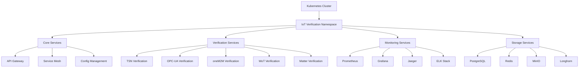

# Kubernetes云原生IoT形式化验证架构

## 概述

本文档介绍如何将IoT形式化验证系统部署到Kubernetes集群，实现云原生架构。

## 1. 云原生架构设计

### 1.1 整体架构



### 1.2 服务架构

- **微服务架构**: 每个验证标准独立部署
- **服务网格**: 使用Istio进行服务间通信管理
- **配置管理**: 使用ConfigMap和Secret管理配置
- **存储管理**: 使用持久化卷和存储类
- **网络策略**: 细粒度的网络访问控制

## 2. Kubernetes部署配置

### 2.1 命名空间配置

```yaml
# k8s/namespace.yaml
apiVersion: v1
kind: Namespace
metadata:
  name: iot-verification
  labels:
    name: iot-verification
    environment: production
    team: iot-verification
```

### 2.2 配置管理

```yaml
# k8s/configmap.yaml
apiVersion: v1
kind: ConfigMap
metadata:
  name: iot-verification-config
  namespace: iot-verification
data:
  # 数据库配置
  DATABASE_HOST: "postgresql-service"
  DATABASE_PORT: "5432"
  DATABASE_NAME: "iot_verification"
  
  # Redis配置
  REDIS_HOST: "redis-service"
  REDIS_PORT: "6379"
  
  # 验证工具配置
  COQ_VERSION: "8.16.0"
  TLA_VERSION: "1.8.0"
  RUST_VERSION: "1.70.0"
  
  # 监控配置
  PROMETHEUS_ENDPOINT: "http://prometheus-service:9090"
  GRAFANA_ENDPOINT: "http://grafana-service:3000"
  
  # 日志配置
  LOG_LEVEL: "info"
  LOG_FORMAT: "json"
  
  # 性能配置
  MAX_CONCURRENT_VERIFICATIONS: "10"
  VERIFICATION_TIMEOUT: "300"
  RESOURCE_LIMITS_CPU: "2"
  RESOURCE_LIMITS_MEMORY: "4Gi"
```

### 2.3 密钥管理

```yaml
# k8s/secret.yaml
apiVersion: v1
kind: Secret
metadata:
  name: iot-verification-secrets
  namespace: iot-verification
type: Opaque
data:
  # 数据库凭据
  DATABASE_USER: aW90X3VzZXI=  # iot_user
  DATABASE_PASSWORD: aW90X3Bhc3N3b3Jk  # iot_password
  
  # JWT密钥
  JWT_SECRET: aW90LWp3dC1zZWNyZXQta2V5  # iot-jwt-secret-key
  
  # API密钥
  API_KEY: aW90LWFwaS1rZXk=  # iot-api-key
  
  # 外部服务凭据
  PROMETHEUS_TOKEN: cHJvbWV0aGV1cy10b2tlbg==  # prometheus-token
  GRAFANA_TOKEN: Z3JhZmFuYS10b2tlbg==  # grafana-token
```

## 3. 核心服务部署

### 3.1 API网关部署

```yaml
# k8s/api-gateway.yaml
apiVersion: apps/v1
kind: Deployment
metadata:
  name: api-gateway
  namespace: iot-verification
spec:
  replicas: 3
  selector:
    matchLabels:
      app: api-gateway
  template:
    metadata:
      labels:
        app: api-gateway
    spec:
      containers:
      - name: api-gateway
        image: iot-verification/api-gateway:latest
        ports:
        - containerPort: 8080
        env:
        - name: DATABASE_HOST
          valueFrom:
            configMapKeyRef:
              name: iot-verification-config
              key: DATABASE_HOST
        - name: DATABASE_PASSWORD
          valueFrom:
            secretKeyRef:
              name: iot-verification-secrets
              key: DATABASE_PASSWORD
        resources:
          requests:
            memory: "256Mi"
            cpu: "250m"
          limits:
            memory: "512Mi"
            cpu: "500m"
        livenessProbe:
          httpGet:
            path: /health
            port: 8080
          initialDelaySeconds: 30
          periodSeconds: 10
        readinessProbe:
          httpGet:
            path: /ready
            port: 8080
          initialDelaySeconds: 5
          periodSeconds: 5
---
apiVersion: v1
kind: Service
metadata:
  name: api-gateway-service
  namespace: iot-verification
spec:
  selector:
    app: api-gateway
  ports:
  - protocol: TCP
    port: 80
    targetPort: 8080
  type: ClusterIP
---
apiVersion: networking.k8s.io/v1
kind: Ingress
metadata:
  name: api-gateway-ingress
  namespace: iot-verification
  annotations:
    nginx.ingress.kubernetes.io/rewrite-target: /
    cert-manager.io/cluster-issuer: "letsencrypt-prod"
spec:
  tls:
  - hosts:
    - api.iot-verification.com
    secretName: iot-verification-tls
  rules:
  - host: api.iot-verification.com
    http:
      paths:
      - path: /
        pathType: Prefix
        backend:
          service:
            name: api-gateway-service
            port:
              number: 80
```

### 3.2 验证服务部署

```yaml
# k8s/verification-services.yaml
apiVersion: apps/v1
kind: Deployment
metadata:
  name: tsn-verification
  namespace: iot-verification
spec:
  replicas: 2
  selector:
    matchLabels:
      app: tsn-verification
  template:
    metadata:
      labels:
        app: tsn-verification
    spec:
      containers:
      - name: tsn-verification
        image: iot-verification/tsn-verification:latest
        ports:
        - containerPort: 8080
        env:
        - name: SERVICE_NAME
          value: "tsn-verification"
        - name: LOG_LEVEL
          valueFrom:
            configMapKeyRef:
              name: iot-verification-config
              key: LOG_LEVEL
        resources:
          requests:
            memory: "512Mi"
            cpu: "500m"
          limits:
            memory: "1Gi"
            cpu: "1000m"
        volumeMounts:
        - name: verification-data
          mountPath: /app/data
        - name: verification-logs
          mountPath: /app/logs
      volumes:
      - name: verification-data
        persistentVolumeClaim:
          claimName: tsn-verification-pvc
      - name: verification-logs
        persistentVolumeClaim:
          claimName: tsn-verification-logs-pvc
---
apiVersion: v1
kind: Service
metadata:
  name: tsn-verification-service
  namespace: iot-verification
spec:
  selector:
    app: tsn-verification
  ports:
  - protocol: TCP
    port: 8080
    targetPort: 8080
  type: ClusterIP
---
apiVersion: v1
kind: PersistentVolumeClaim
metadata:
  name: tsn-verification-pvc
  namespace: iot-verification
spec:
  accessModes:
    - ReadWriteOnce
  resources:
    requests:
      storage: 10Gi
  storageClassName: longhorn
---
apiVersion: v1
kind: PersistentVolumeClaim
metadata:
  name: tsn-verification-logs-pvc
  namespace: iot-verification
spec:
  accessModes:
    - ReadWriteOnce
  resources:
    requests:
      storage: 5Gi
  storageClassName: longhorn
```

### 3.3 数据库部署

```yaml
# k8s/postgresql.yaml
apiVersion: apps/v1
kind: StatefulSet
metadata:
  name: postgresql
  namespace: iot-verification
spec:
  serviceName: postgresql-service
  replicas: 1
  selector:
    matchLabels:
      app: postgresql
  template:
    metadata:
      labels:
        app: postgresql
    spec:
      containers:
      - name: postgresql
        image: postgres:14-alpine
        ports:
        - containerPort: 5432
        env:
        - name: POSTGRES_DB
          valueFrom:
            configMapKeyRef:
              name: iot-verification-config
              key: DATABASE_NAME
        - name: POSTGRES_USER
          valueFrom:
            secretKeyRef:
              name: iot-verification-secrets
              key: DATABASE_USER
        - name: POSTGRES_PASSWORD
          valueFrom:
            secretKeyRef:
              name: iot-verification-secrets
              key: DATABASE_PASSWORD
        resources:
          requests:
            memory: "1Gi"
            cpu: "500m"
          limits:
            memory: "2Gi"
            cpu: "1000m"
        volumeMounts:
        - name: postgresql-data
          mountPath: /var/lib/postgresql/data
        - name: postgresql-config
          mountPath: /etc/postgresql/postgresql.conf
          subPath: postgresql.conf
        livenessProbe:
          exec:
            command:
            - pg_isready
            - -U
            - iot_user
            - -d
            - iot_verification
          initialDelaySeconds: 30
          periodSeconds: 10
        readinessProbe:
          exec:
            command:
            - pg_isready
            - -U
            - iot_user
            - -d
            - iot_verification
          initialDelaySeconds: 5
          periodSeconds: 5
      volumes:
      - name: postgresql-config
        configMap:
          name: postgresql-config
  volumeClaimTemplates:
  - metadata:
      name: postgresql-data
    spec:
      accessModes: [ "ReadWriteOnce" ]
      storageClassName: longhorn
      resources:
        requests:
          storage: 20Gi
---
apiVersion: v1
kind: Service
metadata:
  name: postgresql-service
  namespace: iot-verification
spec:
  selector:
    app: postgresql
  ports:
  - protocol: TCP
    port: 5432
    targetPort: 5432
  type: ClusterIP
---
apiVersion: v1
kind: ConfigMap
metadata:
  name: postgresql-config
  namespace: iot-verification
data:
  postgresql.conf: |
    # 数据库配置
    max_connections = 200
    shared_buffers = 256MB
    effective_cache_size = 1GB
    maintenance_work_mem = 64MB
    checkpoint_completion_target = 0.9
    wal_buffers = 16MB
    default_statistics_target = 100
    random_page_cost = 1.1
    effective_io_concurrency = 200
    work_mem = 4MB
    min_wal_size = 1GB
    max_wal_size = 4GB
```

### 3.4 Redis缓存部署

```yaml
# k8s/redis.yaml
apiVersion: apps/v1
kind: StatefulSet
metadata:
  name: redis
  namespace: iot-verification
spec:
  serviceName: redis-service
  replicas: 3
  selector:
    matchLabels:
      app: redis
  template:
    metadata:
      labels:
        app: redis
    spec:
      containers:
      - name: redis
        image: redis:6-alpine
        ports:
        - containerPort: 6379
        command:
        - redis-server
        - /etc/redis/redis.conf
        volumeMounts:
        - name: redis-data
          mountPath: /data
        - name: redis-config
          mountPath: /etc/redis/redis.conf
          subPath: redis.conf
        resources:
          requests:
            memory: "256Mi"
            cpu: "250m"
          limits:
            memory: "512Mi"
            cpu: "500m"
        livenessProbe:
          exec:
            command:
            - redis-cli
            - ping
          initialDelaySeconds: 30
          periodSeconds: 10
        readinessProbe:
          exec:
            command:
            - redis-cli
            - ping
          initialDelaySeconds: 5
          periodSeconds: 5
      volumes:
      - name: redis-config
        configMap:
          name: redis-config
  volumeClaimTemplates:
  - metadata:
      name: redis-data
    spec:
      accessModes: [ "ReadWriteOnce" ]
      storageClassName: longhorn
      resources:
        requests:
          storage: 5Gi
---
apiVersion: v1
kind: Service
metadata:
  name: redis-service
  namespace: iot-verification
spec:
  selector:
    app: redis
  ports:
  - protocol: TCP
    port: 6379
    targetPort: 6379
  type: ClusterIP
---
apiVersion: v1
kind: ConfigMap
metadata:
  name: redis-config
  namespace: iot-verification
data:
  redis.conf: |
    # Redis配置
    bind 0.0.0.0
    port 6379
    timeout 0
    tcp-keepalive 300
    daemonize no
    supervised no
    pidfile /var/run/redis_6379.pid
    loglevel notice
    logfile ""
    databases 16
    save 900 1
    save 300 10
    save 60 10000
    stop-writes-on-bgsave-error yes
    rdbcompression yes
    rdbchecksum yes
    dbfilename dump.rdb
    dir /data
    maxmemory 256mb
    maxmemory-policy allkeys-lru
    appendonly yes
    appendfilename "appendonly.aof"
    appendfsync everysec
    no-appendfsync-on-rewrite no
    auto-aof-rewrite-percentage 100
    auto-aof-rewrite-min-size 64mb
    aof-load-truncated yes
    aof-use-rdb-preamble yes
```

## 4. 监控和日志

### 4.1 Prometheus监控部署

```yaml
# k8s/prometheus.yaml
apiVersion: apps/v1
kind: Deployment
metadata:
  name: prometheus
  namespace: iot-verification
spec:
  replicas: 1
  selector:
    matchLabels:
      app: prometheus
  template:
    metadata:
      labels:
        app: prometheus
    spec:
      containers:
      - name: prometheus
        image: prom/prometheus:latest
        ports:
        - containerPort: 9090
        command:
        - prometheus
        - --config.file=/etc/prometheus/prometheus.yml
        - --storage.tsdb.path=/prometheus
        - --web.console.libraries=/etc/prometheus/console_libraries
        - --web.console.templates=/etc/prometheus/consoles
        - --storage.tsdb.retention.time=200h
        - --web.enable-lifecycle
        volumeMounts:
        - name: prometheus-config
          mountPath: /etc/prometheus
        - name: prometheus-data
          mountPath: /prometheus
        resources:
          requests:
            memory: "512Mi"
            cpu: "250m"
          limits:
            memory: "1Gi"
            cpu: "500m"
      volumes:
      - name: prometheus-config
        configMap:
          name: prometheus-config
      - name: prometheus-data
        persistentVolumeClaim:
          claimName: prometheus-pvc
---
apiVersion: v1
kind: Service
metadata:
  name: prometheus-service
  namespace: iot-verification
spec:
  selector:
    app: prometheus
  ports:
  - protocol: TCP
    port: 9090
    targetPort: 9090
  type: ClusterIP
---
apiVersion: v1
kind: ConfigMap
metadata:
  name: prometheus-config
  namespace: iot-verification
data:
  prometheus.yml: |
    global:
      scrape_interval: 15s
      evaluation_interval: 15s
    
    rule_files:
      - "rules/*.yml"
    
    scrape_configs:
      - job_name: 'kubernetes-pods'
        kubernetes_sd_configs:
          - role: pod
        relabel_configs:
          - source_labels: [__meta_kubernetes_pod_annotation_prometheus_io_scrape]
            action: keep
            regex: true
          - source_labels: [__meta_kubernetes_pod_annotation_prometheus_io_path]
            action: replace
            target_label: __metrics_path__
            regex: (.+)
          - source_labels: [__address__, __meta_kubernetes_pod_annotation_prometheus_io_port]
            action: replace
            regex: ([^:]+)(?::\d+)?;(\d+)
            replacement: $1:$2
            target_label: __address__
          - action: labelmap
            regex: __meta_kubernetes_pod_label_(.+)
          - source_labels: [__meta_kubernetes_namespace]
            action: replace
            target_label: kubernetes_namespace
          - source_labels: [__meta_kubernetes_pod_name]
            action: replace
            target_label: kubernetes_pod_name
      
      - job_name: 'iot-verification-services'
        static_configs:
          - targets: ['api-gateway-service:8080', 'tsn-verification-service:8080']
        metrics_path: /metrics
        scrape_interval: 10s
---
apiVersion: v1
kind: PersistentVolumeClaim
metadata:
  name: prometheus-pvc
  namespace: iot-verification
spec:
  accessModes:
    - ReadWriteOnce
  resources:
    requests:
      storage: 10Gi
  storageClassName: longhorn
```

### 4.2 Grafana可视化部署

```yaml
# k8s/grafana.yaml
apiVersion: apps/v1
kind: Deployment
metadata:
  name: grafana
  namespace: iot-verification
spec:
  replicas: 1
  selector:
    matchLabels:
      app: grafana
  template:
    metadata:
      labels:
        app: grafana
    spec:
      containers:
      - name: grafana
        image: grafana/grafana:latest
        ports:
        - containerPort: 3000
        env:
        - name: GF_SECURITY_ADMIN_PASSWORD
          value: "admin"
        - name: GF_USERS_ALLOW_SIGN_UP
          value: "false"
        - name: GF_INSTALL_PLUGINS
          value: "grafana-piechart-panel,grafana-worldmap-panel"
        volumeMounts:
        - name: grafana-data
          mountPath: /var/lib/grafana
        - name: grafana-provisioning
          mountPath: /etc/grafana/provisioning
        resources:
          requests:
            memory: "256Mi"
            cpu: "250m"
          limits:
            memory: "512Mi"
            cpu: "500m"
      volumes:
      - name: grafana-data
        persistentVolumeClaim:
          claimName: grafana-pvc
      - name: grafana-provisioning
        configMap:
          name: grafana-provisioning
---
apiVersion: v1
kind: Service
metadata:
  name: grafana-service
  namespace: iot-verification
spec:
  selector:
    app: grafana
  ports:
  - protocol: TCP
    port: 3000
    targetPort: 3000
  type: ClusterIP
---
apiVersion: v1
kind: ConfigMap
metadata:
  name: grafana-provisioning
  namespace: iot-verification
data:
  datasources.yml: |
    apiVersion: 1
    datasources:
      - name: Prometheus
        type: prometheus
        url: http://prometheus-service:9090
        access: proxy
        isDefault: true
  dashboards.yml: |
    apiVersion: 1
    providers:
      - name: 'default'
        orgId: 1
        folder: ''
        type: file
        disableDeletion: false
        updateIntervalSeconds: 10
        allowUiUpdates: true
        options:
          path: /var/lib/grafana/dashboards
---
apiVersion: v1
kind: PersistentVolumeClaim
metadata:
  name: grafana-pvc
  namespace: iot-verification
spec:
  accessModes:
    - ReadWriteOnce
  resources:
    requests:
      storage: 5Gi
  storageClassName: longhorn
```

## 5. 网络策略

### 5.1 网络策略配置

```yaml
# k8s/network-policies.yaml
apiVersion: networking.k8s.io/v1
kind: NetworkPolicy
metadata:
  name: iot-verification-network-policy
  namespace: iot-verification
spec:
  podSelector:
    matchLabels:
      app: iot-verification
  policyTypes:
  - Ingress
  - Egress
  ingress:
  - from:
    - namespaceSelector:
        matchLabels:
          name: iot-verification
    ports:
    - protocol: TCP
      port: 8080
    - protocol: TCP
      port: 5432
    - protocol: TCP
      port: 6379
  - from:
    - namespaceSelector:
        matchLabels:
          name: ingress-nginx
    ports:
    - protocol: TCP
      port: 80
    - protocol: TCP
      port: 443
  egress:
  - to:
    - namespaceSelector:
        matchLabels:
          name: kube-system
    ports:
    - protocol: TCP
      port: 53
    - protocol: UDP
      port: 53
  - to: []
    ports:
    - protocol: TCP
      port: 443
    - protocol: TCP
      port: 80
```

## 6. 自动扩缩容

### 6.1 HPA配置

```yaml
# k8s/hpa.yaml
apiVersion: autoscaling/v2
kind: HorizontalPodAutoscaler
metadata:
  name: api-gateway-hpa
  namespace: iot-verification
spec:
  scaleTargetRef:
    apiVersion: apps/v1
    kind: Deployment
    name: api-gateway
  minReplicas: 3
  maxReplicas: 10
  metrics:
  - type: Resource
    resource:
      name: cpu
      target:
        type: Utilization
        averageUtilization: 70
  - type: Resource
    resource:
      name: memory
      target:
        type: Utilization
        averageUtilization: 80
  behavior:
    scaleDown:
      stabilizationWindowSeconds: 300
      policies:
      - type: Percent
        value: 10
        periodSeconds: 60
    scaleUp:
      stabilizationWindowSeconds: 60
      policies:
      - type: Percent
        value: 100
        periodSeconds: 15
---
apiVersion: autoscaling/v2
kind: HorizontalPodAutoscaler
metadata:
  name: tsn-verification-hpa
  namespace: iot-verification
spec:
  scaleTargetRef:
    apiVersion: apps/v1
    kind: Deployment
    name: tsn-verification
  minReplicas: 2
  maxReplicas: 8
  metrics:
  - type: Resource
    resource:
      name: cpu
      target:
        type: Utilization
        averageUtilization: 75
  - type: Resource
    resource:
      name: memory
      target:
        type: Utilization
        averageUtilization: 80
```

## 7. 部署脚本

### 7.1 部署脚本

```bash
#!/bin/bash
# deploy.sh

set -e

echo "开始部署IoT形式化验证系统到Kubernetes..."

# 检查kubectl是否可用
if ! command -v kubectl &> /dev/null; then
    echo "错误: kubectl未安装或不在PATH中"
    exit 1
fi

# 检查集群连接
if ! kubectl cluster-info &> /dev/null; then
    echo "错误: 无法连接到Kubernetes集群"
    exit 1
fi

echo "连接到Kubernetes集群: $(kubectl cluster-info | grep 'Kubernetes control plane')"

# 创建命名空间
echo "创建命名空间..."
kubectl apply -f k8s/namespace.yaml

# 创建配置
echo "创建配置..."
kubectl apply -f k8s/configmap.yaml
kubectl apply -f k8s/secret.yaml

# 创建存储
echo "创建存储..."
kubectl apply -f k8s/storage/

# 部署数据库
echo "部署PostgreSQL..."
kubectl apply -f k8s/postgresql.yaml

# 部署Redis
echo "部署Redis..."
kubectl apply -f k8s/redis.yaml

# 等待数据库就绪
echo "等待数据库就绪..."
kubectl wait --for=condition=ready pod -l app=postgresql -n iot-verification --timeout=300s
kubectl wait --for=condition=ready pod -l app=redis -n iot-verification --timeout=300s

# 部署验证服务
echo "部署验证服务..."
kubectl apply -f k8s/verification-services.yaml

# 部署API网关
echo "部署API网关..."
kubectl apply -f k8s/api-gateway.yaml

# 部署监控服务
echo "部署监控服务..."
kubectl apply -f k8s/prometheus.yaml
kubectl apply -f k8s/grafana.yaml

# 部署网络策略
echo "部署网络策略..."
kubectl apply -f k8s/network-policies.yaml

# 部署自动扩缩容
echo "部署自动扩缩容..."
kubectl apply -f k8s/hpa.yaml

# 等待所有服务就绪
echo "等待所有服务就绪..."
kubectl wait --for=condition=ready pod -l app=api-gateway -n iot-verification --timeout=300s
kubectl wait --for=condition=ready pod -l app=tsn-verification -n iot-verification --timeout=300s

echo "部署完成！"
echo ""
echo "服务状态:"
kubectl get pods -n iot-verification
echo ""
echo "服务端点:"
kubectl get svc -n iot-verification
echo ""
echo "访问信息:"
echo "API网关: http://api.iot-verification.com"
echo "Grafana: http://grafana.iot-verification.com:3000 (admin/admin)"
echo "Prometheus: http://prometheus.iot-verification.com:9090"
```

### 7.2 清理脚本

```bash
#!/bin/bash
# cleanup.sh

set -e

echo "开始清理IoT形式化验证系统..."

# 删除所有资源
echo "删除部署..."
kubectl delete -f k8s/hpa.yaml --ignore-not-found=true
kubectl delete -f k8s/network-policies.yaml --ignore-not-found=true
kubectl delete -f k8s/grafana.yaml --ignore-not-found=true
kubectl delete -f k8s/prometheus.yaml --ignore-not-found=true
kubectl delete -f k8s/api-gateway.yaml --ignore-not-found=true
kubectl delete -f k8s/verification-services.yaml --ignore-not-found=true
kubectl delete -f k8s/redis.yaml --ignore-not-found=true
kubectl delete -f k8s/postgresql.yaml --ignore-not-found=true
kubectl delete -f k8s/storage/ --ignore-not-found=true
kubectl delete -f k8s/secret.yaml --ignore-not-found=true
kubectl delete -f k8s/configmap.yaml --ignore-not-found=true

# 等待资源删除完成
echo "等待资源删除完成..."
kubectl wait --for=delete pod -l app=iot-verification -n iot-verification --timeout=300s || true

# 删除命名空间
echo "删除命名空间..."
kubectl delete namespace iot-verification --ignore-not-found=true

echo "清理完成！"
```

## 8. 总结

本文档提供了完整的Kubernetes云原生部署方案，包括：

1. **微服务架构**: 每个验证标准独立部署和扩展
2. **高可用性**: 多副本部署和自动故障恢复
3. **自动扩缩容**: 基于资源使用率的自动扩缩容
4. **监控和日志**: 完整的监控和日志收集系统
5. **安全策略**: 网络策略和访问控制
6. **存储管理**: 持久化存储和备份策略

这个架构确保了IoT形式化验证系统在云原生环境中的高可用性、可扩展性和可维护性。
