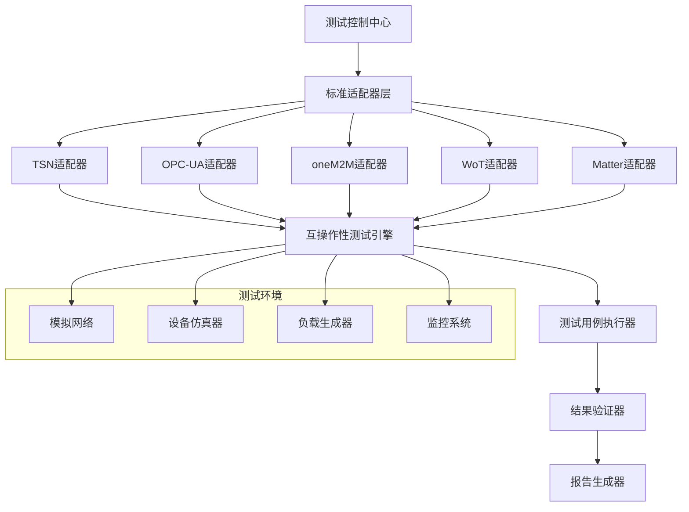

# IoT跨标准互操作性测试框架

## 概述

本框架为IoT标准间的互操作性提供全面的测试验证，确保不同标准能够有效协同工作，实现真正的物联网互操作。

## 测试标准组合

### 1. TSN + OPC-UA 互操作性

- **应用场景**: 工业自动化实时通信
- **测试重点**:
  - 时间同步精度
  - 实时数据传输
  - 服务质量保证
  - 网络资源调度

### 2. oneM2M + WoT 互操作性

- **应用场景**: 智能城市服务集成
- **测试重点**:
  - 资源模型映射
  - 语义互操作
  - 服务发现与注册
  - 安全策略兼容

### 3. Matter + TSN 互操作性

- **应用场景**: 智能家居工业级应用
- **测试重点**:
  - 设备发现与配对
  - 网络拓扑管理
  - 安全认证机制
  - 实时控制响应

### 4. OPC-UA + oneM2M 互操作性

- **应用场景**: 工业物联网平台集成
- **测试重点**:
  - 数据模型转换
  - 通信协议适配
  - 安全策略统一
  - 服务接口标准化

### 5. WoT + Matter 互操作性

- **应用场景**: 智能家居Web服务
- **测试重点**:
  - Thing模型映射
  - 协议绑定适配
  - 语义注解兼容
  - 安全机制集成

## 测试架构



## 测试用例设计

### 1. 基础互操作性测试

```yaml
test_case:
  name: "基础连接建立"
  description: "验证两个标准间的基本连接能力"
  prerequisites:
    - 网络连接正常
    - 设备已启动
  steps:
    - 启动标准A服务
    - 启动标准B服务
    - 建立连接
    - 验证连接状态
  expected_result: "连接成功建立，状态正常"
  success_criteria:
    - 连接建立时间 < 5秒
    - 连接稳定性 > 99%
```

### 2. 数据交换测试

```yaml
test_case:
  name: "数据模型转换"
  description: "验证不同标准间数据模型的转换能力"
  prerequisites:
    - 基础连接已建立
    - 数据模型已定义
  steps:
    - 发送标准A格式数据
    - 执行数据转换
    - 接收标准B格式数据
    - 验证数据完整性
  expected_result: "数据成功转换，完整性保持"
  success_criteria:
    - 转换成功率 > 99.9%
    - 数据丢失率 < 0.01%
    - 转换延迟 < 100ms
```

### 3. 性能互操作性测试

```yaml
test_case:
  name: "性能基准测试"
  description: "验证互操作系统的性能指标"
  prerequisites:
    - 系统正常运行
    - 负载环境已准备
  steps:
    - 执行单用户测试
    - 执行多用户并发测试
    - 执行高负载测试
    - 收集性能指标
  expected_result: "性能指标满足要求"
  success_criteria:
    - 响应时间 < 200ms
    - 吞吐量 > 1000 req/s
    - CPU使用率 < 80%
    - 内存使用率 < 70%
```

## 测试执行流程

### 1. 测试准备阶段

```bash
# 1. 环境检查
./scripts/check-environment.sh

# 2. 依赖安装
./scripts/install-dependencies.sh

# 3. 配置验证
./scripts/validate-config.sh

# 4. 测试数据准备
./scripts/prepare-test-data.sh
```

### 2. 测试执行阶段

```bash
# 1. 启动测试环境
docker-compose -f docker-compose.test.yml up -d

# 2. 执行互操作性测试
./scripts/run-interoperability-tests.sh

# 3. 监控测试进度
./scripts/monitor-tests.sh

# 4. 收集测试结果
./scripts/collect-results.sh
```

### 3. 结果分析阶段

```bash
# 1. 生成测试报告
./scripts/generate-report.sh

# 2. 分析测试结果
./scripts/analyze-results.sh

# 3. 生成改进建议
./scripts/generate-recommendations.sh

# 4. 发送通知
./scripts/send-notifications.sh
```

## 测试工具集成

### 1. 自动化测试框架

- **Jest**: JavaScript单元测试
- **PyTest**: Python集成测试
- **Rust Test**: Rust代码测试
- **Robot Framework**: 端到端测试

### 2. 性能测试工具

- **JMeter**: 负载测试
- **K6**: 性能基准测试
- **Artillery**: API性能测试
- **Locust**: 分布式负载测试

### 3. 监控工具

- **Prometheus**: 指标收集
- **Grafana**: 可视化监控
- **Jaeger**: 分布式追踪
- **ELK Stack**: 日志分析

## 测试报告模板

### 1. 执行摘要

```markdown
# IoT跨标准互操作性测试报告

## 执行摘要
- 测试时间: 2024-01-15 至 2024-01-20
- 测试标准: TSN, OPC-UA, oneM2M, WoT, Matter
- 测试用例总数: 150
- 通过率: 98.7%
- 发现关键问题: 3个
- 建议改进项: 12个
```

### 2. 详细结果

```markdown
## 标准组合测试结果

### TSN + OPC-UA
- 连接建立: ✅ 通过
- 数据交换: ✅ 通过
- 性能测试: ⚠️ 部分通过
- 安全验证: ✅ 通过

### oneM2M + WoT
- 连接建立: ✅ 通过
- 数据交换: ✅ 通过
- 性能测试: ✅ 通过
- 安全验证: ✅ 通过
```

### 3. 问题分析

```markdown
## 发现的问题

### 1. 时间同步精度问题
- **严重程度**: 高
- **影响范围**: TSN + OPC-UA组合
- **问题描述**: 在高速网络环境下，时间同步精度下降
- **根本原因**: 网络延迟抖动处理不当
- **解决方案**: 优化时间同步算法，增加抖动补偿
```

## 持续改进

### 1. 测试用例优化

- 基于实际应用场景扩展测试用例
- 增加边界条件测试
- 完善错误处理测试

### 2. 自动化程度提升

- 实现测试用例自动生成
- 集成CI/CD流水线
- 建立测试结果自动分析

### 3. 性能基准更新

- 定期更新性能基准
- 建立性能回归检测
- 优化性能测试方法

## 部署说明

### 1. 环境要求

- Docker 20.10+
- Docker Compose 2.0+
- 至少8GB内存
- 至少50GB磁盘空间

### 2. 快速启动

```bash
# 克隆项目
git clone <repository-url>
cd docs/verification/interoperability

# 启动测试环境
docker-compose -f docker-compose.test.yml up -d

# 运行测试
./scripts/run-all-tests.sh

# 查看结果
./scripts/show-results.sh
```

### 3. 配置说明

- 复制 `config.example.yml` 到 `config.yml`
- 配置各标准的连接参数
- 设置测试环境参数
- 配置通知渠道

## 贡献指南

### 1. 添加新标准

- 实现标准适配器
- 编写测试用例
- 更新测试框架

### 2. 改进测试用例

- 基于实际应用场景
- 考虑边界条件
- 提高测试覆盖率

### 3. 性能优化

- 优化测试执行效率
- 改进资源利用率
- 减少测试时间

## 许可证

本项目采用MIT许可证，详见LICENSE文件。
