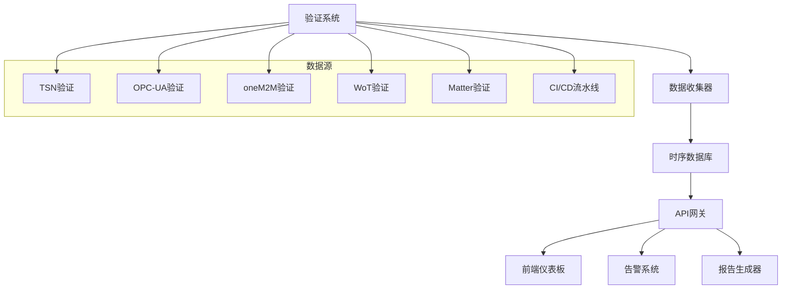

# IoT形式化验证监控仪表板

## 概述

本监控仪表板为IoT形式化验证系统提供实时监控、质量指标可视化和验证状态跟踪功能。

## 功能特性

### 1. 实时验证状态监控

- 各IoT标准验证进度实时显示
- 验证工具运行状态监控
- 错误和警告实时告警

### 2. 质量指标可视化

- 验证覆盖率趋势图
- 性能指标对比分析
- 代码质量评分展示

### 3. 跨标准互操作性监控

- 标准间互操作测试结果
- 兼容性矩阵可视化
- 集成测试状态跟踪

### 4. 自动化流程监控

- CI/CD流水线状态
- 部署验证进度
- 环境健康度监控

## 技术架构



## 部署说明

### 1. 环境要求

- Node.js 18+
- PostgreSQL 14+
- Redis 6+
- Docker & Docker Compose

### 2. 快速启动

```bash
# 克隆项目
git clone <repository-url>
cd docs/verification/verification-dashboard

# 安装依赖
npm install

# 启动服务
docker-compose up -d

# 访问仪表板
open http://localhost:3000
```

### 3. 配置说明

- 复制 `.env.example` 到 `.env`
- 配置数据库连接信息
- 设置验证系统API端点
- 配置告警通知渠道

## 使用指南

### 1. 主仪表板

- 验证系统整体状态概览
- 关键指标快速查看
- 最近验证活动时间线

### 2. 标准详情页

- 各IoT标准验证详情
- 验证工具运行日志
- 性能指标历史趋势

### 3. 互操作性监控

- 跨标准测试结果
- 兼容性分析报告
- 集成测试状态

### 4. 系统管理

- 用户权限管理
- 告警规则配置
- 数据备份恢复

## API接口

### 验证状态查询

```http
GET /api/v1/verification/status
GET /api/v1/verification/{standard}/status
GET /api/v1/verification/{standard}/metrics
```

### 互操作性测试

```http
GET /api/v1/interoperability/tests
POST /api/v1/interoperability/run-test
GET /api/v1/interoperability/results
```

### 性能监控

```http
GET /api/v1/performance/benchmarks
GET /api/v1/performance/trends
GET /api/v1/performance/comparison
```

## 告警配置

### 1. 验证失败告警

- 验证工具异常退出
- 验证结果不通过
- 性能指标超阈值

### 2. 系统健康告警

- 服务不可用
- 资源使用率过高
- 数据库连接异常

### 3. 通知渠道

- 邮件通知
- Slack消息
- 钉钉/企业微信
- Webhook回调

## 数据存储

### 1. 时序数据

- 验证执行时间
- 性能指标数据
- 系统资源使用

### 2. 结构化数据

- 验证结果详情
- 测试用例信息
- 用户操作日志

### 3. 文件存储

- 验证报告PDF
- 性能测试数据
- 日志文件归档

## 扩展开发

### 1. 添加新标准

- 实现标准适配器
- 配置验证规则
- 添加监控指标

### 2. 自定义告警

- 定义告警规则
- 实现告警逻辑
- 配置通知模板

### 3. 集成第三方系统

- 对接监控系统
- 集成日志平台
- 连接通知服务

## 故障排除

### 1. 常见问题

- 数据库连接失败
- 验证工具超时
- 前端页面加载慢

### 2. 日志查看

```bash
# 查看应用日志
docker-compose logs -f dashboard

# 查看数据库日志
docker-compose logs -f postgres

# 查看Redis日志
docker-compose logs -f redis
```

### 3. 性能调优

- 数据库查询优化
- 缓存策略调整
- 前端资源压缩

## 贡献指南

### 1. 代码规范

- 遵循ESLint规则
- 使用TypeScript类型
- 编写单元测试

### 2. 提交规范

- 使用语义化提交信息
- 关联Issue编号
- 提供测试用例

### 3. 文档更新

- 同步更新README
- 维护API文档
- 更新部署说明

## 许可证

本项目采用MIT许可证，详见LICENSE文件。
