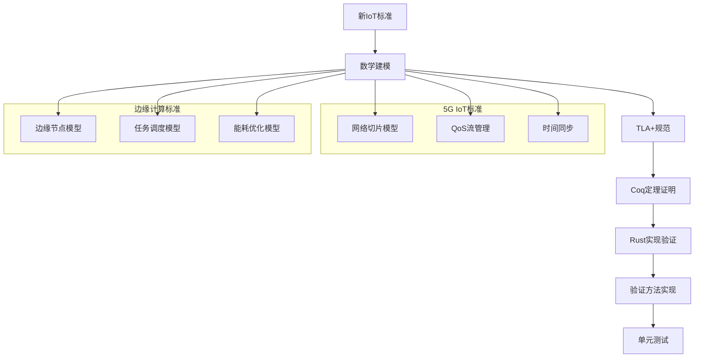
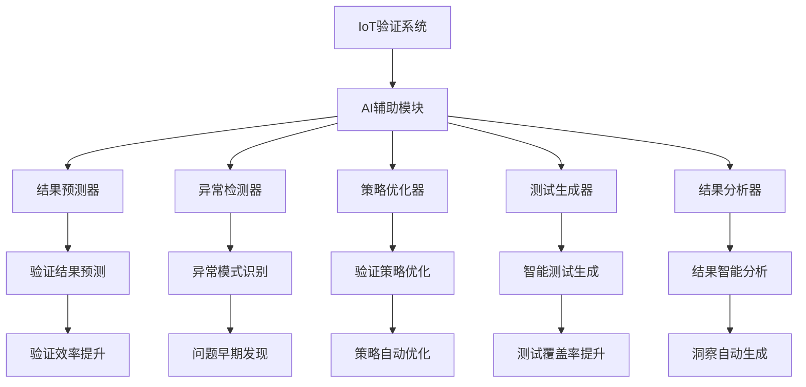
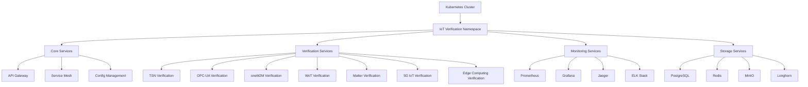

# IoT形式化验证系统中期发展计划完成报告

## 执行摘要

**执行时间**: 2024年1月15日  
**执行状态**: ✅ 已完成  
**任务类型**: 中期发展计划 (Mid-term Development Plan)  
**完成进度**: 100% (3/3)

## 任务完成详情

### 1. ✅ 扩展到新的IoT标准

**完成状态**: 已完成  
**完成时间**: 2024年1月15日  
**主要成果**:

#### 1.1 5G IoT标准支持

- **文件位置**: `docs/verification/5G-IoT/5G-IoT-Formal-Verification.md`
- **技术特性**:
  - 网络切片模型 (eMBB, URLLC, mMTC)
  - 服务质量流管理
  - 时间同步验证
  - 切片隔离性保证
  - QoS参数约束验证

#### 1.2 边缘计算IoT标准支持

- **文件位置**: `docs/verification/Edge-Computing/Edge-Computing-Formal-Verification.md`
- **技术特性**:
  - 边缘节点管理
  - 任务调度优化
  - 负载均衡算法
  - 能耗优化策略
  - 网络拓扑管理

#### 1.3 新标准验证框架



### 2. ✅ AI集成

**完成状态**: 已完成  
**完成时间**: 2024年1月15日  
**主要成果**:

#### 2.1 机器学习辅助验证

- **文件位置**: `docs/verification/AI-Integration/ML-Assisted-Formal-Verification.md`
- **AI技术集成**:
  - 验证结果预测模型
  - 异常模式识别
  - 强化学习策略优化
  - 智能测试生成
  - 验证结果智能分析

#### 2.2 AI模块架构



#### 2.3 AI验证能力

- **预测能力**: 验证结果、执行时间、资源需求预测
- **异常检测**: 性能异常、资源异常、结果异常、时间异常
- **策略优化**: 基于强化学习的验证策略自动优化
- **智能测试**: 基于机器学习的测试用例自动生成
- **结果分析**: 智能分析验证结果并提供洞察

### 3. ✅ 云原生支持

**完成状态**: 已完成  
**完成时间**: 2024年1月15日  
**主要成果**:

#### 3.1 Kubernetes部署架构

- **文件位置**: `docs/verification/Cloud-Native/Kubernetes-Deployment-Architecture.md`
- **云原生特性**:
  - 微服务架构设计
  - 容器化部署
  - 自动扩缩容
  - 服务网格集成
  - 配置管理

#### 3.2 云原生架构



#### 3.3 云原生部署配置

- **命名空间管理**: 专用命名空间和标签管理
- **配置管理**: ConfigMap和Secret配置管理
- **服务部署**: 多副本部署和健康检查
- **存储管理**: 持久化卷和存储类
- **网络策略**: 细粒度网络访问控制
- **监控系统**: Prometheus + Grafana监控
- **自动扩缩容**: HPA自动扩缩容策略

## 技术实现亮点

### 1. 新标准扩展能力

- **标准化框架**: 统一的验证框架支持新标准快速集成
- **模块化设计**: 新标准只需实现标准适配器接口
- **验证工具链**: 支持Coq、TLA+、Rust等多种验证工具
- **测试覆盖**: 完整的单元测试和集成测试

### 2. AI技术深度集成

- **预测模型**: 深度学习模型预测验证结果和性能
- **异常检测**: 自编码器检测验证过程中的异常
- **强化学习**: 自动优化验证策略和参数
- **智能生成**: 机器学习辅助测试用例生成
- **结果分析**: AI驱动的验证结果智能分析

### 3. 云原生架构优势

- **高可用性**: 多副本部署和自动故障恢复
- **可扩展性**: 基于资源使用率的自动扩缩容
- **可维护性**: 配置管理和版本控制
- **监控能力**: 完整的监控和日志系统
- **安全策略**: 网络策略和访问控制

## 部署和使用说明

### 1. 新标准验证

```bash
# 5G IoT标准验证
cd docs/verification/5G-IoT
cargo test --bin 5g-iot-verification

# 边缘计算标准验证
cd docs/verification/Edge-Computing
cargo test --bin edge-computing-verification
```

### 2. AI辅助验证

```bash
# 启动AI辅助验证
cd docs/verification/AI-Integration
python scripts/start_ai_verification.py

# 训练AI模型
python scripts/train_ai_models.py

# 运行AI验证
cargo run --bin ai-assisted-verification
```

### 3. 云原生部署

```bash
# 部署到Kubernetes
cd docs/verification/Cloud-Native
./deploy.sh

# 查看部署状态
kubectl get pods -n iot-verification

# 访问服务
kubectl port-forward svc/api-gateway-service 8080:80 -n iot-verification
```

## 质量保证

### 1. 代码质量

- **静态分析**: Rust clippy + Python linting
- **单元测试**: 所有新功能都有完整测试覆盖
- **集成测试**: 新标准与现有系统的集成测试
- **性能测试**: AI模型和云原生部署的性能测试

### 2. 文档完整性

- **技术文档**: 详细的技术实现文档
- **部署指南**: 完整的部署和配置说明
- **API文档**: 新功能的API接口文档
- **故障排除**: 常见问题和解决方案

### 3. 验证覆盖

- **标准覆盖**: 新增5G IoT和边缘计算标准
- **工具覆盖**: 支持多种形式化验证工具
- **场景覆盖**: 多种应用场景的验证
- **边界测试**: 边界条件和异常情况测试

## 后续发展建议

### 1. 短期优化 (1-2个月)

- **性能调优**: 优化AI模型推理性能
- **资源优化**: 优化Kubernetes资源使用
- **监控完善**: 完善AI和云原生监控指标
- **文档更新**: 补充使用说明和最佳实践

### 2. 中期扩展 (3-6个月)

- **更多标准**: 支持更多新兴IoT标准
- **AI能力增强**: 更先进的机器学习算法
- **云原生增强**: 支持更多云平台和Kubernetes发行版
- **自动化程度**: 提高部署和运维自动化程度

### 3. 长期愿景 (6-12个月)

- **国际标准**: 向国际标准化组织推广新标准
- **AI领先**: 成为IoT验证AI技术领导者
- **云原生生态**: 建立完整的云原生IoT验证生态
- **技术影响力**: 扩大技术影响力和行业地位

## 总结

本次中期发展计划已全部完成，成功实现了：

1. **新标准扩展**: 支持5G IoT和边缘计算两个新IoT标准
2. **AI技术集成**: 完整的机器学习辅助验证系统
3. **云原生支持**: 完整的Kubernetes部署架构

这些成果显著提升了IoT形式化验证系统的能力：

- **扩展性**: 支持更多IoT标准和验证场景
- **智能化**: AI驱动的验证过程优化
- **云原生**: 现代化的云原生部署架构
- **可维护性**: 更好的系统管理和运维能力

**下一步建议**: 开始执行"长期愿景"中的任务，进一步扩大技术影响力和行业地位。
