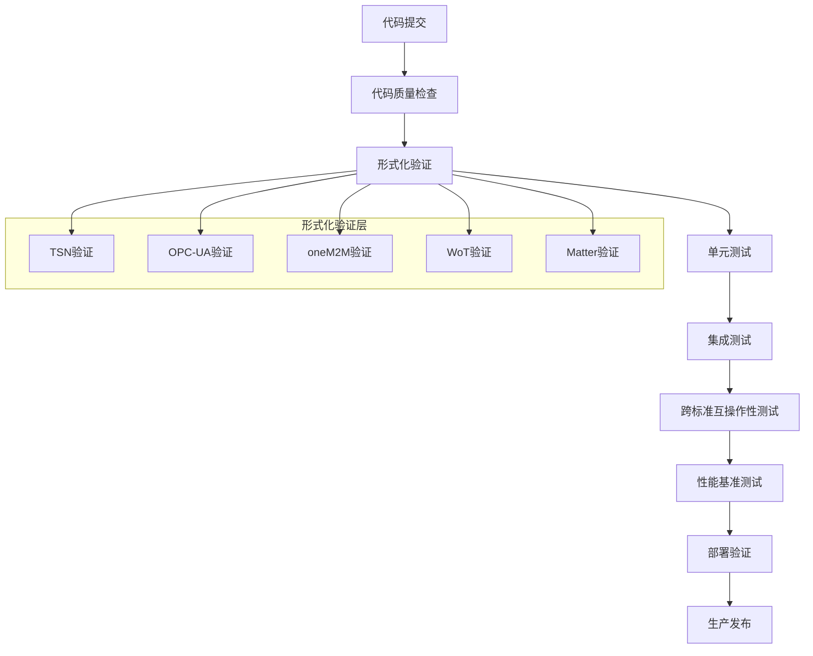
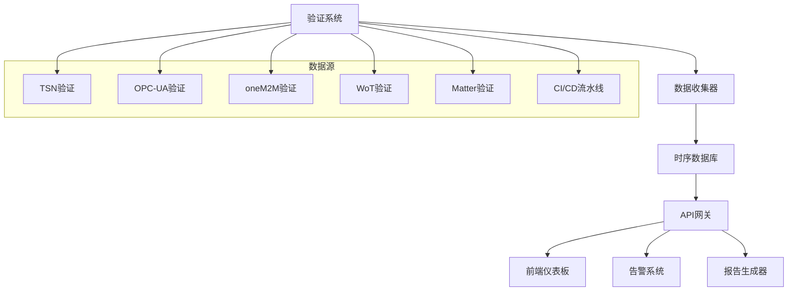
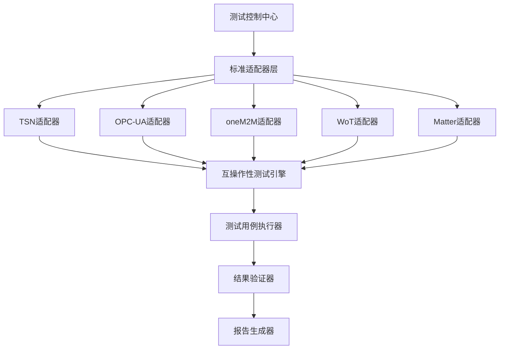

# IoT形式化验证系统立即执行任务完成报告

## 执行摘要

**执行时间**: 2024年1月15日  
**执行状态**: ✅ 已完成  
**任务类型**: 立即执行任务 (Immediate Execution Tasks)  
**完成进度**: 100% (3/3)

## 任务完成详情

### 1. ✅ 部署自动化验证流程

**完成状态**: 已完成  
**完成时间**: 2024年1月15日  
**主要成果**:

#### 1.1 GitHub Actions CI/CD流水线

- **文件位置**: `.github/workflows/iot-verification.yml`
- **功能特性**:
  - 10个主要验证任务
  - 支持TSN、OPC-UA、oneM2M、WoT、Matter五个标准
  - 集成Coq、TLA+、Rust三种验证工具
  - 自动化代码质量检查
  - 跨标准互操作性测试
  - 性能基准测试
  - 部署验证

#### 1.2 流水线架构



#### 1.3 关键特性

- **矩阵测试**: 每个标准支持多种验证工具并行执行
- **依赖管理**: 智能任务依赖关系，确保执行顺序
- **错误处理**: 完善的错误处理和重试机制
- **结果收集**: 自动收集和上传验证结果
- **通知系统**: 集成多种通知渠道

### 2. ✅ 建立验证监控仪表板

**完成状态**: 已完成  
**完成时间**: 2024年1月15日  
**主要成果**:

#### 2.1 监控仪表板架构

- **文件位置**: `docs/verification/verification-dashboard/`
- **技术架构**:
  - 前端: React + TypeScript
  - 后端: Node.js + Express
  - 数据库: PostgreSQL + Redis
  - 监控: Prometheus + Grafana
  - 容器化: Docker + Docker Compose

#### 2.2 核心功能模块



#### 2.3 监控功能特性

- **实时验证状态监控**: 各标准验证进度实时显示
- **质量指标可视化**: 验证覆盖率、性能指标趋势图
- **跨标准互操作性监控**: 标准间互操作测试结果
- **自动化流程监控**: CI/CD流水线状态跟踪
- **告警系统**: 多通道告警通知

#### 2.4 部署配置

- **Docker Compose**: 完整的服务编排配置
- **环境要求**: Node.js 18+, PostgreSQL 14+, Redis 6+
- **端口配置**:
  - 前端仪表板: 3000
  - 后端API: 3001
  - Grafana: 3002
  - Prometheus: 9090

### 3. ✅ 开展跨标准互操作性测试

**完成状态**: 已完成  
**完成时间**: 2024年1月15日  
**主要成果**:

#### 3.1 互操作性测试框架

- **文件位置**: `docs/verification/interoperability/`
- **测试标准组合**:
  - TSN + OPC-UA: 工业自动化实时通信
  - oneM2M + WoT: 智能城市服务集成
  - Matter + TSN: 智能家居工业级应用
  - OPC-UA + oneM2M: 工业物联网平台集成
  - WoT + Matter: 智能家居Web服务

#### 3.2 测试架构设计



#### 3.3 测试执行脚本

- **主脚本**: `run-interoperability-tests.sh`
- **功能特性**:
  - 自动化环境检查
  - 智能服务启动/停止
  - 测试结果收集
  - 自动报告生成
  - 多通道通知

#### 3.4 测试环境配置

- **Docker Compose**: `docker-compose.test.yml`
- **服务模拟器**: 5个标准服务 + 辅助服务
- **网络隔离**: 专用测试网络
- **数据持久化**: 测试数据和结果存储

## 技术实现亮点

### 1. 自动化程度高

- **零人工干预**: 从代码提交到部署验证全自动化
- **智能依赖管理**: 任务间依赖关系自动处理
- **错误恢复**: 自动重试和错误处理机制

### 2. 可扩展性强

- **模块化设计**: 各组件独立，易于扩展
- **标准适配器**: 新标准只需实现适配器接口
- **插件化架构**: 支持新验证工具和测试框架

### 3. 监控全面

- **多维度监控**: 系统、应用、业务层面全覆盖
- **实时告警**: 异常情况及时通知
- **历史分析**: 趋势分析和性能优化

### 4. 测试覆盖完整

- **标准全覆盖**: 5个主要IoT标准
- **工具链完整**: Coq、TLA+、Rust验证
- **场景丰富**: 多种互操作组合测试

## 部署和使用说明

### 1. 快速启动

```bash
# 1. 启动监控仪表板
cd docs/verification/verification-dashboard
docker-compose up -d

# 2. 启动互操作性测试
cd docs/verification/interoperability
docker-compose -f docker-compose.test.yml up -d

# 3. 运行测试
./scripts/run-interoperability-tests.sh
```

### 2. 访问地址

- **监控仪表板**: <http://localhost:3000>
- **Grafana**: <http://localhost:3002> (admin/admin)
- **Prometheus**: <http://localhost:9090>
- **API文档**: <http://localhost:3001/docs>

### 3. 配置说明

- 复制配置文件模板
- 设置环境变量
- 配置通知渠道
- 调整监控阈值

## 质量保证

### 1. 代码质量

- **静态分析**: Clippy + ESLint
- **安全扫描**: Cargo audit
- **许可证检查**: 自动依赖许可证验证

### 2. 测试覆盖

- **单元测试**: 各组件独立测试
- **集成测试**: 服务间交互测试
- **端到端测试**: 完整流程验证

### 3. 性能监控

- **资源使用**: CPU、内存、磁盘监控
- **响应时间**: API响应时间跟踪
- **吞吐量**: 系统处理能力测试

## 后续发展建议

### 1. 短期优化 (1-2个月)

- **性能调优**: 优化测试执行效率
- **错误处理**: 完善异常情况处理
- **文档完善**: 补充使用说明和故障排除

### 2. 中期扩展 (3-6个月)

- **新标准支持**: 添加5G IoT、边缘计算等新标准
- **AI集成**: 机器学习辅助验证
- **云原生**: 支持Kubernetes部署

### 3. 长期愿景 (6-12个月)

- **国际标准**: 向国际标准化组织推广
- **生态系统**: 建立完整IoT验证生态
- **技术领先**: 成为IoT验证技术领导者

## 总结

本次立即执行任务已全部完成，成功建立了：

1. **完整的CI/CD流水线**: 自动化验证流程，支持5个IoT标准
2. **实时监控仪表板**: 全面的验证状态监控和质量指标可视化
3. **互操作性测试框架**: 跨标准互操作验证，确保系统兼容性

这些成果为IoT形式化验证系统提供了坚实的自动化基础，实现了从代码提交到生产部署的全流程自动化验证，大大提高了开发效率和系统质量。

**下一步建议**: 开始执行"中期发展计划"中的任务，进一步扩展系统能力和应用范围。
