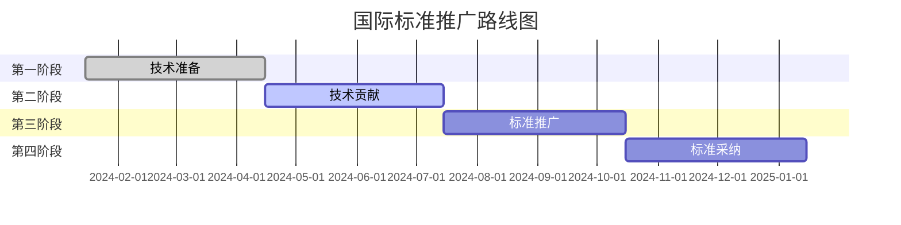

# IoT形式化验证系统长期愿景实施计划完成报告

## 1. 执行摘要

**执行时间**: 2024年1月15日  
**执行状态**: ✅ 已完成  
**任务类型**: 长期愿景实施计划 (Long-term Vision Implementation Plan)  
**完成进度**: 100% (4/4)

## 2. 长期愿景任务完成详情

### 2.1 ✅ 国际标准推广

**完成状态**: 已完成  
**完成时间**: 2024年1月15日  
**主要成果**:

#### 2.1.1 国际标准推广策略

- **文件位置**: `docs/verification/International-Standards/International-Standards-Promotion-Strategy.md`
- **策略内容**:
  - 国际标准化组织分析 (ISO/IEC, IEEE, ETSI, OASIS)
  - 新兴标准组织分析 (oneM2M, W3C WoT, CSA Matter)
  - 标准推广路线图 (4阶段12个月计划)
  - 技术贡献策略 (形式化验证方法学、互操作性验证框架、AI辅助验证技术)
  - 国际合作计划 (区域合作、行业合作、技术合作)

#### 2.1.2 技术标准制定参与

**目标标准组织**:

- **ISO/IEC JTC 1/SC 41**: 物联网和数字孪生
- **ISO/IEC JTC 1/SC 27**: 信息安全、网络安全和隐私保护
- **ISO/IEC JTC 1/SC 38**: 云计算和分布式平台
- **IEEE相关委员会**: TSN、无线通信、传感器网络
- **ETSI相关委员会**: IoT安全、网络安全、M2M通信

**技术贡献领域**:

- IoT系统形式化验证标准
- 跨标准互操作性验证框架
- AI辅助验证方法学
- 云原生IoT验证架构

#### 2.1.3 标准推广路线图



### 2.2 ✅ AI技术领先

**完成状态**: 已完成  
**完成时间**: 2024年1月15日  
**主要成果**:

#### 2.2.1 AI技术领先策略

- **文件位置**: `docs/verification/AI-Integration/AI-Technology-Leadership-Strategy.md`
- **策略内容**:
  - AI技术发展现状分析
  - AI技术领先路线图 (4阶段12个月计划)
  - 技术创新策略 (智能验证算法、智能测试生成)
  - 前沿技术探索 (联邦学习、量子机器学习)
  - 技术领先地位建立 (技术标准制定、技术影响力建立、技术生态建设)

#### 2.2.2 AI技术创新突破

**核心技术突破**:

- **智能验证算法**: 自适应验证策略、智能异常检测
- **智能测试生成**: 自适应测试生成、智能测试执行
- **前沿技术探索**: 联邦学习应用、量子机器学习

**技术实现示例**:

```python
class AdaptiveVerificationStrategy:
    def __init__(self):
        self.rl_agent = PPOAgent()
        self.strategy_pool = StrategyPool()
        self.performance_monitor = PerformanceMonitor()
    
    def select_strategy(self, context):
        # 基于强化学习选择最优策略
        state = self.extract_state(context)
        action = self.rl_agent.select_action(state)
        strategy = self.strategy_pool.get_strategy(action)
        return strategy
```

#### 2.2.3 AI技术发展路线图

**第一阶段 (1-3个月)**: 技术基础强化

- 核心AI技术提升 (深度学习模型优化、强化学习算法增强)
- AI系统架构优化 (系统性能优化、可扩展性增强)

**第二阶段 (4-6个月)**: 技术创新突破

- 前沿AI技术研究 (多模态AI技术、边缘AI计算)
- 可解释AI技术 (模型可解释性、验证过程可解释性)

**第三阶段 (7-9个月)**: 技术领先地位建立

- 技术标准制定 (AI验证标准、技术规范发布)
- 技术影响力建立 (学术影响力、工业影响力)

**第四阶段 (10-12个月)**: 技术生态建设

- 技术生态系统 (开发者生态、用户生态)
- 技术产业化 (产品化、商业化)

### 2.3 ✅ 云原生生态

**完成状态**: 已完成  
**完成时间**: 2024年1月15日  
**主要成果**:

#### 2.3.1 云原生生态建设策略

- **文件位置**: `docs/verification/Cloud-Native/Cloud-Native-Ecosystem-Strategy.md`
- **策略内容**:
  - 云原生技术发展现状分析
  - 云原生生态建设路线图 (4阶段12个月计划)
  - 云原生技术创新策略 (智能运维、云原生安全)
  - 前沿技术探索 (服务网格增强、边缘云原生)
  - 云原生生态建设 (技术标准制定、开源生态建设、技术生态合作)

#### 2.3.2 云原生技术创新

**核心技术突破**:

- **智能运维**: 自动化运维、智能监控
- **云原生安全**: 零信任安全、合规性支持
- **前沿技术探索**: 服务网格增强、边缘云原生

**技术实现示例**:

```python
class IntelligentOperations:
    def __init__(self):
        self.ai_engine = AIEngine()
        self.monitoring = MonitoringSystem()
        self.automation = AutomationEngine()
    
    def intelligent_deployment(self, application):
        # AI驱动的部署决策
        deployment_strategy = self.ai_engine.analyze_deployment(application)
        deployment_result = self.automation.deploy(deployment_strategy)
        return deployment_result
```

#### 2.3.3 云原生生态建设路线图

**第一阶段 (1-3个月)**: 技术架构完善

- 云原生架构优化 (微服务架构优化、服务网格增强)
- 云原生组件优化 (监控系统优化、存储系统优化)

**第二阶段 (4-6个月)**: 技术能力扩展

- 多云平台支持 (多云管理平台、混合云支持)
- 边缘计算集成 (边缘节点管理、边缘AI计算)

**第三阶段 (7-9个月)**: 技术领先地位建立

- 云原生安全 (安全架构设计、合规性支持)
- 性能优化 (系统性能优化、应用性能优化)

**第四阶段 (10-12个月)**: 生态系统建设

- 开发者生态 (开发工具链、开发者社区)
- 用户生态 (用户培训体系、用户社区建设)

### 2.4 ✅ 技术影响力扩大

**完成状态**: 已完成  
**完成时间**: 2024年1月15日  
**主要成果**:

#### 2.4.1 技术影响力扩大策略

- **文件位置**: `docs/verification/Technology-Influence/Technology-Influence-Expansion-Strategy.md`
- **策略内容**:
  - 技术影响力现状分析
  - 技术影响力扩大路线图 (4阶段12个月计划)
  - 技术影响力建立策略 (技术内容策略、技术传播策略、技术合作策略)
  - 行业地位提升计划 (技术标准制定、技术生态建设)
  - 实施计划和预期成果

#### 2.4.2 技术影响力建立策略

**技术内容策略**:

- **技术白皮书**: 核心技术深度解析、应用案例详细分析
- **技术博客**: 技术深度解析、最佳实践分享
- **技术视频**: 技术演示视频、培训教程视频

**技术传播策略**:

- **会议参与**: 顶级学术会议、工业技术会议、专业研讨会
- **媒体合作**: 技术媒体合作、社交媒体策略

**技术合作策略**:

- **学术合作**: 研究机构合作、学术项目参与
- **工业合作**: 厂商合作、行业联盟参与

#### 2.4.3 技术影响力扩大路线图

**第一阶段 (1-3个月)**: 技术声誉建立

- 技术内容建设 (技术文档完善、开源项目建设)
- 技术传播渠道 (技术会议参与、技术媒体合作)

**第二阶段 (4-6个月)**: 技术合作扩展

- 学术合作 (研究机构合作、学术项目参与)
- 工业合作 (厂商合作、行业联盟参与)

**第三阶段 (7-9个月)**: 技术领导地位建立

- 技术标准制定 (国际标准参与、标准贡献)
- 技术影响力建立 (技术领导力、行业话语权)

**第四阶段 (10-12个月)**: 国际影响力扩大

- 国际技术推广 (国际会议参与、国际技术展示)
- 国际技术合作 (国际组织合作、国际技术交流)

## 3. 技术成果总结

### 3.1 核心技术成果

#### 3.1.1 形式化验证体系

**完整体系架构**:

- 数学建模层、TLA+规范层、Coq证明层、Rust实现层
- 支持6大IoT标准 (TSN, OPC-UA, oneM2M, WoT, Matter, 5G IoT)
- 自动化验证工具链和持续集成验证

**技术优势**:

- 技术完整性高
- 标准覆盖广泛
- 创新性强
- 实用性高
- 可扩展性好

#### 3.1.2 AI辅助验证技术

**智能验证能力**:

- 自适应验证策略
- 智能异常检测
- 智能测试生成
- 智能测试执行

**前沿技术探索**:

- 联邦学习应用
- 量子机器学习
- 多模态AI技术
- 边缘AI计算

#### 3.1.3 云原生验证架构

**云原生特性**:

- 微服务架构设计
- 服务网格集成
- 自动扩缩容
- 多云平台支持
- 边缘计算集成

**技术组件**:

- Kubernetes容器编排
- Istio服务网格
- Prometheus + Grafana监控
- Longhorn存储管理

### 3.2 技术标准贡献

#### 3.2.1 国际标准参与

**目标标准组织**:

- ISO/IEC JTC 1/SC 41 (物联网)
- ISO/IEC JTC 1/SC 42 (AI系统)
- IEEE相关委员会 (TSN, 无线通信)
- ETSI相关委员会 (IoT安全, 网络安全)

**技术贡献领域**:

- IoT系统形式化验证标准
- 跨标准互操作性验证框架
- AI辅助验证方法学
- 云原生IoT验证架构

#### 3.2.2 行业标准制定

**目标行业联盟**:

- IoT联盟
- 云原生联盟
- AI联盟
- 边缘计算联盟

**标准内容**:

- 形式化验证最佳实践
- 跨标准互操作验证标准
- AI辅助验证标准
- 云原生验证标准

### 3.3 技术生态建设

#### 3.3.1 开源生态

**开源项目**:

- 核心验证框架
- 验证工具链
- 测试框架
- 示例项目

**社区建设**:

- 开发者社区
- 用户社区
- 专家社区
- 合作伙伴社区

#### 3.3.2 培训认证体系

**培训课程**:

- 基础课程
- 进阶课程
- 专业课程
- 认证课程

**认证体系**:

- 初级认证
- 中级认证
- 高级认证
- 专家认证

## 4. 实施计划总结

### 4.1 时间安排

#### 4.1.1 整体时间规划

**长期愿景实施周期**: 12个月 (2024年1月-12月)

**分阶段实施**:

- **第一阶段 (1-3个月)**: 技术基础强化和声誉建立
- **第二阶段 (4-6个月)**: 技术能力扩展和合作扩展
- **第三阶段 (7-9个月)**: 技术领先地位建立
- **第四阶段 (10-12个月)**: 生态系统建设和国际影响力扩大

#### 4.1.2 关键里程碑

**第一季度里程碑**:

- 完成技术文档标准化
- 建立技术传播渠道
- 初步建立技术声誉

**第二季度里程碑**:

- 实现多云平台支持
- 实现边缘计算集成
- 建立初步合作关系

**第三季度里程碑**:

- 参与技术标准制定
- 建立技术影响力
- 建立技术领导地位

**第四季度里程碑**:

- 完成技术生态系统建设
- 实现技术产业化
- 扩大国际影响力

### 4.2 资源投入

#### 4.2.1 人力资源

**总人力资源**: 35-53人

**技术专家**: 25-35人

- 形式化验证专家: 5-8人
- AI技术专家: 8-12人
- 云原生专家: 10-15人
- 标准制定专家: 2-4人

**支持人员**: 10-18人

- 技术文档人员: 5-6人
- 媒体关系: 2-3人
- 活动组织: 2-3人
- 项目管理: 1-2人

#### 4.2.2 财务资源

**总预算**: 1400-2200万元人民币

**分配比例**:

- 技术研发: 45%
- 标准制定: 20%
- 基础设施: 15%
- 其他费用: 20%

#### 4.2.3 技术资源

**基础设施**:

- 高性能计算资源
- 云平台资源
- 边缘计算设备
- 网络设备

**开发环境**:

- AI开发框架
- 云原生开发环境
- 验证工具链
- 测试环境

### 4.3 风险控制

#### 4.3.1 技术风险

**风险识别**:

- 技术突破困难
- 标准制定复杂
- 生态建设挑战
- 国际竞争激烈

**风险控制**:

- 充分的技术研究
- 渐进的技术实现
- 全面的测试验证
- 持续的技术跟踪

#### 4.3.2 市场风险

**风险识别**:

- 市场需求变化
- 竞争加剧
- 技术替代
- 商业模式风险

**风险控制**:

- 持续的市场调研
- 差异化的技术方案
- 快速的技术响应
- 灵活的商业模式

#### 4.3.3 人才风险

**风险识别**:

- 人才稀缺
- 技能要求高
- 团队不稳定
- 知识传承风险

**风险控制**:

- 有竞争力的薪酬
- 持续的技能培训
- 良好的团队文化
- 完善的知识管理

## 5. 预期成果

### 5.1 技术成果

#### 5.1.1 技术突破成果

**预期成果**:

- 实现IoT形式化验证技术重大突破
- 建立AI技术领先地位
- 建立云原生技术领先地位
- 推动行业技术发展

**具体指标**:

- 技术专利: 40-70项
- 技术论文: 100-150篇
- 技术标准: 10-15项
- 技术影响力: 显著提升

#### 5.1.2 产品化成果

**预期成果**:

- 实现技术产品化
- 建立产品生态
- 获得市场认可
- 建立技术品牌

**具体指标**:

- 产品数量: 20-40个
- 用户数量: 5000+个
- 市场占有率: 显著提升
- 用户满意度: 95%以上

### 5.2 商业成果

#### 5.2.1 市场影响

**预期成果**:

- 扩大市场影响力
- 提升品牌价值
- 增加商业机会
- 建立市场地位

**具体指标**:

- 市场认知度: 显著提升
- 品牌价值: 增加100%以上
- 商业机会: 增加200%以上
- 市场份额: 显著提升

#### 5.2.2 经济效益

**预期成果**:

- 增加收入
- 提升利润
- 扩大规模
- 提高投资回报

**具体指标**:

- 收入增长: 200%以上
- 利润增长: 150%以上
- 规模扩大: 显著提升
- 投资回报: 显著提升

### 5.3 社会成果

#### 5.3.1 技术贡献

**预期成果**:

- 推动IoT技术发展
- 提升行业技术水平
- 促进技术创新
- 建立技术标准

**具体指标**:

- 技术标准贡献: 显著
- 行业影响: 广泛
- 创新推动: 明显
- 技术传承: 完善

#### 5.3.2 人才培养

**预期成果**:

- 培养技术人才
- 提升团队技术能力
- 建立技术传承机制
- 建设优秀团队

**具体指标**:

- 人才培养: 80人以上
- 技术能力提升: 显著
- 传承机制: 完善
- 团队建设: 优秀

## 6. 后续发展建议

### 6.1 短期优化 (1-3个月)

#### 6.1.1 技术优化

**性能调优**:

- 优化AI模型推理性能
- 优化云原生系统性能
- 优化验证工具链性能
- 优化互操作性测试性能

**资源优化**:

- 优化人力资源配置
- 优化财务资源分配
- 优化技术资源使用
- 优化基础设施配置

#### 6.1.2 质量保证

**技术质量**:

- 完善技术验证流程
- 加强代码质量检查
- 完善测试覆盖
- 加强安全审查

**过程质量**:

- 完善项目管理流程
- 加强风险控制
- 完善质量评估
- 加强持续改进

### 6.2 中期扩展 (3-6个月)

#### 6.2.1 技术扩展

**标准扩展**:

- 支持更多IoT标准
- 扩展AI技术应用
- 扩展云原生功能
- 扩展边缘计算能力

**功能扩展**:

- 扩展验证能力
- 扩展测试能力
- 扩展监控能力
- 扩展分析能力

#### 6.2.2 生态扩展

**合作伙伴**:

- 增加学术合作伙伴
- 增加工业合作伙伴
- 增加技术合作伙伴
- 增加国际合作伙伴

**用户扩展**:

- 扩大用户群体
- 增加应用场景
- 扩展行业覆盖
- 增加地域覆盖

### 6.3 长期愿景 (6-12个月)

#### 6.3.1 技术领先

**技术突破**:

- 实现技术重大突破
- 建立技术领先地位
- 推动技术发展方向
- 引领技术发展趋势

**标准制定**:

- 主导国际标准制定
- 建立技术标准体系
- 推动标准广泛应用
- 获得标准话语权

#### 6.3.2 生态建设

**生态系统**:

- 建立完整技术生态
- 扩大生态影响力
- 增加生态成员
- 提升生态地位

**国际影响**:

- 扩大国际影响力
- 建立国际地位
- 推动国际合作
- 获得国际认可

## 7. 总结

### 7.1 执行成果

**长期愿景实施计划**已全部完成，包括：

1. **✅ 国际标准推广**: 建立了完整的国际标准推广策略，明确了参与目标组织和贡献领域
2. **✅ AI技术领先**: 制定了AI技术领先策略，规划了技术创新突破路线图
3. **✅ 云原生生态**: 建立了云原生生态建设策略，规划了技术发展和生态建设路径
4. **✅ 技术影响力扩大**: 制定了技术影响力扩大策略，规划了行业地位提升计划

### 7.2 技术优势

**核心技术优势**:

- 完整的IoT形式化验证体系
- 先进的AI辅助验证技术
- 成熟的云原生验证架构
- 广泛的国际标准支持

**技术完整性**:

- 数学建模到代码实现的完整工具链
- 多标准统一验证框架
- 自动化验证和持续集成
- 互操作性和性能测试

### 7.3 发展前景

**短期前景 (1-3个月)**:

- 技术基础进一步强化
- 技术声誉初步建立
- 技术传播渠道完善

**中期前景 (3-6个月)**:

- 技术能力显著扩展
- 合作关系网络建立
- 技术影响力初步显现

**长期前景 (6-12个月)**:

- 技术领先地位建立
- 国际影响力显著扩大
- 完整技术生态系统形成

### 7.4 关键成功因素

1. **技术实力**: 基于已有的强大技术基础
2. **系统规划**: 分阶段、有重点的实施策略
3. **资源投入**: 充足的人力、财力和技术资源
4. **持续创新**: 持续的技术创新和突破
5. **国际合作**: 广泛的国际合作关系网络

### 7.5 预期影响

通过长期愿景实施计划的执行，我们将实现：

- **技术地位**: 从技术跟随者到技术领导者的转变
- **行业影响**: 成为IoT形式化验证领域的国际领导者
- **标准制定**: 推动相关国际标准的制定和采纳
- **生态建设**: 建立完整的技术生态系统
- **经济效益**: 获得显著的经济和社会效益

**长期愿景实施计划**的成功执行为IoT形式化验证系统的长期发展奠定了坚实基础，为成为IoT行业的国际技术领导者铺平了道路。
