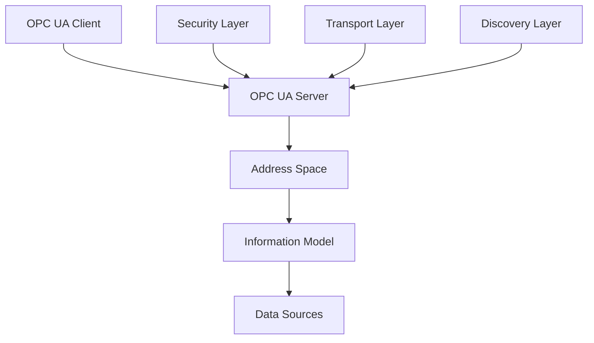

# OPC UA 1.05 深度解析

## 版本信息

- **版本**: 1.0.0
- **创建日期**: 2024-12-19
- **最后更新**: 2024-12-19
- **作者**: IoT团队
- **状态**: 草稿

## 概述

### 1.1 标准简介

OPC UA (OPC Unified Architecture) 是由OPC基金会制定的工业自动化数据交换标准，版本1.05是最新的稳定版本。OPC UA提供了一个统一的、面向服务的架构，用于工业设备和系统之间的安全、可靠的数据交换。

### 1.2 核心特性

- **平台无关性**: 支持多种操作系统和编程语言
- **安全性**: 内置安全机制，支持加密和认证
- **可扩展性**: 支持自定义信息模型
- **互操作性**: 提供标准化的数据访问接口
- **实时性**: 支持实时数据交换和事件通知

## 架构体系

### 2.1 整体架构



### 2.2 核心组件

#### 2.2.1 OPC UA Server

- **地址空间管理**: 管理服务器中的节点和引用
- **服务实现**: 实现OPC UA服务集
- **安全处理**: 处理客户端认证和授权
- **会话管理**: 管理客户端连接和会话

#### 2.2.2 OPC UA Client

- **服务调用**: 调用服务器提供的服务
- **数据订阅**: 订阅数据变化和事件
- **会话管理**: 管理与服务器的连接
- **安全处理**: 处理认证和加密

#### 2.2.3 Address Space

- **节点管理**: 管理所有节点和引用
- **信息模型**: 定义数据结构和关系
- **命名空间**: 管理不同的命名空间
- **访问控制**: 控制节点访问权限

## 信息模型

### 3.1 节点类型

#### 3.1.1 基础节点类型

```rust
// OPC UA节点类型定义
#[derive(Debug, Clone, PartialEq)]
pub enum NodeType {
    Object,         // 对象节点
    Variable,       // 变量节点
    Method,         // 方法节点
    ObjectType,     // 对象类型节点
    VariableType,   // 变量类型节点
    ReferenceType,  // 引用类型节点
    DataType,       // 数据类型节点
    View,           // 视图节点
}
```

#### 3.1.2 节点属性

```rust
// 节点属性结构
pub struct NodeAttributes {
    pub node_id: NodeId,
    pub node_class: NodeClass,
    pub browse_name: QualifiedName,
    pub display_name: LocalizedText,
    pub description: LocalizedText,
    pub write_mask: u32,
    pub user_write_mask: u32,
}
```

### 3.2 引用类型

#### 3.2.1 层次引用

- **Organizes**: 组织关系
- **HasComponent**: 组件关系
- **HasProperty**: 属性关系
- **HasTypeDefinition**: 类型定义关系

#### 3.2.2 语义引用

- **HasSubtype**: 子类型关系
- **HasEventSource**: 事件源关系
- **HasNotifier**: 通知器关系
- **HasModellingRule**: 建模规则关系

### 3.3 数据类型系统

#### 3.3.1 基础数据类型

```rust
// OPC UA基础数据类型
pub enum DataType {
    Boolean,
    SByte,
    Byte,
    Int16,
    UInt16,
    Int32,
    UInt32,
    Int64,
    UInt64,
    Float,
    Double,
    String,
    DateTime,
    Guid,
    ByteString,
    XmlElement,
    NodeId,
    ExpandedNodeId,
    StatusCode,
    QualifiedName,
    LocalizedText,
    ExtensionObject,
    DataValue,
    Variant,
    DiagnosticInfo,
}
```

#### 3.3.2 复杂数据类型

- **结构体**: 用户定义的结构类型
- **枚举**: 枚举类型
- **联合**: 联合类型
- **数组**: 数组类型

## 服务集

### 4.1 发现服务

#### 4.1.1 服务定义

```rust
// 发现服务接口
pub trait DiscoveryService {
    fn find_servers(&self, request: FindServersRequest) -> Result<FindServersResponse, ServiceError>;
    fn get_endpoints(&self, request: GetEndpointsRequest) -> Result<GetEndpointsResponse, ServiceError>;
    fn register_server(&self, request: RegisterServerRequest) -> Result<RegisterServerResponse, ServiceError>;
    fn register_server2(&self, request: RegisterServer2Request) -> Result<RegisterServer2Response, ServiceError>;
}
```

#### 4.1.2 实现示例

```rust
impl DiscoveryService for OPCUAServer {
    fn find_servers(&self, request: FindServersRequest) -> Result<FindServersResponse, ServiceError> {
        // 实现服务器发现逻辑
        let servers = self.discover_servers(&request.server_uris)?;
        Ok(FindServersResponse {
            servers,
            response_header: self.create_response_header(),
        })
    }
}
```

### 4.2 安全服务

#### 4.2.1 安全策略

- **None**: 无安全策略
- **Basic128Rsa15**: 基本128位RSA15加密
- **Basic256**: 基本256位加密
- **Basic256Sha256**: 基本256位SHA256加密
- **Aes128Sha256RsaOaep**: AES128-SHA256-RSA-OAEP
- **Aes256Sha256RsaPss**: AES256-SHA256-RSA-PSS

#### 4.2.2 认证机制

```rust
// 认证接口
pub trait AuthenticationService {
    fn authenticate(&self, credentials: &Credentials) -> Result<Session, AuthError>;
    fn validate_session(&self, session: &Session) -> Result<bool, AuthError>;
    fn revoke_session(&self, session_id: &NodeId) -> Result<(), AuthError>;
}
```

### 4.3 会话服务

#### 4.3.1 会话管理

```rust
// 会话服务接口
pub trait SessionService {
    fn create_session(&self, request: CreateSessionRequest) -> Result<CreateSessionResponse, ServiceError>;
    fn activate_session(&self, request: ActivateSessionRequest) -> Result<ActivateSessionResponse, ServiceError>;
    fn close_session(&self, request: CloseSessionRequest) -> Result<CloseSessionResponse, ServiceError>;
    fn cancel(&self, request: CancelRequest) -> Result<CancelResponse, ServiceError>;
}
```

### 4.4 节点管理服务

#### 4.4.1 浏览服务

```rust
// 浏览服务接口
pub trait BrowseService {
    fn browse(&self, request: BrowseRequest) -> Result<BrowseResponse, ServiceError>;
    fn browse_next(&self, request: BrowseNextRequest) -> Result<BrowseNextResponse, ServiceError>;
    fn translate_browse_paths_to_node_ids(&self, request: TranslateBrowsePathsToNodeIdsRequest) -> Result<TranslateBrowsePathsToNodeIdsResponse, ServiceError>;
    fn register_nodes(&self, request: RegisterNodesRequest) -> Result<RegisterNodesResponse, ServiceError>;
    fn unregister_nodes(&self, request: UnregisterNodesRequest) -> Result<UnregisterNodesResponse, ServiceError>;
}
```

#### 4.4.2 读写服务

```rust
// 读写服务接口
pub trait ReadWriteService {
    fn read(&self, request: ReadRequest) -> Result<ReadResponse, ServiceError>;
    fn write(&self, request: WriteRequest) -> Result<WriteResponse, ServiceError>;
    fn history_read(&self, request: HistoryReadRequest) -> Result<HistoryReadResponse, ServiceError>;
    fn history_update(&self, request: HistoryUpdateRequest) -> Result<HistoryUpdateResponse, ServiceError>;
}
```

### 4.5 订阅服务

#### 4.5.1 订阅管理

```rust
// 订阅服务接口
pub trait SubscriptionService {
    fn create_subscription(&self, request: CreateSubscriptionRequest) -> Result<CreateSubscriptionResponse, ServiceError>;
    fn modify_subscription(&self, request: ModifySubscriptionRequest) -> Result<ModifySubscriptionResponse, ServiceError>;
    fn set_publishing_mode(&self, request: SetPublishingModeRequest) -> Result<SetPublishingModeResponse, ServiceError>;
    fn publish(&self, request: PublishRequest) -> Result<PublishResponse, ServiceError>;
    fn republish(&self, request: RepublishRequest) -> Result<RepublishResponse, ServiceError>;
    fn transfer_subscriptions(&self, request: TransferSubscriptionsRequest) -> Result<TransferSubscriptionsResponse, ServiceError>;
    fn delete_subscriptions(&self, request: DeleteSubscriptionsRequest) -> Result<DeleteSubscriptionsResponse, ServiceError>;
}
```

## 安全机制

### 5.1 安全模型

#### 5.1.1 安全层次

1. **传输层安全**: 使用TLS/SSL加密通信
2. **会话层安全**: 会话认证和授权
3. **应用层安全**: 应用级安全策略

#### 5.1.2 安全策略配置

```rust
// 安全策略配置
pub struct SecurityPolicy {
    pub policy_uri: String,
    pub security_mode: MessageSecurityMode,
    pub security_algorithm_suite: SecurityAlgorithmSuite,
    pub certificate_validation: CertificateValidationPolicy,
}
```

### 5.2 认证机制

#### 5.2.1 用户认证

- **匿名认证**: 无需用户凭据
- **用户名密码认证**: 用户名和密码验证
- **证书认证**: X.509证书验证
- **令牌认证**: JWT或其他令牌验证

#### 5.2.2 权限控制

```rust
// 权限控制接口
pub trait AccessControl {
    fn check_read_permission(&self, session: &Session, node_id: &NodeId) -> Result<bool, AccessError>;
    fn check_write_permission(&self, session: &Session, node_id: &NodeId) -> Result<bool, AccessError>;
    fn check_execute_permission(&self, session: &Session, node_id: &NodeId) -> Result<bool, AccessError>;
}
```

## 传输协议

### 6.1 支持协议

#### 6.1.1 TCP传输

- **OPC UA TCP**: 基于TCP的二进制协议
- **OPC UA TCP with Security**: 带安全机制的TCP协议
- **OPC UA TCP with Compression**: 带压缩的TCP协议

#### 6.1.2 HTTP传输

- **OPC UA HTTP**: 基于HTTP的协议
- **OPC UA HTTPS**: 基于HTTPS的安全协议
- **OPC UA WebSocket**: 基于WebSocket的协议

### 6.2 协议实现

#### 6.2.1 TCP协议实现

```rust
// TCP协议处理器
pub struct TCPProtocolHandler {
    listener: TcpListener,
    security_policy: SecurityPolicy,
    session_manager: SessionManager,
}

impl TCPProtocolHandler {
    pub async fn handle_connection(&self, stream: TcpStream) -> Result<(), ProtocolError> {
        // 处理TCP连接
        let mut connection = Connection::new(stream);
        
        // 握手过程
        connection.perform_handshake(&self.security_policy).await?;
        
        // 消息处理循环
        loop {
            let message = connection.receive_message().await?;
            let response = self.process_message(message).await?;
            connection.send_message(response).await?;
        }
    }
}
```

## 信息模型扩展

### 7.1 标准信息模型

#### 7.1.1 基础信息模型

- **Base Information Model**: 基础信息模型
- **DI (Device Integration)**: 设备集成模型
- **ADI (Analytics Device Integration)**: 分析设备集成模型
- **FDI (Field Device Integration)**: 现场设备集成模型

#### 7.1.2 行业信息模型

- **PLCopen**: PLC编程标准
- **ISA-95**: 企业控制系统集成
- **PackML**: 包装机械标准
- **MTConnect**: 制造技术连接

### 7.2 自定义信息模型

#### 7.2.1 模型定义

```rust
// 自定义信息模型定义
pub struct CustomInformationModel {
    pub namespace_uri: String,
    pub namespace_version: String,
    pub nodes: Vec<Node>,
    pub references: Vec<Reference>,
}

impl CustomInformationModel {
    pub fn add_object_type(&mut self, object_type: ObjectType) -> Result<(), ModelError> {
        // 添加对象类型
        self.validate_object_type(&object_type)?;
        self.nodes.push(Node::ObjectType(object_type));
        Ok(())
    }
    
    pub fn add_variable_type(&mut self, variable_type: VariableType) -> Result<(), ModelError> {
        // 添加变量类型
        self.validate_variable_type(&variable_type)?;
        self.nodes.push(Node::VariableType(variable_type));
        Ok(())
    }
}
```

## 性能优化

### 8.1 性能指标

#### 8.1.1 关键指标

- **响应时间**: 服务调用响应时间
- **吞吐量**: 每秒处理的消息数量
- **并发连接**: 支持的并发连接数
- **内存使用**: 内存占用情况

#### 8.1.2 性能监控

```rust
// 性能监控器
pub struct PerformanceMonitor {
    metrics: Arc<RwLock<PerformanceMetrics>>,
    start_time: Instant,
}

impl PerformanceMonitor {
    pub fn record_service_call(&self, service_name: &str, duration: Duration) {
        let mut metrics = self.metrics.write().unwrap();
        metrics.record_call(service_name, duration);
    }
    
    pub fn get_statistics(&self) -> PerformanceStatistics {
        let metrics = self.metrics.read().unwrap();
        metrics.calculate_statistics()
    }
}
```

### 8.2 优化策略

#### 8.2.1 连接池

```rust
// 连接池管理
pub struct ConnectionPool {
    connections: Arc<RwLock<VecDeque<Connection>>>,
    max_connections: usize,
    connection_factory: Box<dyn ConnectionFactory>,
}

impl ConnectionPool {
    pub async fn get_connection(&self) -> Result<PooledConnection, PoolError> {
        // 获取连接池中的连接
        if let Some(connection) = self.try_get_existing_connection().await? {
            return Ok(connection);
        }
        
        // 创建新连接
        if self.can_create_new_connection().await {
            self.create_new_connection().await
        } else {
            Err(PoolError::MaxConnectionsReached)
        }
    }
}
```

#### 8.2.2 缓存机制

```rust
// 节点缓存
pub struct NodeCache {
    cache: Arc<RwLock<LruCache<NodeId, CachedNode>>>,
    max_size: usize,
}

impl NodeCache {
    pub fn get_node(&self, node_id: &NodeId) -> Option<CachedNode> {
        let cache = self.cache.read().unwrap();
        cache.get(node_id).cloned()
    }
    
    pub fn cache_node(&self, node_id: NodeId, node: CachedNode) {
        let mut cache = self.cache.write().unwrap();
        cache.put(node_id, node);
    }
}
```

## 互操作性

### 9.1 标准兼容性

#### 9.1.1 版本兼容

- **向后兼容**: 支持旧版本客户端
- **向前兼容**: 支持新版本功能
- **版本协商**: 客户端服务器版本协商

#### 9.1.2 互操作测试

```rust
// 互操作测试框架
pub struct InteroperabilityTest {
    test_cases: Vec<TestCase>,
    test_environment: TestEnvironment,
}

impl InteroperabilityTest {
    pub async fn run_conformance_tests(&self) -> TestResults {
        let mut results = TestResults::new();
        
        for test_case in &self.test_cases {
            let result = self.run_test_case(test_case).await;
            results.add_result(result);
        }
        
        results
    }
}
```

### 9.2 与其他标准集成

#### 9.2.1 与oneM2M集成

```rust
// OPC UA与oneM2M集成适配器
pub struct OPCUAOneM2MAdapter {
    opcua_server: OPCUAServer,
    onem2m_client: OneM2MClient,
    mapping_rules: MappingRules,
}

impl OPCUAOneM2MAdapter {
    pub async fn translate_opcua_to_onem2m(&self, opcua_data: &OPCUAData) -> Result<OneM2MData, TranslationError> {
        // 将OPC UA数据转换为oneM2M格式
        let mapped_data = self.mapping_rules.map_opcua_to_onem2m(opcua_data)?;
        Ok(mapped_data)
    }
    
    pub async fn translate_onem2m_to_opcua(&self, onem2m_data: &OneM2MData) -> Result<OPCUAData, TranslationError> {
        // 将oneM2M数据转换为OPC UA格式
        let mapped_data = self.mapping_rules.map_onem2m_to_opcua(onem2m_data)?;
        Ok(mapped_data)
    }
}
```

#### 9.2.2 与WoT集成

```rust
// OPC UA与WoT集成适配器
pub struct OPCUAWoTAdapter {
    opcua_server: OPCUAServer,
    wot_thing: WoTThing,
    semantic_mapper: SemanticMapper,
}

impl OPCUAWoTAdapter {
    pub async fn create_wot_thing_description(&self) -> Result<ThingDescription, TranslationError> {
        // 基于OPC UA地址空间创建WoT Thing Description
        let address_space = self.opcua_server.get_address_space();
        let thing_description = self.semantic_mapper.map_to_thing_description(address_space)?;
        Ok(thing_description)
    }
}
```

## 实施指南

### 10.1 服务器实现

#### 10.1.1 基础服务器

```rust
// OPC UA服务器实现
pub struct OPCUAServer {
    address_space: Arc<RwLock<AddressSpace>>,
    session_manager: Arc<SessionManager>,
    subscription_manager: Arc<SubscriptionManager>,
    security_manager: Arc<SecurityManager>,
    performance_monitor: Arc<PerformanceMonitor>,
}

impl OPCUAServer {
    pub async fn start(&self, endpoint: &str) -> Result<(), ServerError> {
        // 启动服务器
        let listener = TcpListener::bind(endpoint).await?;
        
        loop {
            let (stream, _) = listener.accept().await?;
            let server = self.clone();
            
            tokio::spawn(async move {
                if let Err(e) = server.handle_connection(stream).await {
                    error!("Connection error: {}", e);
                }
            });
        }
    }
}
```

#### 10.1.2 自定义服务器

```rust
// 自定义OPC UA服务器
pub struct CustomOPCUAServer {
    base_server: OPCUAServer,
    custom_services: Vec<Box<dyn CustomService>>,
    business_logic: BusinessLogic,
}

impl CustomOPCUAServer {
    pub fn new() -> Self {
        let mut server = Self {
            base_server: OPCUAServer::new(),
            custom_services: Vec::new(),
            business_logic: BusinessLogic::new(),
        };
        
        // 注册自定义服务
        server.register_custom_services();
        
        server
    }
    
    fn register_custom_services(&mut self) {
        // 注册自定义服务实现
        self.custom_services.push(Box::new(CustomReadService::new()));
        self.custom_services.push(Box::new(CustomWriteService::new()));
        self.custom_services.push(Box::new(CustomMethodService::new()));
    }
}
```

### 10.2 客户端实现

#### 10.2.1 基础客户端

```rust
// OPC UA客户端实现
pub struct OPCUAClient {
    connection: Arc<RwLock<Connection>>,
    session: Arc<RwLock<Option<Session>>>,
    subscription_manager: Arc<SubscriptionManager>,
    security_manager: Arc<SecurityManager>,
}

impl OPCUAClient {
    pub async fn connect(&mut self, endpoint: &str, security_policy: &SecurityPolicy) -> Result<(), ClientError> {
        // 连接到服务器
        let connection = Connection::connect(endpoint, security_policy).await?;
        *self.connection.write().unwrap() = connection;
        
        // 创建会话
        let session = self.create_session().await?;
        *self.session.write().unwrap() = Some(session);
        
        Ok(())
    }
    
    pub async fn read(&self, node_id: &NodeId) -> Result<DataValue, ClientError> {
        // 读取节点值
        let request = ReadRequest {
            nodes_to_read: vec![ReadValueId {
                node_id: node_id.clone(),
                attribute_id: AttributeId::Value,
                index_range: None,
                data_encoding: None,
            }],
        };
        
        let response = self.call_service(request).await?;
        Ok(response.results[0].clone())
    }
}
```

## 最佳实践

### 11.1 设计原则

#### 11.1.1 信息模型设计

- **层次化设计**: 使用层次结构组织信息
- **类型化设计**: 定义明确的类型关系
- **标准化设计**: 遵循标准信息模型
- **扩展性设计**: 支持未来扩展

#### 11.1.2 安全设计

- **深度防御**: 多层安全防护
- **最小权限**: 最小必要权限原则
- **安全审计**: 完整的安全审计日志
- **定期更新**: 定期更新安全策略

### 11.2 性能优化

#### 11.2.1 服务器优化

- **连接池**: 使用连接池管理连接
- **缓存机制**: 实现节点和数据缓存
- **异步处理**: 使用异步处理提高并发
- **资源管理**: 合理管理内存和CPU资源

#### 11.2.2 客户端优化

- **批量操作**: 使用批量操作减少网络开销
- **订阅机制**: 使用订阅减少轮询
- **连接复用**: 复用连接减少握手开销
- **错误处理**: 实现智能错误处理和重试

## 故障排除

### 12.1 常见问题

#### 12.1.1 连接问题

- **连接超时**: 检查网络和防火墙设置
- **认证失败**: 检查证书和凭据
- **协议不匹配**: 检查安全策略配置

#### 12.1.2 性能问题

- **响应延迟**: 检查服务器负载和网络延迟
- **内存泄漏**: 检查资源释放和垃圾回收
- **并发限制**: 检查连接池和线程池配置

### 12.2 调试工具

#### 12.2.1 日志系统

```rust
// 日志配置
pub fn configure_logging() {
    tracing_subscriber::fmt()
        .with_env_filter(EnvFilter::from_default_env())
        .with_target(false)
        .with_thread_ids(true)
        .with_thread_names(true)
        .with_file(true)
        .with_line_number(true)
        .init();
}
```

#### 12.2.2 监控工具

```rust
// 性能监控
pub struct OPCUAMonitor {
    metrics_collector: MetricsCollector,
    alert_manager: AlertManager,
}

impl OPCUAMonitor {
    pub fn record_metric(&self, metric_name: &str, value: f64) {
        self.metrics_collector.record(metric_name, value);
        
        // 检查告警条件
        if let Some(alert) = self.alert_manager.check_alert(metric_name, value) {
            self.send_alert(alert);
        }
    }
}
```

## 总结

OPC UA 1.05是一个功能强大、安全可靠的工业IoT通信标准。通过深度理解其架构、信息模型、服务集和安全机制，我们可以构建高质量的OPC UA应用程序。

关键要点：

1. **标准化**: 遵循OPC UA标准规范
2. **安全性**: 实现完整的安全机制
3. **性能**: 优化系统性能
4. **互操作性**: 确保与其他系统的互操作
5. **可扩展性**: 支持未来功能扩展

通过本项目的实现，我们将OPC UA与其他IoT标准进行深度集成，实现真正的语义级互操作。
