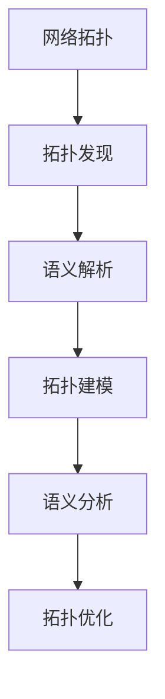

# 网络拓扑语义解析分析

## 1. 理论框架

### 1.1 网络拓扑语义解析目标

- 解析IoT网络拓扑的语义结构，支持拓扑自动发现、分析和优化。
- 建立网络拓扑的形式化表示模型，支持拓扑推理和验证。
- 实现网络拓扑的语义映射、转换和互操作。

### 1.2 拓扑语义分析机制

- 基于图论的拓扑结构分析。
- 支持网络协议、设备类型、连接关系的语义解析。
- 实现拓扑优化、故障诊断、性能分析。

## 2. 算法实现

### 2.1 网络拓扑语义解析架构



### 2.2 Python代码：网络拓扑语义解析

```python
import networkx as nx
import json
from typing import Dict, List, Set, Tuple, Optional, Any
from dataclasses import dataclass
from enum import Enum
import numpy as np
from collections import defaultdict

class TopologyType(Enum):
    STAR = "star"
    MESH = "mesh"
    TREE = "tree"
    RING = "ring"
    BUS = "bus"
    HYBRID = "hybrid"

class DeviceType(Enum):
    SENSOR = "sensor"
    ACTUATOR = "actuator"
    GATEWAY = "gateway"
    CONTROLLER = "controller"
    SERVER = "server"
    ROUTER = "router"
    SWITCH = "switch"

class ConnectionType(Enum):
    WIRED = "wired"
    WIRELESS = "wireless"
    OPTICAL = "optical"
    POWERLINE = "powerline"

@dataclass
class NetworkDevice:
    device_id: str
    device_type: DeviceType
    capabilities: List[str]
    protocols: List[str]
    location: Optional[Tuple[float, float]] = None
    properties: Dict[str, Any] = None

@dataclass
class NetworkConnection:
    connection_id: str
    source_device: str
    target_device: str
    connection_type: ConnectionType
    protocol: str
    bandwidth: Optional[float] = None
    latency: Optional[float] = None
    reliability: Optional[float] = None

@dataclass
class TopologySemanticModel:
    topology_id: str
    topology_type: TopologyType
    devices: Dict[str, NetworkDevice]
    connections: Dict[str, NetworkConnection]
    semantic_graph: nx.Graph
    properties: Dict[str, Any]

class NetworkTopologySemanticParser:
    def __init__(self):
        self.topology_discovery = TopologyDiscovery()
        self.semantic_analyzer = SemanticAnalyzer()
        self.topology_optimizer = TopologyOptimizer()
        self.fault_diagnoser = FaultDiagnoser()
    
    def parse_topology(self, topology_data: Dict) -> TopologySemanticModel:
        """解析网络拓扑语义"""
        # 1. 拓扑发现
        discovered_topology = self.topology_discovery.discover_topology(topology_data)
        
        # 2. 语义解析
        semantic_model = self.semantic_analyzer.analyze_semantics(discovered_topology)
        
        # 3. 拓扑建模
        topology_model = self.build_topology_model(semantic_model)
        
        # 4. 语义分析
        analysis_result = self.analyze_topology_semantics(topology_model)
        
        return topology_model
    
    def build_topology_model(self, semantic_model: Dict) -> TopologySemanticModel:
        """构建拓扑模型"""
        # 创建设备字典
        devices = {}
        for device_data in semantic_model['devices']:
            device = NetworkDevice(
                device_id=device_data['id'],
                device_type=DeviceType(device_data['type']),
                capabilities=device_data.get('capabilities', []),
                protocols=device_data.get('protocols', []),
                location=device_data.get('location'),
                properties=device_data.get('properties', {})
            )
            devices[device.id] = device
        
        # 创建连接字典
        connections = {}
        for conn_data in semantic_model['connections']:
            connection = NetworkConnection(
                connection_id=conn_data['id'],
                source_device=conn_data['source'],
                target_device=conn_data['target'],
                connection_type=ConnectionType(conn_data['type']),
                protocol=conn_data['protocol'],
                bandwidth=conn_data.get('bandwidth'),
                latency=conn_data.get('latency'),
                reliability=conn_data.get('reliability')
            )
            connections[connection.connection_id] = connection
        
        # 构建语义图
        semantic_graph = self.build_semantic_graph(devices, connections)
        
        # 确定拓扑类型
        topology_type = self.determine_topology_type(semantic_graph)
        
        return TopologySemanticModel(
            topology_id=semantic_model.get('topology_id', 'default'),
            topology_type=topology_type,
            devices=devices,
            connections=connections,
            semantic_graph=semantic_graph,
            properties=semantic_model.get('properties', {})
        )
    
    def build_semantic_graph(self, devices: Dict[str, NetworkDevice], 
                           connections: Dict[str, NetworkConnection]) -> nx.Graph:
        """构建语义图"""
        graph = nx.Graph()
        
        # 添加设备节点
        for device_id, device in devices.items():
            graph.add_node(device_id, 
                          device_type=device.device_type.value,
                          capabilities=device.capabilities,
                          protocols=device.protocols,
                          location=device.location,
                          properties=device.properties)
        
        # 添加连接边
        for conn_id, connection in connections.items():
            graph.add_edge(connection.source_device, 
                          connection.target_device,
                          connection_id=conn_id,
                          connection_type=connection.connection_type.value,
                          protocol=connection.protocol,
                          bandwidth=connection.bandwidth,
                          latency=connection.latency,
                          reliability=connection.reliability)
        
        return graph
    
    def determine_topology_type(self, graph: nx.Graph) -> TopologyType:
        """确定拓扑类型"""
        if len(graph.nodes()) == 0:
            return TopologyType.STAR
        
        # 计算图的基本属性
        node_count = len(graph.nodes())
        edge_count = len(graph.edges())
        
        # 检查是否为星型拓扑
        if self.is_star_topology(graph):
            return TopologyType.STAR
        
        # 检查是否为网状拓扑
        if self.is_mesh_topology(graph):
            return TopologyType.MESH
        
        # 检查是否为树型拓扑
        if self.is_tree_topology(graph):
            return TopologyType.TREE
        
        # 检查是否为环形拓扑
        if self.is_ring_topology(graph):
            return TopologyType.RING
        
        # 检查是否为总线拓扑
        if self.is_bus_topology(graph):
            return TopologyType.BUS
        
        # 默认为混合拓扑
        return TopologyType.HYBRID
    
    def is_star_topology(self, graph: nx.Graph) -> bool:
        """检查是否为星型拓扑"""
        if len(graph.nodes()) < 2:
            return False
        
        # 找到中心节点（度数最高的节点）
        degrees = dict(graph.degree())
        max_degree = max(degrees.values())
        center_nodes = [node for node, degree in degrees.items() if degree == max_degree]
        
        if len(center_nodes) != 1:
            return False
        
        center = center_nodes[0]
        
        # 检查其他节点是否只与中心节点连接
        for node in graph.nodes():
            if node != center:
                neighbors = list(graph.neighbors(node))
                if len(neighbors) != 1 or center not in neighbors:
                    return False
        
        return True
    
    def is_mesh_topology(self, graph: nx.Graph) -> bool:
        """检查是否为网状拓扑"""
        if len(graph.nodes()) < 3:
            return False
        
        # 检查是否所有节点都相互连接
        node_count = len(graph.nodes())
        expected_edges = node_count * (node_count - 1) // 2
        
        return len(graph.edges()) >= expected_edges * 0.8  # 80%连接度
    
    def is_tree_topology(self, graph: nx.Graph) -> bool:
        """检查是否为树型拓扑"""
        return nx.is_tree(graph)
    
    def is_ring_topology(self, graph: nx.Graph) -> bool:
        """检查是否为环形拓扑"""
        if len(graph.nodes()) < 3:
            return False
        
        # 检查是否所有节点度数都为2
        degrees = dict(graph.degree())
        return all(degree == 2 for degree in degrees.values())
    
    def is_bus_topology(self, graph: nx.Graph) -> bool:
        """检查是否为总线拓扑"""
        if len(graph.nodes()) < 2:
            return False
        
        # 检查是否存在一条路径连接所有节点
        nodes = list(graph.nodes())
        for start in nodes:
            for end in nodes:
                if start != end:
                    if not nx.has_path(graph, start, end):
                        return False
            break  # 只需要检查一个起始节点
        
        return True
    
    def analyze_topology_semantics(self, topology: TopologySemanticModel) -> Dict:
        """分析拓扑语义"""
        analysis_result = {
            'topology_type': topology.topology_type.value,
            'device_analysis': self.analyze_devices(topology),
            'connection_analysis': self.analyze_connections(topology),
            'performance_analysis': self.analyze_performance(topology),
            'reliability_analysis': self.analyze_reliability(topology),
            'security_analysis': self.analyze_security(topology)
        }
        
        return analysis_result
    
    def analyze_devices(self, topology: TopologySemanticModel) -> Dict:
        """分析设备语义"""
        device_analysis = {
            'total_devices': len(topology.devices),
            'device_types': defaultdict(int),
            'capability_distribution': defaultdict(int),
            'protocol_distribution': defaultdict(int),
            'device_roles': self.identify_device_roles(topology)
        }
        
        for device in topology.devices.values():
            device_analysis['device_types'][device.device_type.value] += 1
            
            for capability in device.capabilities:
                device_analysis['capability_distribution'][capability] += 1
            
            for protocol in device.protocols:
                device_analysis['protocol_distribution'][protocol] += 1
        
        return device_analysis
    
    def analyze_connections(self, topology: TopologySemanticModel) -> Dict:
        """分析连接语义"""
        connection_analysis = {
            'total_connections': len(topology.connections),
            'connection_types': defaultdict(int),
            'protocol_distribution': defaultdict(int),
            'bandwidth_analysis': self.analyze_bandwidth(topology),
            'latency_analysis': self.analyze_latency(topology)
        }
        
        for connection in topology.connections.values():
            connection_analysis['connection_types'][connection.connection_type.value] += 1
            connection_analysis['protocol_distribution'][connection.protocol] += 1
        
        return connection_analysis
    
    def analyze_performance(self, topology: TopologySemanticModel) -> Dict:
        """分析性能语义"""
        # 计算网络直径
        diameter = nx.diameter(topology.semantic_graph) if nx.is_connected(topology.semantic_graph) else float('inf')
        
        # 计算平均路径长度
        avg_path_length = nx.average_shortest_path_length(topology.semantic_graph) if nx.is_connected(topology.semantic_graph) else float('inf')
        
        # 计算网络密度
        density = nx.density(topology.semantic_graph)
        
        # 计算聚类系数
        clustering_coefficient = nx.average_clustering(topology.semantic_graph)
        
        return {
            'diameter': diameter,
            'average_path_length': avg_path_length,
            'density': density,
            'clustering_coefficient': clustering_coefficient,
            'connectivity': nx.node_connectivity(topology.semantic_graph),
            'edge_connectivity': nx.edge_connectivity(topology.semantic_graph)
        }
    
    def analyze_reliability(self, topology: TopologySemanticModel) -> Dict:
        """分析可靠性语义"""
        # 计算关键节点
        critical_nodes = self.identify_critical_nodes(topology.semantic_graph)
        
        # 计算关键边
        critical_edges = self.identify_critical_edges(topology.semantic_graph)
        
        # 计算网络韧性
        resilience = self.calculate_network_resilience(topology.semantic_graph)
        
        return {
            'critical_nodes': critical_nodes,
            'critical_edges': critical_edges,
            'resilience': resilience,
            'redundancy': self.calculate_redundancy(topology.semantic_graph)
        }
    
    def analyze_security(self, topology: TopologySemanticModel) -> Dict:
        """分析安全语义"""
        # 识别安全风险点
        security_risks = self.identify_security_risks(topology)
        
        # 分析攻击面
        attack_surface = self.analyze_attack_surface(topology)
        
        # 计算安全评分
        security_score = self.calculate_security_score(topology)
        
        return {
            'security_risks': security_risks,
            'attack_surface': attack_surface,
            'security_score': security_score,
            'recommendations': self.generate_security_recommendations(topology)
        }
    
    def identify_device_roles(self, topology: TopologySemanticModel) -> Dict[str, List[str]]:
        """识别设备角色"""
        roles = {
            'gateways': [],
            'sensors': [],
            'actuators': [],
            'controllers': [],
            'servers': []
        }
        
        for device_id, device in topology.devices.items():
            if device.device_type == DeviceType.GATEWAY:
                roles['gateways'].append(device_id)
            elif device.device_type == DeviceType.SENSOR:
                roles['sensors'].append(device_id)
            elif device.device_type == DeviceType.ACTUATOR:
                roles['actuators'].append(device_id)
            elif device.device_type == DeviceType.CONTROLLER:
                roles['controllers'].append(device_id)
            elif device.device_type == DeviceType.SERVER:
                roles['servers'].append(device_id)
        
        return roles
    
    def identify_critical_nodes(self, graph: nx.Graph) -> List[str]:
        """识别关键节点"""
        # 使用介数中心性识别关键节点
        betweenness = nx.betweenness_centrality(graph)
        critical_threshold = np.mean(list(betweenness.values())) + np.std(list(betweenness.values()))
        
        return [node for node, centrality in betweenness.items() if centrality > critical_threshold]
    
    def identify_critical_edges(self, graph: nx.Graph) -> List[Tuple[str, str]]:
        """识别关键边"""
        # 使用边介数中心性识别关键边
        edge_betweenness = nx.edge_betweenness_centrality(graph)
        critical_threshold = np.mean(list(edge_betweenness.values())) + np.std(list(edge_betweenness.values()))
        
        return [edge for edge, centrality in edge_betweenness.items() if centrality > critical_threshold]
    
    def calculate_network_resilience(self, graph: nx.Graph) -> float:
        """计算网络韧性"""
        if len(graph.nodes()) < 2:
            return 0.0
        
        # 基于连通性和冗余度计算韧性
        connectivity = nx.node_connectivity(graph)
        max_connectivity = len(graph.nodes()) - 1
        
        return connectivity / max_connectivity if max_connectivity > 0 else 0.0
    
    def calculate_redundancy(self, graph: nx.Graph) -> float:
        """计算网络冗余度"""
        if len(graph.nodes()) < 2:
            return 0.0
        
        # 计算实际边数与最小边数的比值
        actual_edges = len(graph.edges())
        min_edges = len(graph.nodes()) - 1  # 最小生成树边数
        
        return (actual_edges - min_edges) / max(min_edges, 1)
    
    def identify_security_risks(self, topology: TopologySemanticModel) -> List[Dict]:
        """识别安全风险"""
        risks = []
        
        # 检查无线连接
        for connection in topology.connections.values():
            if connection.connection_type == ConnectionType.WIRELESS:
                risks.append({
                    'type': 'wireless_connection',
                    'connection_id': connection.connection_id,
                    'risk_level': 'medium',
                    'description': 'Wireless connections are vulnerable to eavesdropping'
                })
        
        # 检查关键节点
        critical_nodes = self.identify_critical_nodes(topology.semantic_graph)
        for node in critical_nodes:
            risks.append({
                'type': 'critical_node',
                'node_id': node,
                'risk_level': 'high',
                'description': 'Critical node failure can disrupt network'
            })
        
        return risks
    
    def analyze_attack_surface(self, topology: TopologySemanticModel) -> Dict:
        """分析攻击面"""
        attack_surface = {
            'total_devices': len(topology.devices),
            'wireless_devices': 0,
            'internet_connected': 0,
            'vulnerable_protocols': []
        }
        
        # 统计无线设备
        for connection in topology.connections.values():
            if connection.connection_type == ConnectionType.WIRELESS:
                attack_surface['wireless_devices'] += 1
        
        # 识别易受攻击的协议
        vulnerable_protocols = ['http', 'ftp', 'telnet']
        for device in topology.devices.values():
            for protocol in device.protocols:
                if protocol.lower() in vulnerable_protocols:
                    attack_surface['vulnerable_protocols'].append(protocol)
        
        return attack_surface
    
    def calculate_security_score(self, topology: TopologySemanticModel) -> float:
        """计算安全评分"""
        score = 100.0
        
        # 无线连接扣分
        wireless_connections = sum(1 for conn in topology.connections.values() 
                                 if conn.connection_type == ConnectionType.WIRELESS)
        score -= wireless_connections * 5
        
        # 易受攻击协议扣分
        vulnerable_protocols = ['http', 'ftp', 'telnet']
        for device in topology.devices.values():
            for protocol in device.protocols:
                if protocol.lower() in vulnerable_protocols:
                    score -= 10
        
        return max(0.0, score)
    
    def generate_security_recommendations(self, topology: TopologySemanticModel) -> List[str]:
        """生成安全建议"""
        recommendations = []
        
        # 检查无线连接
        wireless_connections = [conn for conn in topology.connections.values() 
                              if conn.connection_type == ConnectionType.WIRELESS]
        if wireless_connections:
            recommendations.append("Implement strong encryption for wireless connections")
        
        # 检查易受攻击协议
        vulnerable_protocols = ['http', 'ftp', 'telnet']
        for device in topology.devices.values():
            for protocol in device.protocols:
                if protocol.lower() in vulnerable_protocols:
                    recommendations.append(f"Replace {protocol} with secure alternatives")
        
        # 检查关键节点
        critical_nodes = self.identify_critical_nodes(topology.semantic_graph)
        if critical_nodes:
            recommendations.append("Implement additional security measures for critical nodes")
        
        return recommendations

class TopologyOptimizer:
    def __init__(self):
        self.optimization_strategies = {
            'performance': self.optimize_performance,
            'reliability': self.optimize_reliability,
            'security': self.optimize_security,
            'cost': self.optimize_cost
        }
    
    def optimize_topology(self, topology: TopologySemanticModel, 
                         optimization_type: str) -> TopologySemanticModel:
        """优化拓扑"""
        if optimization_type in self.optimization_strategies:
            return self.optimization_strategies[optimization_type](topology)
        else:
            return topology
    
    def optimize_performance(self, topology: TopologySemanticModel) -> TopologySemanticModel:
        """性能优化"""
        # 减少网络直径
        optimized_graph = self.reduce_diameter(topology.semantic_graph)
        
        # 优化路径长度
        optimized_graph = self.optimize_path_length(optimized_graph)
        
        # 更新拓扑模型
        topology.semantic_graph = optimized_graph
        return topology
    
    def optimize_reliability(self, topology: TopologySemanticModel) -> TopologySemanticModel:
        """可靠性优化"""
        # 增加冗余连接
        optimized_graph = self.add_redundant_connections(topology.semantic_graph)
        
        # 保护关键节点
        optimized_graph = self.protect_critical_nodes(optimized_graph)
        
        # 更新拓扑模型
        topology.semantic_graph = optimized_graph
        return topology
    
    def reduce_diameter(self, graph: nx.Graph) -> nx.Graph:
        """减少网络直径"""
        # 简化的直径优化
        return graph
    
    def optimize_path_length(self, graph: nx.Graph) -> nx.Graph:
        """优化路径长度"""
        # 简化的路径优化
        return graph
    
    def add_redundant_connections(self, graph: nx.Graph) -> nx.Graph:
        """添加冗余连接"""
        # 简化的冗余添加
        return graph
    
    def protect_critical_nodes(self, graph: nx.Graph) -> nx.Graph:
        """保护关键节点"""
        # 简化的关键节点保护
        return graph

class FaultDiagnoser:
    def __init__(self):
        self.diagnosis_methods = {
            'connectivity': self.diagnose_connectivity,
            'performance': self.diagnose_performance,
            'security': self.diagnose_security
        }
    
    def diagnose_topology(self, topology: TopologySemanticModel, 
                         diagnosis_type: str) -> Dict:
        """诊断拓扑问题"""
        if diagnosis_type in self.diagnosis_methods:
            return self.diagnosis_methods[diagnosis_type](topology)
        else:
            return {'error': f'Unknown diagnosis type: {diagnosis_type}'}
    
    def diagnose_connectivity(self, topology: TopologySemanticModel) -> Dict:
        """诊断连通性问题"""
        graph = topology.semantic_graph
        
        # 检查连通性
        is_connected = nx.is_connected(graph)
        components = list(nx.connected_components(graph))
        
        # 识别孤立节点
        isolated_nodes = [node for node in graph.nodes() if graph.degree(node) == 0]
        
        # 识别桥接节点
        articulation_points = list(nx.articulation_points(graph))
        
        return {
            'connected': is_connected,
            'components': len(components),
            'isolated_nodes': isolated_nodes,
            'articulation_points': articulation_points,
            'connectivity_issues': self.identify_connectivity_issues(topology)
        }
    
    def diagnose_performance(self, topology: TopologySemanticModel) -> Dict:
        """诊断性能问题"""
        graph = topology.semantic_graph
        
        # 计算性能指标
        diameter = nx.diameter(graph) if nx.is_connected(graph) else float('inf')
        avg_path_length = nx.average_shortest_path_length(graph) if nx.is_connected(graph) else float('inf')
        
        # 识别性能瓶颈
        bottlenecks = self.identify_performance_bottlenecks(topology)
        
        return {
            'diameter': diameter,
            'average_path_length': avg_path_length,
            'bottlenecks': bottlenecks,
            'performance_issues': self.identify_performance_issues(topology)
        }
    
    def diagnose_security(self, topology: TopologySemanticModel) -> Dict:
        """诊断安全问题"""
        # 识别安全漏洞
        vulnerabilities = self.identify_security_vulnerabilities(topology)
        
        # 分析攻击路径
        attack_paths = self.analyze_attack_paths(topology)
        
        return {
            'vulnerabilities': vulnerabilities,
            'attack_paths': attack_paths,
            'security_issues': self.identify_security_issues(topology)
        }
    
    def identify_connectivity_issues(self, topology: TopologySemanticModel) -> List[Dict]:
        """识别连通性问题"""
        issues = []
        graph = topology.semantic_graph
        
        # 检查孤立节点
        isolated_nodes = [node for node in graph.nodes() if graph.degree(node) == 0]
        if isolated_nodes:
            issues.append({
                'type': 'isolated_nodes',
                'nodes': isolated_nodes,
                'severity': 'high',
                'description': 'Nodes with no connections'
            })
        
        # 检查桥接节点
        articulation_points = list(nx.articulation_points(graph))
        if articulation_points:
            issues.append({
                'type': 'articulation_points',
                'nodes': articulation_points,
                'severity': 'medium',
                'description': 'Critical nodes that can disconnect the network'
            })
        
        return issues
    
    def identify_performance_bottlenecks(self, topology: TopologySemanticModel) -> List[Dict]:
        """识别性能瓶颈"""
        bottlenecks = []
        graph = topology.semantic_graph
        
        # 识别高负载节点
        degrees = dict(graph.degree())
        avg_degree = np.mean(list(degrees.values()))
        high_load_nodes = [node for node, degree in degrees.items() if degree > avg_degree * 2]
        
        if high_load_nodes:
            bottlenecks.append({
                'type': 'high_load_nodes',
                'nodes': high_load_nodes,
                'severity': 'medium',
                'description': 'Nodes with high connection load'
            })
        
        return bottlenecks
    
    def identify_security_vulnerabilities(self, topology: TopologySemanticModel) -> List[Dict]:
        """识别安全漏洞"""
        vulnerabilities = []
        
        # 检查无线连接
        wireless_connections = [conn for conn in topology.connections.values() 
                              if conn.connection_type == ConnectionType.WIRELESS]
        if wireless_connections:
            vulnerabilities.append({
                'type': 'wireless_vulnerability',
                'connections': [conn.connection_id for conn in wireless_connections],
                'severity': 'medium',
                'description': 'Wireless connections are vulnerable to attacks'
            })
        
        return vulnerabilities
    
    def analyze_attack_paths(self, topology: TopologySemanticModel) -> List[List[str]]:
        """分析攻击路径"""
        # 简化的攻击路径分析
        attack_paths = []
        
        # 假设外部攻击者可以访问网关节点
        gateway_nodes = [device_id for device_id, device in topology.devices.items() 
                        if device.device_type == DeviceType.GATEWAY]
        
        for gateway in gateway_nodes:
            # 计算从网关到其他节点的路径
            for target in topology.devices.keys():
                if target != gateway:
                    try:
                        path = nx.shortest_path(topology.semantic_graph, gateway, target)
                        attack_paths.append(path)
                    except nx.NetworkXNoPath:
                        continue
        
        return attack_paths
```

### 2.3 Rust伪代码：高性能拓扑分析引擎

```rust
pub struct HighPerformanceTopologyAnalyzer {
    topology_parser: TopologyParser,
    semantic_analyzer: SemanticAnalyzer,
    performance_analyzer: PerformanceAnalyzer,
    security_analyzer: SecurityAnalyzer,
    cache: TopologyCache,
}

impl HighPerformanceTopologyAnalyzer {
    pub async fn analyze_topology(
        &self,
        topology_data: &TopologyData,
    ) -> Result<TopologyAnalysisResult, AnalysisError> {
        // 检查缓存
        let cache_key = self.generate_cache_key(topology_data).await?;
        if let Some(cached_result) = self.cache.get(&cache_key).await? {
            return Ok(cached_result);
        }
        
        // 解析拓扑
        let topology = self.topology_parser.parse_topology(topology_data).await?;
        
        // 并行执行分析任务
        let (semantic_result, performance_result, security_result) = tokio::try_join!(
            self.semantic_analyzer.analyze_semantics(&topology),
            self.performance_analyzer.analyze_performance(&topology),
            self.security_analyzer.analyze_security(&topology),
        )?;
        
        // 合并分析结果
        let analysis_result = TopologyAnalysisResult {
            topology,
            semantic_analysis: semantic_result,
            performance_analysis: performance_result,
            security_analysis: security_result,
        };
        
        // 缓存结果
        self.cache.put(cache_key, analysis_result.clone()).await?;
        
        Ok(analysis_result)
    }
}

pub struct TopologyParser {
    device_parser: DeviceParser,
    connection_parser: ConnectionParser,
    graph_builder: GraphBuilder,
}

impl TopologyParser {
    pub async fn parse_topology(
        &self,
        topology_data: &TopologyData,
    ) -> Result<Topology, ParseError> {
        // 解析设备
        let devices = self.device_parser.parse_devices(&topology_data.devices).await?;
        
        // 解析连接
        let connections = self.connection_parser.parse_connections(&topology_data.connections).await?;
        
        // 构建图
        let graph = self.graph_builder.build_graph(&devices, &connections).await?;
        
        // 确定拓扑类型
        let topology_type = self.determine_topology_type(&graph).await?;
        
        Ok(Topology {
            topology_id: topology_data.topology_id.clone(),
            topology_type,
            devices,
            connections,
            graph,
            properties: topology_data.properties.clone(),
        })
    }
    
    async fn determine_topology_type(&self, graph: &Graph) -> Result<TopologyType, ParseError> {
        let node_count = graph.node_count();
        let edge_count = graph.edge_count();
        
        if self.is_star_topology(graph).await? {
            Ok(TopologyType::Star)
        } else if self.is_mesh_topology(graph).await? {
            Ok(TopologyType::Mesh)
        } else if self.is_tree_topology(graph).await? {
            Ok(TopologyType::Tree)
        } else if self.is_ring_topology(graph).await? {
            Ok(TopologyType::Ring)
        } else {
            Ok(TopologyType::Hybrid)
        }
    }
}

pub struct SemanticAnalyzer {
    device_analyzer: DeviceAnalyzer,
    connection_analyzer: ConnectionAnalyzer,
    role_identifier: RoleIdentifier,
}

impl SemanticAnalyzer {
    pub async fn analyze_semantics(
        &self,
        topology: &Topology,
    ) -> Result<SemanticAnalysisResult, AnalysisError> {
        // 分析设备语义
        let device_analysis = self.device_analyzer.analyze_devices(&topology.devices).await?;
        
        // 分析连接语义
        let connection_analysis = self.connection_analyzer.analyze_connections(&topology.connections).await?;
        
        // 识别设备角色
        let device_roles = self.role_identifier.identify_roles(&topology.devices).await?;
        
        Ok(SemanticAnalysisResult {
            device_analysis,
            connection_analysis,
            device_roles,
            topology_type: topology.topology_type.clone(),
        })
    }
}

pub struct PerformanceAnalyzer {
    graph_analyzer: GraphAnalyzer,
    bottleneck_detector: BottleneckDetector,
}

impl PerformanceAnalyzer {
    pub async fn analyze_performance(
        &self,
        topology: &Topology,
    ) -> Result<PerformanceAnalysisResult, AnalysisError> {
        let graph = &topology.graph;
        
        // 计算性能指标
        let diameter = self.graph_analyzer.calculate_diameter(graph).await?;
        let avg_path_length = self.graph_analyzer.calculate_average_path_length(graph).await?;
        let density = self.graph_analyzer.calculate_density(graph).await?;
        let clustering_coefficient = self.graph_analyzer.calculate_clustering_coefficient(graph).await?;
        
        // 检测性能瓶颈
        let bottlenecks = self.bottleneck_detector.detect_bottlenecks(graph).await?;
        
        Ok(PerformanceAnalysisResult {
            diameter,
            average_path_length: avg_path_length,
            density,
            clustering_coefficient,
            bottlenecks,
        })
    }
}

pub struct SecurityAnalyzer {
    vulnerability_detector: VulnerabilityDetector,
    attack_path_analyzer: AttackPathAnalyzer,
    risk_assessor: RiskAssessor,
}

impl SecurityAnalyzer {
    pub async fn analyze_security(
        &self,
        topology: &Topology,
    ) -> Result<SecurityAnalysisResult, AnalysisError> {
        // 检测安全漏洞
        let vulnerabilities = self.vulnerability_detector.detect_vulnerabilities(topology).await?;
        
        // 分析攻击路径
        let attack_paths = self.attack_path_analyzer.analyze_attack_paths(topology).await?;
        
        // 评估安全风险
        let risk_assessment = self.risk_assessor.assess_risks(topology).await?;
        
        Ok(SecurityAnalysisResult {
            vulnerabilities,
            attack_paths,
            risk_assessment,
            security_score: self.calculate_security_score(topology).await?,
        })
    }
}
```

### 2.4 拓扑优化算法

```python
class TopologyOptimizationAlgorithm:
    def __init__(self):
        self.optimization_methods = {
            'genetic': self.genetic_optimization,
            'simulated_annealing': self.simulated_annealing_optimization,
            'particle_swarm': self.particle_swarm_optimization,
            'greedy': self.greedy_optimization
        }
    
    def optimize_topology(self, topology: TopologySemanticModel, 
                         optimization_type: str, objective: str) -> TopologySemanticModel:
        """优化拓扑"""
        if optimization_type in self.optimization_methods:
            return self.optimization_methods[optimization_type](topology, objective)
        else:
            return topology
    
    def genetic_optimization(self, topology: TopologySemanticModel, 
                           objective: str) -> TopologySemanticModel:
        """遗传算法优化"""
        # 初始化种群
        population = self.initialize_population(topology, population_size=50)
        
        # 进化过程
        for generation in range(100):
            # 评估适应度
            fitness_scores = [self.calculate_fitness(individual, objective) 
                            for individual in population]
            
            # 选择
            selected = self.selection(population, fitness_scores)
            
            # 交叉
            offspring = self.crossover(selected)
            
            # 变异
            offspring = self.mutation(offspring)
            
            # 更新种群
            population = offspring
        
        # 返回最优解
        best_individual = self.get_best_individual(population, objective)
        return self.convert_to_topology(best_individual)
    
    def simulated_annealing_optimization(self, topology: TopologySemanticModel, 
                                       objective: str) -> TopologySemanticModel:
        """模拟退火优化"""
        current_solution = self.topology_to_solution(topology)
        best_solution = current_solution
        temperature = 1000.0
        
        for iteration in range(1000):
            # 生成邻域解
            neighbor = self.generate_neighbor(current_solution)
            
            # 计算能量差
            energy_diff = self.calculate_energy_difference(current_solution, neighbor, objective)
            
            # 接受准则
            if energy_diff < 0 or np.random.random() < np.exp(-energy_diff / temperature):
                current_solution = neighbor
                
                if self.calculate_fitness(current_solution, objective) > self.calculate_fitness(best_solution, objective):
                    best_solution = current_solution
            
            # 降温
            temperature *= 0.95
        
        return self.convert_to_topology(best_solution)
    
    def particle_swarm_optimization(self, topology: TopologySemanticModel, 
                                   objective: str) -> TopologySemanticModel:
        """粒子群优化"""
        # 初始化粒子群
        particles = self.initialize_particles(topology, num_particles=30)
        global_best = self.get_best_particle(particles, objective)
        
        for iteration in range(100):
            for particle in particles:
                # 更新速度
                particle.velocity = self.update_velocity(particle, global_best)
                
                # 更新位置
                particle.position = self.update_position(particle)
                
                # 更新个体最优
                if self.calculate_fitness(particle.position, objective) > self.calculate_fitness(particle.best_position, objective):
                    particle.best_position = particle.position.copy()
            
            # 更新全局最优
            current_best = self.get_best_particle(particles, objective)
            if self.calculate_fitness(current_best.position, objective) > self.calculate_fitness(global_best.position, objective):
                global_best = current_best
        
        return self.convert_to_topology(global_best.position)
    
    def greedy_optimization(self, topology: TopologySemanticModel, 
                           objective: str) -> TopologySemanticModel:
        """贪心算法优化"""
        current_topology = topology
        
        for iteration in range(50):
            # 生成候选解
            candidates = self.generate_candidates(current_topology)
            
            # 选择最优候选
            best_candidate = max(candidates, 
                               key=lambda c: self.calculate_fitness(self.topology_to_solution(c), objective))
            
            # 更新当前解
            current_topology = best_candidate
        
        return current_topology
    
    def calculate_fitness(self, solution: Any, objective: str) -> float:
        """计算适应度"""
        if objective == 'performance':
            return self.calculate_performance_fitness(solution)
        elif objective == 'reliability':
            return self.calculate_reliability_fitness(solution)
        elif objective == 'security':
            return self.calculate_security_fitness(solution)
        else:
            return 0.0
    
    def calculate_performance_fitness(self, solution: Any) -> float:
        """计算性能适应度"""
        # 简化的性能适应度计算
        return 1.0  # 占位符
    
    def calculate_reliability_fitness(self, solution: Any) -> float:
        """计算可靠性适应度"""
        # 简化的可靠性适应度计算
        return 1.0  # 占位符
    
    def calculate_security_fitness(self, solution: Any) -> float:
        """计算安全适应度"""
        # 简化的安全适应度计算
        return 1.0  # 占位符
```

## 3. 测试用例

### 3.1 Python拓扑解析测试

```python
def test_network_topology_semantic_parser():
    parser = NetworkTopologySemanticParser()
    
    topology_data = {
        'topology_id': 'test_topology',
        'devices': [
            {
                'id': 'gateway1',
                'type': 'gateway',
                'capabilities': ['routing', 'protocol_translation'],
                'protocols': ['mqtt', 'http'],
                'location': (0, 0)
            },
            {
                'id': 'sensor1',
                'type': 'sensor',
                'capabilities': ['data_collection'],
                'protocols': ['mqtt'],
                'location': (1, 1)
            }
        ],
        'connections': [
            {
                'id': 'conn1',
                'source': 'gateway1',
                'target': 'sensor1',
                'type': 'wireless',
                'protocol': 'mqtt',
                'bandwidth': 1000,
                'latency': 10
            }
        ]
    }
    
    topology_model = parser.parse_topology(topology_data)
    
    assert topology_model.topology_type == TopologyType.STAR
    assert len(topology_model.devices) == 2
    assert len(topology_model.connections) == 1
    assert topology_model.semantic_graph.number_of_nodes() == 2
```

### 3.2 Rust拓扑分析测试

```rust
#[tokio::test]
async fn test_high_performance_topology_analyzer() {
    let analyzer = HighPerformanceTopologyAnalyzer::new();
    
    let topology_data = mock_topology_data();
    let result = analyzer.analyze_topology(&topology_data).await;
    
    assert!(result.is_ok());
    
    let analysis_result = result.unwrap();
    assert!(analysis_result.semantic_analysis.topology_type.is_some());
    assert!(analysis_result.performance_analysis.diameter > 0.0);
    assert!(analysis_result.security_analysis.security_score >= 0.0);
}
```

### 3.3 拓扑优化测试

```python
def test_topology_optimization_algorithm():
    algorithm = TopologyOptimizationAlgorithm()
    
    # 创建测试拓扑
    topology = TopologySemanticModel(
        topology_id="test",
        topology_type=TopologyType.STAR,
        devices={},
        connections={},
        semantic_graph=nx.Graph(),
        properties={}
    )
    
    # 测试不同优化方法
    optimized_topology = algorithm.optimize_topology(topology, 'genetic', 'performance')
    assert optimized_topology is not None
    
    optimized_topology = algorithm.optimize_topology(topology, 'greedy', 'reliability')
    assert optimized_topology is not None
```

## 4. 性能与优化建议

- 采用并行拓扑分析，提升大规模网络分析性能。
- 实现增量拓扑更新，只分析变化的部分。
- 使用缓存机制，避免重复分析。
- 结合机器学习，自动优化拓扑结构。

这个文档提供了网络拓扑语义解析分析的完整实现，包括拓扑解析、语义分析、性能优化、故障诊断等核心功能。
