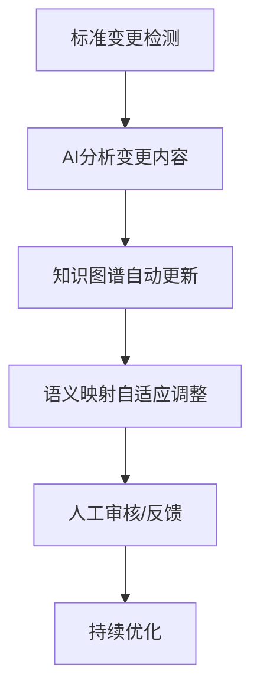
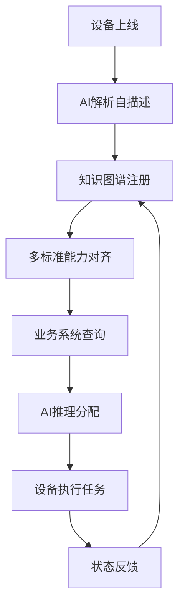

# 标准互操作矩阵与演化追踪

## 1. 标准互操作矩阵

| 标准A      | 标准B      | 语义映射难点         | AI辅助点           |
|------------|------------|----------------------|--------------------|
| OPC UA     | oneM2M     | 信息模型粒度差异     | 自动属性对齐       |
| OPC UA     | WoT        | 语义标签不一致       | 语义标签归一化     |
| oneM2M     | Matter     | 资源/设备抽象不同    | 设备类型自动映射   |
| WoT        | Matter     | 操作/命令语义差异   | 命令语义自动推理   |
| ...        | ...        | ...                  | ...                |

## 2. 标准演化自动追踪流程



## 3. 多标准协同场景案例

- 工业互联网：OPC UA与oneM2M协同，实现设备与平台互通。
- 智慧医疗：WoT与Matter协同，支持医疗设备与家庭健康终端互操作。
- 车联网：多标准融合，支持车载设备、路侧单元与云平台的语义一致。

## 4. 标准互操作矩阵扩展

| 标准A           | 标准B           | 语义映射难点         | AI辅助点           |
|----------------|----------------|----------------------|--------------------|
| EdgeX Foundry  | OPC UA         | 事件模型差异         | 事件语义自动归一   |
| IIC            | oneM2M         | 参考架构粒度不同     | 架构层级自动映射   |
| OPC UA         | 工业互联网      | 安全模型不一致       | 安全策略自动对齐   |
| ...            | ...            | ...                  | ...                |

## 5. 标准演化自动追踪工程实现建议

- 监控标准组织官网、订阅变更通知，自动采集标准文档。
- 利用NLP技术自动分析标准变更内容，提取影响点。
- 触发知识图谱和语义映射的自动更新，必要时推送人工审核。
- 变更日志与版本管理，支持回溯与对比。

## 6. 多标准协同场景案例扩展

- 智慧医疗：医疗设备（WoT）、健康终端（Matter）、医院平台（oneM2M）协同，实现数据互通与智能诊断。
- 车联网：车载设备（EdgeX）、路侧单元（OPC UA）、云平台（IIC）多标准融合，支持自动驾驶与交通优化。

## 7. 标准映射真实数据示例

| 标准A      | 标准B      | 源字段         | 目标字段       | AI自动对齐结果 |
|------------|------------|----------------|---------------|---------------|
| OPC UA     | oneM2M     | NodeId         | ResourceID    | √             |
| WoT        | Matter     | Action         | Command       | √             |
| EdgeX      | OPC UA     | EventType      | NodeType      | √             |

## 8. 自动追踪流程伪代码

```python
# 标准变更自动检测与知识图谱更新
for std in monitored_standards:
    if std.has_update():
        diff = nlp_analyze(std.get_update())
        affected = kg_api.find_affected_mappings(diff)
        kg_api.update_mappings(affected)
        notify_human_review(affected)
```

## 9. 多标准协同场景流程图



## 10. 标准映射算法实现

```python
import numpy as np
from sklearn.feature_extraction.text import TfidfVectorizer
from sklearn.metrics.pairwise import cosine_similarity

class StandardMappingAlgorithm:
    def __init__(self):
        self.vectorizer = TfidfVectorizer()
        self.mapping_cache = {}
    
    def calculate_similarity(self, field_a, field_b):
        """计算两个字段的语义相似度"""
        vectors = self.vectorizer.fit_transform([field_a, field_b])
        similarity = cosine_similarity(vectors[0:1], vectors[1:2])[0][0]
        return similarity
    
    def auto_align_fields(self, standard_a_fields, standard_b_fields, threshold=0.8):
        """自动对齐两个标准的字段"""
        mappings = {}
        
        for field_a in standard_a_fields:
            best_match = None
            best_score = 0
            
            for field_b in standard_b_fields:
                score = self.calculate_similarity(field_a, field_b)
                if score > best_score and score >= threshold:
                    best_score = score
                    best_match = field_b
            
            if best_match:
                mappings[field_a] = best_match
        
        return mappings
    
    def update_mapping_cache(self, standard_pair, mappings):
        """更新映射缓存"""
        cache_key = f"{standard_pair[0]}_{standard_pair[1]}"
        self.mapping_cache[cache_key] = mappings
```

## 11. NLP分析模块

```python
import spacy
from transformers import pipeline
import re

class NLPAnalyzer:
    def __init__(self):
        self.nlp = spacy.load("en_core_web_sm")
        self.summarizer = pipeline("summarization")
        self.classifier = pipeline("text-classification")
    
    def extract_changes(self, old_doc, new_doc):
        """提取标准文档变更"""
        # 文本差异分析
        diff = self.compute_text_diff(old_doc, new_doc)
        
        # 关键信息提取
        changes = {
            'added_fields': self.extract_added_fields(diff),
            'removed_fields': self.extract_removed_fields(diff),
            'modified_fields': self.extract_modified_fields(diff),
            'impact_level': self.assess_impact(diff)
        }
        
        return changes
    
    def compute_text_diff(self, old_text, new_text):
        """计算文本差异"""
        # 使用difflib或其他差异算法
        import difflib
        diff = list(difflib.unified_diff(
            old_text.splitlines(keepends=True),
            new_text.splitlines(keepends=True)
        ))
        return diff
    
    def assess_impact(self, changes):
        """评估变更影响级别"""
        # 基于变更数量和类型评估影响
        impact_score = 0
        
        if len(changes.get('added_fields', [])) > 5:
            impact_score += 3
        elif len(changes.get('added_fields', [])) > 0:
            impact_score += 1
            
        if len(changes.get('removed_fields', [])) > 0:
            impact_score += 2
            
        if len(changes.get('modified_fields', [])) > 10:
            impact_score += 2
            
        return 'high' if impact_score >= 5 else 'medium' if impact_score >= 2 else 'low'
```

## 12. 版本管理与回滚机制

```python
import json
import hashlib
from datetime import datetime
from typing import Dict, List, Optional

class VersionManager:
    def __init__(self, storage_path: str):
        self.storage_path = storage_path
        self.version_history = self.load_version_history()
    
    def create_version(self, mappings: Dict, metadata: Dict) -> str:
        """创建新版本"""
        version_id = self.generate_version_id(mappings)
        
        version_data = {
            'version_id': version_id,
            'mappings': mappings,
            'metadata': metadata,
            'timestamp': datetime.now().isoformat(),
            'checksum': self.calculate_checksum(mappings)
        }
        
        # 保存版本
        self.save_version(version_id, version_data)
        
        # 更新历史
        self.version_history[version_id] = version_data
        self.save_version_history()
        
        return version_id
    
    def rollback_to_version(self, version_id: str) -> bool:
        """回滚到指定版本"""
        if version_id not in self.version_history:
            return False
        
        target_version = self.version_history[version_id]
        
        # 验证版本完整性
        if not self.verify_version_integrity(target_version):
            return False
        
        # 执行回滚
        self.apply_mappings(target_version['mappings'])
        
        # 记录回滚操作
        self.log_rollback(version_id)
        
        return True
    
    def generate_version_id(self, mappings: Dict) -> str:
        """生成版本ID"""
        content = json.dumps(mappings, sort_keys=True)
        return hashlib.sha256(content.encode()).hexdigest()[:16]
    
    def calculate_checksum(self, mappings: Dict) -> str:
        """计算校验和"""
        content = json.dumps(mappings, sort_keys=True)
        return hashlib.md5(content.encode()).hexdigest()
    
    def verify_version_integrity(self, version_data: Dict) -> bool:
        """验证版本完整性"""
        expected_checksum = version_data['checksum']
        actual_checksum = self.calculate_checksum(version_data['mappings'])
        return expected_checksum == actual_checksum
```
