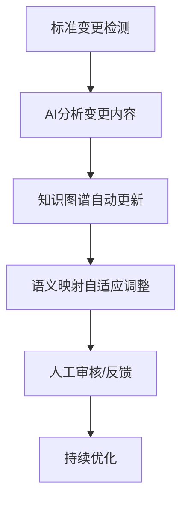

# 标准互操作矩阵与演化追踪

## 1. 标准互操作矩阵

| 标准A      | 标准B      | 语义映射难点         | AI辅助点           |
|------------|------------|----------------------|--------------------|
| OPC UA     | oneM2M     | 信息模型粒度差异     | 自动属性对齐       |
| OPC UA     | WoT        | 语义标签不一致       | 语义标签归一化     |
| oneM2M     | Matter     | 资源/设备抽象不同    | 设备类型自动映射   |
| WoT        | Matter     | 操作/命令语义差异   | 命令语义自动推理   |
| ...        | ...        | ...                  | ...                |

## 2. 标准演化自动追踪流程

## 3. 多标准协同场景案例

- 工业互联网：OPC UA与oneM2M协同，实现设备与平台互通。
- 智慧医疗：WoT与Matter协同，支持医疗设备与家庭健康终端互操作。
- 车联网：多标准融合，支持车载设备、路侧单元与云平台的语义一致。

## 4. 标准互操作矩阵扩展

| 标准A           | 标准B           | 语义映射难点         | AI辅助点           |
|----------------|----------------|----------------------|--------------------|
| EdgeX Foundry  | OPC UA         | 事件模型差异         | 事件语义自动归一   |
| IIC            | oneM2M         | 参考架构粒度不同     | 架构层级自动映射   |
| OPC UA         | 工业互联网      | 安全模型不一致       | 安全策略自动对齐   |
| ...            | ...            | ...                  | ...                |

## 5. 标准演化自动追踪工程实现建议

- 监控标准组织官网、订阅变更通知，自动采集标准文档。
- 利用NLP技术自动分析标准变更内容，提取影响点。
- 触发知识图谱和语义映射的自动更新，必要时推送人工审核。
- 变更日志与版本管理，支持回溯与对比。

## 6. 多标准协同场景案例扩展

- 智慧医疗：医疗设备（WoT）、健康终端（Matter）、医院平台（oneM2M）协同，实现数据互通与智能诊断。
- 车联网：车载设备（EdgeX）、路侧单元（OPC UA）、云平台（IIC）多标准融合，支持自动驾驶与交通优化。
