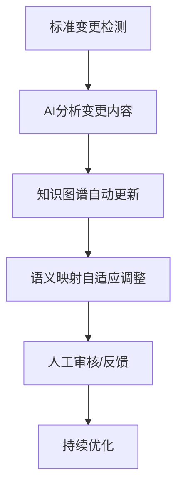

# 标准互操作矩阵与演化追踪

## 1. 标准互操作矩阵

| 标准A      | 标准B      | 语义映射难点         | AI辅助点           |
|------------|------------|----------------------|--------------------|
| OPC UA     | oneM2M     | 信息模型粒度差异     | 自动属性对齐       |
| OPC UA     | WoT        | 语义标签不一致       | 语义标签归一化     |
| oneM2M     | Matter     | 资源/设备抽象不同    | 设备类型自动映射   |
| WoT        | Matter     | 操作/命令语义差异   | 命令语义自动推理   |
| ...        | ...        | ...                  | ...                |

## 2. 标准演化自动追踪流程

## 3. 多标准协同场景案例

- 工业互联网：OPC UA与oneM2M协同，实现设备与平台互通。
- 智慧医疗：WoT与Matter协同，支持医疗设备与家庭健康终端互操作。
- 车联网：多标准融合，支持车载设备、路侧单元与云平台的语义一致。
