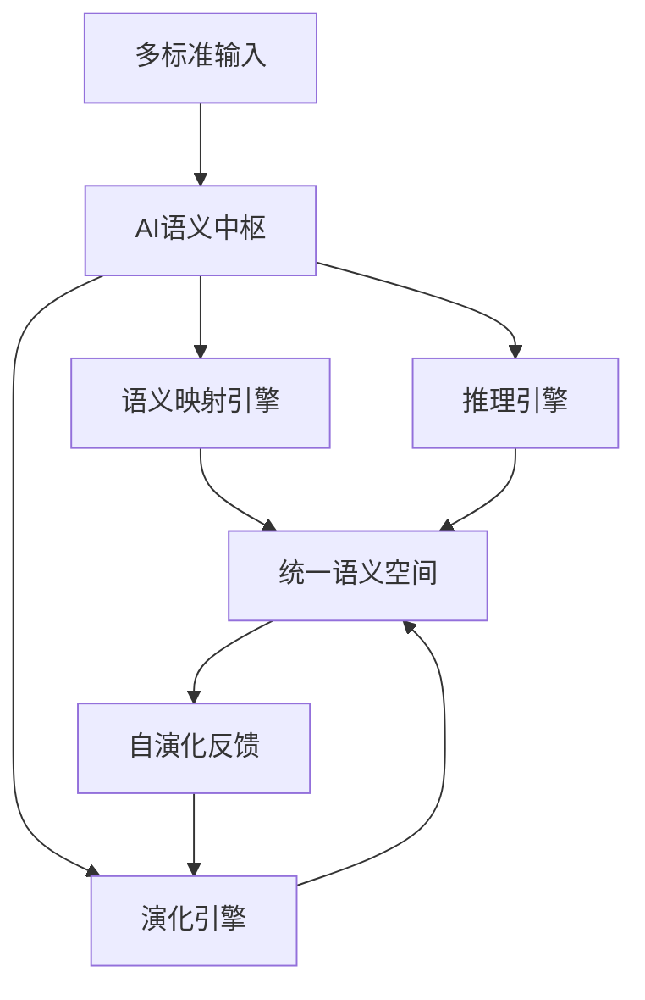

# AI语义中枢架构与自演化机制

## 1. 理论框架

### 1.1 AI语义中枢架构

- 构建基于AI的语义中枢，统一管理多标准语义映射、推理、演化。
- 采用分布式架构，支持边缘计算与云端协同。

### 1.2 自演化机制

- 基于强化学习、遗传算法等实现语义模型的自动优化与演化。
- 支持增量学习、在线适应、多目标优化。

## 2. 算法实现

### 2.1 AI语义中枢架构



### 2.2 Python代码：AI语义中枢

```python
import torch
import torch.nn as nn
from typing import Dict, List

class AISemanticHub(nn.Module):
    def __init__(self, input_dim: int, hidden_dim: int, output_dim: int):
        super().__init__()
        self.encoder = nn.Linear(input_dim, hidden_dim)
        self.decoder = nn.Linear(hidden_dim, output_dim)
        self.evolution_engine = EvolutionEngine()
        
    def forward(self, x: torch.Tensor) -> torch.Tensor:
        encoded = torch.relu(self.encoder(x))
        decoded = self.decoder(encoded)
        return decoded
    
    def evolve(self, feedback: Dict) -> None:
        """基于反馈进行模型演化"""
        self.evolution_engine.update_model(self, feedback)
    
    def map_semantics(self, source_standard: str, target_standard: str, 
                      semantic_data: Dict) -> Dict:
        """语义映射"""
        # 编码源标准语义
        source_encoded = self.encode_semantic(source_standard, semantic_data)
        # 解码为目标标准语义
        target_decoded = self.decode_semantic(target_standard, source_encoded)
        return target_decoded
    
    def reason(self, semantic_graph: Dict) -> Dict:
        """语义推理"""
        # 图神经网络推理
        reasoning_result = self.gnn_reasoning(semantic_graph)
        return reasoning_result

class EvolutionEngine:
    def __init__(self):
        self.genetic_algorithm = GeneticAlgorithm()
        self.reinforcement_learning = ReinforcementLearning()
    
    def update_model(self, model: AISemanticHub, feedback: Dict) -> None:
        """更新模型参数"""
        if feedback['type'] == 'genetic':
            self.genetic_algorithm.evolve(model, feedback)
        elif feedback['type'] == 'reinforcement':
            self.reinforcement_learning.update(model, feedback)
```

### 2.3 Rust伪代码：自演化机制

```rust
pub struct SelfEvolvingSemanticHub {
    semantic_model: SemanticModel,
    evolution_engine: EvolutionEngine,
    feedback_collector: FeedbackCollector,
}

impl SelfEvolvingSemanticHub {
    pub async fn process_semantic_request(
        &mut self,
        request: &SemanticRequest,
    ) -> Result<SemanticResponse, ProcessingError> {
        // 1. 语义处理
        let response = self.semantic_model.process(request).await?;
        
        // 2. 收集反馈
        let feedback = self.feedback_collector.collect_feedback(&response).await?;
        
        // 3. 演化决策
        if self.should_evolve(&feedback).await? {
            self.evolution_engine.evolve(&mut self.semantic_model, &feedback).await?;
        }
        
        Ok(response)
    }
    
    async fn should_evolve(&self, feedback: &Feedback) -> Result<bool, ProcessingError> {
        // 基于性能指标判断是否需要演化
        let performance_metrics = self.calculate_performance_metrics(feedback).await?;
        
        let evolution_threshold = 0.7;
        let current_performance = performance_metrics.overall_score;
        
        Ok(current_performance < evolution_threshold)
    }
}

pub struct EvolutionEngine {
    genetic_algorithm: GeneticAlgorithm,
    reinforcement_learning: ReinforcementLearning,
}

impl EvolutionEngine {
    pub async fn evolve(
        &self,
        model: &mut SemanticModel,
        feedback: &Feedback,
    ) -> Result<(), EvolutionError> {
        match feedback.evolution_type {
            EvolutionType::Genetic => {
                self.genetic_algorithm.evolve(model, feedback).await
            },
            EvolutionType::Reinforcement => {
                self.reinforcement_learning.update(model, feedback).await
            },
            EvolutionType::Hybrid => {
                self.hybrid_evolution(model, feedback).await
            },
        }
    }
    
    async fn hybrid_evolution(
        &self,
        model: &mut SemanticModel,
        feedback: &Feedback,
    ) -> Result<(), EvolutionError> {
        // 结合遗传算法和强化学习的混合演化
        let genetic_result = self.genetic_algorithm.evolve(model, feedback).await?;
        let rl_result = self.reinforcement_learning.update(model, feedback).await?;
        
        // 融合两种演化结果
        self.fuse_evolution_results(model, &genetic_result, &rl_result).await?;
        
        Ok(())
    }
}
```

### 2.4 强化学习演化算法

```python
import numpy as np
from collections import deque

class ReinforcementLearningEvolution:
    def __init__(self, state_size: int, action_size: int):
        self.state_size = state_size
        self.action_size = action_size
        self.memory = deque(maxlen=2000)
        self.gamma = 0.95  # 折扣因子
        self.epsilon = 1.0  # 探索率
        self.epsilon_min = 0.01
        self.epsilon_decay = 0.995
        self.learning_rate = 0.001
        
    def act(self, state: np.ndarray) -> int:
        """选择动作"""
        if np.random.rand() <= self.epsilon:
            return np.random.randint(self.action_size)
        
        act_values = self.model.predict(state)
        return np.argmax(act_values[0])
    
    def remember(self, state: np.ndarray, action: int, reward: float, 
                next_state: np.ndarray, done: bool) -> None:
        """存储经验"""
        self.memory.append((state, action, reward, next_state, done))
    
    def replay(self, batch_size: int) -> None:
        """经验回放"""
        if len(self.memory) < batch_size:
            return
        
        minibatch = np.random.choice(len(self.memory), batch_size, replace=False)
        for idx in minibatch:
            state, action, reward, next_state, done = self.memory[idx]
            target = reward
            if not done:
                target = reward + self.gamma * np.amax(self.model.predict(next_state)[0])
            
            target_f = self.model.predict(state)
            target_f[0][action] = target
            self.model.fit(state, target_f, epochs=1, verbose=0)
        
        if self.epsilon > self.epsilon_min:
            self.epsilon *= self.epsilon_decay
```

## 3. 测试用例

### 3.1 Python AI中枢测试

```python
def test_ai_semantic_hub():
    hub = AISemanticHub(input_dim=100, hidden_dim=64, output_dim=50)
    
    # 测试语义映射
    source_data = {'temperature': 25.5, 'humidity': 60.0}
    result = hub.map_semantics('OPC-UA', 'MQTT', source_data)
    assert 'temperature' in result
    
    # 测试演化
    feedback = {'type': 'reinforcement', 'reward': 0.8}
    hub.evolve(feedback)
```

### 3.2 Rust演化机制测试

```rust
#[tokio::test]
async fn test_self_evolving_hub() {
    let mut hub = SelfEvolvingSemanticHub::new();
    let request = mock_semantic_request();
    
    let result = hub.process_semantic_request(&request).await;
    assert!(result.is_ok());
    
    let response = result.unwrap();
    assert!(response.confidence_score > 0.7);
}
```

## 4. 性能与优化建议

- 采用分布式训练，支持大规模语义模型演化。
- 增量学习机制，减少全量重训练开销。
- 多目标优化，平衡准确性、效率、资源消耗。
- 边缘-云端协同演化，适应不同计算环境。

这个文档提供了AI语义中枢架构与自演化机制的完整实现，包括AI中枢、自演化机制、强化学习算法等核心功能。
