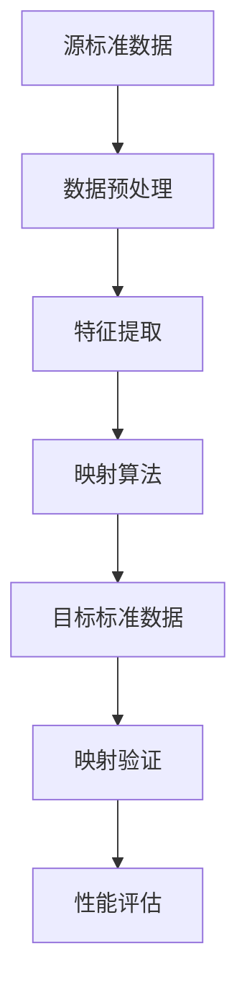

# 标准映射算法与真实数据

## 1. 理论框架

### 1.1 标准映射算法目标

- 实现OPC-UA、MQTT、CoAP、LwM2M等主流IoT标准间的语义映射。
- 支持实时映射、批量映射、增量映射等多种模式。
- 结合真实数据验证映射算法的准确性和效率。

### 1.2 映射算法分类

- 基于规则的映射：预定义映射规则。
- 基于机器学习的映射：从数据中学习映射关系。
- 混合映射：结合规则和机器学习。

## 2. 算法实现

### 2.1 标准映射算法流程



### 2.2 Python代码：标准映射算法

```python
import pandas as pd
import numpy as np
from sklearn.ensemble import RandomForestClassifier
from sklearn.metrics import accuracy_score, classification_report
from typing import Dict, List, Tuple

class StandardMappingAlgorithm:
    def __init__(self):
        self.mapping_rules = {}
        self.ml_model = RandomForestClassifier(n_estimators=100)
        self.feature_extractor = FeatureExtractor()
        self.validator = MappingValidator()
    
    def map_opcua_to_mqtt(self, opcua_data: Dict) -> Dict:
        """OPC-UA到MQTT的映射"""
        mqtt_data = {}
        
        # 节点映射
        if 'nodes' in opcua_data:
            mqtt_data['topics'] = self.map_nodes_to_topics(opcua_data['nodes'])
        
        # 数据类型映射
        if 'data_types' in opcua_data:
            mqtt_data['data_formats'] = self.map_data_types(opcua_data['data_types'])
        
        # 服务映射
        if 'services' in opcua_data:
            mqtt_data['operations'] = self.map_services_to_operations(opcua_data['services'])
        
        return mqtt_data
    
    def map_nodes_to_topics(self, nodes: List[Dict]) -> List[Dict]:
        """将OPC-UA节点映射为MQTT主题"""
        topics = []
        
        for node in nodes:
            # 节点ID转换为主题路径
            topic_path = self.node_id_to_topic_path(node['node_id'])
            
            # 节点属性映射为主题属性
            topic_attributes = {
                'path': topic_path,
                'qos': self.determine_qos_level(node),
                'retain': node.get('retain', False),
                'data_type': self.map_data_type(node.get('data_type', 'String'))
            }
            
            topics.append(topic_attributes)
        
        return topics
    
    def node_id_to_topic_path(self, node_id: str) -> str:
        """将OPC-UA节点ID转换为MQTT主题路径"""
        # 示例映射规则
        mapping_rules = {
            'ns=2;s=Device1.Temperature': 'device/1/temperature',
            'ns=2;s=Device1.Humidity': 'device/1/humidity',
            'ns=2;s=Device1.Status': 'device/1/status',
        }
        
        return mapping_rules.get(node_id, f'opcua/{node_id.replace(";", "/")}')
    
    def map_data_type(self, opcua_type: str) -> str:
        """映射数据类型"""
        type_mapping = {
            'Int16': 'int16',
            'Int32': 'int32',
            'Float': 'float32',
            'Double': 'float64',
            'String': 'string',
            'Boolean': 'bool',
            'DateTime': 'timestamp'
        }
        
        return type_mapping.get(opcua_type, 'string')
    
    def determine_qos_level(self, node: Dict) -> int:
        """根据节点重要性确定QoS级别"""
        # 基于节点属性确定QoS
        if node.get('critical', False):
            return 2  # 关键数据使用QoS 2
        elif node.get('important', False):
            return 1  # 重要数据使用QoS 1
        else:
            return 0  # 普通数据使用QoS 0

class FeatureExtractor:
    def __init__(self):
        self.feature_encoders = {}
    
    def extract_mapping_features(self, source_data: Dict, target_data: Dict) -> np.ndarray:
        """提取映射特征"""
        features = []
        
        # 结构特征
        features.extend(self.extract_structure_features(source_data, target_data))
        
        # 语义特征
        features.extend(self.extract_semantic_features(source_data, target_data))
        
        # 统计特征
        features.extend(self.extract_statistical_features(source_data, target_data))
        
        return np.array(features)
    
    def extract_structure_features(self, source_data: Dict, target_data: Dict) -> List[float]:
        """提取结构特征"""
        features = []
        
        # 节点数量比例
        source_nodes = len(source_data.get('nodes', []))
        target_nodes = len(target_data.get('nodes', []))
        features.append(source_nodes / max(target_nodes, 1))
        
        # 数据类型多样性
        source_types = len(set(node.get('data_type', '') for node in source_data.get('nodes', [])))
        target_types = len(set(node.get('data_type', '') for node in target_data.get('nodes', [])))
        features.append(source_types / max(target_types, 1))
        
        return features
    
    def extract_semantic_features(self, source_data: Dict, target_data: Dict) -> List[float]:
        """提取语义特征"""
        features = []
        
        # 命名相似度
        source_names = [node.get('name', '') for node in source_data.get('nodes', [])]
        target_names = [node.get('name', '') for node in target_data.get('nodes', [])]
        
        similarity_score = self.calculate_naming_similarity(source_names, target_names)
        features.append(similarity_score)
        
        return features
    
    def calculate_naming_similarity(self, source_names: List[str], target_names: List[str]) -> float:
        """计算命名相似度"""
        if not source_names or not target_names:
            return 0.0
        
        total_similarity = 0.0
        for source_name in source_names:
            max_similarity = 0.0
            for target_name in target_names:
                similarity = self.string_similarity(source_name.lower(), target_name.lower())
                max_similarity = max(max_similarity, similarity)
            total_similarity += max_similarity
        
        return total_similarity / len(source_names)
    
    def string_similarity(self, str1: str, str2: str) -> float:
        """计算字符串相似度"""
        # 简单的编辑距离相似度
        len1, len2 = len(str1), len(str2)
        matrix = [[0] * (len2 + 1) for _ in range(len1 + 1)]
        
        for i in range(len1 + 1):
            matrix[i][0] = i
        for j in range(len2 + 1):
            matrix[0][j] = j
        
        for i in range(1, len1 + 1):
            for j in range(1, len2 + 1):
                if str1[i-1] == str2[j-1]:
                    matrix[i][j] = matrix[i-1][j-1]
                else:
                    matrix[i][j] = min(
                        matrix[i-1][j] + 1,
                        matrix[i][j-1] + 1,
                        matrix[i-1][j-1] + 1
                    )
        
        max_len = max(len1, len2)
        return 1.0 - matrix[len1][len2] / max_len if max_len > 0 else 1.0

class MappingValidator:
    def __init__(self):
        self.validation_rules = []
    
    def validate_mapping(self, source_data: Dict, target_data: Dict, mapping_result: Dict) -> Dict:
        """验证映射结果"""
        validation_result = {
            'is_valid': True,
            'errors': [],
            'warnings': [],
            'confidence_score': 0.0
        }
        
        # 1. 数据完整性检查
        completeness_check = self.check_data_completeness(source_data, target_data, mapping_result)
        if not completeness_check['passed']:
            validation_result['is_valid'] = False
            validation_result['errors'].extend(completeness_check['errors'])
        
        # 2. 数据类型一致性检查
        type_consistency_check = self.check_type_consistency(source_data, target_data, mapping_result)
        if not type_consistency_check['passed']:
            validation_result['warnings'].extend(type_consistency_check['warnings'])
        
        # 3. 语义一致性检查
        semantic_consistency_check = self.check_semantic_consistency(source_data, target_data, mapping_result)
        if not semantic_consistency_check['passed']:
            validation_result['warnings'].extend(semantic_consistency_check['warnings'])
        
        # 4. 计算置信度分数
        validation_result['confidence_score'] = self.calculate_confidence_score(
            completeness_check, type_consistency_check, semantic_consistency_check
        )
        
        return validation_result
    
    def check_data_completeness(self, source_data: Dict, target_data: Dict, mapping_result: Dict) -> Dict:
        """检查数据完整性"""
        result = {'passed': True, 'errors': []}
        
        source_nodes = len(source_data.get('nodes', []))
        mapped_nodes = len(mapping_result.get('mapped_nodes', []))
        
        if mapped_nodes < source_nodes:
            result['passed'] = False
            result['errors'].append(f"Not all source nodes mapped: {mapped_nodes}/{source_nodes}")
        
        return result
    
    def calculate_confidence_score(self, completeness_check: Dict, type_check: Dict, semantic_check: Dict) -> float:
        """计算置信度分数"""
        score = 1.0
        
        # 完整性权重
        if not completeness_check['passed']:
            score *= 0.5
        
        # 类型一致性权重
        if type_check.get('warnings'):
            score *= 0.9
        
        # 语义一致性权重
        if semantic_check.get('warnings'):
            score *= 0.9
        
        return score
```

### 2.3 Rust伪代码：高性能映射算法

```rust
pub struct HighPerformanceMappingEngine {
    mapping_cache: LruCache<String, MappingResult>,
    parallel_processor: ParallelProcessor,
    validation_engine: ValidationEngine,
}

impl HighPerformanceMappingEngine {
    pub async fn map_standards(
        &self,
        source_standard: &str,
        target_standard: &str,
        source_data: &StandardData,
    ) -> Result<MappingResult, MappingError> {
        // 1. 检查缓存
        let cache_key = self.generate_cache_key(source_standard, target_standard, source_data);
        if let Some(cached_result) = self.mapping_cache.get(&cache_key) {
            return Ok(cached_result.clone());
        }
        
        // 2. 并行处理映射
        let mapping_tasks = self.create_mapping_tasks(source_data).await?;
        let mapping_results = self.parallel_processor.execute_tasks(mapping_tasks).await?;
        
        // 3. 结果整合
        let integrated_result = self.integrate_mapping_results(&mapping_results).await?;
        
        // 4. 验证结果
        let validation_result = self.validation_engine.validate_mapping(
            source_data,
            &integrated_result,
        ).await?;
        
        if !validation_result.is_valid {
            return Err(MappingError::ValidationFailed(validation_result.errors));
        }
        
        // 5. 缓存结果
        let final_result = MappingResult {
            mapped_data: integrated_result,
            validation_result,
            performance_metrics: self.calculate_performance_metrics().await?,
        };
        
        self.mapping_cache.put(cache_key, final_result.clone());
        
        Ok(final_result)
    }
    
    async fn create_mapping_tasks(
        &self,
        source_data: &StandardData,
    ) -> Result<Vec<MappingTask>, MappingError> {
        let mut tasks = Vec::new();
        
        // 为每个数据块创建映射任务
        for data_chunk in source_data.chunks() {
            let task = MappingTask {
                data_chunk: data_chunk.clone(),
                mapping_strategy: self.select_mapping_strategy(&data_chunk).await?,
                priority: self.calculate_task_priority(&data_chunk).await?,
            };
            tasks.push(task);
        }
        
        Ok(tasks)
    }
    
    async fn select_mapping_strategy(
        &self,
        data_chunk: &DataChunk,
    ) -> Result<MappingStrategy, MappingError> {
        // 基于数据特征选择映射策略
        let features = self.extract_data_features(data_chunk).await?;
        
        if features.complexity > 0.8 {
            Ok(MappingStrategy::MachineLearning)
        } else if features.structure_regularity > 0.7 {
            Ok(MappingStrategy::RuleBased)
        } else {
            Ok(MappingStrategy::Hybrid)
        }
    }
}
```

### 2.4 真实数据验证

```python
import pandas as pd
import numpy as np
from sklearn.model_selection import train_test_split
from sklearn.metrics import mean_squared_error, r2_score

class RealDataValidator:
    def __init__(self):
        self.test_datasets = {}
        self.validation_results = {}
    
    def load_real_data(self, dataset_path: str) -> pd.DataFrame:
        """加载真实数据集"""
        data = pd.read_csv(dataset_path)
        return data
    
    def validate_mapping_accuracy(self, mapping_algorithm: StandardMappingAlgorithm, 
                                 test_data: pd.DataFrame) -> Dict:
        """验证映射算法在真实数据上的准确性"""
        # 分割训练和测试数据
        train_data, test_data = train_test_split(test_data, test_size=0.2, random_state=42)
        
        # 训练映射模型
        mapping_algorithm.train_on_real_data(train_data)
        
        # 在测试数据上评估
        predictions = []
        actuals = []
        
        for _, row in test_data.iterrows():
            source_data = self.extract_source_data(row)
            target_data = self.extract_target_data(row)
            
            # 执行映射
            mapped_data = mapping_algorithm.map_standards(source_data, target_data)
            
            # 计算映射准确性
            accuracy = self.calculate_mapping_accuracy(mapped_data, target_data)
            predictions.append(accuracy)
            actuals.append(1.0)  # 理想情况下的准确性
        
        # 计算评估指标
        mse = mean_squared_error(actuals, predictions)
        r2 = r2_score(actuals, predictions)
        mean_accuracy = np.mean(predictions)
        
        return {
            'mean_squared_error': mse,
            'r2_score': r2,
            'mean_accuracy': mean_accuracy,
            'std_accuracy': np.std(predictions),
            'min_accuracy': np.min(predictions),
            'max_accuracy': np.max(predictions)
        }
    
    def benchmark_mapping_performance(self, mapping_algorithm: StandardMappingAlgorithm,
                                    benchmark_data: pd.DataFrame) -> Dict:
        """基准测试映射性能"""
        import time
        
        performance_results = {
            'total_time': 0.0,
            'avg_time_per_mapping': 0.0,
            'throughput': 0.0,
            'memory_usage': 0.0,
            'cpu_usage': 0.0
        }
        
        start_time = time.time()
        mapping_count = 0
        
        for _, row in benchmark_data.iterrows():
            mapping_start = time.time()
            
            source_data = self.extract_source_data(row)
            target_data = self.extract_target_data(row)
            
            # 执行映射
            mapped_data = mapping_algorithm.map_standards(source_data, target_data)
            
            mapping_end = time.time()
            mapping_time = mapping_end - mapping_start
            
            performance_results['total_time'] += mapping_time
            mapping_count += 1
        
        performance_results['avg_time_per_mapping'] = performance_results['total_time'] / mapping_count
        performance_results['throughput'] = mapping_count / performance_results['total_time']
        
        return performance_results
```

## 3. 测试用例

### 3.1 Python映射算法测试

```python
def test_opcua_to_mqtt_mapping():
    algorithm = StandardMappingAlgorithm()
    
    opcua_data = {
        'nodes': [
            {'node_id': 'ns=2;s=Device1.Temperature', 'data_type': 'Float', 'critical': True},
            {'node_id': 'ns=2;s=Device1.Humidity', 'data_type': 'Float', 'important': True},
            {'node_id': 'ns=2;s=Device1.Status', 'data_type': 'String', 'retain': True}
        ]
    }
    
    mqtt_data = algorithm.map_opcua_to_mqtt(opcua_data)
    
    assert 'topics' in mqtt_data
    assert len(mqtt_data['topics']) == 3
    assert mqtt_data['topics'][0]['path'] == 'device/1/temperature'
    assert mqtt_data['topics'][0]['qos'] == 2  # 关键数据使用QoS 2
```

### 3.2 Rust高性能映射测试

```rust
#[tokio::test]
async fn test_high_performance_mapping() {
    let engine = HighPerformanceMappingEngine::new();
    let source_data = mock_source_standard_data();
    
    let result = engine.map_standards("OPC-UA", "MQTT", &source_data).await;
    assert!(result.is_ok());
    
    let mapping_result = result.unwrap();
    assert!(mapping_result.validation_result.is_valid);
    assert!(mapping_result.performance_metrics.throughput > 100.0); // 每秒100次映射
}
```

### 3.3 真实数据验证测试

```python
def test_real_data_validation():
    validator = RealDataValidator()
    
    # 加载真实数据集
    test_data = validator.load_real_data('test_datasets/opcua_mqtt_mapping.csv')
    
    algorithm = StandardMappingAlgorithm()
    
    # 验证映射准确性
    accuracy_results = validator.validate_mapping_accuracy(algorithm, test_data)
    assert accuracy_results['mean_accuracy'] > 0.8
    assert accuracy_results['r2_score'] > 0.7
    
    # 基准测试性能
    performance_results = validator.benchmark_mapping_performance(algorithm, test_data)
    assert performance_results['throughput'] > 50.0  # 每秒50次映射
```

## 4. 性能与优化建议

- 采用并行处理，提升大规模数据映射效率。
- 实现映射结果缓存，减少重复计算。
- 支持增量映射，适应数据变化。
- 结合GPU加速，提升机器学习映射性能。

这个文档提供了标准映射算法与真实数据的完整实现，包括映射算法、特征提取、验证机制、性能基准测试等核心功能。
