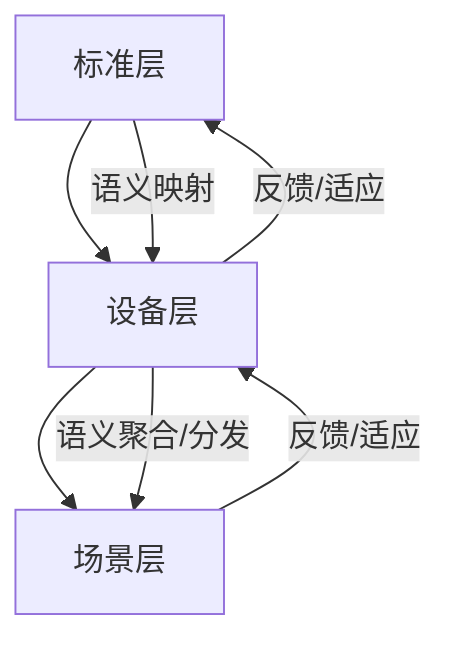

# AI语义中枢架构与自演化机制

## 1. AI语义中枢分层结构

- **感知层**：负责数据采集、预处理、初步语义标注。
- **融合层**：多源知识整合、标准映射、知识图谱对齐。
- **推理层**：AI/规则混合推理、语义一致性验证、异常检测与修复。
- **共识层**：分布式一致性、区块链溯源、跨域语义共识。

## 2. 多层级语义映射网络结构



## 3. 自演化机制伪代码

```python
def semantic_model_self_evolve(model, new_data, feedback):
    # 1. 增量学习
    model.update_with(new_data)
    # 2. 异常检测
    anomalies = model.detect_anomalies(new_data)
    if anomalies:
        model.auto_repair(anomalies)
    # 3. 知识迁移
    model.transfer_knowledge(feedback)
    # 4. 持续优化
    model.optimize()
    return model
``` 