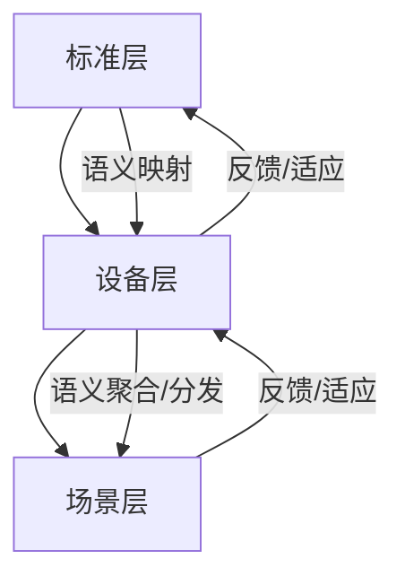
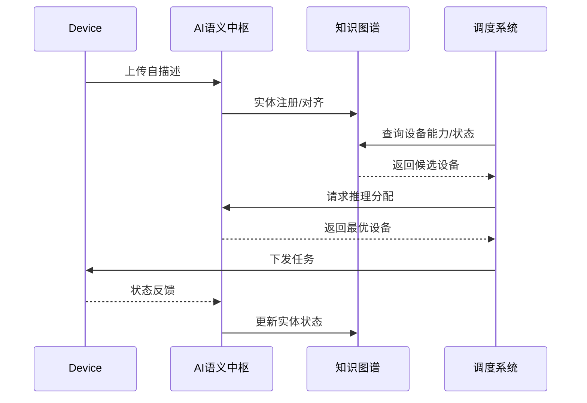

# AI语义中枢架构与自演化机制

## 1. AI语义中枢分层结构

- **感知层**：负责数据采集、预处理、初步语义标注。
- **融合层**：多源知识整合、标准映射、知识图谱对齐。
- **推理层**：AI/规则混合推理、语义一致性验证、异常检测与修复。
- **共识层**：分布式一致性、区块链溯源、跨域语义共识。

## 2. 多层级语义映射网络结构



## 3. 自演化机制伪代码

```python
def semantic_model_self_evolve(model, new_data, feedback):
    # 1. 增量学习
    model.update_with(new_data)
    # 2. 异常检测
    anomalies = model.detect_anomalies(new_data)
    if anomalies:
        model.auto_repair(anomalies)
    # 3. 知识迁移
    model.transfer_knowledge(feedback)
    # 4. 持续优化
    model.optimize()
    return model
```

## 4. 典型应用场景

- **工业互联**：AI语义中枢协调OPC UA、oneM2M等多标准设备，实现生产线自动化与智能调度。
- **智慧城市**：多源感知设备通过AI语义中枢实现交通、安防、能耗等多场景数据融合与智能决策。
- **智能家居**：Matter、WoT等标准设备通过AI语义中枢实现自动发现、语义对齐与场景联动。

## 5. 知识图谱接口设计

- 提供RESTful API或GraphQL接口，实现知识图谱与AI推理引擎的数据交互。
- 支持实体、属性、关系的增删查改，支持语义查询与推理结果回写。
- 典型接口：
  - `POST /entities` 新增实体
  - `GET /entities/{id}` 查询实体
  - `POST /reasoning` 触发AI推理
  - `POST /feedback` 回写优化建议

## 6. 自演化机制实际工程流程

1. 数据采集与预处理，自动标注新实体/属性。
2. AI模型增量学习，适应新场景和设备。
3. 异常检测与自动修复，发现语义冲突时自动生成修正建议。
4. 知识迁移与持续优化，结合人工反馈不断完善模型。
5. 关键步骤均有日志与版本管理，支持回滚与追溯。

## 7. 工程落地案例：智能工厂生产线自动化

- 多品牌设备（OPC UA、oneM2M、Matter）上线后自动注册，AI语义中枢解析自描述，完成语义对齐。
- 生产调度系统通过API查询知识图谱，获取设备能力与状态，实现自动化任务分配。
- 设备状态变化实时反馈，AI推理引擎动态调整生产计划。

### 伪代码示例

```python
# 设备上线注册
for device in new_devices:
    entity = ai_semantic_hub.parse_description(device.description)
    kg_api.add_entity(entity)

# 生产调度
task = get_next_task()
candidates = kg_api.query_entities(type='robot', status='idle')
selected = ai_semantic_hub.reasoning(task, candidates)
assign_task(selected, task)
```

## 8. API接口输入输出示例

- `POST /entities`
  - 输入：`{"type": "robot", "capabilities": ["welding", "assembly"]}`
  - 输出：`{"id": "entity-123", "status": "registered"}`
- `POST /reasoning`
  - 输入：`{"task": "welding", "candidates": ["entity-123", "entity-456"]}`
  - 输出：`{"selected": "entity-123"}`

## 9. AI语义中枢与系统交互时序图


