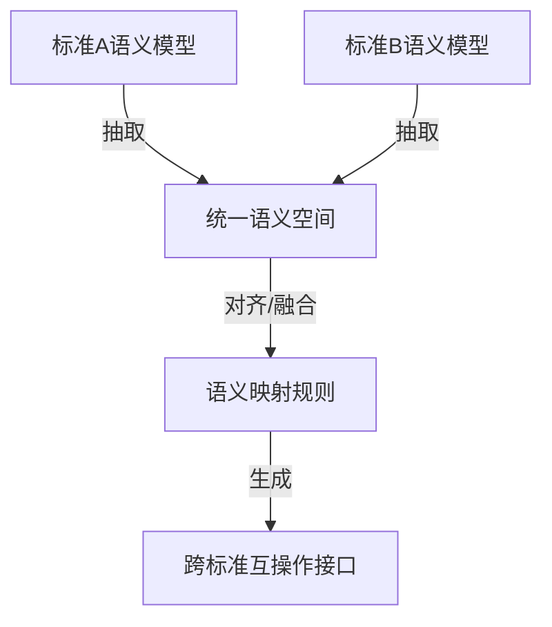

# 多标准语义统一理论

## 1. 理论创新

### 1.1 统一语义空间

- 构建跨标准的统一语义空间，支持OPC-UA、MQTT、CoAP、LwM2M等主流IoT标准的语义映射。
- 采用本体论、范畴论等形式化方法，定义标准间的语义同构、同伦、嵌入与映射关系。

### 1.2 语义对齐与冲突融合

- 设计多层次语义对齐机制（概念、属性、关系、行为）。
- 引入GNN（图神经网络）等AI方法辅助语义冲突检测与融合。

## 2. 算法实现

### 2.1 语义映射算法流程



### 2.2 Rust伪代码：多标准语义对齐

```rust
pub struct SemanticAligner {
    ontology_a: Ontology,
    ontology_b: Ontology,
    gnn_model: GNNModel,
}

impl SemanticAligner {
    pub fn align(&self) -> AlignmentResult {
        // 1. 概念对齐
        let concept_matches = self.match_concepts();
        // 2. 属性对齐
        let property_matches = self.match_properties();
        // 3. 关系对齐
        let relation_matches = self.match_relations();
        // 4. GNN冲突检测与融合
        let fusion_result = self.gnn_model.fuse(&concept_matches, &property_matches, &relation_matches);
        AlignmentResult {
            concept_matches,
            property_matches,
            relation_matches,
            fusion_result,
        }
    }
}
```

### 2.3 Python示例：语义映射规则生成

```python
def generate_mapping_rules(ontology_a, ontology_b):
    rules = []
    for concept_a in ontology_a['concepts']:
        for concept_b in ontology_b['concepts']:
            if similarity(concept_a, concept_b) > 0.8:
                rules.append((concept_a['name'], concept_b['name']))
    return rules
```

## 3. 测试用例

### 3.1 Rust对齐测试

```rust
#[test]
fn test_semantic_alignment() {
    let aligner = SemanticAligner::new(mock_ontology_a(), mock_ontology_b(), mock_gnn_model());
    let result = aligner.align();
    assert!(result.fusion_result.confidence > 0.7);
}
```

### 3.2 Python规则生成测试

```python
def test_generate_mapping_rules():
    ontology_a = {'concepts': [{'name': 'Temperature'}]}
    ontology_b = {'concepts': [{'name': '温度'}]}
    rules = generate_mapping_rules(ontology_a, ontology_b)
    assert rules[0][0] == 'Temperature'
```

## 4. 性能与优化建议

- 采用增量式语义对齐，提升大规模标准集成效率。
- GNN模型支持分布式训练与推理。
- 语义映射规则缓存与复用，减少重复计算。
