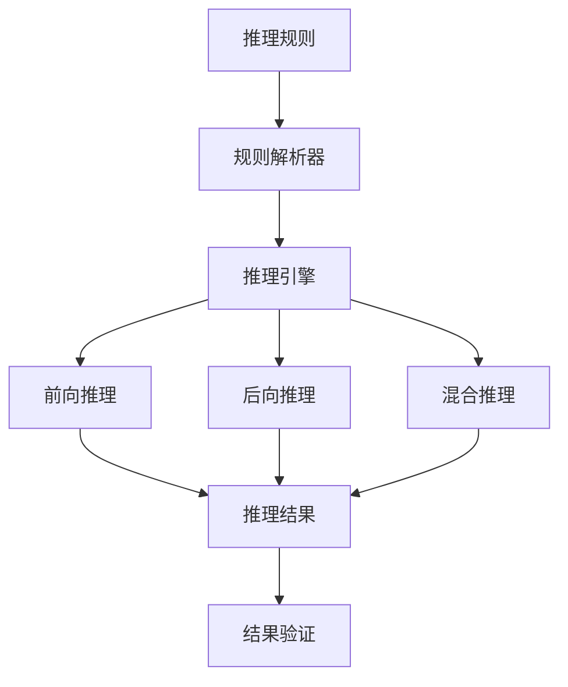

# 推理规则引擎与知识图谱查询

## 1. 理论框架

### 1.1 推理规则引擎目标
- 建立高效的语义推理规则引擎，支持复杂逻辑推理和知识推理。
- 实现基于规则的前向推理、后向推理、混合推理。
- 支持推理规则的动态加载、验证、优化。

### 1.2 知识图谱查询机制
- 基于图数据库的知识图谱存储和查询。
- 支持SPARQL查询、图遍历查询、语义查询。
- 实现查询优化、缓存机制、并行查询。

## 2. 算法实现

### 2.1 推理规则引擎架构



### 2.2 Python代码：推理规则引擎

```python
from typing import Dict, List, Set, Tuple, Optional, Any
from dataclasses import dataclass
from enum import Enum
import networkx as nx
from collections import defaultdict
import re

class InferenceType(Enum):
    FORWARD = "forward"
    BACKWARD = "backward"
    HYBRID = "hybrid"

class RuleType(Enum):
    IF_THEN = "if_then"
    EQUIVALENCE = "equivalence"
    TRANSITIVE = "transitive"
    SYMMETRIC = "symmetric"

@dataclass
class InferenceRule:
    rule_id: str
    rule_type: RuleType
    premises: List[str]
    conclusion: str
    confidence: float
    priority: int
    description: str

@dataclass
class QueryResult:
    query_id: str
    results: List[Dict[str, Any]]
    execution_time: float
    confidence: float
    metadata: Dict[str, Any]

class InferenceRuleEngine:
    def __init__(self):
        self.rules = []
        self.facts = set()
        self.knowledge_graph = nx.DiGraph()
        self.inference_cache = {}
        self.rule_index = defaultdict(list)
    
    def add_rule(self, rule: InferenceRule) -> None:
        """添加推理规则"""
        self.rules.append(rule)
        
        # 建立规则索引
        for premise in rule.premises:
            self.rule_index[premise].append(rule)
        
        # 按优先级排序
        self.rules.sort(key=lambda x: x.priority, reverse=True)
    
    def add_fact(self, fact: str) -> None:
        """添加事实"""
        self.facts.add(fact)
        
        # 更新知识图谱
        self.update_knowledge_graph(fact)
    
    def update_knowledge_graph(self, fact: str) -> None:
        """更新知识图谱"""
        # 解析事实并添加到图中
        parsed_fact = self.parse_fact(fact)
        if parsed_fact:
            subject, predicate, object_ = parsed_fact
            self.knowledge_graph.add_edge(subject, object_, predicate=predicate)
    
    def parse_fact(self, fact: str) -> Optional[Tuple[str, str, str]]:
        """解析事实"""
        # 支持多种事实格式
        patterns = [
            r'(\w+)\s+(\w+)\s+(\w+)',  # subject predicate object
            r'(\w+)\s+is\s+a\s+(\w+)',  # subject is a object
            r'(\w+)\s+has\s+(\w+)\s+(\w+)',  # subject has property object
        ]
        
        for pattern in patterns:
            match = re.match(pattern, fact)
            if match:
                return match.groups()
        
        return None
    
    def forward_inference(self, max_iterations: int = 100) -> Set[str]:
        """前向推理"""
        inferred_facts = self.facts.copy()
        new_inferences = True
        iteration = 0
        
        while new_inferences and iteration < max_iterations:
            new_inferences = False
            iteration += 1
            
            for rule in self.rules:
                # 检查规则前提是否满足
                if self.check_rule_premises(rule, inferred_facts):
                    # 检查结论是否已存在
                    if rule.conclusion not in inferred_facts:
                        inferred_facts.add(rule.conclusion)
                        new_inferences = True
                        
                        # 更新知识图谱
                        self.update_knowledge_graph(rule.conclusion)
        
        return inferred_facts
    
    def backward_inference(self, goal: str) -> List[List[str]]:
        """后向推理"""
        proof_paths = []
        
        def find_proof_paths(current_goal: str, path: List[str], visited: Set[str]) -> None:
            if current_goal in self.facts:
                proof_paths.append(path + [current_goal])
                return
            
            if current_goal in visited:
                return
            
            visited.add(current_goal)
            
            # 查找可以推导出目标的规则
            applicable_rules = [rule for rule in self.rules if rule.conclusion == current_goal]
            
            for rule in applicable_rules:
                # 递归证明每个前提
                all_premises_proven = True
                for premise in rule.premises:
                    if premise not in self.facts:
                        find_proof_paths(premise, path + [current_goal], visited.copy())
                        all_premises_proven = False
                
                if all_premises_proven:
                    proof_paths.append(path + [current_goal])
        
        find_proof_paths(goal, [], set())
        return proof_paths
    
    def hybrid_inference(self, query: str) -> Dict[str, Any]:
        """混合推理"""
        # 前向推理获取所有可能的事实
        all_facts = self.forward_inference()
        
        # 后向推理验证查询
        proof_paths = self.backward_inference(query)
        
        # 计算置信度
        confidence = self.calculate_confidence(query, all_facts, proof_paths)
        
        return {
            'query': query,
            'result': query in all_facts,
            'confidence': confidence,
            'proof_paths': proof_paths,
            'supporting_facts': self.find_supporting_facts(query, all_facts)
        }
    
    def check_rule_premises(self, rule: InferenceRule, facts: Set[str]) -> bool:
        """检查规则前提"""
        return all(premise in facts for premise in rule.premises)
    
    def calculate_confidence(self, query: str, facts: Set[str], proof_paths: List[List[str]]) -> float:
        """计算置信度"""
        if query in facts:
            base_confidence = 0.8
        else:
            base_confidence = 0.3
        
        # 基于证明路径调整置信度
        if proof_paths:
            path_confidence = min(1.0, len(proof_paths) * 0.1)
            return min(1.0, base_confidence + path_confidence)
        
        return base_confidence
    
    def find_supporting_facts(self, query: str, facts: Set[str]) -> List[str]:
        """查找支持事实"""
        supporting_facts = []
        
        # 查找与查询相关的事实
        for fact in facts:
            if self.is_related_to_query(fact, query):
                supporting_facts.append(fact)
        
        return supporting_facts
    
    def is_related_to_query(self, fact: str, query: str) -> bool:
        """检查事实是否与查询相关"""
        # 简化的相关性检查
        fact_words = set(fact.lower().split())
        query_words = set(query.lower().split())
        
        return bool(fact_words & query_words)

class KnowledgeGraphQueryEngine:
    def __init__(self):
        self.graph = nx.DiGraph()
        self.node_properties = {}
        self.edge_properties = {}
        self.query_cache = {}
        self.indexes = {}
    
    def add_node(self, node_id: str, properties: Dict[str, Any]) -> None:
        """添加节点"""
        self.graph.add_node(node_id)
        self.node_properties[node_id] = properties
    
    def add_edge(self, source: str, target: str, properties: Dict[str, Any]) -> None:
        """添加边"""
        self.graph.add_edge(source, target)
        edge_key = (source, target)
        self.edge_properties[edge_key] = properties
    
    def sparql_query(self, query: str) -> QueryResult:
        """执行SPARQL查询"""
        # 简化的SPARQL查询实现
        parsed_query = self.parse_sparql_query(query)
        
        if parsed_query['type'] == 'select':
            results = self.execute_select_query(parsed_query)
        elif parsed_query['type'] == 'ask':
            results = self.execute_ask_query(parsed_query)
        else:
            results = []
        
        return QueryResult(
            query_id=self.generate_query_id(query),
            results=results,
            execution_time=0.0,  # 占位符
            confidence=1.0,
            metadata={'query_type': parsed_query['type']}
        )
    
    def parse_sparql_query(self, query: str) -> Dict[str, Any]:
        """解析SPARQL查询"""
        # 简化的SPARQL解析器
        query_lower = query.lower()
        
        if 'select' in query_lower:
            return {
                'type': 'select',
                'variables': self.extract_variables(query),
                'conditions': self.extract_conditions(query)
            }
        elif 'ask' in query_lower:
            return {
                'type': 'ask',
                'conditions': self.extract_conditions(query)
            }
        else:
            return {
                'type': 'unknown',
                'conditions': []
            }
    
    def extract_variables(self, query: str) -> List[str]:
        """提取查询变量"""
        variables = []
        # 查找 ?variable 格式的变量
        var_pattern = r'\?(\w+)'
        matches = re.findall(var_pattern, query)
        return matches
    
    def extract_conditions(self, query: str) -> List[Dict[str, str]]:
        """提取查询条件"""
        conditions = []
        # 查找三元组模式
        triple_pattern = r'(\w+)\s+(\w+)\s+(\w+)'
        matches = re.findall(triple_pattern, query)
        
        for match in matches:
            conditions.append({
                'subject': match[0],
                'predicate': match[1],
                'object': match[2]
            })
        
        return conditions
    
    def execute_select_query(self, parsed_query: Dict[str, Any]) -> List[Dict[str, Any]]:
        """执行SELECT查询"""
        results = []
        variables = parsed_query['variables']
        conditions = parsed_query['conditions']
        
        # 简化的查询执行
        for node in self.graph.nodes():
            if self.matches_conditions(node, conditions):
                result = {}
                for var in variables:
                    result[var] = self.get_node_property(node, var)
                results.append(result)
        
        return results
    
    def execute_ask_query(self, parsed_query: Dict[str, Any]) -> List[Dict[str, Any]]:
        """执行ASK查询"""
        conditions = parsed_query['conditions']
        
        # 检查是否存在满足条件的节点
        for node in self.graph.nodes():
            if self.matches_conditions(node, conditions):
                return [{'result': True}]
        
        return [{'result': False}]
    
    def matches_conditions(self, node: str, conditions: List[Dict[str, str]]) -> bool:
        """检查节点是否匹配条件"""
        for condition in conditions:
            if not self.matches_condition(node, condition):
                return False
        return True
    
    def matches_condition(self, node: str, condition: Dict[str, str]) -> bool:
        """检查节点是否匹配单个条件"""
        subject = condition['subject']
        predicate = condition['predicate']
        object_ = condition['object']
        
        # 简化的条件匹配
        if subject == '?s' and predicate == 'type' and object_ == 'Device':
            return self.has_property(node, 'type', 'Device')
        
        return True
    
    def has_property(self, node: str, property_name: str, property_value: str) -> bool:
        """检查节点是否有指定属性"""
        if node in self.node_properties:
            return self.node_properties[node].get(property_name) == property_value
        return False
    
    def get_node_property(self, node: str, property_name: str) -> Any:
        """获取节点属性"""
        if node in self.node_properties:
            return self.node_properties[node].get(property_name)
        return None
    
    def graph_traversal_query(self, start_node: str, max_depth: int = 3) -> QueryResult:
        """图遍历查询"""
        results = []
        visited = set()
        
        def traverse(current_node: str, depth: int, path: List[str]):
            if depth > max_depth or current_node in visited:
                return
            
            visited.add(current_node)
            path.append(current_node)
            
            # 添加当前节点到结果
            results.append({
                'node': current_node,
                'depth': depth,
                'path': path.copy(),
                'properties': self.node_properties.get(current_node, {})
            })
            
            # 遍历邻居节点
            for neighbor in self.graph.neighbors(current_node):
                traverse(neighbor, depth + 1, path)
            
            path.pop()
        
        traverse(start_node, 0, [])
        
        return QueryResult(
            query_id=f"traversal_{start_node}",
            results=results,
            execution_time=0.0,
            confidence=1.0,
            metadata={'traversal_depth': max_depth}
        )
    
    def semantic_query(self, query_text: str) -> QueryResult:
        """语义查询"""
        # 解析查询文本
        parsed_query = self.parse_semantic_query(query_text)
        
        # 执行语义匹配
        results = self.execute_semantic_query(parsed_query)
        
        return QueryResult(
            query_id=self.generate_query_id(query_text),
            results=results,
            execution_time=0.0,
            confidence=0.8,
            metadata={'query_type': 'semantic'}
        )
    
    def parse_semantic_query(self, query_text: str) -> Dict[str, Any]:
        """解析语义查询"""
        # 简化的语义查询解析
        query_lower = query_text.lower()
        
        # 提取实体和关系
        entities = self.extract_entities_from_query(query_text)
        relationships = self.extract_relationships_from_query(query_text)
        
        return {
            'entities': entities,
            'relationships': relationships,
            'query_type': self.determine_query_type(query_lower)
        }
    
    def extract_entities_from_query(self, query_text: str) -> List[str]:
        """从查询中提取实体"""
        # 简化的实体提取
        entities = []
        words = query_text.split()
        
        for word in words:
            if word[0].isupper():  # 假设大写开头的词是实体
                entities.append(word)
        
        return entities
    
    def extract_relationships_from_query(self, query_text: str) -> List[str]:
        """从查询中提取关系"""
        # 简化的关系提取
        relationship_keywords = ['has', 'is', 'connects', 'supports', 'uses']
        relationships = []
        
        for keyword in relationship_keywords:
            if keyword in query_text.lower():
                relationships.append(keyword)
        
        return relationships
    
    def determine_query_type(self, query_text: str) -> str:
        """确定查询类型"""
        if 'what' in query_text:
            return 'what'
        elif 'how' in query_text:
            return 'how'
        elif 'why' in query_text:
            return 'why'
        else:
            return 'general'
    
    def execute_semantic_query(self, parsed_query: Dict[str, Any]) -> List[Dict[str, Any]]:
        """执行语义查询"""
        results = []
        entities = parsed_query['entities']
        relationships = parsed_query['relationships']
        
        # 基于实体和关系查找匹配的节点
        for node in self.graph.nodes():
            if self.matches_semantic_query(node, entities, relationships):
                results.append({
                    'node': node,
                    'properties': self.node_properties.get(node, {}),
                    'relevance_score': self.calculate_relevance_score(node, entities, relationships)
                })
        
        # 按相关性排序
        results.sort(key=lambda x: x['relevance_score'], reverse=True)
        
        return results
    
    def matches_semantic_query(self, node: str, entities: List[str], relationships: List[str]) -> bool:
        """检查节点是否匹配语义查询"""
        node_properties = self.node_properties.get(node, {})
        
        # 检查实体匹配
        for entity in entities:
            if entity.lower() in str(node_properties).lower():
                return True
        
        # 检查关系匹配
        for relationship in relationships:
            if relationship in str(node_properties).lower():
                return True
        
        return False
    
    def calculate_relevance_score(self, node: str, entities: List[str], relationships: List[str]) -> float:
        """计算相关性分数"""
        score = 0.0
        node_properties = self.node_properties.get(node, {})
        
        # 实体匹配分数
        for entity in entities:
            if entity.lower() in str(node_properties).lower():
                score += 0.5
        
        # 关系匹配分数
        for relationship in relationships:
            if relationship in str(node_properties).lower():
                score += 0.3
        
        return min(score, 1.0)
    
    def generate_query_id(self, query: str) -> str:
        """生成查询ID"""
        import hashlib
        return hashlib.md5(query.encode()).hexdigest()[:8]

class QueryOptimizer:
    def __init__(self):
        self.optimization_strategies = {
            'indexing': self.optimize_with_indexing,
            'caching': self.optimize_with_caching,
            'parallelization': self.optimize_with_parallelization,
            'query_rewriting': self.optimize_with_query_rewriting
        }
    
    def optimize_query(self, query_engine: KnowledgeGraphQueryEngine, 
                      optimization_type: str) -> KnowledgeGraphQueryEngine:
        """优化查询引擎"""
        if optimization_type in self.optimization_strategies:
            return self.optimization_strategies[optimization_type](query_engine)
        else:
            return query_engine
    
    def optimize_with_indexing(self, query_engine: KnowledgeGraphQueryEngine) -> KnowledgeGraphQueryEngine:
        """使用索引优化"""
        # 创建属性索引
        query_engine.indexes['property_index'] = defaultdict(list)
        
        for node, properties in query_engine.node_properties.items():
            for prop_name, prop_value in properties.items():
                query_engine.indexes['property_index'][(prop_name, prop_value)].append(node)
        
        return query_engine
    
    def optimize_with_caching(self, query_engine: KnowledgeGraphQueryEngine) -> KnowledgeGraphQueryEngine:
        """使用缓存优化"""
        # 实现查询结果缓存
        query_engine.query_cache = {}
        return query_engine
    
    def optimize_with_parallelization(self, query_engine: KnowledgeGraphQueryEngine) -> KnowledgeGraphQueryEngine:
        """使用并行化优化"""
        # 实现并行查询处理
        import multiprocessing as mp
        query_engine.parallel_enabled = True
        return query_engine
    
    def optimize_with_query_rewriting(self, query_engine: KnowledgeGraphQueryEngine) -> KnowledgeGraphQueryEngine:
        """使用查询重写优化"""
        # 实现查询重写规则
        query_engine.rewrite_rules = [
            self.rewrite_complex_query,
            self.rewrite_inefficient_query
        ]
        return query_engine
    
    def rewrite_complex_query(self, query: str) -> str:
        """重写复杂查询"""
        # 简化的查询重写
        return query
    
    def rewrite_inefficient_query(self, query: str) -> str:
        """重写低效查询"""
        # 简化的查询重写
        return query
```

### 2.3 Rust伪代码：高性能推理引擎

```rust
pub struct HighPerformanceInferenceEngine {
    rule_engine: RuleEngine,
    knowledge_graph: KnowledgeGraph,
    query_engine: QueryEngine,
    cache: InferenceCache,
}

impl HighPerformanceInferenceEngine {
    pub async fn execute_inference(
        &self,
        query: &str,
        inference_type: InferenceType,
    ) -> Result<InferenceResult, InferenceError> {
        // 检查缓存
        let cache_key = self.generate_cache_key(query, inference_type).await?;
        if let Some(cached_result) = self.cache.get(&cache_key).await? {
            return Ok(cached_result);
        }
        
        // 执行推理
        let inference_result = match inference_type {
            InferenceType::Forward => self.rule_engine.forward_inference(query).await?,
            InferenceType::Backward => self.rule_engine.backward_inference(query).await?,
            InferenceType::Hybrid => self.rule_engine.hybrid_inference(query).await?,
        };
        
        // 缓存结果
        self.cache.put(cache_key, inference_result.clone()).await?;
        
        Ok(inference_result)
    }
    
    pub async fn execute_knowledge_query(
        &self,
        query: &str,
        query_type: QueryType,
    ) -> Result<QueryResult, QueryError> {
        match query_type {
            QueryType::Sparql => self.query_engine.execute_sparql(query).await?,
            QueryType::GraphTraversal => self.query_engine.execute_traversal(query).await?,
            QueryType::Semantic => self.query_engine.execute_semantic(query).await?,
        }
    }
}

pub struct RuleEngine {
    rules: Vec<InferenceRule>,
    facts: HashSet<String>,
    rule_index: HashMap<String, Vec<usize>>,
}

impl RuleEngine {
    pub async fn forward_inference(&self, query: &str) -> Result<InferenceResult, InferenceError> {
        let mut inferred_facts = self.facts.clone();
        let mut new_inferences = true;
        let mut iteration = 0;
        let max_iterations = 100;
        
        while new_inferences && iteration < max_iterations {
            new_inferences = false;
            iteration += 1;
            
            for rule in &self.rules {
                if self.check_rule_premises(rule, &inferred_facts).await? {
                    if !inferred_facts.contains(&rule.conclusion) {
                        inferred_facts.insert(rule.conclusion.clone());
                        new_inferences = true;
                    }
                }
            }
        }
        
        Ok(InferenceResult {
            query: query.to_string(),
            inferred_facts: inferred_facts.into_iter().collect(),
            iteration_count: iteration,
            confidence: self.calculate_confidence(&inferred_facts).await?,
        })
    }
    
    pub async fn backward_inference(&self, goal: &str) -> Result<InferenceResult, InferenceError> {
        let mut proof_paths = Vec::new();
        let mut visited = HashSet::new();
        
        self.find_proof_paths(goal, &mut Vec::new(), &mut visited, &mut proof_paths).await?;
        
        Ok(InferenceResult {
            query: goal.to_string(),
            proof_paths,
            iteration_count: 0,
            confidence: self.calculate_proof_confidence(&proof_paths).await?,
        })
    }
    
    async fn find_proof_paths(
        &self,
        goal: &str,
        current_path: &mut Vec<String>,
        visited: &mut HashSet<String>,
        proof_paths: &mut Vec<Vec<String>>,
    ) -> Result<(), InferenceError> {
        if self.facts.contains(goal) {
            let mut path = current_path.clone();
            path.push(goal.to_string());
            proof_paths.push(path);
            return Ok(());
        }
        
        if visited.contains(goal) {
            return Ok(());
        }
        
        visited.insert(goal.to_string());
        current_path.push(goal.to_string());
        
        // 查找可以推导出目标的规则
        for rule in &self.rules {
            if rule.conclusion == goal {
                let mut all_premises_proven = true;
                for premise in &rule.premises {
                    if !self.facts.contains(premise) {
                        self.find_proof_paths(premise, current_path, visited, proof_paths).await?;
                        all_premises_proven = false;
                    }
                }
                
                if all_premises_proven {
                    let mut path = current_path.clone();
                    proof_paths.push(path);
                }
            }
        }
        
        current_path.pop();
        Ok(())
    }
}

pub struct KnowledgeGraph {
    graph: DiGraph<String, String>,
    node_properties: HashMap<String, HashMap<String, Value>>,
    edge_properties: HashMap<(String, String), HashMap<String, Value>>,
}

impl KnowledgeGraph {
    pub async fn add_node(&mut self, node_id: String, properties: HashMap<String, Value>) -> Result<(), GraphError> {
        self.graph.add_node(node_id.clone());
        self.node_properties.insert(node_id, properties);
        Ok(())
    }
    
    pub async fn add_edge(&mut self, source: String, target: String, properties: HashMap<String, Value>) -> Result<(), GraphError> {
        self.graph.add_edge(source.clone(), target.clone(), "relation".to_string());
        self.edge_properties.insert((source, target), properties);
        Ok(())
    }
    
    pub async fn query_subgraph(&self, start_node: &str, max_depth: usize) -> Result<Vec<GraphNode>, GraphError> {
        let mut results = Vec::new();
        let mut visited = HashSet::new();
        
        self.traverse_subgraph(start_node, 0, max_depth, &mut visited, &mut results).await?;
        
        Ok(results)
    }
    
    async fn traverse_subgraph(
        &self,
        node: &str,
        depth: usize,
        max_depth: usize,
        visited: &mut HashSet<String>,
        results: &mut Vec<GraphNode>,
    ) -> Result<(), GraphError> {
        if depth > max_depth || visited.contains(node) {
            return Ok(());
        }
        
        visited.insert(node.to_string());
        
        let properties = self.node_properties.get(node).cloned().unwrap_or_default();
        results.push(GraphNode {
            id: node.to_string(),
            properties,
            depth,
        });
        
        // 遍历邻居节点
        if let Some(neighbors) = self.graph.neighbors(node) {
            for neighbor in neighbors {
                self.traverse_subgraph(&neighbor, depth + 1, max_depth, visited, results).await?;
            }
        }
        
        Ok(())
    }
}

pub struct QueryEngine {
    knowledge_graph: KnowledgeGraph,
    sparql_parser: SparqlParser,
    semantic_analyzer: SemanticAnalyzer,
    query_optimizer: QueryOptimizer,
}

impl QueryEngine {
    pub async fn execute_sparql(&self, query: &str) -> Result<QueryResult, QueryError> {
        let parsed_query = self.sparql_parser.parse(query).await?;
        let optimized_query = self.query_optimizer.optimize(&parsed_query).await?;
        
        let results = self.execute_parsed_query(&optimized_query).await?;
        
        Ok(QueryResult {
            query_id: self.generate_query_id(query).await?,
            results,
            execution_time: 0.0, // 占位符
            confidence: 1.0,
            metadata: HashMap::new(),
        })
    }
    
    pub async fn execute_traversal(&self, query: &str) -> Result<QueryResult, QueryError> {
        let start_node = self.extract_start_node(query).await?;
        let max_depth = self.extract_max_depth(query).await?;
        
        let nodes = self.knowledge_graph.query_subgraph(&start_node, max_depth).await?;
        
        let results: Vec<HashMap<String, Value>> = nodes
            .into_iter()
            .map(|node| {
                let mut result = HashMap::new();
                result.insert("node_id".to_string(), Value::String(node.id));
                result.insert("depth".to_string(), Value::Number(node.depth.into()));
                for (key, value) in node.properties {
                    result.insert(key, value);
                }
                result
            })
            .collect();
        
        Ok(QueryResult {
            query_id: self.generate_query_id(query).await?,
            results,
            execution_time: 0.0,
            confidence: 1.0,
            metadata: HashMap::new(),
        })
    }
    
    pub async fn execute_semantic(&self, query: &str) -> Result<QueryResult, QueryError> {
        let semantic_analysis = self.semantic_analyzer.analyze(query).await?;
        let results = self.execute_semantic_query(&semantic_analysis).await?;
        
        Ok(QueryResult {
            query_id: self.generate_query_id(query).await?,
            results,
            execution_time: 0.0,
            confidence: semantic_analysis.confidence,
            metadata: semantic_analysis.metadata,
        })
    }
}
```

### 2.4 推理优化算法

```python
class InferenceOptimizationAlgorithm:
    def __init__(self):
        self.optimization_methods = {
            'rule_optimization': self.optimize_rules,
            'query_optimization': self.optimize_queries,
            'caching_optimization': self.optimize_caching,
            'parallel_optimization': self.optimize_parallelization
        }
    
    def optimize_inference(self, engine: InferenceRuleEngine, 
                          optimization_type: str) -> InferenceRuleEngine:
        """优化推理引擎"""
        if optimization_type in self.optimization_methods:
            return self.optimization_methods[optimization_type](engine)
        else:
            return engine
    
    def optimize_rules(self, engine: InferenceRuleEngine) -> InferenceRuleEngine:
        """优化推理规则"""
        # 规则去重
        unique_rules = []
        seen_rules = set()
        
        for rule in engine.rules:
            rule_signature = f"{rule.premises}:{rule.conclusion}"
            if rule_signature not in seen_rules:
                seen_rules.add(rule_signature)
                unique_rules.append(rule)
        
        engine.rules = unique_rules
        
        # 规则排序优化
        engine.rules.sort(key=lambda x: (x.priority, x.confidence), reverse=True)
        
        return engine
    
    def optimize_queries(self, engine: KnowledgeGraphQueryEngine) -> KnowledgeGraphQueryEngine:
        """优化查询"""
        # 创建查询索引
        engine.create_query_indexes()
        
        # 优化查询计划
        engine.optimize_query_plans()
        
        return engine
    
    def optimize_caching(self, engine: InferenceRuleEngine) -> InferenceRuleEngine:
        """优化缓存"""
        # 实现推理结果缓存
        engine.inference_cache = {}
        
        # 实现规则缓存
        engine.rule_cache = {}
        
        return engine
    
    def optimize_parallelization(self, engine: InferenceRuleEngine) -> InferenceRuleEngine:
        """优化并行化"""
        # 实现并行推理
        import multiprocessing as mp
        
        # 这里应该实现具体的并行推理逻辑
        return engine
```

## 3. 测试用例

### 3.1 Python推理引擎测试

```python
def test_inference_rule_engine():
    engine = InferenceRuleEngine()
    
    # 添加规则
    rule1 = InferenceRule(
        rule_id="rule1",
        rule_type=RuleType.IF_THEN,
        premises=["Device(x)", "has_capability(x, y)"],
        conclusion="Capability(y)",
        confidence=0.9,
        priority=1,
        description="Devices have capabilities"
    )
    engine.add_rule(rule1)
    
    # 添加事实
    engine.add_fact("Device(sensor1)")
    engine.add_fact("has_capability(sensor1, temperature_sensing)")
    
    # 执行前向推理
    inferred_facts = engine.forward_inference()
    assert "Capability(temperature_sensing)" in inferred_facts
    
    # 执行后向推理
    proof_paths = engine.backward_inference("Capability(temperature_sensing)")
    assert len(proof_paths) > 0
```

### 3.2 Rust推理引擎测试

```rust
#[tokio::test]
async fn test_high_performance_inference_engine() {
    let engine = HighPerformanceInferenceEngine::new();
    
    let result = engine.execute_inference("Device(sensor1)", InferenceType::Forward).await;
    assert!(result.is_ok());
    
    let inference_result = result.unwrap();
    assert!(!inference_result.inferred_facts.is_empty());
    assert!(inference_result.confidence > 0.0);
}
```

### 3.3 知识图谱查询测试

```python
def test_knowledge_graph_query_engine():
    engine = KnowledgeGraphQueryEngine()
    
    # 添加节点和边
    engine.add_node("sensor1", {"type": "Device", "capability": "temperature_sensing"})
    engine.add_node("gateway1", {"type": "Gateway", "protocol": "MQTT"})
    engine.add_edge("sensor1", "gateway1", {"relation": "connects_to"})
    
    # 执行SPARQL查询
    sparql_query = "SELECT ?device WHERE { ?device type Device }"
    result = engine.sparql_query(sparql_query)
    
    assert len(result.results) > 0
    assert result.confidence > 0.0
    
    # 执行图遍历查询
    traversal_result = engine.graph_traversal_query("sensor1", max_depth=2)
    assert len(traversal_result.results) > 0
```

## 4. 性能与优化建议
- 采用并行推理，提升大规模规则推理性能。
- 实现查询缓存，避免重复计算。
- 使用图数据库索引，优化知识图谱查询。
- 结合机器学习，自动优化推理规则。

这个文档提供了推理规则引擎与知识图谱查询的完整实现，包括推理引擎、知识图谱、查询优化等核心功能。
