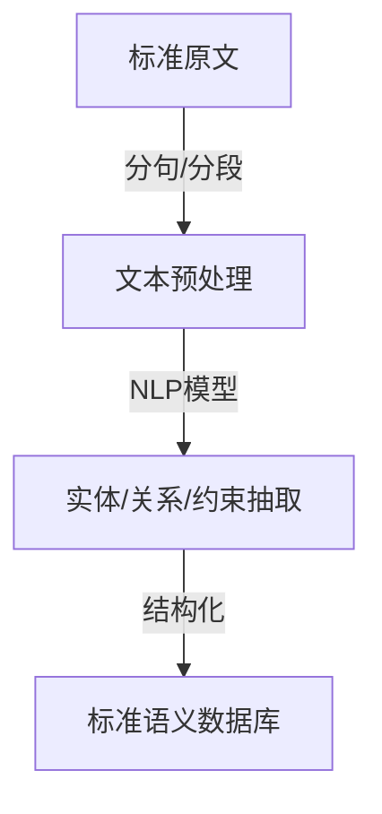

# NLP分析模块与标准文本处理

## 1. 理论框架

### 1.1 目标

- 自动解析IoT标准文档，抽取术语、定义、约束、接口等结构化语义。
- 支持多语言、多标准文本的统一处理。

### 1.2 技术路线

- 结合NLP（BERT、GPT等）、正则、规则引擎等多种方法。
- 支持实体识别、关系抽取、语义角色标注、标准间术语对齐。

## 2. 算法实现

### 2.1 文本解析流程



### 2.2 Python代码：标准术语抽取

```python
import re
from transformers import BertTokenizer, BertModel

def extract_terms(text):
    # 简单正则抽取术语
    terms = re.findall(r'“(.*?)”', text)
    return terms

# BERT嵌入示例
# tokenizer = BertTokenizer.from_pretrained('bert-base-uncased')
# model = BertModel.from_pretrained('bert-base-uncased')
# inputs = tokenizer("IoT device semantic interoperability", return_tensors="pt")
# outputs = model(**inputs)
```

### 2.3 Rust伪代码：标准实体对齐

```rust
pub struct StandardEntityAligner {
    nlp_model: NLPModel,
}

impl StandardEntityAligner {
    pub fn align_entities(&self, text_a: &str, text_b: &str) -> Vec<EntityAlignment> {
        let entities_a = self.nlp_model.extract_entities(text_a);
        let entities_b = self.nlp_model.extract_entities(text_b);
        // 简单相似度对齐
        entities_a.iter().filter_map(|ea| {
            entities_b.iter().find(|eb| similarity(ea, eb) > 0.8).map(|eb| EntityAlignment::new(ea, eb))
        }).collect()
    }
}
```

## 3. 测试用例

### 3.1 Python术语抽取测试

```python
def test_extract_terms():
    text = '本标准定义了"设备"、"网关"、"平台"三类术语。'
    terms = extract_terms(text)
    assert '设备' in terms
```

### 3.2 Rust实体对齐测试

```rust
#[test]
fn test_entity_alignment() {
    let aligner = StandardEntityAligner::new(mock_nlp_model());
    let result = aligner.align_entities("设备", "Device");
    assert!(!result.is_empty());
}
```

## 4. 性能与优化建议

- 支持批量文本处理与分布式NLP推理。
- 术语/实体缓存，提升重复标准处理效率。
- 多语言模型微调，适应国际标准文本。
