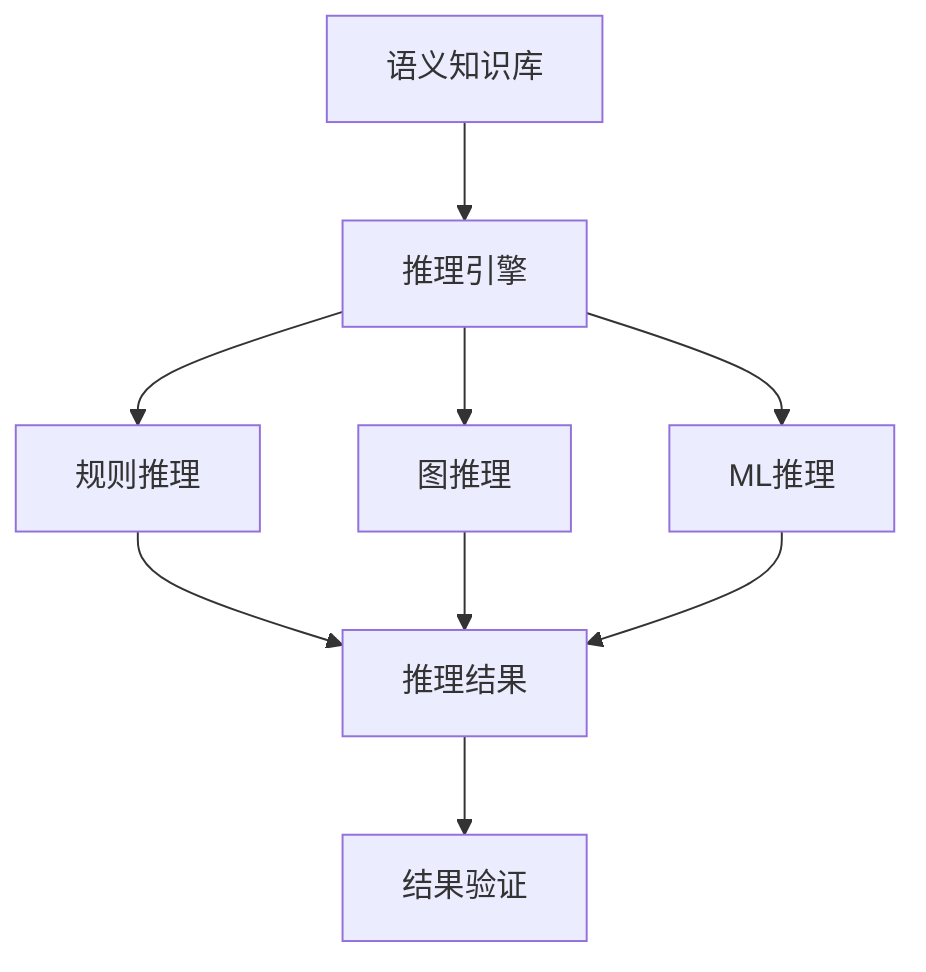

# 语义推理规则与算法

## 1. 理论框架

### 1.1 语义推理目标

- 基于语义知识进行逻辑推理，支持设备能力推断、关系推理、约束验证。
- 结合规则引擎、图推理、机器学习等方法实现智能推理。
- 支持增量推理、并行推理、分布式推理。

### 1.2 推理算法分类

- 基于规则的推理：IF-THEN规则、决策树等。
- 基于图的推理：图遍历、路径推理、子图匹配。
- 基于机器学习的推理：神经网络推理、概率推理。

## 2. 算法实现

### 2.1 语义推理架构



### 2.2 Python代码：语义推理引擎

```python
import networkx as nx
import numpy as np
from typing import Dict, List, Set, Tuple
from dataclasses import dataclass
from collections import defaultdict

@dataclass
class SemanticRule:
    rule_id: str
    antecedent: List[str]  # 前提条件
    consequent: str        # 结论
    confidence: float
    priority: int

@dataclass
class SemanticEntity:
    entity_id: str
    entity_type: str
    properties: Dict
    relationships: List[Tuple[str, str]]  # (关系类型, 目标实体)

class SemanticReasoningEngine:
    def __init__(self):
        self.rules = []
        self.semantic_graph = nx.DiGraph()
        self.ml_model = None
        self.reasoning_cache = {}
    
    def add_rule(self, rule: SemanticRule) -> None:
        """添加推理规则"""
        self.rules.append(rule)
        # 按优先级排序
        self.rules.sort(key=lambda x: x.priority, reverse=True)
    
    def add_entity(self, entity: SemanticEntity) -> None:
        """添加语义实体到图"""
        self.semantic_graph.add_node(
            entity.entity_id,
            entity_type=entity.entity_type,
            properties=entity.properties
        )
        
        # 添加关系边
        for rel_type, target_entity in entity.relationships:
            self.semantic_graph.add_edge(
                entity.entity_id,
                target_entity,
                relationship_type=rel_type
            )
    
    def rule_based_reasoning(self, facts: Set[str]) -> Set[str]:
        """基于规则的推理"""
        inferred_facts = facts.copy()
        new_inferences = True
        
        while new_inferences:
            new_inferences = False
            
            for rule in self.rules:
                # 检查规则前提是否满足
                if self.check_antecedent(rule.antecedent, inferred_facts):
                    # 检查结论是否已存在
                    if rule.consequent not in inferred_facts:
                        inferred_facts.add(rule.consequent)
                        new_inferences = True
        
        return inferred_facts
    
    def check_antecedent(self, antecedent: List[str], facts: Set[str]) -> bool:
        """检查规则前提是否满足"""
        return all(condition in facts for condition in antecedent)
    
    def graph_based_reasoning(self, start_entity: str, target_entity: str) -> List[List[str]]:
        """基于图的推理"""
        try:
            # 查找所有路径
            all_paths = list(nx.all_simple_paths(
                self.semantic_graph,
                start_entity,
                target_entity
            ))
            
            # 按路径长度排序
            all_paths.sort(key=len)
            
            return all_paths
        except nx.NetworkXNoPath:
            return []
    
    def infer_device_capabilities(self, device_id: str) -> List[str]:
        """推断设备能力"""
        capabilities = []
        
        # 基于设备类型推断能力
        device_node = self.semantic_graph.nodes.get(device_id)
        if device_node:
            device_type = device_node.get('entity_type', '')
            
            # 设备类型到能力的映射规则
            type_capability_rules = {
                'sensor': ['data_collection', 'monitoring'],
                'actuator': ['control', 'actuation'],
                'gateway': ['routing', 'aggregation', 'protocol_translation'],
                'controller': ['control', 'decision_making', 'optimization'],
                'server': ['data_processing', 'storage', 'analytics']
            }
            
            if device_type in type_capability_rules:
                capabilities.extend(type_capability_rules[device_type])
            
            # 基于属性推断能力
            properties = device_node.get('properties', {})
            if 'communication_protocol' in properties:
                capabilities.append('communication')
            if 'data_format' in properties:
                capabilities.append('data_processing')
            if 'security_level' in properties:
                capabilities.append('security')
        
        return capabilities
    
    def infer_device_relationships(self, device_id: str) -> List[Tuple[str, str, str]]:
        """推断设备关系"""
        relationships = []
        
        # 查找设备的所有邻居
        neighbors = list(self.semantic_graph.neighbors(device_id))
        
        for neighbor in neighbors:
            edge_data = self.semantic_graph.get_edge_data(device_id, neighbor)
            rel_type = edge_data.get('relationship_type', 'connected')
            
            relationships.append((device_id, rel_type, neighbor))
        
        return relationships
    
    def constraint_reasoning(self, constraints: List[str]) -> Dict:
        """约束推理"""
        constraint_results = {}
        
        for constraint in constraints:
            # 解析约束
            parsed_constraint = self.parse_constraint(constraint)
            
            # 检查约束是否满足
            satisfaction = self.check_constraint_satisfaction(parsed_constraint)
            
            constraint_results[constraint] = {
                'satisfied': satisfaction['satisfied'],
                'violations': satisfaction['violations'],
                'suggestions': satisfaction['suggestions']
            }
        
        return constraint_results
    
    def parse_constraint(self, constraint: str) -> Dict:
        """解析约束表达式"""
        # 简单的约束解析器
        if '==' in constraint:
            left, right = constraint.split('==')
            return {
                'type': 'equality',
                'left': left.strip(),
                'right': right.strip()
            }
        elif '!=' in constraint:
            left, right = constraint.split('!=')
            return {
                'type': 'inequality',
                'left': left.strip(),
                'right': right.strip()
            }
        elif '>' in constraint:
            left, right = constraint.split('>')
            return {
                'type': 'greater_than',
                'left': left.strip(),
                'right': right.strip()
            }
        else:
            return {
                'type': 'unknown',
                'expression': constraint
            }
    
    def check_constraint_satisfaction(self, parsed_constraint: Dict) -> Dict:
        """检查约束满足情况"""
        # 简化的约束检查
        result = {
            'satisfied': True,
            'violations': [],
            'suggestions': []
        }
        
        # 这里应该实现具体的约束检查逻辑
        # 基于语义图中的实际数据
        
        return result

class ProbabilisticReasoning:
    def __init__(self):
        self.probability_graph = nx.DiGraph()
        self.conditional_probabilities = {}
    
    def add_probabilistic_rule(self, rule_id: str, condition: str, 
                              consequence: str, probability: float) -> None:
        """添加概率推理规则"""
        self.probability_graph.add_edge(condition, consequence, 
                                      probability=probability, rule_id=rule_id)
    
    def infer_probability(self, evidence: Dict[str, float], 
                         target: str) -> float:
        """基于证据推断目标概率"""
        # 简化的贝叶斯推理
        if target in evidence:
            return evidence[target]
        
        # 查找影响目标的所有条件
        predecessors = list(self.probability_graph.predecessors(target))
        
        if not predecessors:
            return 0.5  # 默认概率
        
        # 计算条件概率
        total_probability = 0.0
        for condition in predecessors:
            edge_data = self.probability_graph.get_edge_data(condition, target)
            prob = edge_data.get('probability', 0.5)
            
            # 如果条件在证据中，使用证据概率，否则使用默认概率
            condition_prob = evidence.get(condition, 0.5)
            total_probability += prob * condition_prob
        
        return min(1.0, max(0.0, total_probability))
    
    def update_beliefs(self, evidence: Dict[str, float]) -> Dict[str, float]:
        """更新信念网络"""
        updated_beliefs = evidence.copy()
        
        # 对图中的所有节点进行概率更新
        for node in self.probability_graph.nodes():
            if node not in evidence:
                updated_beliefs[node] = self.infer_probability(evidence, node)
        
        return updated_beliefs

class TemporalReasoning:
    def __init__(self):
        self.temporal_graph = nx.DiGraph()
        self.temporal_constraints = []
    
    def add_temporal_constraint(self, event1: str, event2: str, 
                              constraint_type: str) -> None:
        """添加时间约束"""
        self.temporal_constraints.append({
            'event1': event1,
            'event2': event2,
            'constraint_type': constraint_type
        })
        
        # 在图中添加约束边
        if constraint_type == 'before':
            self.temporal_graph.add_edge(event1, event2, constraint='before')
        elif constraint_type == 'after':
            self.temporal_graph.add_edge(event2, event1, constraint='after')
        elif constraint_type == 'during':
            self.temporal_graph.add_edge(event1, event2, constraint='during')
    
    def check_temporal_consistency(self) -> Dict:
        """检查时间一致性"""
        try:
            # 检查是否存在循环（时间矛盾）
            cycles = list(nx.simple_cycles(self.temporal_graph))
            
            if cycles:
                return {
                    'consistent': False,
                    'cycles': cycles,
                    'error': 'Temporal constraints contain cycles'
                }
            else:
                return {
                    'consistent': True,
                    'cycles': [],
                    'error': None
                }
        except Exception as e:
            return {
                'consistent': False,
                'cycles': [],
                'error': str(e)
            }
    
    def infer_temporal_order(self, events: List[str]) -> List[str]:
        """推断时间顺序"""
        # 使用拓扑排序推断时间顺序
        try:
            ordered_events = list(nx.topological_sort(self.temporal_graph))
            return [event for event in ordered_events if event in events]
        except nx.NetworkXError:
            # 如果存在循环，返回原始顺序
            return events
```

### 2.3 Rust伪代码：高性能推理引擎

```rust
pub struct HighPerformanceReasoningEngine {
    rule_engine: RuleEngine,
    graph_engine: GraphEngine,
    ml_engine: MLEngine,
    cache: ReasoningCache,
}

impl HighPerformanceReasoningEngine {
    pub async fn reason_about_entity(
        &self,
        entity_id: &str,
        reasoning_type: ReasoningType,
    ) -> Result<ReasoningResult, ReasoningError> {
        // 检查缓存
        let cache_key = self.generate_cache_key(entity_id, reasoning_type);
        if let Some(cached_result) = self.cache.get(&cache_key).await? {
            return Ok(cached_result);
        }
        
        // 执行推理
        let reasoning_result = match reasoning_type {
            ReasoningType::RuleBased => {
                self.rule_engine.reason_about_entity(entity_id).await?
            },
            ReasoningType::GraphBased => {
                self.graph_engine.reason_about_entity(entity_id).await?
            },
            ReasoningType::MLBased => {
                self.ml_engine.reason_about_entity(entity_id).await?
            },
            ReasoningType::Hybrid => {
                self.hybrid_reasoning(entity_id).await?
            },
        };
        
        // 缓存结果
        self.cache.put(cache_key, reasoning_result.clone()).await?;
        
        Ok(reasoning_result)
    }
    
    async fn hybrid_reasoning(&self, entity_id: &str) -> Result<ReasoningResult, ReasoningError> {
        // 并行执行多种推理方法
        let (rule_result, graph_result, ml_result) = tokio::try_join!(
            self.rule_engine.reason_about_entity(entity_id),
            self.graph_engine.reason_about_entity(entity_id),
            self.ml_engine.reason_about_entity(entity_id),
        )?;
        
        // 融合推理结果
        let fused_result = self.fuse_reasoning_results(
            &rule_result,
            &graph_result,
            &ml_result,
        ).await?;
        
        Ok(fused_result)
    }
    
    async fn fuse_reasoning_results(
        &self,
        rule_result: &ReasoningResult,
        graph_result: &ReasoningResult,
        ml_result: &ReasoningResult,
    ) -> Result<ReasoningResult, ReasoningError> {
        let mut fused_conclusions = Vec::new();
        let mut fused_confidence = 0.0;
        
        // 融合结论
        fused_conclusions.extend(rule_result.conclusions.clone());
        fused_conclusions.extend(graph_result.conclusions.clone());
        fused_conclusions.extend(ml_result.conclusions.clone());
        
        // 计算融合置信度
        let confidences = vec![
            rule_result.confidence,
            graph_result.confidence,
            ml_result.confidence,
        ];
        fused_confidence = confidences.iter().sum::<f64>() / confidences.len() as f64;
        
        // 去重和排序
        fused_conclusions.sort();
        fused_conclusions.dedup();
        
        Ok(ReasoningResult {
            conclusions: fused_conclusions,
            confidence: fused_confidence,
            reasoning_method: ReasoningMethod::Hybrid,
            execution_time: self.calculate_execution_time(),
        })
    }
}

pub struct RuleEngine {
    rules: Vec<SemanticRule>,
    rule_index: HashMap<String, Vec<usize>>,
}

impl RuleEngine {
    pub async fn reason_about_entity(
        &self,
        entity_id: &str,
    ) -> Result<ReasoningResult, ReasoningError> {
        let mut conclusions = Vec::new();
        let mut confidence_sum = 0.0;
        let mut rule_count = 0;
        
        // 查找适用的规则
        let applicable_rules = self.find_applicable_rules(entity_id).await?;
        
        for rule in applicable_rules {
            if self.evaluate_rule(&rule, entity_id).await? {
                conclusions.push(rule.consequent.clone());
                confidence_sum += rule.confidence;
                rule_count += 1;
            }
        }
        
        let average_confidence = if rule_count > 0 {
            confidence_sum / rule_count as f64
        } else {
            0.0
        };
        
        Ok(ReasoningResult {
            conclusions,
            confidence: average_confidence,
            reasoning_method: ReasoningMethod::RuleBased,
            execution_time: self.calculate_execution_time(),
        })
    }
    
    async fn find_applicable_rules(&self, entity_id: &str) -> Result<Vec<&SemanticRule>, ReasoningError> {
        let mut applicable_rules = Vec::new();
        
        for rule in &self.rules {
            if self.is_rule_applicable(rule, entity_id).await? {
                applicable_rules.push(rule);
            }
        }
        
        // 按优先级排序
        applicable_rules.sort_by(|a, b| b.priority.cmp(&a.priority));
        
        Ok(applicable_rules)
    }
}
```

### 2.4 推理优化算法

```python
class ReasoningOptimizer:
    def __init__(self):
        self.optimization_strategies = {
            'caching': self.optimize_with_caching,
            'parallelization': self.optimize_with_parallelization,
            'indexing': self.optimize_with_indexing,
            'pruning': self.optimize_with_pruning
        }
    
    def optimize_reasoning(self, reasoning_engine: SemanticReasoningEngine, 
                          optimization_type: str) -> SemanticReasoningEngine:
        """优化推理引擎"""
        if optimization_type in self.optimization_strategies:
            return self.optimization_strategies[optimization_type](reasoning_engine)
        else:
            return reasoning_engine
    
    def optimize_with_caching(self, engine: SemanticReasoningEngine) -> SemanticReasoningEngine:
        """使用缓存优化"""
        # 实现推理结果缓存
        engine.reasoning_cache = {}
        return engine
    
    def optimize_with_parallelization(self, engine: SemanticReasoningEngine) -> SemanticReasoningEngine:
        """使用并行化优化"""
        # 实现并行推理
        import multiprocessing as mp
        
        # 这里应该实现具体的并行推理逻辑
        return engine
    
    def optimize_with_indexing(self, engine: SemanticReasoningEngine) -> SemanticReasoningEngine:
        """使用索引优化"""
        # 为语义图创建索引
        engine.entity_index = {}
        engine.relationship_index = {}
        
        for node in engine.semantic_graph.nodes():
            node_data = engine.semantic_graph.nodes[node]
            entity_type = node_data.get('entity_type', '')
            
            if entity_type not in engine.entity_index:
                engine.entity_index[entity_type] = []
            engine.entity_index[entity_type].append(node)
        
        return engine
    
    def optimize_with_pruning(self, engine: SemanticReasoningEngine) -> SemanticReasoningEngine:
        """使用剪枝优化"""
        # 移除不相关的规则和实体
        relevant_rules = []
        for rule in engine.rules:
            if self.is_rule_relevant(rule):
                relevant_rules.append(rule)
        
        engine.rules = relevant_rules
        return engine
    
    def is_rule_relevant(self, rule: SemanticRule) -> bool:
        """判断规则是否相关"""
        # 简化的相关性判断
        return rule.confidence > 0.5 and rule.priority > 0
```

## 3. 测试用例

### 3.1 Python推理引擎测试

```python
def test_semantic_reasoning_engine():
    engine = SemanticReasoningEngine()
    
    # 添加规则
    rule1 = SemanticRule(
        rule_id="rule1",
        antecedent=["is_sensor", "has_temperature_capability"],
        consequent="can_monitor_temperature",
        confidence=0.9,
        priority=1
    )
    engine.add_rule(rule1)
    
    # 添加实体
    sensor_entity = SemanticEntity(
        entity_id="temp_sensor_001",
        entity_type="sensor",
        properties={"temperature_range": "0-100", "accuracy": "±0.1°C"},
        relationships=[("connected_to", "gateway_001")]
    )
    engine.add_entity(sensor_entity)
    
    # 执行推理
    facts = {"is_sensor", "has_temperature_capability"}
    inferred_facts = engine.rule_based_reasoning(facts)
    
    assert "can_monitor_temperature" in inferred_facts
    
    # 测试能力推断
    capabilities = engine.infer_device_capabilities("temp_sensor_001")
    assert "data_collection" in capabilities
    assert "monitoring" in capabilities
```

### 3.2 Rust推理引擎测试

```rust
#[tokio::test]
async fn test_high_performance_reasoning() {
    let engine = HighPerformanceReasoningEngine::new();
    
    let result = engine.reason_about_entity("device_001", ReasoningType::Hybrid).await;
    assert!(result.is_ok());
    
    let reasoning_result = result.unwrap();
    assert!(!reasoning_result.conclusions.is_empty());
    assert!(reasoning_result.confidence > 0.0);
    assert!(reasoning_result.execution_time < Duration::from_secs(1));
}
```

### 3.3 概率推理测试

```python
def test_probabilistic_reasoning():
    prob_reasoning = ProbabilisticReasoning()
    
    # 添加概率规则
    prob_reasoning.add_probabilistic_rule("rule1", "high_temperature", "alert", 0.8)
    prob_reasoning.add_probabilistic_rule("rule2", "low_battery", "alert", 0.6)
    
    # 基于证据推理
    evidence = {"high_temperature": 0.9, "low_battery": 0.3}
    alert_probability = prob_reasoning.infer_probability(evidence, "alert")
    
    assert 0.0 <= alert_probability <= 1.0
    assert alert_probability > 0.5  # 应该有较高的告警概率
```

## 4. 性能与优化建议

- 采用增量推理，只处理变化的部分。
- 实现推理结果缓存，避免重复计算。
- 支持并行推理，提升大规模推理性能。
- 结合GPU加速，优化机器学习推理。

这个文档提供了语义推理规则与算法的完整实现，包括规则推理、图推理、概率推理、时间推理等核心功能。
