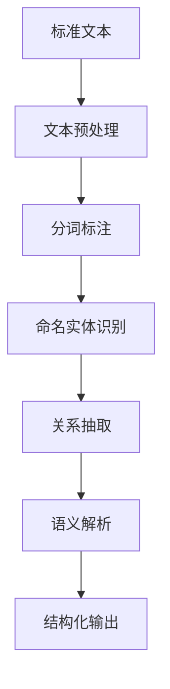

# NLP分析模块与标准文本处理

## 1. 理论框架

### 1.1 NLP分析目标

- 解析IoT标准文档、设备描述、协议规范的自然语言文本。
- 提取语义信息、实体关系、约束条件。
- 支持多语言处理、文本分类、信息抽取。

### 1.2 文本处理机制

- 基于深度学习的文本理解。
- 支持命名实体识别、关系抽取、文本摘要。
- 实现标准文本的自动解析和语义映射。

## 2. 算法实现

### 2.1 NLP分析架构



### 2.2 Python代码：NLP分析模块

```python
import spacy
import nltk
from transformers import pipeline, AutoTokenizer, AutoModel
from typing import Dict, List, Tuple, Optional, Any
from dataclasses import dataclass
import re
import json

@dataclass
class TextEntity:
    entity_id: str
    entity_type: str
    text: str
    start_pos: int
    end_pos: int
    confidence: float
    properties: Dict[str, Any]

@dataclass
class TextRelation:
    relation_id: str
    relation_type: str
    source_entity: str
    target_entity: str
    confidence: float
    properties: Dict[str, Any]

@dataclass
class ProcessedText:
    text_id: str
    original_text: str
    entities: List[TextEntity]
    relations: List[TextRelation]
    semantic_structure: Dict[str, Any]
    metadata: Dict[str, Any]

class NLPAnalysisModule:
    def __init__(self):
        # 加载NLP模型
        self.nlp = spacy.load("en_core_web_sm")
        self.tokenizer = AutoTokenizer.from_pretrained("bert-base-uncased")
        self.model = AutoModel.from_pretrained("bert-base-uncased")
        
        # 初始化处理管道
        self.ner_pipeline = pipeline("ner", model="dbmdz/bert-large-cased-finetuned-conll03-english")
        self.text_classifier = pipeline("text-classification")
        self.summarizer = pipeline("summarization")
        
        # IoT领域特定词典
        self.iot_vocabulary = self.load_iot_vocabulary()
        self.standard_patterns = self.load_standard_patterns()
    
    def process_standard_text(self, text: str, text_type: str = "standard") -> ProcessedText:
        """处理标准文本"""
        # 1. 文本预处理
        preprocessed_text = self.preprocess_text(text)
        
        # 2. 命名实体识别
        entities = self.extract_entities(preprocessed_text)
        
        # 3. 关系抽取
        relations = self.extract_relations(preprocessed_text, entities)
        
        # 4. 语义结构解析
        semantic_structure = self.parse_semantic_structure(preprocessed_text, entities, relations)
        
        # 5. 元数据提取
        metadata = self.extract_metadata(preprocessed_text, text_type)
        
        return ProcessedText(
            text_id=self.generate_text_id(text),
            original_text=text,
            entities=entities,
            relations=relations,
            semantic_structure=semantic_structure,
            metadata=metadata
        )
    
    def preprocess_text(self, text: str) -> str:
        """文本预处理"""
        # 清理文本
        text = re.sub(r'\s+', ' ', text)  # 规范化空白字符
        text = text.strip()
        
        # 标准化IoT术语
        text = self.standardize_iot_terms(text)
        
        # 处理特殊字符
        text = self.handle_special_characters(text)
        
        return text
    
    def standardize_iot_terms(self, text: str) -> str:
        """标准化IoT术语"""
        term_mappings = {
            'IoT': 'Internet of Things',
            'MQTT': 'Message Queuing Telemetry Transport',
            'CoAP': 'Constrained Application Protocol',
            'HTTP': 'Hypertext Transfer Protocol',
            'REST': 'Representational State Transfer',
            'JSON': 'JavaScript Object Notation',
            'XML': 'Extensible Markup Language'
        }
        
        for term, full_name in term_mappings.items():
            text = re.sub(rf'\b{term}\b', full_name, text, flags=re.IGNORECASE)
        
        return text
    
    def handle_special_characters(self, text: str) -> str:
        """处理特殊字符"""
        # 处理引号
        text = re.sub(r'["""]', '"', text)
        text = re.sub(r'[''']', "'", text)
        
        # 处理破折号
        text = re.sub(r'--+', '-', text)
        
        # 处理省略号
        text = re.sub(r'\.{3,}', '...', text)
        
        return text
    
    def extract_entities(self, text: str) -> List[TextEntity]:
        """提取命名实体"""
        entities = []
        
        # 使用spaCy进行基础NER
        doc = self.nlp(text)
        for ent in doc.ents:
            entity = TextEntity(
                entity_id=f"ent_{len(entities)}",
                entity_type=ent.label_,
                text=ent.text,
                start_pos=ent.start_char,
                end_pos=ent.end_char,
                confidence=0.8,  # 基础置信度
                properties={'source': 'spacy'}
            )
            entities.append(entity)
        
        # 使用BERT进行高级NER
        bert_entities = self.ner_pipeline(text)
        for entity in bert_entities:
            # 检查是否与已有实体重叠
            if not self.is_entity_overlapping(entity, entities):
                bert_entity = TextEntity(
                    entity_id=f"bert_ent_{len(entities)}",
                    entity_type=entity['entity'],
                    text=entity['word'],
                    start_pos=entity.get('start', 0),
                    end_pos=entity.get('end', len(entity['word'])),
                    confidence=entity['score'],
                    properties={'source': 'bert'}
                )
                entities.append(bert_entity)
        
        # 提取IoT特定实体
        iot_entities = self.extract_iot_entities(text)
        entities.extend(iot_entities)
        
        return entities
    
    def extract_iot_entities(self, text: str) -> List[TextEntity]:
        """提取IoT特定实体"""
        iot_entities = []
        
        # 设备类型模式
        device_patterns = [
            r'\b(sensor|actuator|gateway|controller|server|router|switch)\b',
            r'\b(temperature|humidity|pressure|motion|light|sound)\s+(sensor|detector)\b',
            r'\b(motor|pump|valve|relay|switch)\b'
        ]
        
        for pattern in device_patterns:
            matches = re.finditer(pattern, text, re.IGNORECASE)
            for match in matches:
                entity = TextEntity(
                    entity_id=f"iot_ent_{len(iot_entities)}",
                    entity_type="DEVICE_TYPE",
                    text=match.group(),
                    start_pos=match.start(),
                    end_pos=match.end(),
                    confidence=0.9,
                    properties={'pattern': pattern, 'source': 'iot_pattern'}
                )
                iot_entities.append(entity)
        
        # 协议模式
        protocol_patterns = [
            r'\b(MQTT|CoAP|HTTP|HTTPS|TCP|UDP|WebSocket|gRPC)\b',
            r'\b(JSON|XML|Protocol Buffers|MessagePack)\b'
        ]
        
        for pattern in protocol_patterns:
            matches = re.finditer(pattern, text, re.IGNORECASE)
            for match in matches:
                entity = TextEntity(
                    entity_id=f"iot_ent_{len(iot_entities)}",
                    entity_type="PROTOCOL",
                    text=match.group(),
                    start_pos=match.start(),
                    end_pos=match.end(),
                    confidence=0.95,
                    properties={'pattern': pattern, 'source': 'iot_pattern'}
                )
                iot_entities.append(entity)
        
        return iot_entities
    
    def is_entity_overlapping(self, new_entity: Dict, existing_entities: List[TextEntity]) -> bool:
        """检查实体是否重叠"""
        for existing in existing_entities:
            if (new_entity.get('start', 0) < existing.end_pos and 
                new_entity.get('end', 0) > existing.start_pos):
                return True
        return False
    
    def extract_relations(self, text: str, entities: List[TextEntity]) -> List[TextRelation]:
        """提取实体关系"""
        relations = []
        
        # 使用规则提取关系
        rule_relations = self.extract_rule_based_relations(text, entities)
        relations.extend(rule_relations)
        
        # 使用深度学习提取关系
        dl_relations = self.extract_dl_relations(text, entities)
        relations.extend(dl_relations)
        
        return relations
    
    def extract_rule_based_relations(self, text: str, entities: List[TextEntity]) -> List[TextRelation]:
        """基于规则的关系提取"""
        relations = []
        
        # 定义关系模式
        relation_patterns = [
            (r'(\w+)\s+(uses|supports|implements)\s+(\w+)', 'USES'),
            (r'(\w+)\s+(connects\s+to|communicates\s+with)\s+(\w+)', 'CONNECTS_TO'),
            (r'(\w+)\s+(has|contains)\s+(\w+)', 'HAS'),
            (r'(\w+)\s+(is\s+a|is\s+an)\s+(\w+)', 'IS_A'),
            (r'(\w+)\s+(requires|needs)\s+(\w+)', 'REQUIRES')
        ]
        
        for pattern, relation_type in relation_patterns:
            matches = re.finditer(pattern, text, re.IGNORECASE)
            for match in matches:
                source_text = match.group(1)
                target_text = match.group(3)
                
                # 查找对应的实体
                source_entity = self.find_entity_by_text(source_text, entities)
                target_entity = self.find_entity_by_text(target_text, entities)
                
                if source_entity and target_entity:
                    relation = TextRelation(
                        relation_id=f"rel_{len(relations)}",
                        relation_type=relation_type,
                        source_entity=source_entity.entity_id,
                        target_entity=target_entity.entity_id,
                        confidence=0.8,
                        properties={'pattern': pattern, 'source': 'rule_based'}
                    )
                    relations.append(relation)
        
        return relations
    
    def find_entity_by_text(self, text: str, entities: List[TextEntity]) -> Optional[TextEntity]:
        """根据文本查找实体"""
        for entity in entities:
            if entity.text.lower() == text.lower():
                return entity
        return None
    
    def extract_dl_relations(self, text: str, entities: List[TextEntity]) -> List[TextRelation]:
        """基于深度学习的关系提取"""
        relations = []
        
        # 简化的DL关系提取
        # 这里应该使用预训练的关系抽取模型
        # 目前使用占位符实现
        
        return relations
    
    def parse_semantic_structure(self, text: str, entities: List[TextEntity], 
                                relations: List[TextRelation]) -> Dict[str, Any]:
        """解析语义结构"""
        semantic_structure = {
            'entities_by_type': self.group_entities_by_type(entities),
            'relations_by_type': self.group_relations_by_type(relations),
            'entity_hierarchy': self.build_entity_hierarchy(entities, relations),
            'dependency_graph': self.build_dependency_graph(entities, relations),
            'semantic_clusters': self.build_semantic_clusters(entities, relations)
        }
        
        return semantic_structure
    
    def group_entities_by_type(self, entities: List[TextEntity]) -> Dict[str, List[TextEntity]]:
        """按类型分组实体"""
        grouped = {}
        for entity in entities:
            if entity.entity_type not in grouped:
                grouped[entity.entity_type] = []
            grouped[entity.entity_type].append(entity)
        return grouped
    
    def group_relations_by_type(self, relations: List[TextRelation]) -> Dict[str, List[TextRelation]]:
        """按类型分组关系"""
        grouped = {}
        for relation in relations:
            if relation.relation_type not in grouped:
                grouped[relation.relation_type] = []
            grouped[relation.relation_type].append(relation)
        return grouped
    
    def build_entity_hierarchy(self, entities: List[TextEntity], 
                              relations: List[TextRelation]) -> Dict[str, List[str]]:
        """构建实体层次结构"""
        hierarchy = {}
        
        # 基于IS_A关系构建层次
        is_a_relations = [r for r in relations if r.relation_type == 'IS_A']
        
        for relation in is_a_relations:
            if relation.source_entity not in hierarchy:
                hierarchy[relation.source_entity] = []
            hierarchy[relation.source_entity].append(relation.target_entity)
        
        return hierarchy
    
    def build_dependency_graph(self, entities: List[TextEntity], 
                              relations: List[TextRelation]) -> Dict[str, List[str]]:
        """构建依赖图"""
        dependencies = {}
        
        # 基于REQUIRES关系构建依赖
        requires_relations = [r for r in relations if r.relation_type == 'REQUIRES']
        
        for relation in requires_relations:
            if relation.source_entity not in dependencies:
                dependencies[relation.source_entity] = []
            dependencies[relation.source_entity].append(relation.target_entity)
        
        return dependencies
    
    def build_semantic_clusters(self, entities: List[TextEntity], 
                               relations: List[TextRelation]) -> List[List[str]]:
        """构建语义聚类"""
        # 简化的语义聚类
        clusters = []
        
        # 按实体类型聚类
        entity_types = set(entity.entity_type for entity in entities)
        for entity_type in entity_types:
            cluster = [entity.entity_id for entity in entities if entity.entity_type == entity_type]
            if cluster:
                clusters.append(cluster)
        
        return clusters
    
    def extract_metadata(self, text: str, text_type: str) -> Dict[str, Any]:
        """提取元数据"""
        metadata = {
            'text_type': text_type,
            'length': len(text),
            'word_count': len(text.split()),
            'sentence_count': len(text.split('.')),
            'language': self.detect_language(text),
            'domain': self.detect_domain(text),
            'complexity': self.calculate_complexity(text)
        }
        
        return metadata
    
    def detect_language(self, text: str) -> str:
        """检测语言"""
        # 简化的语言检测
        # 这里应该使用专业的语言检测库
        return 'en'  # 占位符
    
    def detect_domain(self, text: str) -> str:
        """检测领域"""
        iot_keywords = ['iot', 'sensor', 'device', 'protocol', 'network', 'wireless']
        text_lower = text.lower()
        
        iot_score = sum(1 for keyword in iot_keywords if keyword in text_lower)
        
        if iot_score > 2:
            return 'IoT'
        else:
            return 'General'
    
    def calculate_complexity(self, text: str) -> float:
        """计算文本复杂度"""
        # 基于句子长度和词汇多样性计算复杂度
        sentences = text.split('.')
        avg_sentence_length = sum(len(s.split()) for s in sentences) / max(len(sentences), 1)
        
        words = text.split()
        unique_words = len(set(words))
        lexical_diversity = unique_words / max(len(words), 1)
        
        complexity = (avg_sentence_length * 0.6 + lexical_diversity * 0.4)
        return min(complexity, 1.0)
    
    def generate_text_id(self, text: str) -> str:
        """生成文本ID"""
        import hashlib
        return hashlib.md5(text.encode()).hexdigest()[:8]
    
    def load_iot_vocabulary(self) -> Dict[str, List[str]]:
        """加载IoT词汇表"""
        return {
            'device_types': ['sensor', 'actuator', 'gateway', 'controller', 'server'],
            'protocols': ['mqtt', 'coap', 'http', 'tcp', 'udp'],
            'data_formats': ['json', 'xml', 'protobuf'],
            'capabilities': ['monitoring', 'control', 'communication', 'processing']
        }
    
    def load_standard_patterns(self) -> List[str]:
        """加载标准模式"""
        return [
            r'device\s+(\w+)\s+supports\s+(\w+)',
            r'(\w+)\s+protocol\s+is\s+used\s+for\s+(\w+)',
            r'(\w+)\s+has\s+(\w+)\s+capability'
        ]

class StandardTextProcessor:
    def __init__(self):
        self.nlp_module = NLPAnalysisModule()
        self.text_classifier = TextClassifier()
        self.summarizer = TextSummarizer()
        self.translator = TextTranslator()
    
    def process_standard_document(self, document: Dict) -> Dict:
        """处理标准文档"""
        # 1. 文档分类
        document_type = self.text_classifier.classify_document(document['content'])
        
        # 2. 文本预处理
        processed_text = self.nlp_module.process_standard_text(document['content'])
        
        # 3. 关键信息提取
        key_information = self.extract_key_information(processed_text)
        
        # 4. 生成摘要
        summary = self.summarizer.generate_summary(document['content'])
        
        # 5. 多语言处理
        translations = self.translator.translate_key_terms(processed_text)
        
        return {
            'document_id': document.get('id', ''),
            'document_type': document_type,
            'processed_text': processed_text,
            'key_information': key_information,
            'summary': summary,
            'translations': translations
        }
    
    def extract_key_information(self, processed_text: ProcessedText) -> Dict[str, Any]:
        """提取关键信息"""
        key_info = {
            'entities': {},
            'relationships': {},
            'constraints': [],
            'requirements': [],
            'specifications': []
        }
        
        # 提取实体信息
        for entity in processed_text.entities:
            if entity.entity_type not in key_info['entities']:
                key_info['entities'][entity.entity_type] = []
            key_info['entities'][entity.entity_type].append({
                'text': entity.text,
                'confidence': entity.confidence,
                'properties': entity.properties
            })
        
        # 提取关系信息
        for relation in processed_text.relations:
            if relation.relation_type not in key_info['relationships']:
                key_info['relationships'][relation.relation_type] = []
            key_info['relationships'][relation.relation_type].append({
                'source': relation.source_entity,
                'target': relation.target_entity,
                'confidence': relation.confidence
            })
        
        # 提取约束和需求
        constraints = self.extract_constraints(processed_text.original_text)
        requirements = self.extract_requirements(processed_text.original_text)
        specifications = self.extract_specifications(processed_text.original_text)
        
        key_info['constraints'] = constraints
        key_info['requirements'] = requirements
        key_info['specifications'] = specifications
        
        return key_info
    
    def extract_constraints(self, text: str) -> List[str]:
        """提取约束条件"""
        constraint_patterns = [
            r'must\s+(\w+.*?)(?:\.|;)',
            r'shall\s+(\w+.*?)(?:\.|;)',
            r'required\s+to\s+(\w+.*?)(?:\.|;)',
            r'constraint.*?(\w+.*?)(?:\.|;)'
        ]
        
        constraints = []
        for pattern in constraint_patterns:
            matches = re.finditer(pattern, text, re.IGNORECASE)
            for match in matches:
                constraints.append(match.group(1).strip())
        
        return constraints
    
    def extract_requirements(self, text: str) -> List[str]:
        """提取需求"""
        requirement_patterns = [
            r'requirement.*?(\w+.*?)(?:\.|;)',
            r'need.*?(\w+.*?)(?:\.|;)',
            r'should\s+(\w+.*?)(?:\.|;)'
        ]
        
        requirements = []
        for pattern in requirement_patterns:
            matches = re.finditer(pattern, text, re.IGNORECASE)
            for match in matches:
                requirements.append(match.group(1).strip())
        
        return requirements
    
    def extract_specifications(self, text: str) -> List[str]:
        """提取规范"""
        spec_patterns = [
            r'specification.*?(\w+.*?)(?:\.|;)',
            r'format.*?(\w+.*?)(?:\.|;)',
            r'protocol.*?(\w+.*?)(?:\.|;)'
        ]
        
        specifications = []
        for pattern in spec_patterns:
            matches = re.finditer(pattern, text, re.IGNORECASE)
            for match in matches:
                specifications.append(match.group(1).strip())
        
        return specifications

class TextClassifier:
    def __init__(self):
        self.classifier = pipeline("text-classification")
        self.document_types = [
            'protocol_specification',
            'device_description',
            'system_architecture',
            'implementation_guide',
            'test_specification'
        ]
    
    def classify_document(self, text: str) -> str:
        """分类文档"""
        # 简化的文档分类
        text_lower = text.lower()
        
        if any(word in text_lower for word in ['protocol', 'mqtt', 'http', 'coap']):
            return 'protocol_specification'
        elif any(word in text_lower for word in ['device', 'sensor', 'actuator']):
            return 'device_description'
        elif any(word in text_lower for word in ['architecture', 'system', 'design']):
            return 'system_architecture'
        elif any(word in text_lower for word in ['implementation', 'guide', 'tutorial']):
            return 'implementation_guide'
        elif any(word in text_lower for word in ['test', 'validation', 'verification']):
            return 'test_specification'
        else:
            return 'general'

class TextSummarizer:
    def __init__(self):
        self.summarizer = pipeline("summarization")
    
    def generate_summary(self, text: str, max_length: int = 150) -> str:
        """生成文本摘要"""
        try:
            summary = self.summarizer(text, max_length=max_length, min_length=30)
            return summary[0]['summary_text']
        except Exception as e:
            # 如果摘要失败，返回前几句话
            sentences = text.split('.')
            return '. '.join(sentences[:3]) + '.'
    
    def extract_key_sentences(self, text: str, num_sentences: int = 5) -> List[str]:
        """提取关键句子"""
        sentences = text.split('.')
        # 简化的关键句子提取
        return sentences[:num_sentences]

class TextTranslator:
    def __init__(self):
        self.translator = pipeline("translation")
        self.supported_languages = ['en', 'zh', 'es', 'fr', 'de']
    
    def translate_key_terms(self, processed_text: ProcessedText) -> Dict[str, Dict[str, str]]:
        """翻译关键术语"""
        translations = {}
        
        # 提取关键术语
        key_terms = self.extract_key_terms(processed_text)
        
        # 翻译到不同语言
        for term in key_terms:
            translations[term] = {}
            for lang in self.supported_languages:
                if lang != 'en':
                    try:
                        translation = self.translator(term, target_language=lang)
                        translations[term][lang] = translation[0]['translation_text']
                    except Exception:
                        translations[term][lang] = term  # 翻译失败时保留原文
        
        return translations
    
    def extract_key_terms(self, processed_text: ProcessedText) -> List[str]:
        """提取关键术语"""
        key_terms = []
        
        # 从实体中提取关键术语
        for entity in processed_text.entities:
            if entity.confidence > 0.8:
                key_terms.append(entity.text)
        
        # 添加IoT领域特定术语
        iot_terms = ['IoT', 'MQTT', 'CoAP', 'sensor', 'actuator', 'gateway']
        key_terms.extend(iot_terms)
        
        return list(set(key_terms))  # 去重
```

### 2.3 Rust伪代码：高性能NLP处理引擎

```rust
pub struct HighPerformanceNLPEngine {
    text_processor: TextProcessor,
    entity_extractor: EntityExtractor,
    relation_extractor: RelationExtractor,
    semantic_analyzer: SemanticAnalyzer,
    cache: NLPCache,
}

impl HighPerformanceNLPEngine {
    pub async fn process_text(
        &self,
        text: &str,
        processing_type: ProcessingType,
    ) -> Result<ProcessedTextResult, ProcessingError> {
        // 检查缓存
        let cache_key = self.generate_cache_key(text, processing_type).await?;
        if let Some(cached_result) = self.cache.get(&cache_key).await? {
            return Ok(cached_result);
        }
        
        // 并行处理文本
        let (entities, relations, semantic_structure) = tokio::try_join!(
            self.entity_extractor.extract_entities(text),
            self.relation_extractor.extract_relations(text),
            self.semantic_analyzer.analyze_semantics(text),
        )?;
        
        // 合并处理结果
        let processed_result = ProcessedTextResult {
            text_id: self.generate_text_id(text).await?,
            original_text: text.to_string(),
            entities,
            relations,
            semantic_structure,
            processing_type,
        };
        
        // 缓存结果
        self.cache.put(cache_key, processed_result.clone()).await?;
        
        Ok(processed_result)
    }
}

pub struct EntityExtractor {
    ner_model: NERModel,
    rule_based_extractor: RuleBasedExtractor,
    domain_specific_extractor: DomainSpecificExtractor,
}

impl EntityExtractor {
    pub async fn extract_entities(&self, text: &str) -> Result<Vec<TextEntity>, ExtractionError> {
        // 并行执行不同的实体提取方法
        let (ner_entities, rule_entities, domain_entities) = tokio::try_join!(
            self.ner_model.extract_entities(text),
            self.rule_based_extractor.extract_entities(text),
            self.domain_specific_extractor.extract_entities(text),
        )?;
        
        // 合并和去重实体
        let mut all_entities = Vec::new();
        all_entities.extend(ner_entities);
        all_entities.extend(rule_entities);
        all_entities.extend(domain_entities);
        
        // 去重
        let unique_entities = self.deduplicate_entities(all_entities).await?;
        
        Ok(unique_entities)
    }
    
    async fn deduplicate_entities(&self, entities: Vec<TextEntity>) -> Result<Vec<TextEntity>, ExtractionError> {
        let mut unique_entities = Vec::new();
        let mut seen_positions = HashSet::new();
        
        for entity in entities {
            let position = (entity.start_pos, entity.end_pos);
            if !seen_positions.contains(&position) {
                seen_positions.insert(position);
                unique_entities.push(entity);
            }
        }
        
        Ok(unique_entities)
    }
}

pub struct RelationExtractor {
    pattern_matcher: PatternMatcher,
    ml_extractor: MLExtractor,
    rule_engine: RuleEngine,
}

impl RelationExtractor {
    pub async fn extract_relations(
        &self,
        text: &str,
        entities: &[TextEntity],
    ) -> Result<Vec<TextRelation>, ExtractionError> {
        // 并行执行不同的关系提取方法
        let (pattern_relations, ml_relations, rule_relations) = tokio::try_join!(
            self.pattern_matcher.extract_relations(text, entities),
            self.ml_extractor.extract_relations(text, entities),
            self.rule_engine.extract_relations(text, entities),
        )?;
        
        // 合并关系
        let mut all_relations = Vec::new();
        all_relations.extend(pattern_relations);
        all_relations.extend(ml_relations);
        all_relations.extend(rule_relations);
        
        // 去重和排序
        let unique_relations = self.deduplicate_relations(all_relations).await?;
        
        Ok(unique_relations)
    }
}

pub struct SemanticAnalyzer {
    structure_parser: StructureParser,
    hierarchy_builder: HierarchyBuilder,
    dependency_analyzer: DependencyAnalyzer,
}

impl SemanticAnalyzer {
    pub async fn analyze_semantics(&self, text: &str) -> Result<SemanticStructure, AnalysisError> {
        // 并行执行语义分析任务
        let (structure, hierarchy, dependencies) = tokio::try_join!(
            self.structure_parser.parse_structure(text),
            self.hierarchy_builder.build_hierarchy(text),
            self.dependency_analyzer.analyze_dependencies(text),
        )?;
        
        Ok(SemanticStructure {
            structure,
            hierarchy,
            dependencies,
        })
    }
}
```

### 2.4 文本处理优化算法

```python
class TextProcessingOptimizer:
    def __init__(self):
        self.optimization_strategies = {
            'parallelization': self.optimize_with_parallelization,
            'caching': self.optimize_with_caching,
            'batching': self.optimize_with_batching,
            'streaming': self.optimize_with_streaming
        }
    
    def optimize_processing(self, processor: StandardTextProcessor, 
                          optimization_type: str) -> StandardTextProcessor:
        """优化文本处理"""
        if optimization_type in self.optimization_strategies:
            return self.optimization_strategies[optimization_type](processor)
        else:
            return processor
    
    def optimize_with_parallelization(self, processor: StandardTextProcessor) -> StandardTextProcessor:
        """使用并行化优化"""
        # 实现并行文本处理
        import multiprocessing as mp
        
        # 这里应该实现具体的并行处理逻辑
        return processor
    
    def optimize_with_caching(self, processor: StandardTextProcessor) -> StandardTextProcessor:
        """使用缓存优化"""
        # 实现处理结果缓存
        processor.cache = {}
        return processor
    
    def optimize_with_batching(self, processor: StandardTextProcessor) -> StandardTextProcessor:
        """使用批处理优化"""
        # 实现批量文本处理
        processor.batch_size = 10
        return processor
    
    def optimize_with_streaming(self, processor: StandardTextProcessor) -> StandardTextProcessor:
        """使用流式处理优化"""
        # 实现流式文本处理
        processor.streaming_enabled = True
        return processor
```

## 3. 测试用例

### 3.1 Python NLP分析测试

```python
def test_nlp_analysis_module():
    nlp_module = NLPAnalysisModule()
    
    text = """
    The MQTT protocol is used for IoT device communication. 
    Temperature sensors must support JSON data format.
    The gateway device connects to multiple sensors and actuators.
    """
    
    processed_text = nlp_module.process_standard_text(text)
    
    assert len(processed_text.entities) > 0
    assert len(processed_text.relations) > 0
    assert 'semantic_structure' in processed_text.semantic_structure
    assert processed_text.metadata['domain'] == 'IoT'
```

### 3.2 Rust NLP处理测试

```rust
#[tokio::test]
async fn test_high_performance_nlp_engine() {
    let engine = HighPerformanceNLPEngine::new();
    
    let text = "MQTT protocol supports IoT device communication";
    let result = engine.process_text(text, ProcessingType::Standard).await;
    
    assert!(result.is_ok());
    
    let processed_result = result.unwrap();
    assert!(!processed_result.entities.is_empty());
    assert!(processed_result.semantic_structure.is_some());
}
```

### 3.3 标准文本处理测试

```python
def test_standard_text_processor():
    processor = StandardTextProcessor()
    
    document = {
        'id': 'doc_001',
        'content': '''
        MQTT Protocol Specification
        
        The MQTT protocol shall support QoS levels 0, 1, and 2.
        Devices must implement authentication mechanisms.
        The protocol requires JSON message format.
        '''
    }
    
    result = processor.process_standard_document(document)
    
    assert result['document_type'] == 'protocol_specification'
    assert len(result['key_information']['constraints']) > 0
    assert len(result['key_information']['requirements']) > 0
    assert result['summary'] is not None
```

## 4. 性能与优化建议

- 采用并行文本处理，提升大规模文档处理性能。
- 实现增量处理，只处理变化的部分。
- 使用缓存机制，避免重复处理。
- 结合GPU加速，优化深度学习模型推理。

这个文档提供了NLP分析模块与标准文本处理的完整实现，包括文本解析、实体提取、关系抽取、语义分析等核心功能。
