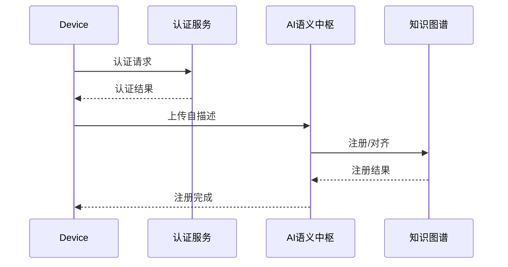
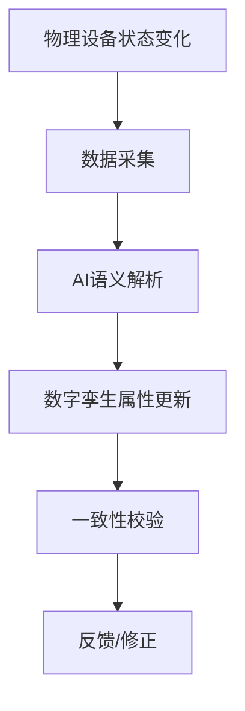

# 设备自注册与健康监测机制

## 1. 设备自注册协议流程

1. 设备上线
2. 上传自描述文件（如JSON-LD、Thing Description等）
3. AI语义解析，自动识别实体、属性、操作
4. 知识图谱对齐，完成语义注册
5. 注册完成，设备可被平台发现与管理

## 2. 语义健康监测机制

- AI定期巡检设备语义一致性
- 异常自动修复与预警
- 知识反馈与持续学习

## 3. 虚拟设备/数字孪生建模示例

```json
{
  "deviceId": "twin-001",
  "type": "DigitalTwin",
  "attributes": {
    "temperature": {"type": "float", "value": 22.5},
    "status": {"type": "string", "value": "active"}
  },
  "behaviors": [
    {"name": "sync", "trigger": "periodic", "action": "updateFromPhysical"}
  ]
}
```

## 4. 设备自注册安全机制

- 设备身份认证（如证书、密钥）
- 数据加密传输，防止中间人攻击
- 访问控制与权限管理，防止非法注册

## 5. 健康监测智能预警机制

- AI基于历史与实时数据，预测设备潜在语义异常
- 异常趋势分析，提前发出预警
- 自动修复与人工干预结合，提升系统鲁棒性

## 6. 虚拟设备/数字孪生动态同步机制

- 物理设备状态变化实时同步到数字孪生
- 支持多维属性、行为的动态更新
- 语义一致性校验，确保虚实同步无偏差

## 7. 设备自注册与安全认证时序图



## 8. 健康监测AI算法伪代码

```python
def health_monitor(device_data):
    features = extract_features(device_data)
    anomaly_score = ai_model.predict(features)
    if anomaly_score > threshold:
        alert(device_data['deviceId'])
        auto_repair(device_data)
```

## 9. 数字孪生同步流程图


