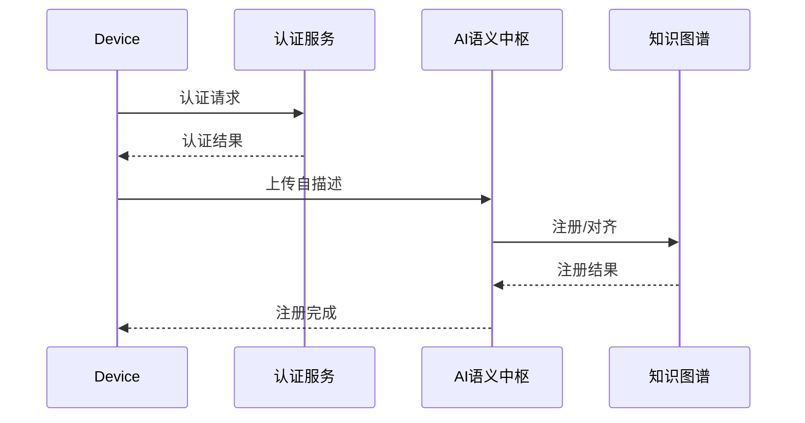
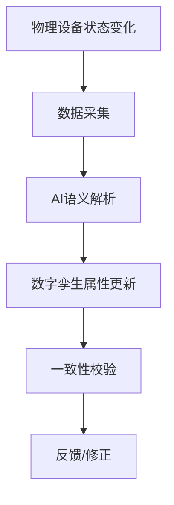

# 设备自注册与健康监测机制

## 1. 设备自注册协议流程

1. 设备上线
2. 上传自描述文件（如JSON-LD、Thing Description等）
3. AI语义解析，自动识别实体、属性、操作
4. 知识图谱对齐，完成语义注册
5. 注册完成，设备可被平台发现与管理

## 2. 语义健康监测机制

- AI定期巡检设备语义一致性
- 异常自动修复与预警
- 知识反馈与持续学习

## 3. 虚拟设备/数字孪生建模示例

```json
{
  "deviceId": "twin-001",
  "type": "DigitalTwin",
  "attributes": {
    "temperature": {"type": "float", "value": 22.5},
    "status": {"type": "string", "value": "active"}
  },
  "behaviors": [
    {"name": "sync", "trigger": "periodic", "action": "updateFromPhysical"}
  ]
}
```

## 4. 设备自注册安全机制

- 设备身份认证（如证书、密钥）
- 数据加密传输，防止中间人攻击
- 访问控制与权限管理，防止非法注册

## 5. 健康监测智能预警机制

- AI基于历史与实时数据，预测设备潜在语义异常
- 异常趋势分析，提前发出预警
- 自动修复与人工干预结合，提升系统鲁棒性

## 6. 虚拟设备/数字孪生动态同步机制

- 物理设备状态变化实时同步到数字孪生
- 支持多维属性、行为的动态更新
- 语义一致性校验，确保虚实同步无偏差

## 7. 设备自注册与安全认证时序图



## 8. 健康监测AI算法伪代码

```python
def health_monitor(device_data):
    features = extract_features(device_data)
    anomaly_score = ai_model.predict(features)
    if anomaly_score > threshold:
        alert(device_data['deviceId'])
        auto_repair(device_data)
```

## 9. 数字孪生同步流程图



## 10. 设备描述解析器实现

```python
import json
import jsonschema
from typing import Dict, Any, Optional
from dataclasses import dataclass

@dataclass
class DeviceDescription:
    device_id: str
    device_type: str
    capabilities: list
    properties: Dict[str, Any]
    actions: list
    events: list

class DeviceDescriptionParser:
    def __init__(self):
        self.schemas = {
            'json-ld': self.load_jsonld_schema(),
            'thing-description': self.load_thing_description_schema(),
            'matter': self.load_matter_schema()
        }
    
    def parse_description(self, description: str, format_type: str) -> DeviceDescription:
        """解析设备描述"""
        try:
            # 解析JSON
            data = json.loads(description)
            
            # 验证schema
            if format_type in self.schemas:
                jsonschema.validate(data, self.schemas[format_type])
            
            # 转换为统一格式
            return self.convert_to_unified_format(data, format_type)
            
        except json.JSONDecodeError as e:
            raise ValueError(f"Invalid JSON format: {e}")
        except jsonschema.ValidationError as e:
            raise ValueError(f"Schema validation failed: {e}")
    
    def convert_to_unified_format(self, data: Dict, format_type: str) -> DeviceDescription:
        """转换为统一格式"""
        if format_type == 'json-ld':
            return self.parse_jsonld(data)
        elif format_type == 'thing-description':
            return self.parse_thing_description(data)
        elif format_type == 'matter':
            return self.parse_matter(data)
        else:
            raise ValueError(f"Unsupported format: {format_type}")
    
    def parse_jsonld(self, data: Dict) -> DeviceDescription:
        """解析JSON-LD格式"""
        return DeviceDescription(
            device_id=data.get('@id', ''),
            device_type=data.get('@type', ''),
            capabilities=data.get('capabilities', []),
            properties=data.get('properties', {}),
            actions=data.get('actions', []),
            events=data.get('events', [])
        )
    
    def parse_thing_description(self, data: Dict) -> DeviceDescription:
        """解析WoT Thing Description格式"""
        return DeviceDescription(
            device_id=data.get('id', ''),
            device_type=data.get('@type', ''),
            capabilities=data.get('capabilities', []),
            properties=data.get('properties', {}),
            actions=data.get('actions', []),
            events=data.get('events', [])
        )
    
    def parse_matter(self, data: Dict) -> DeviceDescription:
        """解析Matter格式"""
        return DeviceDescription(
            device_id=data.get('deviceId', ''),
            device_type=data.get('deviceType', ''),
            capabilities=data.get('clusters', []),
            properties=data.get('attributes', {}),
            actions=data.get('commands', []),
            events=data.get('events', [])
        )
```

## 11. 健康监测机器学习模型

```python
import numpy as np
import pandas as pd
from sklearn.ensemble import IsolationForest
from sklearn.preprocessing import StandardScaler
from sklearn.model_selection import train_test_split
import joblib

class DeviceHealthMonitor:
    def __init__(self):
        self.anomaly_detector = IsolationForest(contamination=0.1, random_state=42)
        self.scaler = StandardScaler()
        self.is_trained = False
    
    def extract_features(self, device_data: Dict) -> np.ndarray:
        """提取设备特征"""
        features = []
        
        # 数值特征
        if 'temperature' in device_data:
            features.append(device_data['temperature'])
        if 'cpu_usage' in device_data:
            features.append(device_data['cpu_usage'])
        if 'memory_usage' in device_data:
            features.append(device_data['memory_usage'])
        if 'response_time' in device_data:
            features.append(device_data['response_time'])
        
        # 统计特征
        if 'error_count' in device_data:
            features.append(device_data['error_count'])
        if 'uptime' in device_data:
            features.append(device_data['uptime'])
        
        return np.array(features).reshape(1, -1)
    
    def train_model(self, training_data: List[Dict]):
        """训练异常检测模型"""
        # 提取特征
        features_list = []
        for data in training_data:
            features = self.extract_features(data)
            features_list.append(features.flatten())
        
        features_array = np.array(features_list)
        
        # 标准化
        features_scaled = self.scaler.fit_transform(features_array)
        
        # 训练模型
        self.anomaly_detector.fit(features_scaled)
        self.is_trained = True
    
    def predict_anomaly(self, device_data: Dict) -> Dict:
        """预测设备异常"""
        if not self.is_trained:
            raise ValueError("Model not trained yet")
        
        # 提取特征
        features = self.extract_features(device_data)
        features_scaled = self.scaler.transform(features)
        
        # 预测
        anomaly_score = self.anomaly_detector.decision_function(features_scaled)[0]
        is_anomaly = self.anomaly_detector.predict(features_scaled)[0] == -1
        
        return {
            'device_id': device_data.get('device_id', ''),
            'anomaly_score': anomaly_score,
            'is_anomaly': is_anomaly,
            'confidence': self.calculate_confidence(anomaly_score)
        }
    
    def calculate_confidence(self, anomaly_score: float) -> float:
        """计算预测置信度"""
        # 基于异常分数的置信度计算
        return 1.0 / (1.0 + np.exp(-anomaly_score))
    
    def save_model(self, filepath: str):
        """保存模型"""
        model_data = {
            'anomaly_detector': self.anomaly_detector,
            'scaler': self.scaler,
            'is_trained': self.is_trained
        }
        joblib.dump(model_data, filepath)
    
    def load_model(self, filepath: str):
        """加载模型"""
        model_data = joblib.load(filepath)
        self.anomaly_detector = model_data['anomaly_detector']
        self.scaler = model_data['scaler']
        self.is_trained = model_data['is_trained']
```

## 12. 安全认证实现

```python
import hashlib
import hmac
import base64
import time
import jwt
from cryptography.hazmat.primitives import hashes
from cryptography.hazmat.primitives.kdf.pbkdf2 import PBKDF2HMAC
from cryptography.hazmat.primitives.ciphers import Cipher, algorithms, modes
import os

class DeviceSecurityManager:
    def __init__(self, secret_key: str):
        self.secret_key = secret_key.encode()
        self.salt = os.urandom(16)
    
    def generate_device_certificate(self, device_id: str, public_key: str) -> str:
        """生成设备证书"""
        payload = {
            'device_id': device_id,
            'public_key': public_key,
            'issued_at': int(time.time()),
            'expires_at': int(time.time()) + 365 * 24 * 3600  # 1年有效期
        }
        
        return jwt.encode(payload, self.secret_key, algorithm='HS256')
    
    def verify_device_certificate(self, certificate: str) -> Dict:
        """验证设备证书"""
        try:
            payload = jwt.decode(certificate, self.secret_key, algorithms=['HS256'])
            return payload
        except jwt.ExpiredSignatureError:
            raise ValueError("Certificate expired")
        except jwt.InvalidTokenError:
            raise ValueError("Invalid certificate")
    
    def encrypt_data(self, data: str) -> str:
        """加密数据"""
        # 生成密钥
        kdf = PBKDF2HMAC(
            algorithm=hashes.SHA256(),
            length=32,
            salt=self.salt,
            iterations=100000,
        )
        key = kdf.derive(self.secret_key)
        
        # 生成IV
        iv = os.urandom(16)
        
        # 加密
        cipher = Cipher(algorithms.AES(key), modes.CBC(iv))
        encryptor = cipher.encryptor()
        
        # 填充数据
        padded_data = data.encode()
        if len(padded_data) % 16 != 0:
            padded_data += b'\0' * (16 - len(padded_data) % 16)
        
        encrypted_data = encryptor.update(padded_data) + encryptor.finalize()
        
        # 返回base64编码的结果
        return base64.b64encode(iv + encrypted_data).decode()
    
    def decrypt_data(self, encrypted_data: str) -> str:
        """解密数据"""
        # 解码
        data = base64.b64decode(encrypted_data.encode())
        
        # 提取IV和加密数据
        iv = data[:16]
        encrypted = data[16:]
        
        # 生成密钥
        kdf = PBKDF2HMAC(
            algorithm=hashes.SHA256(),
            length=32,
            salt=self.salt,
            iterations=100000,
        )
        key = kdf.derive(self.secret_key)
        
        # 解密
        cipher = Cipher(algorithms.AES(key), modes.CBC(iv))
        decryptor = cipher.decryptor()
        
        decrypted_data = decryptor.update(encrypted) + decryptor.finalize()
        
        # 去除填充
        return decrypted_data.rstrip(b'\0').decode()
    
    def generate_hmac(self, data: str) -> str:
        """生成HMAC签名"""
        return hmac.new(
            self.secret_key,
            data.encode(),
            hashlib.sha256
        ).hexdigest()
    
    def verify_hmac(self, data: str, signature: str) -> bool:
        """验证HMAC签名"""
        expected_signature = self.generate_hmac(data)
        return hmac.compare_digest(expected_signature, signature)
```
