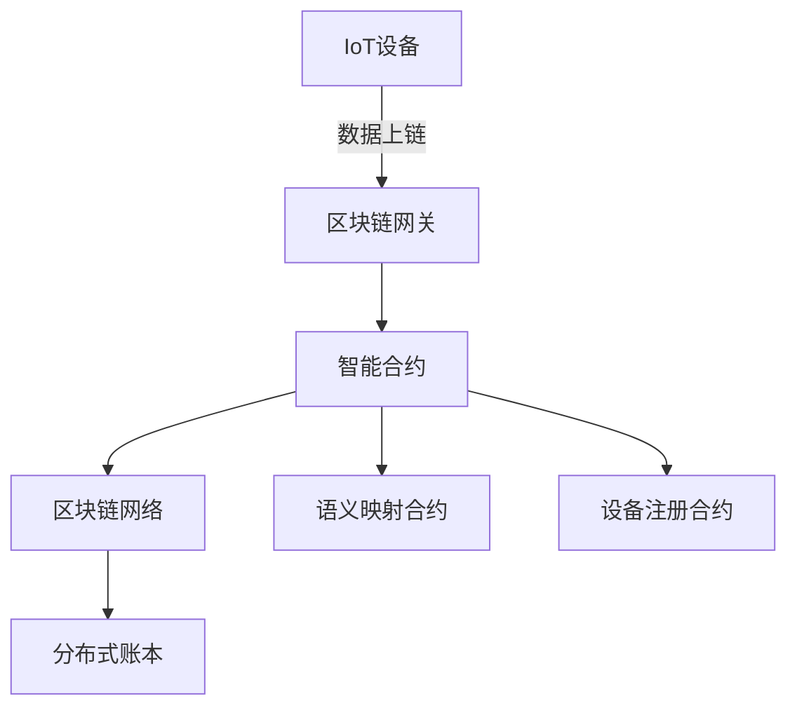

# 区块链集成与分布式共识

## 1. 理论框架

### 1.1 区块链与IoT语义互操作集成

- 利用区块链不可篡改、去中心化特性，实现IoT多标准语义映射、设备注册、数据溯源、互操作事件记录。
- 采用智能合约自动执行语义映射、标准转换、设备健康状态上链等操作。

### 1.2 分布式共识机制

- 支持PoW、PoS、PBFT等多种共识算法，适应不同IoT场景下的性能与安全需求。
- 设计轻量级共识协议，兼顾边缘设备资源受限与全局一致性。

## 2. 工程实现

### 2.1 区块链集成架构



### 2.2 智能合约示例（Solidity）

```solidity
// SPDX-License-Identifier: MIT
pragma solidity ^0.8.0;

contract DeviceSemanticRegistry {
    struct Device {
        string deviceId;
        string semanticHash;
        string standard;
        uint256 registeredAt;
    }
    mapping(string => Device) public devices;
    event DeviceRegistered(string deviceId, string semanticHash, string standard, uint256 timestamp);

    function registerDevice(string memory deviceId, string memory semanticHash, string memory standard) public {
        devices[deviceId] = Device(deviceId, semanticHash, standard, block.timestamp);
        emit DeviceRegistered(deviceId, semanticHash, standard, block.timestamp);
    }
}
```

### 2.3 Rust区块链客户端集成

```rust
use web3::types::{Address, U256};
use web3::contract::{Contract, Options};
use web3::transports::Http;

async fn register_device_on_chain(device_id: &str, semantic_hash: &str, standard: &str) -> web3::Result<()> {
    let transport = Http::new("http://localhost:8545")?;
    let web3 = web3::Web3::new(transport);
    let contract_address: Address = "0x...".parse().unwrap();
    let contract = Contract::from_json(
        web3.eth(),
        contract_address,
        include_bytes!("DeviceSemanticRegistry.abi"),
    )?;
    let accounts = web3.eth().accounts().await?;
    let tx = contract.call(
        "registerDevice",
        (device_id.to_string(), semantic_hash.to_string(), standard.to_string()),
        accounts[0],
        Options::default(),
    ).await?;
    println!("Device registered: tx hash = {:?}", tx);
    Ok(())
}
```

### 2.4 分布式共识算法伪代码（PBFT）

```python
def pbft_consensus(nodes, request):
    # 1. Pre-prepare阶段
    primary = nodes[0]
    pre_prepare_msg = primary.create_pre_prepare(request)
    for node in nodes[1:]:
        node.receive_pre_prepare(pre_prepare_msg)
    # 2. Prepare阶段
    for node in nodes:
        prepare_msg = node.create_prepare(pre_prepare_msg)
        for peer in nodes:
            peer.receive_prepare(prepare_msg)
    # 3. Commit阶段
    for node in nodes:
        commit_msg = node.create_commit(prepare_msg)
        for peer in nodes:
            peer.receive_commit(commit_msg)
    # 4. 达成共识
    for node in nodes:
        if node.has_enough_commits():
            node.commit(request)
```

## 3. 测试用例

### 3.1 智能合约注册测试

```solidity
// Truffle测试
contract("DeviceSemanticRegistry", accounts => {
  it("should register a device", async () => {
    const registry = await DeviceSemanticRegistry.deployed();
    await registry.registerDevice("dev001", "hash001", "OPC-UA");
    const device = await registry.devices("dev001");
    assert.equal(device.deviceId, "dev001");
    assert.equal(device.semanticHash, "hash001");
    assert.equal(device.standard, "OPC-UA");
  });
});
```

### 3.2 Rust客户端集成测试

```rust
#[tokio::test]
async fn test_register_device_on_chain() {
    let result = register_device_on_chain("dev001", "hash001", "OPC-UA").await;
    assert!(result.is_ok());
}
```

## 4. 性能优化建议

- 采用分层链下缓存，减少链上操作频率。
- 智能合约函数精简，降低Gas消耗。
- 共识节点分组，提升大规模IoT场景下的吞吐量。
- 支持异步批量上链，提升数据写入效率。
