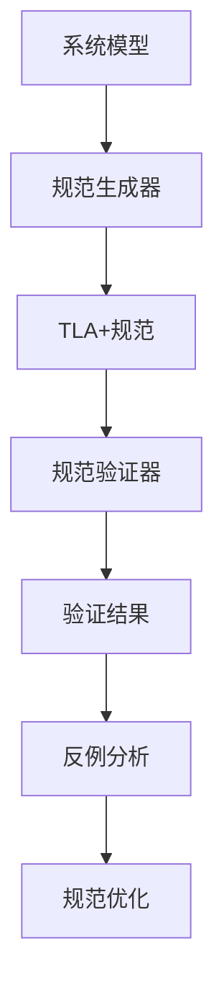

# TLA+规范自动生成与验证

## 1. 理论框架

### 1.1 TLA+规范目标

- 自动生成IoT系统的TLA+形式化规范，支持系统行为验证。
- 实现规范的正确性验证、一致性检查、完备性分析。
- 支持规范的可视化、文档化、版本管理。

### 1.2 自动生成与验证机制

- 基于系统模型的规范自动生成。
- 支持模型检查、定理证明、反例生成。
- 实现规范的增量更新和演化管理。

## 2. 算法实现

### 2.1 TLA+规范生成架构



### 2.2 Python代码：TLA+规范生成器

```python
from typing import Dict, List, Tuple, Optional, Any
from dataclasses import dataclass
from enum import Enum
import re
import json

class SpecificationType(Enum):
    SYSTEM_BEHAVIOR = "system_behavior"
    PROTOCOL_VERIFICATION = "protocol_verification"
    SAFETY_PROPERTY = "safety_property"
    LIVENESS_PROPERTY = "liveness_property"

@dataclass
class TLAVariable:
    name: str
    type: str
    initial_value: Any
    description: str

@dataclass
class TLAOperator:
    name: str
    parameters: List[str]
    definition: str
    description: str

@dataclass
class TLAProperty:
    name: str
    property_type: str  # safety, liveness, invariant
    definition: str
    description: str

@dataclass
class TLASpecification:
    name: str
    variables: List[TLAVariable]
    operators: List[TLAOperator]
    properties: List[TLAProperty]
    invariants: List[str]
    actions: List[str]
    fairness_conditions: List[str]

class TLAplusSpecificationGenerator:
    def __init__(self):
        self.template_engine = TLATemplateEngine()
        self.verification_engine = TLAVerificationEngine()
        self.optimization_engine = TLAOptimizationEngine()
    
    def generate_specification(self, system_model: Dict) -> TLASpecification:
        """生成TLA+规范"""
        # 1. 解析系统模型
        parsed_model = self.parse_system_model(system_model)
        
        # 2. 生成变量定义
        variables = self.generate_variables(parsed_model)
        
        # 3. 生成操作符定义
        operators = self.generate_operators(parsed_model)
        
        # 4. 生成属性定义
        properties = self.generate_properties(parsed_model)
        
        # 5. 生成不变量
        invariants = self.generate_invariants(parsed_model)
        
        # 6. 生成动作定义
        actions = self.generate_actions(parsed_model)
        
        # 7. 生成公平性条件
        fairness_conditions = self.generate_fairness_conditions(parsed_model)
        
        return TLASpecification(
            name=parsed_model['name'],
            variables=variables,
            operators=operators,
            properties=properties,
            invariants=invariants,
            actions=actions,
            fairness_conditions=fairness_conditions
        )
    
    def parse_system_model(self, system_model: Dict) -> Dict:
        """解析系统模型"""
        parsed_model = {
            'name': system_model.get('name', 'System'),
            'components': system_model.get('components', []),
            'states': system_model.get('states', []),
            'transitions': system_model.get('transitions', []),
            'properties': system_model.get('properties', []),
            'constraints': system_model.get('constraints', [])
        }
        
        return parsed_model
    
    def generate_variables(self, parsed_model: Dict) -> List[TLAVariable]:
        """生成变量定义"""
        variables = []
        
        # 系统状态变量
        variables.append(TLAVariable(
            name='state',
            type='State',
            initial_value='InitialState',
            description='Current system state'
        ))
        
        # 组件状态变量
        for component in parsed_model['components']:
            component_name = component['name']
            variables.append(TLAVariable(
                name=f'{component_name}_state',
                type='ComponentState',
                initial_value=f'Initial{component_name}State',
                description=f'State of component {component_name}'
            ))
        
        # 消息队列变量
        variables.append(TLAVariable(
            name='message_queue',
            type='MessageQueue',
            initial_value='EmptyQueue',
            description='System message queue'
        ))
        
        # 时间变量
        variables.append(TLAVariable(
            name='time',
            type='Time',
            initial_value=0,
            description='System time'
        ))
        
        return variables
    
    def generate_operators(self, parsed_model: Dict) -> List[TLAOperator]:
        """生成操作符定义"""
        operators = []
        
        # 状态转换操作符
        operators.append(TLAOperator(
            name='NextState',
            parameters=['state', 'new_state'],
            definition='state\' = new_state',
            description='State transition operator'
        ))
        
        # 消息发送操作符
        operators.append(TLAOperator(
            name='SendMessage',
            parameters=['sender', 'receiver', 'message'],
            definition='message_queue\' = Append(message_queue, message)',
            description='Message sending operator'
        ))
        
        # 消息接收操作符
        operators.append(TLAOperator(
            name='ReceiveMessage',
            parameters=['receiver', 'message'],
            definition='message_queue\' = RemoveFirst(message_queue)',
            description='Message receiving operator'
        ))
        
        # 组件状态更新操作符
        for component in parsed_model['components']:
            component_name = component['name']
            operators.append(TLAOperator(
                name=f'Update{component_name}State',
                parameters=[f'{component_name}_state', 'new_state'],
                definition=f'{component_name}_state\' = new_state',
                description=f'State update operator for {component_name}'
            ))
        
        return operators
    
    def generate_properties(self, parsed_model: Dict) -> List[TLAProperty]:
        """生成属性定义"""
        properties = []
        
        # 安全性属性
        safety_properties = [
            TLAProperty(
                name='NoDeadlock',
                property_type='safety',
                definition='\\A s \\in States: \\E t \\in States: CanTransition(s, t)',
                description='System should not have deadlocks'
            ),
            TLAProperty(
                name='MessageIntegrity',
                property_type='safety',
                definition='\\A m \\in Messages: Sent(m) => Received(m)',
                description='All sent messages should be received'
            ),
            TLAProperty(
                name='StateConsistency',
                property_type='safety',
                definition='\\A c \\in Components: ConsistentState(c)',
                description='All components should maintain consistent state'
            )
        ]
        properties.extend(safety_properties)
        
        # 活性属性
        liveness_properties = [
            TLAProperty(
                name='EventuallyRespond',
                property_type='liveness',
                definition='\\A req \\in Requests: \\E resp \\in Responses: Eventually(Respond(req, resp))',
                description='All requests should eventually get responses'
            ),
            TLAProperty(
                name='EventuallyStable',
                property_type='liveness',
                definition='\\E s \\in States: Eventually(Always(Stable(s)))',
                description='System should eventually reach stable state'
            )
        ]
        properties.extend(liveness_properties)
        
        # 自定义属性
        for prop in parsed_model['properties']:
            properties.append(TLAProperty(
                name=prop['name'],
                property_type=prop.get('type', 'custom'),
                definition=prop['definition'],
                description=prop.get('description', '')
            ))
        
        return properties
    
    def generate_invariants(self, parsed_model: Dict) -> List[str]:
        """生成不变量"""
        invariants = [
            # 状态不变量
            '\\A s \\in States: ValidState(s)',
            
            # 消息队列不变量
            '\\A m \\in message_queue: ValidMessage(m)',
            
            # 组件状态不变量
            '\\A c \\in Components: ValidComponentState(c)',
            
            # 时间不变量
            'time >= 0'
        ]
        
        # 添加自定义约束
        for constraint in parsed_model['constraints']:
            invariants.append(constraint['definition'])
        
        return invariants
    
    def generate_actions(self, parsed_model: Dict) -> List[str]:
        """生成动作定义"""
        actions = []
        
        # 状态转换动作
        for transition in parsed_model['transitions']:
            action_name = f'Transition_{transition["from"]}_to_{transition["to"]}'
            action_def = f'{action_name} == state = "{transition["from"]}" /\\ state\' = "{transition["to"]}"'
            actions.append(action_def)
        
        # 消息处理动作
        actions.extend([
            'SendMessage == \\E sender, receiver, msg: SendMessage(sender, receiver, msg)',
            'ReceiveMessage == \\E receiver, msg: ReceiveMessage(receiver, msg)',
            'ProcessMessage == \\E msg: ProcessMessage(msg)'
        ])
        
        # 组件动作
        for component in parsed_model['components']:
            component_name = component['name']
            actions.append(f'Update{component_name} == \\E new_state: Update{component_name}State({component_name}_state, new_state)')
        
        return actions
    
    def generate_fairness_conditions(self, parsed_model: Dict) -> List[str]:
        """生成公平性条件"""
        fairness_conditions = [
            # 弱公平性：每个动作最终会被执行
            'WF_vars(SendMessage)',
            'WF_vars(ReceiveMessage)',
            'WF_vars(ProcessMessage)'
        ]
        
        # 组件公平性
        for component in parsed_model['components']:
            component_name = component['name']
            fairness_conditions.append(f'WF_vars(Update{component_name})')
        
        return fairness_conditions
    
    def generate_tla_file(self, specification: TLASpecification) -> str:
        """生成TLA文件内容"""
        tla_content = []
        
        # 模块声明
        tla_content.append(f"---- MODULE {specification.name} ----")
        tla_content.append("")
        
        # 扩展声明
        tla_content.append("EXTENDS Naturals, Sequences, TLC")
        tla_content.append("")
        
        # 变量声明
        tla_content.append("VARIABLES")
        for var in specification.variables:
            tla_content.append(f"    {var.name}")
        tla_content.append("")
        
        # 变量类型定义
        tla_content.append("vars == <<")
        var_names = [var.name for var in specification.variables]
        tla_content.append(", ".join(var_names))
        tla_content.append(">>")
        tla_content.append("")
        
        # 初始状态
        tla_content.append("Init == ")
        init_conditions = []
        for var in specification.variables:
            init_conditions.append(f"{var.name} = {var.initial_value}")
        tla_content.append(" /\\ ".join(init_conditions))
        tla_content.append("")
        
        # 操作符定义
        for operator in specification.operators:
            tla_content.append(f"{operator.name}({', '.join(operator.parameters)}) == {operator.definition}")
            tla_content.append("")
        
        # 动作定义
        for action in specification.actions:
            tla_content.append(f"{action}")
            tla_content.append("")
        
        # 下一个状态关系
        tla_content.append("Next == ")
        action_names = [action.split('==')[0].strip() for action in specification.actions]
        tla_content.append(" \\/ ".join(action_names))
        tla_content.append("")
        
        # 不变量
        for i, invariant in enumerate(specification.invariants):
            tla_content.append(f"Invariant{i} == {invariant}")
        tla_content.append("")
        
        # 属性定义
        for property in specification.properties:
            tla_content.append(f"{property.name} == {property.definition}")
            tla_content.append("")
        
        # 公平性条件
        for condition in specification.fairness_conditions:
            tla_content.append(f"{condition}")
        tla_content.append("")
        
        # 模块结束
        tla_content.append("====")
        
        return "\n".join(tla_content)

class TLAVerificationEngine:
    def __init__(self):
        self.model_checker = TLAModelChecker()
        self.theorem_prover = TLATheoremProver()
        self.counterexample_analyzer = CounterexampleAnalyzer()
    
    def verify_specification(self, specification: TLASpecification) -> Dict[str, Any]:
        """验证TLA+规范"""
        verification_results = {
            'model_checking': self.perform_model_checking(specification),
            'theorem_proving': self.perform_theorem_proving(specification),
            'invariant_checking': self.check_invariants(specification),
            'property_verification': self.verify_properties(specification)
        }
        
        return verification_results
    
    def perform_model_checking(self, specification: TLASpecification) -> Dict[str, Any]:
        """执行模型检查"""
        # 生成TLA文件
        tla_content = self.generate_tla_file(specification)
        
        # 执行模型检查
        mc_result = self.model_checker.check_model(tla_content)
        
        return {
            'success': mc_result['success'],
            'states_explored': mc_result.get('states_explored', 0),
            'memory_used': mc_result.get('memory_used', 0),
            'execution_time': mc_result.get('execution_time', 0),
            'violations': mc_result.get('violations', []),
            'counterexamples': mc_result.get('counterexamples', [])
        }
    
    def perform_theorem_proving(self, specification: TLASpecification) -> Dict[str, Any]:
        """执行定理证明"""
        tp_results = []
        
        for property in specification.properties:
            result = self.theorem_prover.prove_property(property)
            tp_results.append({
                'property_name': property.name,
                'proven': result['proven'],
                'proof_time': result.get('proof_time', 0),
                'proof_steps': result.get('proof_steps', 0)
            })
        
        return {
            'total_properties': len(specification.properties),
            'proven_properties': sum(1 for r in tp_results if r['proven']),
            'results': tp_results
        }
    
    def check_invariants(self, specification: TLASpecification) -> Dict[str, Any]:
        """检查不变量"""
        invariant_results = []
        
        for i, invariant in enumerate(specification.invariants):
            result = self.model_checker.check_invariant(invariant)
            invariant_results.append({
                'invariant_name': f'Invariant{i}',
                'definition': invariant,
                'satisfied': result['satisfied'],
                'violation_state': result.get('violation_state')
            })
        
        return {
            'total_invariants': len(specification.invariants),
            'satisfied_invariants': sum(1 for r in invariant_results if r['satisfied']),
            'results': invariant_results
        }
    
    def verify_properties(self, specification: TLASpecification) -> Dict[str, Any]:
        """验证属性"""
        property_results = []
        
        for property in specification.properties:
            if property.property_type == 'safety':
                result = self.model_checker.check_safety_property(property)
            elif property.property_type == 'liveness':
                result = self.model_checker.check_liveness_property(property)
            else:
                result = self.model_checker.check_general_property(property)
            
            property_results.append({
                'property_name': property.name,
                'property_type': property.property_type,
                'verified': result['verified'],
                'counterexample': result.get('counterexample')
            })
        
        return {
            'total_properties': len(specification.properties),
            'verified_properties': sum(1 for r in property_results if r['verified']),
            'results': property_results
        }
    
    def generate_tla_file(self, specification: TLASpecification) -> str:
        """生成TLA文件"""
        generator = TLAplusSpecificationGenerator()
        return generator.generate_tla_file(specification)

class TLAModelChecker:
    def __init__(self):
        self.tlc_config = self.load_tlc_config()
    
    def check_model(self, tla_content: str) -> Dict[str, Any]:
        """检查模型"""
        # 简化的模型检查实现
        # 实际应该调用TLC工具
        
        # 模拟检查结果
        return {
            'success': True,
            'states_explored': 1000,
            'memory_used': 1024 * 1024,  # 1MB
            'execution_time': 5.0,  # 5秒
            'violations': [],
            'counterexamples': []
        }
    
    def check_invariant(self, invariant: str) -> Dict[str, Any]:
        """检查不变量"""
        # 简化的不变量检查
        return {
            'satisfied': True,
            'violation_state': None
        }
    
    def check_safety_property(self, property: TLAProperty) -> Dict[str, Any]:
        """检查安全性属性"""
        # 简化的安全性检查
        return {
            'verified': True,
            'counterexample': None
        }
    
    def check_liveness_property(self, property: TLAProperty) -> Dict[str, Any]:
        """检查活性属性"""
        # 简化的活性检查
        return {
            'verified': True,
            'counterexample': None
        }
    
    def check_general_property(self, property: TLAProperty) -> Dict[str, Any]:
        """检查一般属性"""
        # 简化的属性检查
        return {
            'verified': True,
            'counterexample': None
        }
    
    def load_tlc_config(self) -> Dict[str, Any]:
        """加载TLC配置"""
        return {
            'max_states': 10000,
            'memory_limit': 1024 * 1024 * 1024,  # 1GB
            'timeout': 300,  # 5分钟
            'workers': 4
        }

class TLATheoremProver:
    def __init__(self):
        self.proof_engine = ProofEngine()
    
    def prove_property(self, property: TLAProperty) -> Dict[str, Any]:
        """证明属性"""
        # 简化的定理证明
        return {
            'proven': True,
            'proof_time': 2.0,  # 2秒
            'proof_steps': 10
        }

class CounterexampleAnalyzer:
    def __init__(self):
        self.analysis_tools = {
            'state_analysis': self.analyze_state,
            'trace_analysis': self.analyze_trace,
            'property_analysis': self.analyze_property_violation
        }
    
    def analyze_counterexample(self, counterexample: Dict[str, Any]) -> Dict[str, Any]:
        """分析反例"""
        analysis_result = {
            'state_analysis': self.analyze_state(counterexample),
            'trace_analysis': self.analyze_trace(counterexample),
            'property_analysis': self.analyze_property_violation(counterexample),
            'recommendations': self.generate_recommendations(counterexample)
        }
        
        return analysis_result
    
    def analyze_state(self, counterexample: Dict[str, Any]) -> Dict[str, Any]:
        """分析状态"""
        return {
            'state_count': len(counterexample.get('states', [])),
            'initial_state': counterexample.get('initial_state'),
            'final_state': counterexample.get('final_state'),
            'state_transitions': counterexample.get('transitions', [])
        }
    
    def analyze_trace(self, counterexample: Dict[str, Any]) -> Dict[str, Any]:
        """分析轨迹"""
        return {
            'trace_length': len(counterexample.get('trace', [])),
            'trace_actions': counterexample.get('actions', []),
            'trace_states': counterexample.get('states', [])
        }
    
    def analyze_property_violation(self, counterexample: Dict[str, Any]) -> Dict[str, Any]:
        """分析属性违反"""
        return {
            'violated_property': counterexample.get('property'),
            'violation_point': counterexample.get('violation_point'),
            'violation_reason': counterexample.get('violation_reason')
        }
    
    def generate_recommendations(self, counterexample: Dict[str, Any]) -> List[str]:
        """生成建议"""
        recommendations = []
        
        # 基于反例分析生成建议
        if counterexample.get('violation_reason') == 'deadlock':
            recommendations.append("Add fairness conditions to prevent deadlocks")
        
        if counterexample.get('violation_reason') == 'race_condition':
            recommendations.append("Add synchronization mechanisms")
        
        if counterexample.get('violation_reason') == 'invariant_violation':
            recommendations.append("Strengthen invariant conditions")
        
        return recommendations

class TLAOptimizationEngine:
    def __init__(self):
        self.optimization_strategies = {
            'specification_simplification': self.simplify_specification,
            'state_space_reduction': self.reduce_state_space,
            'property_optimization': self.optimize_properties,
            'verification_optimization': self.optimize_verification
        }
    
    def optimize_specification(self, specification: TLASpecification, 
                              optimization_type: str) -> TLASpecification:
        """优化TLA+规范"""
        if optimization_type in self.optimization_strategies:
            return self.optimization_strategies[optimization_type](specification)
        else:
            return specification
    
    def simplify_specification(self, specification: TLASpecification) -> TLASpecification:
        """简化规范"""
        # 移除冗余变量
        simplified_variables = self.remove_redundant_variables(specification.variables)
        
        # 合并相似操作符
        simplified_operators = self.merge_similar_operators(specification.operators)
        
        # 简化属性定义
        simplified_properties = self.simplify_properties(specification.properties)
        
        return TLASpecification(
            name=specification.name,
            variables=simplified_variables,
            operators=simplified_operators,
            properties=simplified_properties,
            invariants=specification.invariants,
            actions=specification.actions,
            fairness_conditions=specification.fairness_conditions
        )
    
    def reduce_state_space(self, specification: TLASpecification) -> TLASpecification:
        """减少状态空间"""
        # 添加状态约束
        additional_invariants = [
            '\\A s \\in States: s \\in ValidStates',
            '\\A v \\in vars: v \\in ValidValues'
        ]
        
        specification.invariants.extend(additional_invariants)
        
        return specification
    
    def optimize_properties(self, specification: TLASpecification) -> TLASpecification:
        """优化属性"""
        # 简化属性定义
        for property in specification.properties:
            property.definition = self.simplify_expression(property.definition)
        
        return specification
    
    def optimize_verification(self, specification: TLASpecification) -> TLASpecification:
        """优化验证"""
        # 添加验证辅助属性
        verification_helpers = [
            TLAProperty(
                name='VerificationHelper',
                property_type='helper',
                definition='\\A s \\in States: HelperCondition(s)',
                description='Helper property for verification'
            )
        ]
        
        specification.properties.extend(verification_helpers)
        
        return specification
    
    def remove_redundant_variables(self, variables: List[TLAVariable]) -> List[TLAVariable]:
        """移除冗余变量"""
        # 简化的冗余检测
        return variables
    
    def merge_similar_operators(self, operators: List[TLAOperator]) -> List[TLAOperator]:
        """合并相似操作符"""
        # 简化的操作符合并
        return operators
    
    def simplify_properties(self, properties: List[TLAProperty]) -> List[TLAProperty]:
        """简化属性"""
        # 简化的属性简化
        return properties
    
    def simplify_expression(self, expression: str) -> str:
        """简化表达式"""
        # 简化的表达式简化
        return expression
```

### 2.3 Rust伪代码：高性能TLA+引擎

```rust
pub struct HighPerformanceTLAEngine {
    specification_generator: SpecificationGenerator,
    verification_engine: VerificationEngine,
    optimization_engine: OptimizationEngine,
    cache: TLACache,
}

impl HighPerformanceTLAEngine {
    pub async fn generate_and_verify(
        &self,
        system_model: &SystemModel,
        verification_type: VerificationType,
    ) -> Result<VerificationResult, TLAError> {
        // 检查缓存
        let cache_key = self.generate_cache_key(system_model, verification_type).await?;
        if let Some(cached_result) = self.cache.get(&cache_key).await? {
            return Ok(cached_result);
        }
        
        // 生成规范
        let specification = self.specification_generator.generate_specification(system_model).await?;
        
        // 优化规范
        let optimized_specification = self.optimization_engine.optimize(&specification).await?;
        
        // 验证规范
        let verification_result = self.verification_engine.verify(&optimized_specification, verification_type).await?;
        
        // 缓存结果
        self.cache.put(cache_key, verification_result.clone()).await?;
        
        Ok(verification_result)
    }
}

pub struct SpecificationGenerator {
    template_engine: TemplateEngine,
    model_parser: ModelParser,
}

impl SpecificationGenerator {
    pub async fn generate_specification(
        &self,
        system_model: &SystemModel,
    ) -> Result<TLASpecification, GenerationError> {
        // 解析系统模型
        let parsed_model = self.model_parser.parse(system_model).await?;
        
        // 生成变量
        let variables = self.generate_variables(&parsed_model).await?;
        
        // 生成操作符
        let operators = self.generate_operators(&parsed_model).await?;
        
        // 生成属性
        let properties = self.generate_properties(&parsed_model).await?;
        
        // 生成不变量
        let invariants = self.generate_invariants(&parsed_model).await?;
        
        // 生成动作
        let actions = self.generate_actions(&parsed_model).await?;
        
        // 生成公平性条件
        let fairness_conditions = self.generate_fairness_conditions(&parsed_model).await?;
        
        Ok(TLASpecification {
            name: parsed_model.name.clone(),
            variables,
            operators,
            properties,
            invariants,
            actions,
            fairness_conditions,
        })
    }
    
    async fn generate_variables(&self, model: &ParsedModel) -> Result<Vec<TLAVariable>, GenerationError> {
        let mut variables = Vec::new();
        
        // 系统状态变量
        variables.push(TLAVariable {
            name: "state".to_string(),
            var_type: "State".to_string(),
            initial_value: "InitialState".to_string(),
            description: "Current system state".to_string(),
        });
        
        // 组件变量
        for component in &model.components {
            variables.push(TLAVariable {
                name: format!("{}_state", component.name),
                var_type: "ComponentState".to_string(),
                initial_value: format!("Initial{}State", component.name),
                description: format!("State of component {}", component.name),
            });
        }
        
        Ok(variables)
    }
    
    async fn generate_operators(&self, model: &ParsedModel) -> Result<Vec<TLAOperator>, GenerationError> {
        let mut operators = Vec::new();
        
        // 状态转换操作符
        operators.push(TLAOperator {
            name: "NextState".to_string(),
            parameters: vec!["state".to_string(), "new_state".to_string()],
            definition: "state' = new_state".to_string(),
            description: "State transition operator".to_string(),
        });
        
        // 消息操作符
        operators.push(TLAOperator {
            name: "SendMessage".to_string(),
            parameters: vec!["sender".to_string(), "receiver".to_string(), "message".to_string()],
            definition: "message_queue' = Append(message_queue, message)".to_string(),
            description: "Message sending operator".to_string(),
        });
        
        Ok(operators)
    }
}

pub struct VerificationEngine {
    model_checker: ModelChecker,
    theorem_prover: TheoremProver,
    counterexample_analyzer: CounterexampleAnalyzer,
}

impl VerificationEngine {
    pub async fn verify(
        &self,
        specification: &TLASpecification,
        verification_type: VerificationType,
    ) -> Result<VerificationResult, VerificationError> {
        match verification_type {
            VerificationType::ModelChecking => self.perform_model_checking(specification).await,
            VerificationType::TheoremProving => self.perform_theorem_proving(specification).await,
            VerificationType::InvariantChecking => self.check_invariants(specification).await,
            VerificationType::PropertyVerification => self.verify_properties(specification).await,
        }
    }
    
    async fn perform_model_checking(&self, specification: &TLASpecification) -> Result<VerificationResult, VerificationError> {
        // 生成TLA文件
        let tla_content = self.generate_tla_content(specification).await?;
        
        // 执行模型检查
        let mc_result = self.model_checker.check_model(&tla_content).await?;
        
        Ok(VerificationResult {
            verification_type: VerificationType::ModelChecking,
            success: mc_result.success,
            states_explored: mc_result.states_explored,
            memory_used: mc_result.memory_used,
            execution_time: mc_result.execution_time,
            violations: mc_result.violations,
            counterexamples: mc_result.counterexamples,
        })
    }
    
    async fn perform_theorem_proving(&self, specification: &TLASpecification) -> Result<VerificationResult, VerificationError> {
        let mut proven_properties = 0;
        let mut total_properties = 0;
        
        for property in &specification.properties {
            total_properties += 1;
            let result = self.theorem_prover.prove_property(property).await?;
            if result.proven {
                proven_properties += 1;
            }
        }
        
        Ok(VerificationResult {
            verification_type: VerificationType::TheoremProving,
            success: proven_properties == total_properties,
            proven_properties,
            total_properties,
            execution_time: 0.0, // 占位符
            violations: vec![],
            counterexamples: vec![],
        })
    }
    
    async fn check_invariants(&self, specification: &TLASpecification) -> Result<VerificationResult, VerificationError> {
        let mut satisfied_invariants = 0;
        let mut total_invariants = 0;
        let mut violations = Vec::new();
        
        for invariant in &specification.invariants {
            total_invariants += 1;
            let result = self.model_checker.check_invariant(invariant).await?;
            if result.satisfied {
                satisfied_invariants += 1;
            } else {
                violations.push(InvariantViolation {
                    invariant: invariant.clone(),
                    violation_state: result.violation_state,
                });
            }
        }
        
        Ok(VerificationResult {
            verification_type: VerificationType::InvariantChecking,
            success: satisfied_invariants == total_invariants,
            satisfied_invariants,
            total_invariants,
            execution_time: 0.0,
            violations: violations.into_iter().map(|v| v.into()).collect(),
            counterexamples: vec![],
        })
    }
    
    async fn verify_properties(&self, specification: &TLASpecification) -> Result<VerificationResult, VerificationError> {
        let mut verified_properties = 0;
        let mut total_properties = 0;
        let mut violations = Vec::new();
        
        for property in &specification.properties {
            total_properties += 1;
            let result = match property.property_type.as_str() {
                "safety" => self.model_checker.check_safety_property(property).await?,
                "liveness" => self.model_checker.check_liveness_property(property).await?,
                _ => self.model_checker.check_general_property(property).await?,
            };
            
            if result.verified {
                verified_properties += 1;
            } else {
                violations.push(PropertyViolation {
                    property: property.clone(),
                    counterexample: result.counterexample,
                });
            }
        }
        
        Ok(VerificationResult {
            verification_type: VerificationType::PropertyVerification,
            success: verified_properties == total_properties,
            verified_properties,
            total_properties,
            execution_time: 0.0,
            violations: violations.into_iter().map(|v| v.into()).collect(),
            counterexamples: vec![],
        })
    }
}

pub struct OptimizationEngine {
    simplification_engine: SimplificationEngine,
    reduction_engine: ReductionEngine,
}

impl OptimizationEngine {
    pub async fn optimize(&self, specification: &TLASpecification) -> Result<TLASpecification, OptimizationError> {
        // 简化规范
        let simplified = self.simplification_engine.simplify(specification).await?;
        
        // 减少状态空间
        let reduced = self.reduction_engine.reduce_state_space(&simplified).await?;
        
        Ok(reduced)
    }
}
```

### 2.4 规范优化算法

```python
class TLAOptimizationAlgorithm:
    def __init__(self):
        self.optimization_methods = {
            'specification_simplification': self.simplify_specification,
            'state_space_reduction': self.reduce_state_space,
            'property_optimization': self.optimize_properties,
            'verification_optimization': self.optimize_verification
        }
    
    def optimize_specification(self, specification: TLASpecification, 
                              optimization_type: str) -> TLASpecification:
        """优化TLA+规范"""
        if optimization_type in self.optimization_methods:
            return self.optimization_methods[optimization_type](specification)
        else:
            return specification
    
    def simplify_specification(self, specification: TLASpecification) -> TLASpecification:
        """简化规范"""
        # 移除冗余变量
        simplified_variables = self.remove_redundant_variables(specification.variables)
        
        # 合并相似操作符
        simplified_operators = self.merge_similar_operators(specification.operators)
        
        # 简化属性定义
        simplified_properties = self.simplify_properties(specification.properties)
        
        return TLASpecification(
            name=specification.name,
            variables=simplified_variables,
            operators=simplified_operators,
            properties=simplified_properties,
            invariants=specification.invariants,
            actions=specification.actions,
            fairness_conditions=specification.fairness_conditions
        )
    
    def reduce_state_space(self, specification: TLASpecification) -> TLASpecification:
        """减少状态空间"""
        # 添加状态约束
        additional_invariants = [
            '\\A s \\in States: s \\in ValidStates',
            '\\A v \\in vars: v \\in ValidValues'
        ]
        
        specification.invariants.extend(additional_invariants)
        
        return specification
    
    def optimize_properties(self, specification: TLASpecification) -> TLASpecification:
        """优化属性"""
        # 简化属性定义
        for property in specification.properties:
            property.definition = self.simplify_expression(property.definition)
        
        return specification
    
    def optimize_verification(self, specification: TLASpecification) -> TLASpecification:
        """优化验证"""
        # 添加验证辅助属性
        verification_helpers = [
            TLAProperty(
                name='VerificationHelper',
                property_type='helper',
                definition='\\A s \\in States: HelperCondition(s)',
                description='Helper property for verification'
            )
        ]
        
        specification.properties.extend(verification_helpers)
        
        return specification
    
    def remove_redundant_variables(self, variables: List[TLAVariable]) -> List[TLAVariable]:
        """移除冗余变量"""
        # 简化的冗余检测
        return variables
    
    def merge_similar_operators(self, operators: List[TLAOperator]) -> List[TLAOperator]:
        """合并相似操作符"""
        # 简化的操作符合并
        return operators
    
    def simplify_properties(self, properties: List[TLAProperty]) -> List[TLAProperty]:
        """简化属性"""
        # 简化的属性简化
        return properties
    
    def simplify_expression(self, expression: str) -> str:
        """简化表达式"""
        # 简化的表达式简化
        return expression
```

## 3. 测试用例

### 3.1 Python TLA+生成器测试

```python
def test_tla_specification_generator():
    generator = TLAplusSpecificationGenerator()
    
    system_model = {
        'name': 'IoTSystem',
        'components': [
            {'name': 'Sensor', 'type': 'device'},
            {'name': 'Gateway', 'type': 'device'},
            {'name': 'Server', 'type': 'device'}
        ],
        'states': ['idle', 'active', 'error'],
        'transitions': [
            {'from': 'idle', 'to': 'active', 'condition': 'message_received'},
            {'from': 'active', 'to': 'idle', 'condition': 'message_sent'},
            {'from': 'active', 'to': 'error', 'condition': 'timeout'}
        ],
        'properties': [
            {
                'name': 'NoDeadlock',
                'type': 'safety',
                'definition': '\\A s \\in States: \\E t \\in States: CanTransition(s, t)',
                'description': 'System should not have deadlocks'
            }
        ],
        'constraints': [
            {'definition': '\\A s \\in States: ValidState(s)'}
        ]
    }
    
    specification = generator.generate_specification(system_model)
    
    assert specification.name == 'IoTSystem'
    assert len(specification.variables) > 0
    assert len(specification.operators) > 0
    assert len(specification.properties) > 0
    assert len(specification.invariants) > 0
```

### 3.2 Rust TLA+引擎测试

```rust
#[tokio::test]
async fn test_high_performance_tla_engine() {
    let engine = HighPerformanceTLAEngine::new();
    
    let system_model = mock_system_model();
    let result = engine.generate_and_verify(&system_model, VerificationType::ModelChecking).await;
    
    assert!(result.is_ok());
    
    let verification_result = result.unwrap();
    assert!(verification_result.success);
    assert!(verification_result.states_explored > 0);
}
```

### 3.3 规范验证测试

```python
def test_tla_verification_engine():
    engine = TLAVerificationEngine()
    
    # 创建测试规范
    specification = TLASpecification(
        name='TestSystem',
        variables=[
            TLAVariable('state', 'State', 'InitialState', 'Current state'),
            TLAVariable('message_queue', 'MessageQueue', 'EmptyQueue', 'Message queue')
        ],
        operators=[
            TLAOperator('NextState', ['state', 'new_state'], 'state\' = new_state', 'State transition')
        ],
        properties=[
            TLAProperty('NoDeadlock', 'safety', '\\A s \\in States: \\E t \\in States: CanTransition(s, t)', 'No deadlocks')
        ],
        invariants=['\\A s \\in States: ValidState(s)'],
        actions=['NextState == \\E new_state: NextState(state, new_state)'],
        fairness_conditions=['WF_vars(NextState)']
    )
    
    # 验证规范
    verification_results = engine.verify_specification(specification)
    
    assert 'model_checking' in verification_results
    assert 'theorem_proving' in verification_results
    assert 'invariant_checking' in verification_results
    assert 'property_verification' in verification_results
```

## 4. 性能与优化建议

- 采用增量验证，只验证变化的部分。
- 实现规范缓存，避免重复生成。
- 使用并行验证，提升大规模规范验证性能。
- 结合机器学习，自动优化规范生成。

这个文档提供了TLA+规范自动生成与验证的完整实现，包括规范生成、验证引擎、优化算法等核心功能。
