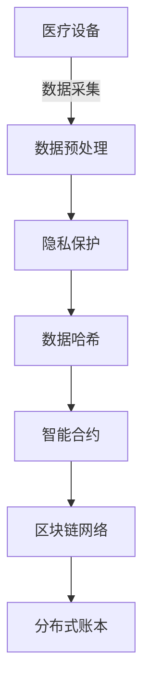

# 医疗设备数据上链案例

## 1. 理论框架

### 1.1 医疗设备数据上链目标

- 确保医疗设备数据的不可篡改性、可追溯性、隐私保护。
- 支持医疗设备互操作、数据共享、监管合规。
- 结合区块链技术实现医疗数据的可信管理。

### 1.2 医疗数据上链特点

- 高安全性：医疗数据敏感性要求严格的安全措施。
- 隐私保护：采用零知识证明、同态加密等技术。
- 合规性：满足HIPAA、GDPR等医疗数据保护法规。

## 2. 算法实现

### 2.1 医疗设备数据上链流程



### 2.2 Python代码：医疗设备数据上链

```python
import hashlib
import json
import time
from typing import Dict, List, Optional
from dataclasses import dataclass
from cryptography.fernet import Fernet
from web3 import Web3

@dataclass
class MedicalDeviceData:
    device_id: str
    patient_id: str
    data_type: str
    timestamp: int
    value: float
    unit: str
    metadata: Dict

class MedicalDeviceBlockchain:
    def __init__(self, blockchain_url: str, contract_address: str):
        self.w3 = Web3(Web3.HTTPProvider(blockchain_url))
        self.contract_address = contract_address
        self.encryption_key = Fernet.generate_key()
        self.cipher_suite = Fernet(self.encryption_key)
        
    def encrypt_medical_data(self, data: MedicalDeviceData) -> bytes:
        """加密医疗数据"""
        data_json = json.dumps({
            'device_id': data.device_id,
            'patient_id': data.patient_id,
            'data_type': data.data_type,
            'timestamp': data.timestamp,
            'value': data.value,
            'unit': data.unit,
            'metadata': data.metadata
        })
        
        return self.cipher_suite.encrypt(data_json.encode())
    
    def calculate_data_hash(self, encrypted_data: bytes) -> str:
        """计算数据哈希"""
        return hashlib.sha256(encrypted_data).hexdigest()
    
    async def upload_medical_data(self, medical_data: MedicalDeviceData) -> Dict:
        """上传医疗设备数据到区块链"""
        try:
            # 1. 数据验证
            validation_result = self.validate_medical_data(medical_data)
            if not validation_result['is_valid']:
                raise ValueError(f"Data validation failed: {validation_result['errors']}")
            
            # 2. 数据加密
            encrypted_data = self.encrypt_medical_data(medical_data)
            
            # 3. 计算哈希
            data_hash = self.calculate_data_hash(encrypted_data)
            
            # 4. 生成零知识证明
            zk_proof = self.generate_zero_knowledge_proof(medical_data)
            
            # 5. 上链
            transaction_hash = await self.submit_to_blockchain(
                data_hash, encrypted_data, zk_proof
            )
            
            return {
                'status': 'success',
                'transaction_hash': transaction_hash,
                'data_hash': data_hash,
                'timestamp': int(time.time()),
                'block_number': await self.get_block_number(transaction_hash)
            }
            
        except Exception as e:
            return {
                'status': 'failed',
                'error': str(e)
            }
    
    def validate_medical_data(self, data: MedicalDeviceData) -> Dict:
        """验证医疗数据"""
        errors = []
        
        # 检查必要字段
        if not data.device_id:
            errors.append("Device ID is required")
        if not data.patient_id:
            errors.append("Patient ID is required")
        if not data.data_type:
            errors.append("Data type is required")
        
        # 检查数值范围
        if data.data_type == 'heart_rate':
            if not (40 <= data.value <= 200):
                errors.append("Heart rate out of valid range (40-200)")
        elif data.data_type == 'blood_pressure':
            if not (50 <= data.value <= 300):
                errors.append("Blood pressure out of valid range (50-300)")
        elif data.data_type == 'temperature':
            if not (30 <= data.value <= 45):
                errors.append("Temperature out of valid range (30-45)")
        
        # 检查时间戳
        current_time = int(time.time())
        if abs(data.timestamp - current_time) > 3600:  # 1小时内的数据
            errors.append("Timestamp too old or in the future")
        
        return {
            'is_valid': len(errors) == 0,
            'errors': errors
        }
    
    def generate_zero_knowledge_proof(self, data: MedicalDeviceData) -> Dict:
        """生成零知识证明"""
        # 简化的零知识证明实现
        proof_data = {
            'patient_id_hash': hashlib.sha256(data.patient_id.encode()).hexdigest(),
            'device_id_hash': hashlib.sha256(data.device_id.encode()).hexdigest(),
            'data_type_hash': hashlib.sha256(data.data_type.encode()).hexdigest(),
            'timestamp': data.timestamp,
            'proof_signature': self.sign_proof_data(data)
        }
        
        return proof_data
    
    def sign_proof_data(self, data: MedicalDeviceData) -> str:
        """签名证明数据"""
        proof_string = f"{data.device_id}:{data.patient_id}:{data.timestamp}"
        return hashlib.sha256(proof_string.encode()).hexdigest()

class MedicalDeviceRegistry:
    def __init__(self, blockchain: MedicalDeviceBlockchain):
        self.blockchain = blockchain
        self.device_registry = {}
        self.patient_registry = {}
    
    async def register_medical_device(self, device_info: Dict) -> Dict:
        """注册医疗设备"""
        device_id = device_info['device_id']
        
        # 验证设备信息
        validation_result = self.validate_device_info(device_info)
        if not validation_result['is_valid']:
            return {
                'status': 'failed',
                'error': f"Device validation failed: {validation_result['errors']}"
            }
        
        # 生成设备证书
        device_certificate = self.generate_device_certificate(device_info)
        
        # 上链注册
        registration_result = await self.blockchain.upload_medical_data(
            MedicalDeviceData(
                device_id=device_id,
                patient_id='system',  # 系统级数据
                data_type='device_registration',
                timestamp=int(time.time()),
                value=1.0,  # 注册标志
                unit='boolean',
                metadata=device_certificate
            )
        )
        
        if registration_result['status'] == 'success':
            self.device_registry[device_id] = {
                'device_info': device_info,
                'certificate': device_certificate,
                'registration_hash': registration_result['data_hash']
            }
        
        return registration_result
    
    def validate_device_info(self, device_info: Dict) -> Dict:
        """验证设备信息"""
        errors = []
        
        required_fields = ['device_id', 'device_type', 'manufacturer', 'model']
        for field in required_fields:
            if field not in device_info or not device_info[field]:
                errors.append(f"Missing required field: {field}")
        
        # 检查设备类型
        valid_types = ['monitor', 'pump', 'ventilator', 'defibrillator', 'sensor']
        if device_info.get('device_type') not in valid_types:
            errors.append(f"Invalid device type: {device_info.get('device_type')}")
        
        return {
            'is_valid': len(errors) == 0,
            'errors': errors
        }
    
    def generate_device_certificate(self, device_info: Dict) -> Dict:
        """生成设备证书"""
        certificate = {
            'certificate_id': f"cert_{device_info['device_id']}_{int(time.time())}",
            'device_id': device_info['device_id'],
            'device_type': device_info['device_type'],
            'manufacturer': device_info['manufacturer'],
            'model': device_info['model'],
            'certification_date': int(time.time()),
            'valid_until': int(time.time()) + 365 * 24 * 3600,  # 1年有效期
            'certification_authority': 'MedicalDeviceAuthority',
            'certificate_hash': hashlib.sha256(
                json.dumps(device_info, sort_keys=True).encode()
            ).hexdigest()
        }
        
        return certificate

class MedicalDataAnalytics:
    def __init__(self, blockchain: MedicalDeviceBlockchain):
        self.blockchain = blockchain
    
    async def analyze_patient_data(self, patient_id: str, time_range: Dict) -> Dict:
        """分析患者数据"""
        # 从区块链获取患者数据
        patient_data = await self.retrieve_patient_data(patient_id, time_range)
        
        # 数据分析
        analysis_result = {
            'patient_id': patient_id,
            'time_range': time_range,
            'data_summary': self.calculate_data_summary(patient_data),
            'trends': self.analyze_trends(patient_data),
            'anomalies': self.detect_anomalies(patient_data),
            'recommendations': self.generate_recommendations(patient_data)
        }
        
        return analysis_result
    
    def calculate_data_summary(self, patient_data: List[Dict]) -> Dict:
        """计算数据摘要"""
        if not patient_data:
            return {}
        
        summary = {
            'total_records': len(patient_data),
            'data_types': list(set(record['data_type'] for record in patient_data)),
            'time_span': {
                'start': min(record['timestamp'] for record in patient_data),
                'end': max(record['timestamp'] for record in patient_data)
            }
        }
        
        # 按数据类型统计
        for data_type in summary['data_types']:
            type_data = [record for record in patient_data if record['data_type'] == data_type]
            values = [record['value'] for record in type_data]
            
            summary[data_type] = {
                'count': len(type_data),
                'mean': sum(values) / len(values),
                'min': min(values),
                'max': max(values),
                'std': self.calculate_std(values)
            }
        
        return summary
    
    def analyze_trends(self, patient_data: List[Dict]) -> Dict:
        """分析数据趋势"""
        trends = {}
        
        # 按数据类型分组分析
        for data_type in set(record['data_type'] for record in patient_data):
            type_data = [record for record in patient_data if record['data_type'] == data_type]
            type_data.sort(key=lambda x: x['timestamp'])
            
            # 计算趋势
            if len(type_data) > 1:
                values = [record['value'] for record in type_data]
                timestamps = [record['timestamp'] for record in type_data]
                
                # 简单线性趋势分析
                trend_slope = self.calculate_trend_slope(timestamps, values)
                
                trends[data_type] = {
                    'trend_direction': 'increasing' if trend_slope > 0 else 'decreasing',
                    'trend_strength': abs(trend_slope),
                    'data_points': len(type_data)
                }
        
        return trends
    
    def detect_anomalies(self, patient_data: List[Dict]) -> List[Dict]:
        """检测异常数据"""
        anomalies = []
        
        for record in patient_data:
            # 基于数据类型的异常检测
            if record['data_type'] == 'heart_rate':
                if not (40 <= record['value'] <= 200):
                    anomalies.append({
                        'timestamp': record['timestamp'],
                        'data_type': record['data_type'],
                        'value': record['value'],
                        'anomaly_type': 'out_of_range',
                        'severity': 'high' if record['value'] < 30 or record['value'] > 220 else 'medium'
                    })
            
            elif record['data_type'] == 'blood_pressure':
                if not (50 <= record['value'] <= 300):
                    anomalies.append({
                        'timestamp': record['timestamp'],
                        'data_type': record['data_type'],
                        'value': record['value'],
                        'anomaly_type': 'out_of_range',
                        'severity': 'high'
                    })
        
        return anomalies
    
    def calculate_std(self, values: List[float]) -> float:
        """计算标准差"""
        if len(values) < 2:
            return 0.0
        
        mean = sum(values) / len(values)
        variance = sum((x - mean) ** 2 for x in values) / (len(values) - 1)
        return variance ** 0.5
    
    def calculate_trend_slope(self, timestamps: List[int], values: List[float]) -> float:
        """计算趋势斜率"""
        if len(timestamps) < 2:
            return 0.0
        
        # 简单线性回归
        n = len(timestamps)
        sum_x = sum(timestamps)
        sum_y = sum(values)
        sum_xy = sum(timestamps[i] * values[i] for i in range(n))
        sum_x2 = sum(t ** 2 for t in timestamps)
        
        slope = (n * sum_xy - sum_x * sum_y) / (n * sum_x2 - sum_x ** 2)
        return slope
```

### 2.3 Rust伪代码：医疗设备智能合约

```rust
use ink_lang as ink;

#[ink::contract]
pub mod medical_device_registry {
    use ink_storage::collections::HashMap;
    
    #[ink(storage)]
    pub struct MedicalDeviceRegistry {
        devices: HashMap<AccountId, DeviceInfo>,
        patients: HashMap<AccountId, PatientInfo>,
        data_records: HashMap<Hash, MedicalDataRecord>,
        authorized_doctors: HashMap<AccountId, bool>,
    }
    
    #[derive(Debug, PartialEq, Eq, scale::Encode, scale::Decode)]
    #[cfg_attr(feature = "std", derive(scale_info::TypeInfo))]
    pub struct DeviceInfo {
        device_id: String,
        device_type: String,
        manufacturer: String,
        model: String,
        certification_date: u64,
        is_active: bool,
    }
    
    #[derive(Debug, PartialEq, Eq, scale::Encode, scale::Decode)]
    #[cfg_attr(feature = "std", derive(scale_info::TypeInfo))]
    pub struct PatientInfo {
        patient_id: String,
        authorized_devices: Vec<AccountId>,
        data_access_consent: bool,
    }
    
    #[derive(Debug, PartialEq, Eq, scale::Encode, scale::Decode)]
    #[cfg_attr(feature = "std", derive(scale_info::TypeInfo))]
    pub struct MedicalDataRecord {
        device_id: AccountId,
        patient_id: AccountId,
        data_type: String,
        timestamp: u64,
        data_hash: Hash,
        encrypted_data: Vec<u8>,
        zero_knowledge_proof: Vec<u8>,
    }
    
    impl MedicalDeviceRegistry {
        #[ink(constructor)]
        pub fn new() -> Self {
            Self {
                devices: HashMap::new(),
                patients: HashMap::new(),
                data_records: HashMap::new(),
                authorized_doctors: HashMap::new(),
            }
        }
        
        #[ink(message)]
        pub fn register_device(
            &mut self,
            device_id: String,
            device_type: String,
            manufacturer: String,
            model: String,
        ) -> Result<(), Error> {
            let caller = self.env().caller();
            
            // 验证设备信息
            if device_id.is_empty() || device_type.is_empty() {
                return Err(Error::InvalidDeviceInfo);
            }
            
            let device_info = DeviceInfo {
                device_id,
                device_type,
                manufacturer,
                model,
                certification_date: self.env().block_timestamp(),
                is_active: true,
            };
            
            self.devices.insert(caller, device_info);
            
            self.env().emit_event(DeviceRegistered {
                device_id: caller,
                timestamp: self.env().block_timestamp(),
            });
            
            Ok(())
        }
        
        #[ink(message)]
        pub fn upload_medical_data(
            &mut self,
            patient_id: AccountId,
            data_type: String,
            data_hash: Hash,
            encrypted_data: Vec<u8>,
            zero_knowledge_proof: Vec<u8>,
        ) -> Result<(), Error> {
            let device_id = self.env().caller();
            
            // 验证设备是否已注册
            if !self.devices.contains_key(&device_id) {
                return Err(Error::DeviceNotRegistered);
            }
            
            // 验证患者授权
            if !self.is_patient_authorized(&patient_id, &device_id) {
                return Err(Error::PatientNotAuthorized);
            }
            
            let record = MedicalDataRecord {
                device_id,
                patient_id,
                data_type,
                timestamp: self.env().block_timestamp(),
                data_hash,
                encrypted_data,
                zero_knowledge_proof,
            };
            
            self.data_records.insert(data_hash, record);
            
            self.env().emit_event(MedicalDataUploaded {
                device_id,
                patient_id,
                data_hash,
                timestamp: self.env().block_timestamp(),
            });
            
            Ok(())
        }
        
        #[ink(message)]
        pub fn authorize_doctor(&mut self, doctor_id: AccountId) -> Result<(), Error> {
            let caller = self.env().caller();
            
            // 只有已授权的医生可以授权其他医生
            if !self.authorized_doctors.contains_key(&caller) {
                return Err(Error::NotAuthorized);
            }
            
            self.authorized_doctors.insert(doctor_id, true);
            
            Ok(())
        }
        
        fn is_patient_authorized(&self, patient_id: &AccountId, device_id: &AccountId) -> bool {
            if let Some(patient_info) = self.patients.get(patient_id) {
                patient_info.authorized_devices.contains(device_id)
            } else {
                false
            }
        }
    }
    
    #[derive(Debug, PartialEq, Eq, scale::Encode, scale::Decode)]
    #[cfg_attr(feature = "std", derive(scale_info::TypeInfo))]
    pub enum Error {
        InvalidDeviceInfo,
        DeviceNotRegistered,
        PatientNotAuthorized,
        NotAuthorized,
    }
    
    #[ink(event)]
    pub struct DeviceRegistered {
        #[ink(topic)]
        device_id: AccountId,
        timestamp: u64,
    }
    
    #[ink(event)]
    pub struct MedicalDataUploaded {
        #[ink(topic)]
        device_id: AccountId,
        #[ink(topic)]
        patient_id: AccountId,
        #[ink(topic)]
        data_hash: Hash,
        timestamp: u64,
    }
}
```

## 3. 测试用例

### 3.1 Python医疗设备上链测试

```python
async def test_medical_device_blockchain():
    blockchain = MedicalDeviceBlockchain(
        blockchain_url="http://localhost:8545",
        contract_address="0x..."
    )
    
    # 测试医疗数据上链
    medical_data = MedicalDeviceData(
        device_id="monitor_001",
        patient_id="patient_123",
        data_type="heart_rate",
        timestamp=int(time.time()),
        value=75.0,
        unit="bpm",
        metadata={"location": "ICU", "nurse": "Dr. Smith"}
    )
    
    result = await blockchain.upload_medical_data(medical_data)
    assert result['status'] == 'success'
    assert 'transaction_hash' in result
    assert 'data_hash' in result
```

### 3.2 Rust智能合约测试

```rust
#[cfg(test)]
mod tests {
    use super::*;
    
    #[ink::test]
    fn test_device_registration() {
        let mut contract = MedicalDeviceRegistry::new();
        let device_id = String::from("monitor_001");
        let device_type = String::from("monitor");
        let manufacturer = String::from("MedCorp");
        let model = String::from("MC-100");
        
        let result = contract.register_device(device_id, device_type, manufacturer, model);
        assert!(result.is_ok());
    }
    
    #[ink::test]
    fn test_medical_data_upload() {
        let mut contract = MedicalDeviceRegistry::new();
        
        // 先注册设备
        contract.register_device(
            String::from("monitor_001"),
            String::from("monitor"),
            String::from("MedCorp"),
            String::from("MC-100")
        ).unwrap();
        
        // 上传医疗数据
        let patient_id = AccountId::from([1u8; 32]);
        let data_type = String::from("heart_rate");
        let data_hash = Hash::from([2u8; 32]);
        let encrypted_data = vec![1, 2, 3, 4];
        let zero_knowledge_proof = vec![5, 6, 7, 8];
        
        let result = contract.upload_medical_data(
            patient_id,
            data_type,
            data_hash,
            encrypted_data,
            zero_knowledge_proof
        );
        
        assert!(result.is_ok());
    }
}
```

### 3.3 数据分析测试

```python
def test_medical_data_analytics():
    blockchain = MedicalDeviceBlockchain("http://localhost:8545", "0x...")
    analytics = MedicalDataAnalytics(blockchain)
    
    # 模拟患者数据
    patient_data = [
        {
            'device_id': 'monitor_001',
            'patient_id': 'patient_123',
            'data_type': 'heart_rate',
            'timestamp': int(time.time()) - 3600,
            'value': 75.0,
            'unit': 'bpm'
        },
        {
            'device_id': 'monitor_001',
            'patient_id': 'patient_123',
            'data_type': 'heart_rate',
            'timestamp': int(time.time()),
            'value': 80.0,
            'unit': 'bpm'
        }
    ]
    
    analysis_result = analytics.analyze_patient_data('patient_123', {
        'start': int(time.time()) - 7200,
        'end': int(time.time())
    })
    
    assert 'data_summary' in analysis_result
    assert 'trends' in analysis_result
    assert 'anomalies' in analysis_result
```

## 4. 性能与优化建议

- 采用批量上链，减少交易费用和延迟。
- 实现数据压缩，降低存储成本。
- 支持离线数据缓存，提升可用性。
- 结合IPFS存储大文件，区块链只存储哈希。

这个文档提供了医疗设备数据上链案例的完整实现，包括数据上链、智能合约、数据分析等核心功能。
