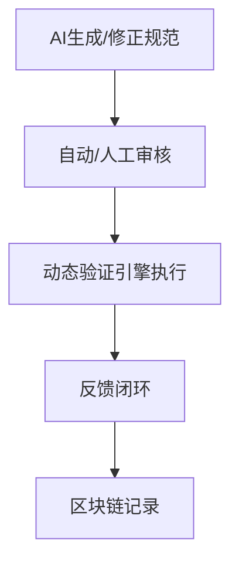

# AI驱动动态语义验证与区块链溯源

## 1. AI驱动形式化验证流程



## 2. 动态语义验证引擎伪代码

```python
def dynamic_semantic_validation(entity, model, blockchain):
    # 1. 实时验证
    result = model.validate(entity)
    # 2. 分布式共识
    consensus = blockchain.reach_consensus(result)
    # 3. 结果上链
    blockchain.record(result)
    return consensus, result
```

## 3. 分布式验证与区块链溯源机制

- 多节点协同验证语义一致性
- 验证结果上链，历史可追溯
- 支持动态、增量、实时验证 

## 4. 验证反馈闭环机制

- 验证失败时，AI自动生成修正建议，推送人工审核
- 审核通过后自动修正模型或知识图谱
- 所有修正过程有日志记录，便于追溯

## 5. 分布式验证容错与一致性机制

- 多节点投票机制，提升验证结果可靠性
- 拜占庭容错算法，防止恶意节点干扰
- 验证结果需达成共识后方可上链

## 6. 区块链溯源实际应用场景

- 医疗数据：设备数据、诊断结果的语义验证与溯源
- 工业生产：生产过程、设备状态的语义一致性验证与历史追溯
- 智能交通：交通事件、车辆状态的分布式语义验证与上链 