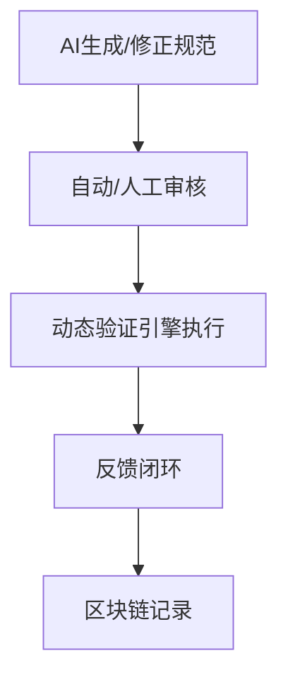

# AI驱动动态语义验证与区块链溯源

## 1. AI驱动形式化验证流程



## 2. 动态语义验证引擎伪代码

```python
def dynamic_semantic_validation(entity, model, blockchain):
    # 1. 实时验证
    result = model.validate(entity)
    # 2. 分布式共识
    consensus = blockchain.reach_consensus(result)
    # 3. 结果上链
    blockchain.record(result)
    return consensus, result
```

## 3. 分布式验证与区块链溯源机制

- 多节点协同验证语义一致性
- 验证结果上链，历史可追溯
- 支持动态、增量、实时验证 