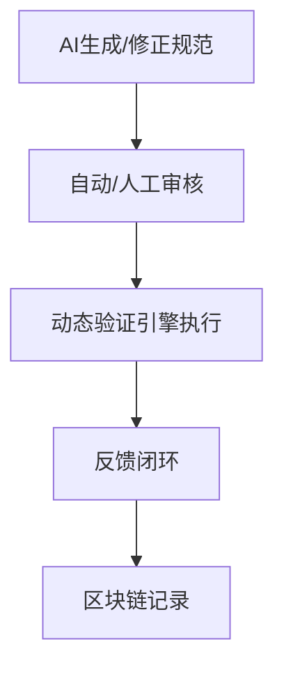
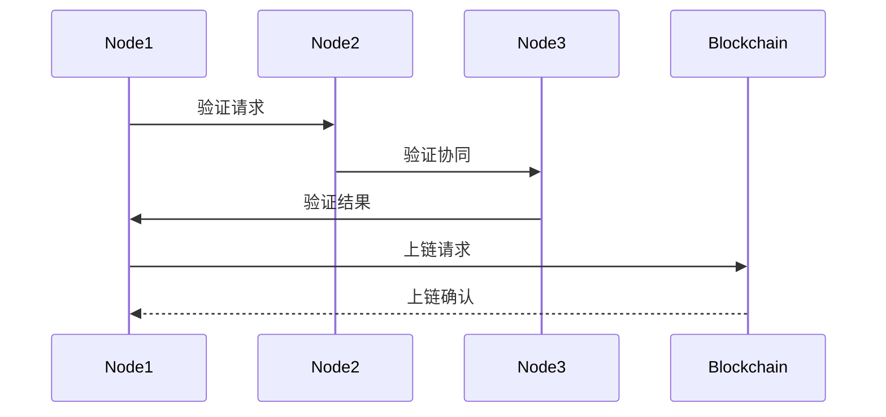

# AI驱动动态语义验证与区块链溯源

## 1. AI驱动形式化验证流程



## 2. 动态语义验证引擎伪代码

```python
def dynamic_semantic_validation(entity, model, blockchain):
    # 1. 实时验证
    result = model.validate(entity)
    # 2. 分布式共识
    consensus = blockchain.reach_consensus(result)
    # 3. 结果上链
    blockchain.record(result)
    return consensus, result
```

## 3. 分布式验证与区块链溯源机制

- 多节点协同验证语义一致性
- 验证结果上链，历史可追溯
- 支持动态、增量、实时验证

## 4. 验证反馈闭环机制

- 验证失败时，AI自动生成修正建议，推送人工审核
- 审核通过后自动修正模型或知识图谱
- 所有修正过程有日志记录，便于追溯

## 5. 分布式验证容错与一致性机制

- 多节点投票机制，提升验证结果可靠性
- 拜占庭容错算法，防止恶意节点干扰
- 验证结果需达成共识后方可上链

## 6. 区块链溯源实际应用场景

- 医疗数据：设备数据、诊断结果的语义验证与溯源
- 工业生产：生产过程、设备状态的语义一致性验证与历史追溯
- 智能交通：交通事件、车辆状态的分布式语义验证与上链

## 7. 分布式验证与区块链上链时序图



## 8. 验证反馈闭环伪代码

```python
def semantic_validation_feedback(entity):
    result = ai_validate(entity)
    if not result['pass']:
        suggestion = ai_generate_fix(result)
        if human_review(suggestion):
            update_model_or_kg(suggestion)
            log_fix(entity, suggestion)
```

## 9. 医疗设备数据上链应用案例

- 医疗设备上传数据后，AI自动验证数据语义一致性。
- 多节点协同验证，达成共识后将验证结果与数据摘要上链。
- 任何后续查询均可溯源，确保数据可信与合规。

## 10. TLA+规范自动生成

```python
from typing import Dict, List, Any
import re

class TLAPlusGenerator:
    def __init__(self):
        self.template_engine = self.load_templates()
    
    def generate_semantic_validation_spec(self, entities: List[Dict], relations: List[Dict]) -> str:
        """生成语义验证的TLA+规范"""
        
        # 生成变量定义
        variables = self.generate_variables(entities)
        
        # 生成初始状态
        initial_state = self.generate_initial_state(entities)
        
        # 生成状态转换
        transitions = self.generate_transitions(entities, relations)
        
        # 生成不变式
        invariants = self.generate_invariants(entities, relations)
        
        # 组装完整规范
        spec = f"""
---- MODULE SemanticValidation ----
EXTENDS Naturals, Sequences, TLC

VARIABLES {variables}

Init == {initial_state}

Next == {transitions}

Invariant == {invariants}

====
"""
        return spec
    
    def generate_variables(self, entities: List[Dict]) -> str:
        """生成变量定义"""
        var_defs = []
        for entity in entities:
            var_defs.append(f"entity_{entity['id']}_state")
        return ", ".join(var_defs)
    
    def generate_initial_state(self, entities: List[Dict]) -> str:
        """生成初始状态"""
        init_conditions = []
        for entity in entities:
            init_conditions.append(f"entity_{entity['id']}_state = 'initial'")
        return " /\\ ".join(init_conditions)
    
    def generate_transitions(self, entities: List[Dict], relations: List[Dict]) -> str:
        """生成状态转换"""
        transitions = []
        
        # 实体状态转换
        for entity in entities:
            transitions.append(f"""
Entity_{entity['id']}_Transition ==
    /\\ entity_{entity['id']}_state = 'initial'
    /\\ entity_{entity['id']}_state' = 'validated'
""")
        
        # 关系验证转换
        for relation in relations:
            transitions.append(f"""
Relation_{relation['id']}_Validation ==
    /\\ entity_{relation['source']}_state = 'validated'
    /\\ entity_{relation['target']}_state = 'validated'
    /\\ relation_{relation['id']}_state' = 'valid'
""")
        
        return " \\/ ".join(transitions)
    
    def generate_invariants(self, entities: List[Dict], relations: List[Dict]) -> str:
        """生成不变式"""
        invariants = []
        
        # 实体状态不变式
        for entity in entities:
            invariants.append(f"entity_{entity['id']}_state \\in {{'initial', 'validated', 'invalid'}}")
        
        # 关系一致性不变式
        for relation in relations:
            invariants.append(f"""
RelationConsistency_{relation['id']} ==
    (relation_{relation['id']}_state = 'valid') =>
    (entity_{relation['source']}_state = 'validated' /\\ entity_{relation['target']}_state = 'validated')
""")
        
        return " /\\ ".join(invariants)
    
    def generate_ai_enhanced_spec(self, semantic_model: Dict) -> str:
        """生成AI增强的TLA+规范"""
        # 基于语义模型自动生成更复杂的规范
        spec = self.generate_semantic_validation_spec(
            semantic_model.get('entities', []),
            semantic_model.get('relations', [])
        )
        
        # 添加AI推理相关的状态和转换
        ai_spec = self.add_ai_reasoning_components(spec, semantic_model)
        
        return ai_spec
    
    def add_ai_reasoning_components(self, base_spec: str, semantic_model: Dict) -> str:
        """添加AI推理组件"""
        # 添加AI推理状态变量
        ai_variables = """
ai_reasoning_state,
ai_confidence_level,
ai_decision_history
"""
        
        # 添加AI推理转换
        ai_transitions = """
AI_Reasoning_Step ==
    /\\ ai_reasoning_state = 'analyzing'
    /\\ ai_confidence_level' = CalculateConfidence()
    /\\ ai_decision_history' = Append(ai_decision_history, CurrentDecision())
    /\\ ai_reasoning_state' = IF ai_confidence_level' > 0.8 THEN 'confident' ELSE 'uncertain'
"""
        
        # 在基础规范中插入AI组件
        spec_with_ai = base_spec.replace(
            "VARIABLES",
            f"VARIABLES {ai_variables}"
        ).replace(
            "Next ==",
            f"Next == {ai_transitions} \\/"
        )
        
        return spec_with_ai
```

## 11. 分布式共识算法

```python
import asyncio
from typing import Dict, List, Set, Optional
from dataclasses import dataclass
from enum import Enum
import time

class ConsensusState(Enum):
    PRE_PREPARE = "pre_prepare"
    PREPARE = "prepare"
    COMMIT = "commit"
    DECIDED = "decided"

@dataclass
class ConsensusMessage:
    message_type: str
    sequence_number: int
    value: str
    sender_id: str
    timestamp: float

class ByzantineFaultTolerantConsensus:
    def __init__(self, node_id: str, total_nodes: int, fault_tolerance: int = 1):
        self.node_id = node_id
        self.total_nodes = total_nodes
        self.fault_tolerance = fault_tolerance
        self.min_quorum = 2 * fault_tolerance + 1
        
        # 状态变量
        self.current_sequence = 0
        self.state = ConsensusState.PRE_PREPARE
        self.prepared_values = {}
        self.committed_values = {}
        self.message_log = []
        
        # 网络通信
        self.peers = set()
        self.pending_messages = asyncio.Queue()
    
    async def propose_value(self, value: str) -> bool:
        """提议新值"""
        self.current_sequence += 1
        
        # 创建预准备消息
        pre_prepare_msg = ConsensusMessage(
            message_type="pre_prepare",
            sequence_number=self.current_sequence,
            value=value,
            sender_id=self.node_id,
            timestamp=time.time()
        )
        
        # 广播预准备消息
        await self.broadcast_message(pre_prepare_msg)
        
        # 开始共识流程
        return await self.run_consensus_round(self.current_sequence, value)
    
    async def run_consensus_round(self, sequence: int, value: str) -> bool:
        """运行共识轮次"""
        # 阶段1: 预准备
        if not await self.handle_pre_prepare(sequence, value):
            return False
        
        # 阶段2: 准备
        if not await self.handle_prepare(sequence, value):
            return False
        
        # 阶段3: 提交
        if not await self.handle_commit(sequence, value):
            return False
        
        # 阶段4: 决定
        return await self.handle_decide(sequence, value)
    
    async def handle_pre_prepare(self, sequence: int, value: str) -> bool:
        """处理预准备阶段"""
        prepare_messages = []
        
        # 等待足够多的准备消息
        timeout = 5.0  # 5秒超时
        start_time = time.time()
        
        while len(prepare_messages) < self.min_quorum and (time.time() - start_time) < timeout:
            try:
                msg = await asyncio.wait_for(self.pending_messages.get(), timeout=0.1)
                if (msg.message_type == "prepare" and 
                    msg.sequence_number == sequence and 
                    msg.value == value):
                    prepare_messages.append(msg)
            except asyncio.TimeoutError:
                continue
        
        return len(prepare_messages) >= self.min_quorum
    
    async def handle_prepare(self, sequence: int, value: str) -> bool:
        """处理准备阶段"""
        # 发送准备消息
        prepare_msg = ConsensusMessage(
            message_type="prepare",
            sequence_number=sequence,
            value=value,
            sender_id=self.node_id,
            timestamp=time.time()
        )
        await self.broadcast_message(prepare_msg)
        
        # 记录准备状态
        self.prepared_values[sequence] = value
        return True
    
    async def handle_commit(self, sequence: int, value: str) -> bool:
        """处理提交阶段"""
        commit_messages = []
        
        # 等待足够多的提交消息
        timeout = 5.0
        start_time = time.time()
        
        while len(commit_messages) < self.min_quorum and (time.time() - start_time) < timeout:
            try:
                msg = await asyncio.wait_for(self.pending_messages.get(), timeout=0.1)
                if (msg.message_type == "commit" and 
                    msg.sequence_number == sequence and 
                    msg.value == value):
                    commit_messages.append(msg)
            except asyncio.TimeoutError:
                continue
        
        if len(commit_messages) >= self.min_quorum:
            self.committed_values[sequence] = value
            return True
        
        return False
    
    async def handle_decide(self, sequence: int, value: str) -> bool:
        """处理决定阶段"""
        if sequence in self.committed_values:
            # 达成共识，执行决定
            await self.execute_decision(sequence, value)
            return True
        return False
    
    async def execute_decision(self, sequence: int, value: str):
        """执行共识决定"""
        # 这里可以添加具体的业务逻辑
        print(f"Node {self.node_id} decided on sequence {sequence}: {value}")
        
        # 可以在这里触发区块链上链操作
        await self.trigger_blockchain_commit(sequence, value)
    
    async def broadcast_message(self, message: ConsensusMessage):
        """广播消息到所有节点"""
        for peer in self.peers:
            await self.send_message_to_peer(peer, message)
    
    async def send_message_to_peer(self, peer_id: str, message: ConsensusMessage):
        """发送消息到指定节点"""
        # 这里应该实现实际的网络通信
        # 简化实现，直接放入消息队列
        await self.pending_messages.put(message)
    
    async def trigger_blockchain_commit(self, sequence: int, value: str):
        """触发区块链提交"""
        # 这里应该实现与区块链的集成
        print(f"Triggering blockchain commit for sequence {sequence}: {value}")
```

## 12. 区块链集成接口

```python
import json
import hashlib
from typing import Dict, List, Optional
from web3 import Web3
from eth_account import Account
import asyncio

class BlockchainInterface:
    def __init__(self, contract_address: str, abi: str, private_key: str):
        self.w3 = Web3(Web3.HTTPProvider('http://localhost:8545'))
        self.contract_address = contract_address
        self.contract = self.w3.eth.contract(
            address=contract_address,
            abi=json.loads(abi)
        )
        self.account = Account.from_key(private_key)
        self.w3.eth.default_account = self.account.address
    
    async def commit_semantic_validation(self, validation_result: Dict) -> str:
        """提交语义验证结果到区块链"""
        try:
            # 准备交易数据
            transaction = self.contract.functions.commitValidation(
                validation_result['entity_id'],
                validation_result['validation_hash'],
                validation_result['timestamp'],
                validation_result['validator_signature']
            ).build_transaction({
                'gas': 2000000,
                'gasPrice': self.w3.eth.gas_price,
                'nonce': self.w3.eth.get_transaction_count(self.account.address),
            })
            
            # 签名并发送交易
            signed_txn = self.w3.eth.account.sign_transaction(transaction, self.account.key)
            tx_hash = self.w3.eth.send_raw_transaction(signed_txn.rawTransaction)
            
            # 等待交易确认
            receipt = self.w3.eth.wait_for_transaction_receipt(tx_hash)
            
            return receipt['transactionHash'].hex()
            
        except Exception as e:
            print(f"Blockchain commit failed: {e}")
            raise
    
    async def verify_semantic_consistency(self, entity_id: str) -> Dict:
        """验证语义一致性"""
        try:
            # 查询区块链上的验证记录
            validation_records = self.contract.functions.getValidationHistory(entity_id).call()
            
            # 分析验证历史
            consistency_result = self.analyze_consistency(validation_records)
            
            return {
                'entity_id': entity_id,
                'consistency_score': consistency_result['score'],
                'validation_count': len(validation_records),
                'last_validation': consistency_result['last_validation'],
                'blockchain_proof': self.generate_proof(validation_records)
            }
            
        except Exception as e:
            print(f"Consistency verification failed: {e}")
            raise
    
    def analyze_consistency(self, validation_records: List) -> Dict:
        """分析验证记录的一致性"""
        if not validation_records:
            return {'score': 0.0, 'last_validation': None}
        
        # 计算一致性分数
        valid_count = sum(1 for record in validation_records if record[2])  # 假设第三个字段是验证结果
        consistency_score = valid_count / len(validation_records)
        
        # 获取最后一次验证
        last_validation = max(validation_records, key=lambda x: x[1])  # 假设第二个字段是时间戳
        
        return {
            'score': consistency_score,
            'last_validation': last_validation
        }
    
    def generate_proof(self, validation_records: List) -> str:
        """生成区块链证明"""
        # 将所有验证记录哈希化
        records_hash = hashlib.sha256(
            json.dumps(validation_records, sort_keys=True).encode()
        ).hexdigest()
        
        return records_hash
    
    async def create_smart_contract(self, contract_source: str) -> str:
        """部署智能合约"""
        try:
            # 编译合约
            compiled_contract = self.w3.eth.contract(
                abi=contract_source,
                bytecode=contract_source  # 这里需要实际的字节码
            )
            
            # 部署合约
            transaction = compiled_contract.constructor().build_transaction({
                'gas': 3000000,
                'gasPrice': self.w3.eth.gas_price,
                'nonce': self.w3.eth.get_transaction_count(self.account.address),
            })
            
            signed_txn = self.w3.eth.account.sign_transaction(transaction, self.account.key)
            tx_hash = self.w3.eth.send_raw_transaction(signed_txn.rawTransaction)
            
            receipt = self.w3.eth.wait_for_transaction_receipt(tx_hash)
            
            return receipt['contractAddress']
            
        except Exception as e:
            print(f"Contract deployment failed: {e}")
            raise
    
    async def query_validation_history(self, entity_id: str, start_block: int = 0) -> List[Dict]:
        """查询验证历史"""
        try:
            # 获取事件日志
            events = self.contract.events.ValidationCommitted.get_all_entries(
                fromBlock=start_block,
                toBlock='latest',
                argument_filters={'entityId': entity_id}
            )
            
            # 转换为标准格式
            history = []
            for event in events:
                history.append({
                    'block_number': event['blockNumber'],
                    'transaction_hash': event['transactionHash'].hex(),
                    'entity_id': event['args']['entityId'],
                    'validation_hash': event['args']['validationHash'],
                    'timestamp': event['args']['timestamp'],
                    'validator': event['args']['validator']
                })
            
            return history
            
        except Exception as e:
            print(f"History query failed: {e}")
            raise
```
