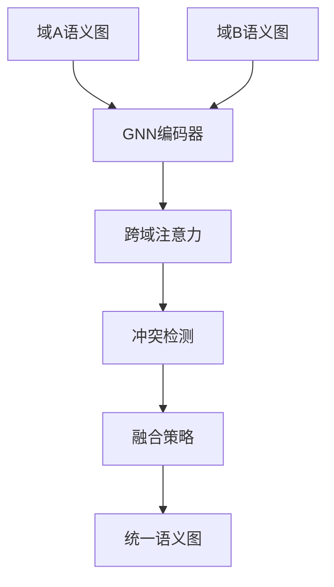

# 跨域语义冲突融合与GNN算法

## 1. 理论框架

### 1.1 跨域语义冲突类型

- 概念冲突：不同领域对同一概念的不同理解。
- 属性冲突：同一概念在不同领域具有不同属性。
- 关系冲突：概念间关系在不同领域中的差异。
- 行为冲突：同一操作在不同领域中的不同语义。

### 1.2 GNN在语义融合中的作用

- 利用图神经网络学习跨域语义表示。
- 通过消息传递机制实现语义冲突检测与融合。
- 支持端到端的语义对齐与映射学习。

## 2. 算法实现

### 2.1 GNN语义融合架构



### 2.2 Python代码：GNN语义融合

```python
import torch
import torch.nn as nn
import torch.nn.functional as F
from torch_geometric.nn import GCNConv, GATConv

class SemanticGNN(nn.Module):
    def __init__(self, input_dim: int, hidden_dim: int, output_dim: int):
        super().__init__()
        self.conv1 = GCNConv(input_dim, hidden_dim)
        self.conv2 = GCNConv(hidden_dim, hidden_dim)
        self.conv3 = GCNConv(hidden_dim, output_dim)
        self.attention = nn.MultiheadAttention(hidden_dim, num_heads=8)
        
    def forward(self, x: torch.Tensor, edge_index: torch.Tensor) -> torch.Tensor:
        # 图卷积层
        x = F.relu(self.conv1(x, edge_index))
        x = F.relu(self.conv2(x, edge_index))
        x = self.conv3(x, edge_index)
        return x
    
    def cross_domain_attention(self, domain_a_features: torch.Tensor, 
                              domain_b_features: torch.Tensor) -> torch.Tensor:
        """跨域注意力机制"""
        # 计算注意力权重
        attention_output, attention_weights = self.attention(
            domain_a_features.unsqueeze(0),
            domain_b_features.unsqueeze(0),
            domain_b_features.unsqueeze(0)
        )
        return attention_output.squeeze(0)

class CrossDomainSemanticFusion:
    def __init__(self, gnn_model: SemanticGNN):
        self.gnn_model = gnn_model
        self.conflict_detector = ConflictDetector()
        self.fusion_strategy = FusionStrategy()
    
    def fuse_semantic_domains(self, domain_a_graph: Dict, domain_b_graph: Dict) -> Dict:
        """融合两个语义域"""
        # 1. 特征提取
        domain_a_features = self.extract_features(domain_a_graph)
        domain_b_features = self.extract_features(domain_b_graph)
        
        # 2. GNN编码
        domain_a_encoded = self.gnn_model(domain_a_features['x'], domain_a_features['edge_index'])
        domain_b_encoded = self.gnn_model(domain_b_features['x'], domain_b_features['edge_index'])
        
        # 3. 跨域注意力
        attention_output = self.gnn_model.cross_domain_attention(domain_a_encoded, domain_b_encoded)
        
        # 4. 冲突检测
        conflicts = self.conflict_detector.detect_conflicts(domain_a_encoded, domain_b_encoded)
        
        # 5. 融合策略
        fused_semantics = self.fusion_strategy.fuse(domain_a_encoded, domain_b_encoded, conflicts)
        
        return {
            'fused_semantics': fused_semantics,
            'conflicts': conflicts,
            'attention_weights': attention_output
        }
    
    def extract_features(self, graph: Dict) -> Dict:
        """提取图特征"""
        # 节点特征
        node_features = []
        for node in graph['nodes']:
            features = self.node_to_features(node)
            node_features.append(features)
        
        # 边特征
        edge_index = []
        for edge in graph['edges']:
            edge_index.append([edge['source'], edge['target']])
        
        return {
            'x': torch.tensor(node_features, dtype=torch.float),
            'edge_index': torch.tensor(edge_index, dtype=torch.long).t().contiguous()
        }
```

### 2.3 Rust伪代码：冲突检测与融合

```rust
pub struct CrossDomainConflictDetector {
    similarity_threshold: f64,
    conflict_classifier: ConflictClassifier,
}

impl CrossDomainConflictDetector {
    pub fn detect_conflicts(
        &self,
        domain_a_semantics: &[SemanticEntity],
        domain_b_semantics: &[SemanticEntity],
    ) -> Vec<SemanticConflict> {
        let mut conflicts = Vec::new();
        
        for entity_a in domain_a_semantics {
            for entity_b in domain_b_semantics {
                let similarity = self.calculate_similarity(entity_a, entity_b);
                
                if similarity > self.similarity_threshold {
                    // 检测到潜在冲突
                    let conflict_type = self.classify_conflict_type(entity_a, entity_b);
                    let conflict_severity = self.assess_conflict_severity(entity_a, entity_b);
                    
                    conflicts.push(SemanticConflict {
                        entity_a: entity_a.clone(),
                        entity_b: entity_b.clone(),
                        conflict_type,
                        severity: conflict_severity,
                        similarity_score: similarity,
                    });
                }
            }
        }
        
        conflicts
    }
    
    fn classify_conflict_type(
        &self,
        entity_a: &SemanticEntity,
        entity_b: &SemanticEntity,
    ) -> ConflictType {
        // 基于实体属性分类冲突类型
        if entity_a.name != entity_b.name {
            ConflictType::NamingConflict
        } else if entity_a.properties != entity_b.properties {
            ConflictType::PropertyConflict
        } else if entity_a.relationships != entity_b.relationships {
            ConflictType::RelationshipConflict
        } else {
            ConflictType::BehaviorConflict
        }
    }
}

pub struct SemanticFusionStrategy {
    fusion_rules: Vec<FusionRule>,
    gnn_model: GNNModel,
}

impl SemanticFusionStrategy {
    pub fn fuse_semantics(
        &self,
        domain_a_semantics: &[SemanticEntity],
        domain_b_semantics: &[SemanticEntity],
        conflicts: &[SemanticConflict],
    ) -> FusedSemantics {
        // 1. 应用融合规则
        let rule_based_fusion = self.apply_fusion_rules(domain_a_semantics, domain_b_semantics, conflicts);
        
        // 2. GNN辅助融合
        let gnn_fusion = self.gnn_assisted_fusion(domain_a_semantics, domain_b_semantics);
        
        // 3. 融合结果整合
        let integrated_fusion = self.integrate_fusion_results(&rule_based_fusion, &gnn_fusion);
        
        // 4. 一致性验证
        let validated_fusion = self.validate_fusion_consistency(&integrated_fusion);
        
        FusedSemantics {
            entities: validated_fusion.entities,
            relationships: validated_fusion.relationships,
            properties: validated_fusion.properties,
            fusion_confidence: self.calculate_fusion_confidence(&validated_fusion),
        }
    }
    
    fn apply_fusion_rules(
        &self,
        domain_a: &[SemanticEntity],
        domain_b: &[SemanticEntity],
        conflicts: &[SemanticConflict],
    ) -> RuleBasedFusion {
        let mut fusion_result = RuleBasedFusion::new();
        
        for rule in &self.fusion_rules {
            let rule_result = rule.apply(domain_a, domain_b, conflicts);
            fusion_result.merge(&rule_result);
        }
        
        fusion_result
    }
}
```

### 2.4 图注意力网络实现

```python
import torch
import torch.nn as nn

class GraphAttentionLayer(nn.Module):
    def __init__(self, input_dim: int, output_dim: int, num_heads: int = 8):
        super().__init__()
        self.input_dim = input_dim
        self.output_dim = output_dim
        self.num_heads = num_heads
        
        self.W = nn.Linear(input_dim, output_dim * num_heads)
        self.attention = nn.Linear(output_dim * 2, 1)
        
    def forward(self, x: torch.Tensor, edge_index: torch.Tensor) -> torch.Tensor:
        # 线性变换
        x = self.W(x)
        x = x.view(-1, self.num_heads, self.output_dim)
        
        # 计算注意力权重
        attention_weights = []
        for i in range(edge_index.size(1)):
            source = edge_index[0, i]
            target = edge_index[1, i]
            
            # 拼接源节点和目标节点特征
            combined = torch.cat([x[source], x[target]], dim=-1)
            attention_weight = torch.sigmoid(self.attention(combined))
            attention_weights.append(attention_weight)
        
        attention_weights = torch.stack(attention_weights)
        
        # 应用注意力权重
        output = torch.zeros_like(x)
        for i in range(edge_index.size(1)):
            source = edge_index[0, i]
            target = edge_index[1, i]
            weight = attention_weights[i]
            output[target] += weight * x[source]
        
        return output.mean(dim=1)  # 多头注意力聚合

class CrossDomainGAT(nn.Module):
    def __init__(self, input_dim: int, hidden_dim: int, output_dim: int):
        super().__init__()
        self.gat1 = GraphAttentionLayer(input_dim, hidden_dim)
        self.gat2 = GraphAttentionLayer(hidden_dim, hidden_dim)
        self.gat3 = GraphAttentionLayer(hidden_dim, output_dim)
        
    def forward(self, x: torch.Tensor, edge_index: torch.Tensor) -> torch.Tensor:
        x = torch.relu(self.gat1(x, edge_index))
        x = torch.relu(self.gat2(x, edge_index))
        x = self.gat3(x, edge_index)
        return x
```

## 3. 测试用例

### 3.1 Python GNN融合测试

```python
def test_semantic_gnn_fusion():
    gnn_model = SemanticGNN(input_dim=64, hidden_dim=32, output_dim=16)
    fusion = CrossDomainSemanticFusion(gnn_model)
    
    domain_a_graph = {
        'nodes': [{'id': 'temp', 'type': 'sensor'}],
        'edges': [{'source': 0, 'target': 0}]
    }
    domain_b_graph = {
        'nodes': [{'id': 'temperature', 'type': 'sensor'}],
        'edges': [{'source': 0, 'target': 0}]
    }
    
    result = fusion.fuse_semantic_domains(domain_a_graph, domain_b_graph)
    assert 'fused_semantics' in result
    assert 'conflicts' in result
```

### 3.2 Rust冲突检测测试

```rust
#[test]
fn test_conflict_detection() {
    let detector = CrossDomainConflictDetector::new(0.8);
    let domain_a = mock_domain_a_semantics();
    let domain_b = mock_domain_b_semantics();
    
    let conflicts = detector.detect_conflicts(&domain_a, &domain_b);
    assert!(!conflicts.is_empty());
    
    for conflict in &conflicts {
        assert!(conflict.similarity_score > 0.8);
    }
}
```

## 4. 性能与优化建议

- 采用图采样技术，处理大规模语义图。
- 支持增量式冲突检测，减少重复计算。
- 结合预训练模型，提升跨域语义理解能力。
- 分布式GNN训练，加速模型收敛。

这个文档提供了跨域语义冲突融合与GNN算法的完整实现，包括GNN架构、冲突检测、融合策略等核心功能。
