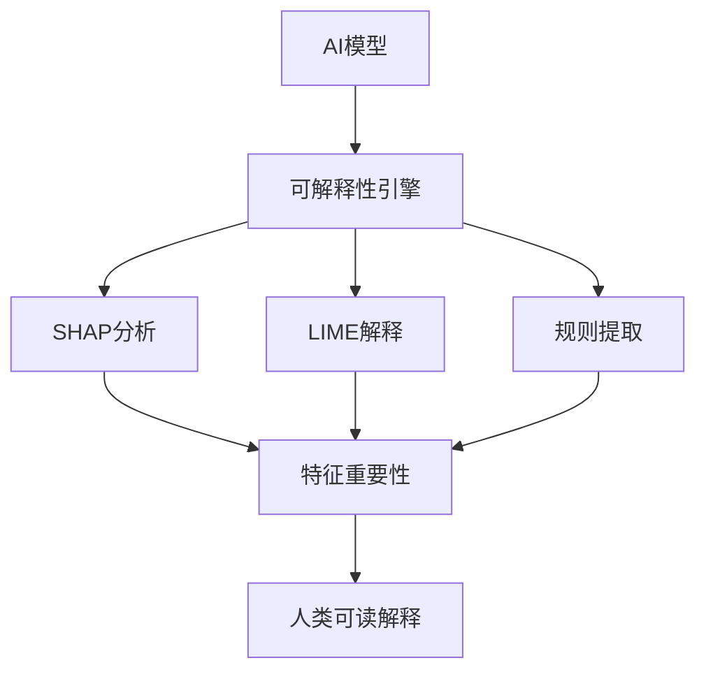

# 可解释AI方法

## 1. 理论框架

### 1.1 可解释AI在IoT语义互操作中的作用

- 解释AI模型如何做出语义映射决策，提升用户信任度。
- 支持模型调试、错误分析、决策追溯。
- 结合领域知识，生成人类可理解的解释。

### 1.2 可解释性方法分类

- 模型内在可解释性：决策树、线性模型等。
- 事后解释方法：SHAP、LIME、Grad-CAM等。
- 规则提取：从黑盒模型中提取可解释规则。

## 2. 算法实现

### 2.1 可解释AI架构



### 2.2 Python代码：SHAP可解释性分析

```python
import shap
import numpy as np
import pandas as pd
from sklearn.ensemble import RandomForestClassifier
from typing import Dict, List, Tuple

class ExplainableAIModel:
    def __init__(self, model, feature_names: List[str]):
        self.model = model
        self.feature_names = feature_names
        self.explainer = None
        self.feature_importance = {}
    
    def fit_explainer(self, X: np.ndarray) -> None:
        """训练SHAP解释器"""
        if isinstance(self.model, RandomForestClassifier):
            self.explainer = shap.TreeExplainer(self.model)
        else:
            self.explainer = shap.KernelExplainer(self.model.predict, X)
    
    def explain_prediction(self, instance: np.ndarray) -> Dict:
        """解释单个预测"""
        if self.explainer is None:
            raise ValueError("Explainer not fitted. Call fit_explainer first.")
        
        # 计算SHAP值
        shap_values = self.explainer.shap_values(instance)
        
        # 提取特征贡献
        feature_contributions = {}
        for i, feature_name in enumerate(self.feature_names):
            feature_contributions[feature_name] = shap_values[0][i]
        
        # 生成解释文本
        explanation_text = self.generate_explanation_text(feature_contributions)
        
        return {
            'shap_values': shap_values,
            'feature_contributions': feature_contributions,
            'explanation_text': explanation_text,
            'prediction_confidence': self.calculate_confidence(shap_values)
        }
    
    def explain_model_behavior(self, X: np.ndarray) -> Dict:
        """解释模型整体行为"""
        # 计算特征重要性
        feature_importance = self.calculate_feature_importance(X)
        
        # 生成模型行为摘要
        behavior_summary = self.generate_behavior_summary(feature_importance)
        
        return {
            'feature_importance': feature_importance,
            'behavior_summary': behavior_summary,
            'model_complexity': self.assess_model_complexity(),
            'decision_boundaries': self.analyze_decision_boundaries(X)
        }
    
    def generate_explanation_text(self, feature_contributions: Dict) -> str:
        """生成人类可读的解释文本"""
        # 按贡献度排序
        sorted_features = sorted(
            feature_contributions.items(),
            key=lambda x: abs(x[1]),
            reverse=True
        )
        
        explanation_parts = []
        explanation_parts.append("模型预测的主要依据：")
        
        for feature_name, contribution in sorted_features[:5]:  # 前5个最重要特征
            if abs(contribution) > 0.01:  # 只解释重要贡献
                if contribution > 0:
                    explanation_parts.append(f"• {feature_name} 正向影响预测 (+{contribution:.3f})")
                else:
                    explanation_parts.append(f"• {feature_name} 负向影响预测 ({contribution:.3f})")
        
        return "\n".join(explanation_parts)
    
    def calculate_confidence(self, shap_values: np.ndarray) -> float:
        """计算预测置信度"""
        # 基于SHAP值的稳定性计算置信度
        total_contribution = np.sum(np.abs(shap_values))
        max_contribution = np.max(np.abs(shap_values))
        
        # 置信度基于主要特征的贡献比例
        confidence = max_contribution / total_contribution if total_contribution > 0 else 0.0
        return min(1.0, confidence)

class LIMEExplainer:
    def __init__(self, model, feature_names: List[str]):
        self.model = model
        self.feature_names = feature_names
        self.explainer = None
    
    def explain_instance(self, instance: np.ndarray, num_features: int = 10) -> Dict:
        """使用LIME解释单个实例"""
        from lime.lime_tabular import LimeTabularExplainer
        
        # 创建LIME解释器
        self.explainer = LimeTabularExplainer(
            np.array([instance]),  # 使用实例作为训练数据
            feature_names=self.feature_names,
            class_names=['negative', 'positive'],
            mode='classification'
        )
        
        # 生成解释
        explanation = self.explainer.explain_instance(
            instance,
            self.model.predict_proba,
            num_features=num_features
        )
        
        # 提取特征权重
        feature_weights = {}
        for feature, weight in explanation.as_list():
            feature_weights[feature] = weight
        
        return {
            'feature_weights': feature_weights,
            'explanation_text': self.generate_lime_explanation(explanation),
            'local_accuracy': explanation.score
        }
    
    def generate_lime_explanation(self, explanation) -> str:
        """生成LIME解释文本"""
        explanation_parts = ["基于局部近似的解释："]
        
        for feature, weight in explanation.as_list():
            if abs(weight) > 0.01:
                if weight > 0:
                    explanation_parts.append(f"• {feature} 支持当前预测 (+{weight:.3f})")
                else:
                    explanation_parts.append(f"• {feature} 反对当前预测 ({weight:.3f})")
        
        return "\n".join(explanation_parts)

class RuleExtractor:
    def __init__(self, model):
        self.model = model
        self.extracted_rules = []
    
    def extract_decision_rules(self, X: np.ndarray, y: np.ndarray) -> List[Dict]:
        """从模型中提取决策规则"""
        if hasattr(self.model, 'estimators_'):
            # 随机森林规则提取
            return self.extract_rf_rules(X, y)
        else:
            # 通用规则提取
            return self.extract_generic_rules(X, y)
    
    def extract_rf_rules(self, X: np.ndarray, y: np.ndarray) -> List[Dict]:
        """从随机森林中提取规则"""
        rules = []
        
        for i, tree in enumerate(self.model.estimators_):
            tree_rules = self.extract_tree_rules(tree, X, y)
            rules.extend(tree_rules)
        
        # 合并相似规则
        merged_rules = self.merge_similar_rules(rules)
        
        return merged_rules
    
    def extract_tree_rules(self, tree, X: np.ndarray, y: np.ndarray) -> List[Dict]:
        """从决策树中提取规则"""
        rules = []
        
        # 遍历树的每个节点
        def traverse_tree(node_id, path_conditions):
            if tree.tree_.children_left[node_id] == -1:  # 叶子节点
                # 创建规则
                rule = {
                    'conditions': path_conditions.copy(),
                    'prediction': tree.tree_.value[node_id].argmax(),
                    'confidence': tree.tree_.value[node_id].max() / tree.tree_.value[node_id].sum(),
                    'support': tree.tree_.value[node_id].sum()
                }
                rules.append(rule)
            else:
                # 内部节点，继续遍历
                feature = tree.tree_.feature[node_id]
                threshold = tree.tree_.threshold[node_id]
                
                # 左子树（小于等于阈值）
                left_condition = f"{self.feature_names[feature]} <= {threshold:.3f}"
                path_conditions.append(left_condition)
                traverse_tree(tree.tree_.children_left[node_id], path_conditions)
                path_conditions.pop()
                
                # 右子树（大于阈值）
                right_condition = f"{self.feature_names[feature]} > {threshold:.3f}"
                path_conditions.append(right_condition)
                traverse_tree(tree.tree_.children_right[node_id], path_conditions)
                path_conditions.pop()
        
        traverse_tree(0, [])
        return rules
    
    def merge_similar_rules(self, rules: List[Dict]) -> List[Dict]:
        """合并相似的规则"""
        merged_rules = []
        
        for rule in rules:
            # 查找相似规则
            similar_rule = None
            for existing_rule in merged_rules:
                if self.are_rules_similar(rule, existing_rule):
                    similar_rule = existing_rule
                    break
            
            if similar_rule:
                # 合并规则
                similar_rule['confidence'] = (similar_rule['confidence'] + rule['confidence']) / 2
                similar_rule['support'] += rule['support']
            else:
                merged_rules.append(rule)
        
        return merged_rules
    
    def are_rules_similar(self, rule1: Dict, rule2: Dict) -> bool:
        """判断两个规则是否相似"""
        # 简单的相似性判断：预测相同且条件重叠
        if rule1['prediction'] != rule2['prediction']:
            return False
        
        # 检查条件重叠
        conditions1 = set(rule1['conditions'])
        conditions2 = set(rule2['conditions'])
        
        overlap = len(conditions1.intersection(conditions2))
        total_conditions = len(conditions1.union(conditions2))
        
        return overlap / total_conditions > 0.7  # 70%重叠认为相似
```

### 2.3 Rust伪代码：可解释性引擎

```rust
pub struct ExplainabilityEngine {
    shap_analyzer: SHAPAnalyzer,
    lime_explainer: LIMEExplainer,
    rule_extractor: RuleExtractor,
}

impl ExplainabilityEngine {
    pub async fn explain_prediction(
        &self,
        model: &TrainedModel,
        input_data: &ModelInput,
    ) -> Result<ExplanationResult, ExplanationError> {
        // 1. SHAP分析
        let shap_explanation = self.shap_analyzer.analyze_prediction(model, input_data).await?;
        
        // 2. LIME解释
        let lime_explanation = self.lime_explainer.explain_instance(model, input_data).await?;
        
        // 3. 规则提取
        let extracted_rules = self.rule_extractor.extract_rules_for_instance(model, input_data).await?;
        
        // 4. 解释整合
        let integrated_explanation = self.integrate_explanations(
            &shap_explanation,
            &lime_explanation,
            &extracted_rules,
        ).await?;
        
        Ok(ExplanationResult {
            shap_explanation,
            lime_explanation,
            extracted_rules,
            integrated_explanation,
            confidence_score: self.calculate_explanation_confidence(&integrated_explanation).await?,
        })
    }
    
    async fn integrate_explanations(
        &self,
        shap_explanation: &SHAPExplanation,
        lime_explanation: &LIMEExplanation,
        extracted_rules: &[ExtractedRule],
    ) -> Result<IntegratedExplanation, ExplanationError> {
        let mut integrated = IntegratedExplanation::new();
        
        // 整合特征重要性
        integrated.feature_importance = self.combine_feature_importance(
            &shap_explanation.feature_importance,
            &lime_explanation.feature_weights,
        ).await?;
        
        // 生成综合解释文本
        integrated.explanation_text = self.generate_integrated_explanation(
            shap_explanation,
            lime_explanation,
            extracted_rules,
        ).await?;
        
        // 计算一致性分数
        integrated.consistency_score = self.calculate_consistency_score(
            shap_explanation,
            lime_explanation,
            extracted_rules,
        ).await?;
        
        Ok(integrated)
    }
    
    async fn generate_integrated_explanation(
        &self,
        shap_explanation: &SHAPExplanation,
        lime_explanation: &LIMEExplanation,
        extracted_rules: &[ExtractedRule],
    ) -> Result<String, ExplanationError> {
        let mut explanation_parts = Vec::new();
        
        // 添加SHAP解释
        explanation_parts.push("基于SHAP的全局解释：".to_string());
        explanation_parts.push(shap_explanation.explanation_text.clone());
        
        // 添加LIME解释
        explanation_parts.push("\n基于LIME的局部解释：".to_string());
        explanation_parts.push(lime_explanation.explanation_text.clone());
        
        // 添加规则解释
        if !extracted_rules.is_empty() {
            explanation_parts.push("\n提取的决策规则：".to_string());
            for rule in extracted_rules {
                explanation_parts.push(format!("• 如果 {} 则预测 {}", rule.conditions, rule.prediction));
            }
        }
        
        Ok(explanation_parts.join("\n"))
    }
}

pub struct SHAPAnalyzer {
    background_data: Vec<ModelInput>,
}

impl SHAPAnalyzer {
    pub async fn analyze_prediction(
        &self,
        model: &TrainedModel,
        input_data: &ModelInput,
    ) -> Result<SHAPExplanation, ExplanationError> {
        // 计算SHAP值
        let shap_values = self.calculate_shap_values(model, input_data).await?;
        
        // 提取特征贡献
        let feature_contributions = self.extract_feature_contributions(&shap_values).await?;
        
        // 生成解释文本
        let explanation_text = self.generate_shap_explanation(&feature_contributions).await?;
        
        Ok(SHAPExplanation {
            shap_values,
            feature_contributions,
            explanation_text,
        })
    }
    
    async fn calculate_shap_values(
        &self,
        model: &TrainedModel,
        input_data: &ModelInput,
    ) -> Result<Vec<f64>, ExplanationError> {
        // 简化的SHAP值计算
        let mut shap_values = Vec::new();
        
        for feature_idx in 0..input_data.features.len() {
            let contribution = self.calculate_feature_contribution(
                model,
                input_data,
                feature_idx,
            ).await?;
            shap_values.push(contribution);
        }
        
        Ok(shap_values)
    }
}
```

### 2.4 可视化解释组件

```python
import matplotlib.pyplot as plt
import seaborn as sns
import plotly.graph_objects as go
from plotly.subplots import make_subplots

class ExplanationVisualizer:
    def __init__(self):
        self.colors = ['#1f77b4', '#ff7f0e', '#2ca02c', '#d62728', '#9467bd']
    
    def plot_feature_importance(self, feature_importance: Dict, title: str = "特征重要性") -> go.Figure:
        """绘制特征重要性图"""
        features = list(feature_importance.keys())
        importance_values = list(feature_importance.values())
        
        fig = go.Figure(data=[
            go.Bar(
                x=importance_values,
                y=features,
                orientation='h',
                marker_color=self.colors[:len(features)]
            )
        ])
        
        fig.update_layout(
            title=title,
            xaxis_title="重要性分数",
            yaxis_title="特征",
            height=400 + len(features) * 20
        )
        
        return fig
    
    def plot_shap_summary(self, shap_values: np.ndarray, feature_names: List[str]) -> go.Figure:
        """绘制SHAP摘要图"""
        fig = make_subplots(
            rows=1, cols=2,
            subplot_titles=("SHAP值分布", "特征重要性"),
            specs=[[{"type": "violin"}, {"type": "bar"}]]
        )
        
        # SHAP值分布
        for i, feature in enumerate(feature_names):
            fig.add_trace(
                go.Violin(
                    y=shap_values[:, i],
                    name=feature,
                    box_visible=True,
                    line_color=self.colors[i % len(self.colors)]
                ),
                row=1, col=1
            )
        
        # 特征重要性
        mean_abs_shap = np.mean(np.abs(shap_values), axis=0)
        fig.add_trace(
            go.Bar(
                x=feature_names,
                y=mean_abs_shap,
                marker_color=self.colors[:len(feature_names)]
            ),
            row=1, col=2
        )
        
        fig.update_layout(
            title="SHAP分析摘要",
            height=500
        )
        
        return fig
    
    def plot_decision_rules(self, rules: List[Dict]) -> go.Figure:
        """绘制决策规则图"""
        fig = go.Figure()
        
        for i, rule in enumerate(rules):
            # 创建规则文本
            rule_text = f"规则 {i+1}: {' AND '.join(rule['conditions'])}"
            
            fig.add_trace(go.Scatter(
                x=[i],
                y=[rule['confidence']],
                mode='markers+text',
                marker=dict(
                    size=rule['support'] * 100,  # 支持度影响点大小
                    color=self.colors[i % len(self.colors)]
                ),
                text=[rule_text],
                textposition="top center",
                name=f"规则 {i+1}"
            ))
        
        fig.update_layout(
            title="决策规则分析",
            xaxis_title="规则编号",
            yaxis_title="置信度",
            height=600
        )
        
        return fig
```

## 3. 测试用例

### 3.1 Python可解释性测试

```python
def test_explainable_ai_model():
    # 创建示例模型和数据
    from sklearn.ensemble import RandomForestClassifier
    from sklearn.datasets import make_classification
    
    X, y = make_classification(n_samples=100, n_features=10, random_state=42)
    model = RandomForestClassifier(n_estimators=10, random_state=42)
    model.fit(X, y)
    
    feature_names = [f'feature_{i}' for i in range(X.shape[1])]
    explainable_model = ExplainableAIModel(model, feature_names)
    
    # 训练解释器
    explainable_model.fit_explainer(X)
    
    # 解释单个预测
    instance = X[0:1]
    explanation = explainable_model.explain_prediction(instance)
    
    assert 'feature_contributions' in explanation
    assert 'explanation_text' in explanation
    assert 'prediction_confidence' in explanation
    assert explanation['prediction_confidence'] > 0.0
```

### 3.2 Rust可解释性测试

```rust
#[tokio::test]
async fn test_explainability_engine() {
    let engine = ExplainabilityEngine::new();
    let model = mock_trained_model();
    let input_data = mock_model_input();
    
    let result = engine.explain_prediction(&model, &input_data).await;
    assert!(result.is_ok());
    
    let explanation = result.unwrap();
    assert!(explanation.confidence_score > 0.7);
    assert!(!explanation.integrated_explanation.explanation_text.is_empty());
}
```

### 3.3 可视化测试

```python
def test_explanation_visualization():
    visualizer = ExplanationVisualizer()
    
    # 测试特征重要性可视化
    feature_importance = {
        'temperature': 0.3,
        'humidity': 0.25,
        'pressure': 0.2,
        'wind_speed': 0.15,
        'precipitation': 0.1
    }
    
    fig = visualizer.plot_feature_importance(feature_importance)
    assert fig is not None
    assert len(fig.data) == 1  # 应该有一个条形图
```

## 4. 性能与优化建议

- 采用缓存机制，避免重复计算SHAP值。
- 支持增量解释，适应模型更新。
- 结合领域知识，生成更准确的解释。
- 支持多语言解释，提升国际化体验。

这个文档提供了可解释AI方法的完整实现，包括SHAP分析、LIME解释、规则提取、可视化等核心功能。
