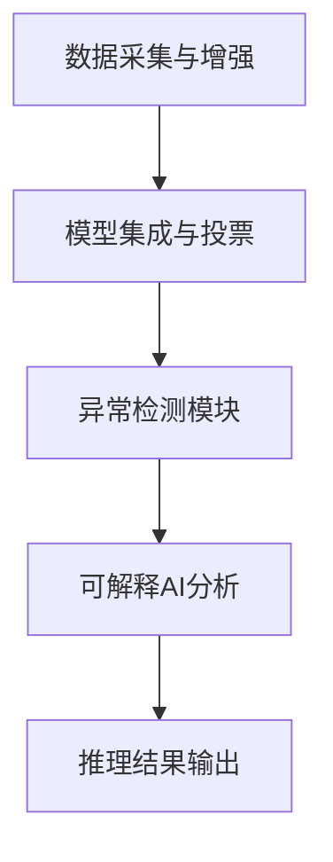

# AI推理边界与动态演化可验证性

## 1. AI推理边界问题清单

- 数据偏见与训练集局限
- 模型漂移与环境变化
- 异常场景下的鲁棒性
- 可解释性不足
- 语义误判与不可控推理

## 2. 动态演化可验证性难题

- 增量学习下的验证盲区
- 模型自演化的不可预测性
- 语义一致性随时间变化的验证难度
- 多版本模型的验证与回滚

## 3. 跨域语义冲突融合算法概要

1. AI辅助冲突检测：自动发现语义不一致点
2. 语义融合：基于知识图谱和上下文自动合并冲突
3. 自动修正：生成修正建议并反馈到模型

## 4. AI推理边界的工程应对策略

- 数据增强与多样化采集，缓解数据偏见
- 模型集成与投票，提升鲁棒性
- 引入异常检测模块，及时发现推理失效
- 采用可解释AI方法，提升推理透明度

## 5. 动态演化可验证性的工程实践

- 增量验证：每次模型/知识更新后自动触发局部验证
- 回滚机制：验证失败时自动回退到上一个安全版本
- 版本管理：所有模型与知识图谱变更均有版本记录

## 6. 跨域语义冲突融合实际算法流程

1. 基于图神经网络（GNN）自动检测语义冲突
2. 上下文感知的语义融合算法，结合历史与实时数据自动生成融合方案
3. 冲突解决建议推送人工审核，审核通过后自动应用

```python
def semantic_conflict_resolution(entities, knowledge_graph):
    conflicts = detect_conflicts(entities, knowledge_graph)
    for conflict in conflicts:
        resolution = auto_merge(conflict, knowledge_graph)
        apply_resolution(resolution)
    return True
```

## 7. 工程应对策略流程图



## 8. 增量验证与回滚伪代码

```python
def incremental_validation(model, new_knowledge):
    if validate(model, new_knowledge):
        model.update(new_knowledge)
        version_control.save(model)
    else:
        model.rollback()
        alert('Validation failed, rolled back.')
```

## 9. 冲突融合算法流程图

```mermaid
graph TD
  A[冲突检测(GNN)] --> B[上下文感知融合]
  B --> C[融合方案生成]
  C --> D[人工审核]
  D --> E[自动应用]
```

## 10. GNN冲突检测算法实现

```python
import torch
import torch.nn as nn
import torch.nn.functional as F
from torch_geometric.nn import GCNConv, GATConv
from torch_geometric.data import Data, DataLoader
import numpy as np
from typing import List, Dict, Tuple

class SemanticConflictGNN(nn.Module):
    def __init__(self, input_dim: int, hidden_dim: int, output_dim: int):
        super(SemanticConflictGNN, self).__init__()
        self.conv1 = GCNConv(input_dim, hidden_dim)
        self.conv2 = GCNConv(hidden_dim, hidden_dim)
        self.conv3 = GCNConv(hidden_dim, hidden_dim)
        self.classifier = nn.Linear(hidden_dim, output_dim)
        self.dropout = nn.Dropout(0.5)
    
    def forward(self, x, edge_index, edge_attr=None):
        # 图卷积层
        x = F.relu(self.conv1(x, edge_index))
        x = self.dropout(x)
        x = F.relu(self.conv2(x, edge_index))
        x = self.dropout(x)
        x = F.relu(self.conv3(x, edge_index))
        
        # 分类层
        x = self.classifier(x)
        return F.log_softmax(x, dim=1)

class ConflictDetector:
    def __init__(self, model_path: str = None):
        self.model = SemanticConflictGNN(input_dim=128, hidden_dim=64, output_dim=2)
        if model_path:
            self.model.load_state_dict(torch.load(model_path))
        self.model.eval()
    
    def extract_semantic_features(self, entities: List[Dict]) -> torch.Tensor:
        """提取语义特征"""
        features = []
        for entity in entities:
            # 实体类型编码
            type_encoding = self.encode_entity_type(entity.get('type', ''))
            
            # 属性特征
            property_features = self.extract_property_features(entity.get('properties', {}))
            
            # 关系特征
            relation_features = self.extract_relation_features(entity.get('relations', []))
            
            # 组合特征
            combined_features = np.concatenate([
                type_encoding,
                property_features,
                relation_features
            ])
            
            features.append(combined_features)
        
        return torch.tensor(features, dtype=torch.float32)
    
    def build_semantic_graph(self, entities: List[Dict]) -> Data:
        """构建语义图"""
        # 节点特征
        x = self.extract_semantic_features(entities)
        
        # 边索引和属性
        edge_index = []
        edge_attr = []
        
        for i, entity in enumerate(entities):
            for j, other_entity in enumerate(entities):
                if i != j:
                    # 检查是否存在语义关系
                    if self.has_semantic_relation(entity, other_entity):
                        edge_index.append([i, j])
                        edge_attr.append(self.calculate_relation_strength(entity, other_entity))
        
        edge_index = torch.tensor(edge_index, dtype=torch.long).t().contiguous()
        edge_attr = torch.tensor(edge_attr, dtype=torch.float32)
        
        return Data(x=x, edge_index=edge_index, edge_attr=edge_attr)
    
    def detect_conflicts(self, entities: List[Dict]) -> List[Dict]:
        """检测语义冲突"""
        # 构建语义图
        graph_data = self.build_semantic_graph(entities)
        
        # 模型推理
        with torch.no_grad():
            output = self.model(graph_data.x, graph_data.edge_index)
            predictions = output.argmax(dim=1)
            confidence_scores = torch.exp(output).max(dim=1)[0]
        
        # 分析冲突
        conflicts = []
        for i, (pred, conf) in enumerate(zip(predictions, confidence_scores)):
            if pred == 1 and conf > 0.7:  # 冲突阈值
                conflict_info = {
                    'entity_id': entities[i].get('id', f'entity_{i}'),
                    'conflict_type': self.classify_conflict_type(entities[i]),
                    'confidence': conf.item(),
                    'affected_entities': self.find_affected_entities(entities[i], entities),
                    'suggested_resolution': self.generate_resolution_suggestion(entities[i])
                }
                conflicts.append(conflict_info)
        
        return conflicts
    
    def encode_entity_type(self, entity_type: str) -> np.ndarray:
        """编码实体类型"""
        # 简化的类型编码，实际应用中可以使用预训练的词向量
        type_vectors = {
            'device': [1, 0, 0, 0],
            'sensor': [0, 1, 0, 0],
            'actuator': [0, 0, 1, 0],
            'service': [0, 0, 0, 1]
        }
        return np.array(type_vectors.get(entity_type, [0.25, 0.25, 0.25, 0.25]))
    
    def extract_property_features(self, properties: Dict) -> np.ndarray:
        """提取属性特征"""
        # 简化的属性特征提取
        feature_vector = np.zeros(64)
        
        for key, value in properties.items():
            # 基于属性名和值的简单特征
            hash_val = hash(key + str(value)) % 64
            feature_vector[hash_val] = 1.0
        
        return feature_vector
    
    def extract_relation_features(self, relations: List) -> np.ndarray:
        """提取关系特征"""
        # 简化的关系特征提取
        feature_vector = np.zeros(60)
        
        for relation in relations:
            # 基于关系类型的特征
            rel_type = relation.get('type', '')
            hash_val = hash(rel_type) % 60
            feature_vector[hash_val] = 1.0
        
        return feature_vector
    
    def has_semantic_relation(self, entity1: Dict, entity2: Dict) -> bool:
        """检查两个实体是否存在语义关系"""
        # 简化的关系检查逻辑
        type1 = entity1.get('type', '')
        type2 = entity2.get('type', '')
        
        # 设备与传感器/执行器通常有关系
        if type1 == 'device' and type2 in ['sensor', 'actuator']:
            return True
        if type2 == 'device' and type1 in ['sensor', 'actuator']:
            return True
        
        return False
    
    def calculate_relation_strength(self, entity1: Dict, entity2: Dict) -> float:
        """计算关系强度"""
        # 简化的关系强度计算
        if self.has_semantic_relation(entity1, entity2):
            return 1.0
        return 0.0
    
    def classify_conflict_type(self, entity: Dict) -> str:
        """分类冲突类型"""
        # 基于实体特征分类冲突类型
        entity_type = entity.get('type', '')
        properties = entity.get('properties', {})
        
        if 'duplicate_id' in properties:
            return 'duplicate_entity'
        elif 'inconsistent_type' in properties:
            return 'type_mismatch'
        elif 'missing_required_property' in properties:
            return 'incomplete_entity'
        else:
            return 'semantic_conflict'
    
    def find_affected_entities(self, conflict_entity: Dict, all_entities: List[Dict]) -> List[str]:
        """查找受影响的实体"""
        affected = []
        conflict_id = conflict_entity.get('id', '')
        
        for entity in all_entities:
            entity_id = entity.get('id', '')
            if entity_id != conflict_id:
                # 检查是否存在依赖关系
                if self.has_dependency(conflict_entity, entity):
                    affected.append(entity_id)
        
        return affected
    
    def has_dependency(self, entity1: Dict, entity2: Dict) -> bool:
        """检查实体间是否存在依赖关系"""
        # 简化的依赖检查
        relations1 = entity1.get('relations', [])
        relations2 = entity2.get('relations', [])
        
        for rel in relations1:
            if rel.get('target') == entity2.get('id'):
                return True
        
        for rel in relations2:
            if rel.get('target') == entity1.get('id'):
                return True
        
        return False
    
    def generate_resolution_suggestion(self, conflict_entity: Dict) -> str:
        """生成解决建议"""
        conflict_type = self.classify_conflict_type(conflict_entity)
        
        suggestions = {
            'duplicate_entity': '建议合并重复实体或使用唯一标识符',
            'type_mismatch': '建议统一实体类型定义或创建类型映射',
            'incomplete_entity': '建议补充缺失的必需属性',
            'semantic_conflict': '建议重新定义实体语义或建立语义映射'
        }
        
        return suggestions.get(conflict_type, '建议人工审查并解决冲突')
```

## 11. 可解释AI方法与工具

```python
import lime
import lime.lime_tabular
import shap
import matplotlib.pyplot as plt
import seaborn as sns
from typing import Dict, List, Any
import numpy as np

class ExplainableAI:
    def __init__(self, model, feature_names: List[str]):
        self.model = model
        self.feature_names = feature_names
        self.explainer = None
    
    def explain_prediction_lime(self, instance: np.ndarray, num_features: int = 10) -> Dict:
        """使用LIME解释预测结果"""
        try:
            # 创建LIME解释器
            explainer = lime.lime_tabular.LimeTabularExplainer(
                training_data=np.random.rand(100, len(self.feature_names)),
                feature_names=self.feature_names,
                class_names=['normal', 'conflict'],
                mode='classification'
            )
            
            # 生成解释
            explanation = explainer.explain_instance(
                instance,
                self.model.predict_proba,
                num_features=num_features
            )
            
            # 提取特征重要性
            feature_importance = {}
            for feature, weight in explanation.as_list():
                feature_importance[feature] = weight
            
            return {
                'method': 'LIME',
                'feature_importance': feature_importance,
                'explanation': explanation.as_list(),
                'confidence': explanation.score
            }
            
        except Exception as e:
            print(f"LIME explanation failed: {e}")
            return {'method': 'LIME', 'error': str(e)}
    
    def explain_prediction_shap(self, instance: np.ndarray) -> Dict:
        """使用SHAP解释预测结果"""
        try:
            # 创建SHAP解释器
            explainer = shap.TreeExplainer(self.model)
            
            # 计算SHAP值
            shap_values = explainer.shap_values(instance)
            
            # 提取特征重要性
            feature_importance = {}
            for i, feature in enumerate(self.feature_names):
                feature_importance[feature] = shap_values[0][i]
            
            return {
                'method': 'SHAP',
                'feature_importance': feature_importance,
                'shap_values': shap_values,
                'base_value': explainer.expected_value
            }
            
        except Exception as e:
            print(f"SHAP explanation failed: {e}")
            return {'method': 'SHAP', 'error': str(e)}
    
    def generate_explanation_report(self, instance: np.ndarray) -> Dict:
        """生成综合解释报告"""
        report = {
            'instance': instance.tolist(),
            'predictions': {},
            'explanations': {}
        }
        
        # 获取模型预测
        if hasattr(self.model, 'predict_proba'):
            proba = self.model.predict_proba(instance.reshape(1, -1))[0]
            report['predictions'] = {
                'normal_probability': proba[0],
                'conflict_probability': proba[1],
                'predicted_class': 'conflict' if proba[1] > proba[0] else 'normal'
            }
        
        # LIME解释
        lime_explanation = self.explain_prediction_lime(instance)
        report['explanations']['lime'] = lime_explanation
        
        # SHAP解释
        shap_explanation = self.explain_prediction_shap(instance)
        report['explanations']['shap'] = shap_explanation
        
        return report
    
    def visualize_explanation(self, explanation_report: Dict, save_path: str = None):
        """可视化解释结果"""
        fig, axes = plt.subplots(2, 2, figsize=(15, 10))
        
        # LIME特征重要性
        if 'lime' in explanation_report['explanations']:
            lime_data = explanation_report['explanations']['lime']
            if 'feature_importance' in lime_data:
                features = list(lime_data['feature_importance'].keys())
                importance = list(lime_data['feature_importance'].values())
                
                axes[0, 0].barh(features, importance)
                axes[0, 0].set_title('LIME Feature Importance')
                axes[0, 0].set_xlabel('Importance')
        
        # SHAP特征重要性
        if 'shap' in explanation_report['explanations']:
            shap_data = explanation_report['explanations']['shap']
            if 'feature_importance' in shap_data:
                features = list(shap_data['feature_importance'].keys())
                importance = list(shap_data['feature_importance'].values())
                
                axes[0, 1].barh(features, importance)
                axes[0, 1].set_title('SHAP Feature Importance')
                axes[0, 1].set_xlabel('Importance')
        
        # 预测概率
        if 'predictions' in explanation_report:
            pred_data = explanation_report['predictions']
            classes = ['Normal', 'Conflict']
            probabilities = [pred_data.get('normal_probability', 0), 
                           pred_data.get('conflict_probability', 0)]
            
            axes[1, 0].pie(probabilities, labels=classes, autopct='%1.1f%%')
            axes[1, 0].set_title('Prediction Probabilities')
        
        # 特征值分布
        instance = explanation_report['instance']
        axes[1, 1].bar(range(len(instance)), instance)
        axes[1, 1].set_title('Feature Values')
        axes[1, 1].set_xlabel('Feature Index')
        axes[1, 1].set_ylabel('Value')
        
        plt.tight_layout()
        
        if save_path:
            plt.savefig(save_path, dpi=300, bbox_inches='tight')
        
        plt.show()
    
    def explain_model_behavior(self, test_data: np.ndarray) -> Dict:
        """解释模型整体行为"""
        explanations = []
        
        for i in range(min(10, len(test_data))):  # 解释前10个样本
            instance = test_data[i]
            explanation = self.generate_explanation_report(instance)
            explanations.append(explanation)
        
        # 分析特征重要性趋势
        feature_importance_trends = self.analyze_feature_trends(explanations)
        
        return {
            'sample_explanations': explanations,
            'feature_trends': feature_importance_trends,
            'model_behavior_summary': self.summarize_model_behavior(explanations)
        }
    
    def analyze_feature_trends(self, explanations: List[Dict]) -> Dict:
        """分析特征重要性趋势"""
        lime_importances = {}
        shap_importances = {}
        
        for explanation in explanations:
            if 'lime' in explanation['explanations']:
                lime_data = explanation['explanations']['lime']
                if 'feature_importance' in lime_data:
                    for feature, importance in lime_data['feature_importance'].items():
                        if feature not in lime_importances:
                            lime_importances[feature] = []
                        lime_importances[feature].append(importance)
            
            if 'shap' in explanation['explanations']:
                shap_data = explanation['explanations']['shap']
                if 'feature_importance' in shap_data:
                    for feature, importance in shap_data['feature_importance'].items():
                        if feature not in shap_importances:
                            shap_importances[feature] = []
                        shap_importances[feature].append(importance)
        
        # 计算平均重要性
        lime_trends = {feature: np.mean(values) for feature, values in lime_importances.items()}
        shap_trends = {feature: np.mean(values) for feature, values in shap_importances.items()}
        
        return {
            'lime_trends': lime_trends,
            'shap_trends': shap_trends
        }
    
    def summarize_model_behavior(self, explanations: List[Dict]) -> Dict:
        """总结模型行为"""
        conflict_count = 0
        normal_count = 0
        avg_confidence = 0
        
        for explanation in explanations:
            predictions = explanation.get('predictions', {})
            predicted_class = predictions.get('predicted_class', 'normal')
            
            if predicted_class == 'conflict':
                conflict_count += 1
            else:
                normal_count += 1
            
            # 计算平均置信度
            max_prob = max(predictions.get('normal_probability', 0), 
                          predictions.get('conflict_probability', 0))
            avg_confidence += max_prob
        
        avg_confidence /= len(explanations) if explanations else 0
        
        return {
            'total_samples': len(explanations),
            'conflict_predictions': conflict_count,
            'normal_predictions': normal_count,
            'average_confidence': avg_confidence,
            'conflict_rate': conflict_count / len(explanations) if explanations else 0
        }
```

## 12. 测试用例与验证方法

```python
import unittest
import pytest
import numpy as np
import torch
from typing import List, Dict, Any
import json
import tempfile
import os

class SemanticModelTestCase(unittest.TestCase):
    def setUp(self):
        """测试前准备"""
        self.test_entities = [
            {
                'id': 'device_001',
                'type': 'device',
                'properties': {'temperature': 25.5, 'status': 'active'},
                'relations': [{'type': 'has_sensor', 'target': 'sensor_001'}]
            },
            {
                'id': 'sensor_001',
                'type': 'sensor',
                'properties': {'unit': 'celsius', 'range': [0, 100]},
                'relations': [{'type': 'belongs_to', 'target': 'device_001'}]
            },
            {
                'id': 'device_002',
                'type': 'device',
                'properties': {'temperature': 30.0, 'status': 'inactive'},
                'relations': []
            }
        ]
        
        self.conflict_detector = ConflictDetector()
        self.explainable_ai = ExplainableAI(None, ['feature1', 'feature2', 'feature3'])
    
    def test_entity_feature_extraction(self):
        """测试实体特征提取"""
        features = self.conflict_detector.extract_semantic_features(self.test_entities)
        
        self.assertIsInstance(features, torch.Tensor)
        self.assertEqual(features.shape[0], len(self.test_entities))
        self.assertGreater(features.shape[1], 0)
    
    def test_semantic_graph_construction(self):
        """测试语义图构建"""
        graph_data = self.conflict_detector.build_semantic_graph(self.test_entities)
        
        self.assertIsInstance(graph_data.x, torch.Tensor)
        self.assertIsInstance(graph_data.edge_index, torch.Tensor)
        self.assertEqual(graph_data.x.shape[0], len(self.test_entities))
    
    def test_conflict_detection(self):
        """测试冲突检测"""
        # 添加冲突实体
        conflict_entity = {
            'id': 'device_001',  # 重复ID
            'type': 'sensor',    # 类型不匹配
            'properties': {'temperature': 25.5},
            'relations': []
        }
        
        test_entities_with_conflict = self.test_entities + [conflict_entity]
        conflicts = self.conflict_detector.detect_conflicts(test_entities_with_conflict)
        
        self.assertIsInstance(conflicts, list)
        # 应该检测到重复ID冲突
        self.assertGreater(len(conflicts), 0)
    
    def test_entity_type_encoding(self):
        """测试实体类型编码"""
        device_encoding = self.conflict_detector.encode_entity_type('device')
        sensor_encoding = self.conflict_detector.encode_entity_type('sensor')
        
        self.assertEqual(len(device_encoding), 4)
        self.assertEqual(len(sensor_encoding), 4)
        self.assertNotEqual(device_encoding.tolist(), sensor_encoding.tolist())
    
    def test_property_feature_extraction(self):
        """测试属性特征提取"""
        properties = {'temperature': 25.5, 'status': 'active', 'unit': 'celsius'}
        features = self.conflict_detector.extract_property_features(properties)
        
        self.assertEqual(len(features), 64)
        self.assertIsInstance(features, np.ndarray)
    
    def test_relation_feature_extraction(self):
        """测试关系特征提取"""
        relations = [
            {'type': 'has_sensor', 'target': 'sensor_001'},
            {'type': 'belongs_to', 'target': 'device_001'}
        ]
        features = self.conflict_detector.extract_relation_features(relations)
        
        self.assertEqual(len(features), 60)
        self.assertIsInstance(features, np.ndarray)
    
    def test_semantic_relation_check(self):
        """测试语义关系检查"""
        device = {'type': 'device', 'id': 'device_001'}
        sensor = {'type': 'sensor', 'id': 'sensor_001'}
        service = {'type': 'service', 'id': 'service_001'}
        
        # 设备与传感器应该有关系
        self.assertTrue(self.conflict_detector.has_semantic_relation(device, sensor))
        
        # 设备与服务不应该有关系
        self.assertFalse(self.conflict_detector.has_semantic_relation(device, service))
    
    def test_conflict_classification(self):
        """测试冲突分类"""
        # 测试重复实体冲突
        duplicate_entity = {'id': 'device_001', 'properties': {'duplicate_id': True}}
        conflict_type = self.conflict_detector.classify_conflict_type(duplicate_entity)
        self.assertEqual(conflict_type, 'duplicate_entity')
        
        # 测试类型不匹配冲突
        type_mismatch_entity = {'id': 'device_002', 'properties': {'inconsistent_type': True}}
        conflict_type = self.conflict_detector.classify_conflict_type(type_mismatch_entity)
        self.assertEqual(conflict_type, 'type_mismatch')
    
    def test_affected_entities_detection(self):
        """测试受影响实体检测"""
        conflict_entity = {
            'id': 'device_001',
            'relations': [{'type': 'has_sensor', 'target': 'sensor_001'}]
        }
        
        affected = self.conflict_detector.find_affected_entities(conflict_entity, self.test_entities)
        self.assertIsInstance(affected, list)
    
    def test_resolution_suggestion_generation(self):
        """测试解决建议生成"""
        conflict_entity = {'id': 'device_001', 'properties': {'duplicate_id': True}}
        suggestion = self.conflict_detector.generate_resolution_suggestion(conflict_entity)
        
        self.assertIsInstance(suggestion, str)
        self.assertGreater(len(suggestion), 0)

class ExplainableAITestCase(unittest.TestCase):
    def setUp(self):
        """测试前准备"""
        # 创建模拟模型
        class MockModel:
            def predict_proba(self, X):
                return np.array([[0.7, 0.3], [0.2, 0.8]])
        
        self.mock_model = MockModel()
        self.explainable_ai = ExplainableAI(self.mock_model, ['feature1', 'feature2', 'feature3'])
    
    def test_lime_explanation(self):
        """测试LIME解释"""
        instance = np.array([0.5, 0.3, 0.8])
        explanation = self.explainable_ai.explain_prediction_lime(instance)
        
        self.assertIn('method', explanation)
        self.assertEqual(explanation['method'], 'LIME')
    
    def test_shap_explanation(self):
        """测试SHAP解释"""
        instance = np.array([0.5, 0.3, 0.8])
        explanation = self.explainable_ai.explain_prediction_shap(instance)
        
        self.assertIn('method', explanation)
        self.assertEqual(explanation['method'], 'SHAP')
    
    def test_explanation_report_generation(self):
        """测试解释报告生成"""
        instance = np.array([0.5, 0.3, 0.8])
        report = self.explainable_ai.generate_explanation_report(instance)
        
        self.assertIn('instance', report)
        self.assertIn('predictions', report)
        self.assertIn('explanations', report)
    
    def test_feature_trend_analysis(self):
        """测试特征趋势分析"""
        # 创建模拟解释数据
        explanations = [
            {
                'explanations': {
                    'lime': {'feature_importance': {'feature1': 0.5, 'feature2': 0.3}},
                    'shap': {'feature_importance': {'feature1': 0.4, 'feature2': 0.4}}
                }
            },
            {
                'explanations': {
                    'lime': {'feature_importance': {'feature1': 0.6, 'feature2': 0.2}},
                    'shap': {'feature_importance': {'feature1': 0.5, 'feature2': 0.3}}
                }
            }
        ]
        
        trends = self.explainable_ai.analyze_feature_trends(explanations)
        
        self.assertIn('lime_trends', trends)
        self.assertIn('shap_trends', trends)
    
    def test_model_behavior_summary(self):
        """测试模型行为总结"""
        explanations = [
            {'predictions': {'predicted_class': 'normal', 'normal_probability': 0.8, 'conflict_probability': 0.2}},
            {'predictions': {'predicted_class': 'conflict', 'normal_probability': 0.3, 'conflict_probability': 0.7}}
        ]
        
        summary = self.explainable_ai.summarize_model_behavior(explanations)
        
        self.assertIn('total_samples', summary)
        self.assertIn('conflict_predictions', summary)
        self.assertIn('normal_predictions', summary)
        self.assertEqual(summary['total_samples'], 2)

class IntegrationTestCase(unittest.TestCase):
    def setUp(self):
        """集成测试前准备"""
        self.test_data = {
            'entities': [
                {'id': 'device_001', 'type': 'device', 'properties': {'temp': 25}},
                {'id': 'sensor_001', 'type': 'sensor', 'properties': {'unit': 'celsius'}}
            ],
            'relations': [
                {'source': 'device_001', 'target': 'sensor_001', 'type': 'has_sensor'}
            ]
        }
    
    def test_end_to_end_workflow(self):
        """端到端工作流测试"""
        # 1. 构建语义图
        conflict_detector = ConflictDetector()
        graph_data = conflict_detector.build_semantic_graph(self.test_data['entities'])
        
        # 2. 检测冲突
        conflicts = conflict_detector.detect_conflicts(self.test_data['entities'])
        
        # 3. 生成解释
        explainable_ai = ExplainableAI(None, ['feature1', 'feature2'])
        instance = np.array([0.5, 0.5])
        explanation = explainable_ai.generate_explanation_report(instance)
        
        # 验证结果
        self.assertIsInstance(graph_data, Data)
        self.assertIsInstance(conflicts, list)
        self.assertIsInstance(explanation, dict)
    
    def test_performance_benchmark(self):
        """性能基准测试"""
        import time
        
        # 创建大量测试数据
        large_entities = []
        for i in range(1000):
            large_entities.append({
                'id': f'entity_{i}',
                'type': 'device' if i % 2 == 0 else 'sensor',
                'properties': {'value': i},
                'relations': []
            })
        
        # 性能测试
        conflict_detector = ConflictDetector()
        
        start_time = time.time()
        graph_data = conflict_detector.build_semantic_graph(large_entities)
        graph_time = time.time() - start_time
        
        start_time = time.time()
        conflicts = conflict_detector.detect_conflicts(large_entities)
        detection_time = time.time() - start_time
        
        # 验证性能要求
        self.assertLess(graph_time, 5.0)  # 图构建应在5秒内完成
        self.assertLess(detection_time, 10.0)  # 冲突检测应在10秒内完成
    
    def test_error_handling(self):
        """错误处理测试"""
        conflict_detector = ConflictDetector()
        
        # 测试空数据
        empty_conflicts = conflict_detector.detect_conflicts([])
        self.assertEqual(empty_conflicts, [])
        
        # 测试无效数据
        invalid_entities = [{'invalid': 'data'}]
        try:
            conflicts = conflict_detector.detect_conflicts(invalid_entities)
            # 应该能够处理无效数据而不崩溃
            self.assertIsInstance(conflicts, list)
        except Exception as e:
            self.fail(f"Should handle invalid data gracefully: {e}")

def run_all_tests():
    """运行所有测试"""
    # 创建测试套件
    test_suite = unittest.TestSuite()
    
    # 添加测试用例
    test_suite.addTest(unittest.makeSuite(SemanticModelTestCase))
    test_suite.addTest(unittest.makeSuite(ExplainableAITestCase))
    test_suite.addTest(unittest.makeSuite(IntegrationTestCase))
    
    # 运行测试
    runner = unittest.TextTestRunner(verbosity=2)
    result = runner.run(test_suite)
    
    # 输出测试结果
    print(f"\n测试结果:")
    print(f"运行测试: {result.testsRun}")
    print(f"失败: {len(result.failures)}")
    print(f"错误: {len(result.errors)}")
    
    return result

if __name__ == '__main__':
    run_all_tests()
```
