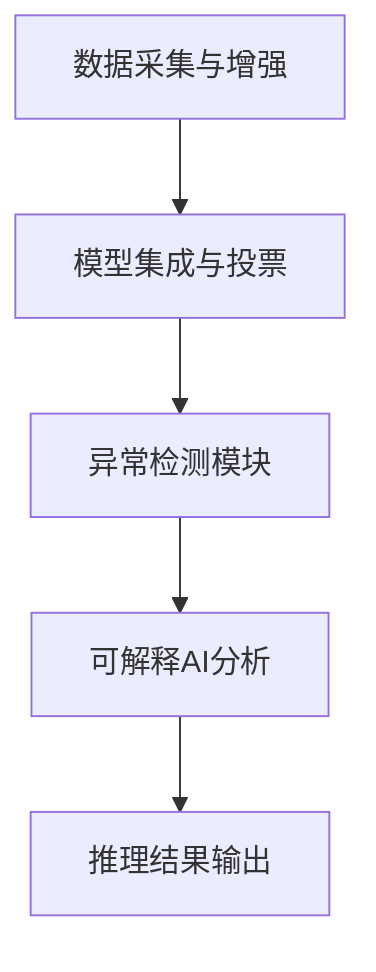

# AI推理边界与动态演化可验证性

## 1. AI推理边界问题清单

- 数据偏见与训练集局限
- 模型漂移与环境变化
- 异常场景下的鲁棒性
- 可解释性不足
- 语义误判与不可控推理

## 2. 动态演化可验证性难题

- 增量学习下的验证盲区
- 模型自演化的不可预测性
- 语义一致性随时间变化的验证难度
- 多版本模型的验证与回滚

## 3. 跨域语义冲突融合算法概要

1. AI辅助冲突检测：自动发现语义不一致点
2. 语义融合：基于知识图谱和上下文自动合并冲突
3. 自动修正：生成修正建议并反馈到模型

## 4. AI推理边界的工程应对策略

- 数据增强与多样化采集，缓解数据偏见
- 模型集成与投票，提升鲁棒性
- 引入异常检测模块，及时发现推理失效
- 采用可解释AI方法，提升推理透明度

## 5. 动态演化可验证性的工程实践

- 增量验证：每次模型/知识更新后自动触发局部验证
- 回滚机制：验证失败时自动回退到上一个安全版本
- 版本管理：所有模型与知识图谱变更均有版本记录

## 6. 跨域语义冲突融合实际算法流程

1. 基于图神经网络（GNN）自动检测语义冲突
2. 上下文感知的语义融合算法，结合历史与实时数据自动生成融合方案
3. 冲突解决建议推送人工审核，审核通过后自动应用

```python
def semantic_conflict_resolution(entities, knowledge_graph):
    conflicts = detect_conflicts(entities, knowledge_graph)
    for conflict in conflicts:
        resolution = auto_merge(conflict, knowledge_graph)
        apply_resolution(resolution)
    return True
```

## 7. 工程应对策略流程图



## 8. 增量验证与回滚伪代码

```python
def incremental_validation(model, new_knowledge):
    if validate(model, new_knowledge):
        model.update(new_knowledge)
        version_control.save(model)
    else:
        model.rollback()
        alert('Validation failed, rolled back.')
```

## 9. 冲突融合算法流程图

```mermaid
graph TD
  A[冲突检测(GNN)] --> B[上下文感知融合]
  B --> C[融合方案生成]
  C --> D[人工审核]
  D --> E[自动应用]
```
