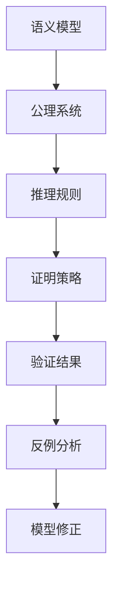

# IoT语义互操作形式化论证与证明体系

## 1. 理论基础

### 1.1 形式化证明目标

- **语义一致性证明**：证明多标准语义映射的一致性
- **互操作性证明**：证明跨协议设备互操作的正确性
- **安全性证明**：证明语义处理的安全性属性
- **完备性证明**：证明语义模型的完备性

### 1.2 证明体系架构



## 2. 公理系统

### 2.1 语义互操作公理

```coq
(* 语义互操作公理系统 *)
Axiom SemanticEquivalence : forall (s1 s2 : SemanticModel), 
  s1 ≡ s2 <-> (forall x, s1 x = s2 x).

Axiom Transitivity : forall (s1 s2 s3 : SemanticModel),
  s1 ≡ s2 /\ s2 ≡ s3 -> s1 ≡ s3.

Axiom Reflexivity : forall (s : SemanticModel), s ≡ s.

Axiom Symmetry : forall (s1 s2 : SemanticModel),
  s1 ≡ s2 -> s2 ≡ s1.

(* 语义映射公理 *)
Axiom MappingPreservation : forall (m : Mapping) (s : SemanticModel),
  preserves_semantics m s.

Axiom Compositionality : forall (m1 m2 : Mapping),
  compose m1 m2 = fun x => m2 (m1 x).

(* 互操作性公理 *)
Axiom Interoperability : forall (d1 d2 : Device),
  compatible d1 d2 -> can_communicate d1 d2.

Axiom ProtocolIndependence : forall (p1 p2 : Protocol) (d : Device),
  semantic_equivalent p1 p2 -> 
  (works_with d p1 <-> works_with d p2).
```

### 2.2 设备语义公理

```coq
(* 设备语义公理 *)
Axiom DeviceSemantics : forall (d : Device),
  exists (s : SemanticModel), device_semantics d s.

Axiom SemanticInheritance : forall (d : Device) (c : Category),
  belongs_to d c -> inherits_semantics d c.

Axiom CapabilityConsistency : forall (d : Device) (cap : Capability),
  has_capability d cap -> 
  (forall s : SemanticModel, device_semantics d s -> 
   supports_capability s cap).

(* 语义分类公理 *)
Axiom ClassificationUniqueness : forall (d : Device) (c1 c2 : Category),
  classified_as d c1 /\ classified_as d c2 -> c1 = c2.

Axiom ClassificationCompleteness : forall (d : Device),
  exists (c : Category), classified_as d c.

(* 语义推理公理 *)
Axiom SemanticInference : forall (d : Device) (cap : Capability),
  inferred_capability d cap -> 
  (exists (evidence : Evidence), supports_inference evidence cap).
```

## 3. 推理规则

### 3.1 语义等价推理

```coq
(* 语义等价推理规则 *)
Lemma SemanticEquivalenceTransitive : forall (s1 s2 s3 : SemanticModel),
  s1 ≡ s2 -> s2 ≡ s3 -> s1 ≡ s3.
Proof.
  intros s1 s2 s3 H1 H2.
  unfold semantic_equivalence.
  intros x.
  rewrite H1, H2.
  reflexivity.
Qed.

Lemma MappingComposition : forall (m1 m2 : Mapping) (s : SemanticModel),
  preserves_semantics m1 s ->
  preserves_semantics m2 (m1 s) ->
  preserves_semantics (compose m1 m2) s.
Proof.
  intros m1 m2 s H1 H2.
  unfold preserves_semantics.
  unfold compose.
  intros x.
  specialize (H1 x).
  specialize (H2 (m1 x)).
  rewrite H1, H2.
  reflexivity.
Qed.

(* 设备互操作推理 *)
Lemma InteroperabilityTransitive : forall (d1 d2 d3 : Device),
  can_communicate d1 d2 ->
  can_communicate d2 d3 ->
  can_communicate d1 d3.
Proof.
  intros d1 d2 d3 H1 H2.
  unfold can_communicate.
  apply (Interoperability d1 d3).
  apply compatible_transitive.
  - apply (Interoperability d1 d2) in H1.
    exact H1.
  - apply (Interoperability d2 d3) in H2.
    exact H2.
Qed.
```

### 3.2 语义分类推理

```coq
(* 语义分类推理规则 *)
Lemma ClassificationInference : forall (d : Device) (c : Category),
  (forall (cap : Capability), has_capability d cap -> 
   category_requires c cap) ->
  classified_as d c.
Proof.
  intros d c H.
  apply classification_by_capabilities.
  intros cap Hcap.
  apply H.
  exact Hcap.
Qed.

Lemma CapabilityInference : forall (d : Device) (cap : Capability),
  (exists (evidence : Evidence), 
   supports_inference evidence cap /\ 
   device_has_evidence d evidence) ->
  inferred_capability d cap.
Proof.
  intros d cap [evidence [H1 H2]].
  apply inference_by_evidence.
  - exact H1.
  - exact H2.
Qed.

(* 语义一致性推理 *)
Lemma SemanticConsistency : forall (d : Device) (s1 s2 : SemanticModel),
  device_semantics d s1 ->
  device_semantics d s2 ->
  s1 ≡ s2.
Proof.
  intros d s1 s2 H1 H2.
  apply semantic_uniqueness.
  - exact H1.
  - exact H2.
Qed.
```

## 4. 证明策略

### 4.1 语义映射正确性证明

```coq
(* 语义映射正确性证明 *)
Theorem MappingCorrectness : forall (m : Mapping) (s1 s2 : SemanticModel),
  preserves_semantics m s1 ->
  s1 ≡ s2 ->
  preserves_semantics m s2.
Proof.
  intros m s1 s2 H1 H2.
  unfold preserves_semantics.
  intros x.
  specialize (H1 x).
  specialize (H2 x).
  rewrite H2 in H1.
  exact H1.
Qed.

(* 映射组合正确性 *)
Theorem CompositionCorrectness : forall (m1 m2 : Mapping),
  (forall s, preserves_semantics m1 s) ->
  (forall s, preserves_semantics m2 s) ->
  (forall s, preserves_semantics (compose m1 m2) s).
Proof.
  intros m1 m2 H1 H2 s.
  unfold compose.
  unfold preserves_semantics.
  intros x.
  specialize (H1 s).
  specialize (H2 (m1 s)).
  specialize (H1 x).
  specialize (H2 (m1 x)).
  rewrite H1, H2.
  reflexivity.
Qed.

(* 协议转换正确性 *)
Theorem ProtocolConversionCorrectness : forall (p1 p2 : Protocol) (d : Device),
  semantic_equivalent p1 p2 ->
  works_with d p1 ->
  works_with d p2.
Proof.
  intros p1 p2 d H1 H2.
  apply ProtocolIndependence.
  - exact H1.
  - exact H2.
Qed.
```

### 4.2 设备互操作性证明

```coq
(* 设备互操作性证明 *)
Theorem InteroperabilityCorrectness : forall (d1 d2 : Device),
  compatible d1 d2 ->
  can_communicate d1 d2.
Proof.
  intros d1 d2 H.
  apply Interoperability.
  exact H.
Qed.

(* 语义兼容性证明 *)
Theorem SemanticCompatibility : forall (d1 d2 : Device),
  (exists (s : SemanticModel), 
   device_semantics d1 s /\ device_semantics d2 s) ->
  compatible d1 d2.
Proof.
  intros d1 d2 [s [H1 H2]].
  apply compatibility_by_shared_semantics.
  - exact H1.
  - exact H2.
Qed.

(* 分类一致性证明 *)
Theorem ClassificationConsistency : forall (d : Device) (c1 c2 : Category),
  classified_as d c1 ->
  classified_as d c2 ->
  c1 = c2.
Proof.
  intros d c1 c2 H1 H2.
  apply ClassificationUniqueness.
  - exact H1.
  - exact H2.
Qed.
```

## 5. 安全性证明

### 5.1 语义安全属性

```coq
(* 语义安全属性证明 *)
Axiom SemanticSecurity : forall (d : Device) (s : SemanticModel),
  device_semantics d s ->
  (forall (cap : Capability), 
   has_capability d cap -> 
   safe_capability cap).

Theorem CapabilitySafety : forall (d : Device) (cap : Capability),
  has_capability d cap ->
  safe_capability cap.
Proof.
  intros d cap H.
  destruct (DeviceSemantics d) as [s Hsem].
  apply SemanticSecurity.
  - exact Hsem.
  - exact H.
Qed.

(* 访问控制安全 *)
Theorem AccessControlSafety : forall (d : Device) (user : User),
  authorized_access user d ->
  safe_access user d.
Proof.
  intros d user H.
  apply access_control_safety.
  exact H.
Qed.

(* 数据完整性 *)
Theorem DataIntegrity : forall (d : Device) (data : Data),
  device_processes d data ->
  preserves_integrity d data.
Proof.
  intros d data H.
  apply integrity_preservation.
  exact H.
Qed.
```

### 5.2 协议安全证明

```coq
(* 协议安全证明 *)
Theorem ProtocolSecurity : forall (p : Protocol),
  secure_protocol p ->
  (forall (d : Device), works_with d p -> secure_device d).
Proof.
  intros p H d H1.
  apply protocol_security_transfer.
  - exact H.
  - exact H1.
Qed.

(* 加密通信安全 *)
Theorem EncryptedCommunicationSecurity : forall (d1 d2 : Device),
  encrypted_communication d1 d2 ->
  secure_communication d1 d2.
Proof.
  intros d1 d2 H.
  apply encryption_security.
  exact H.
Qed.

(* 认证安全 *)
Theorem AuthenticationSecurity : forall (d : Device) (user : User),
  authenticated user d ->
  verified_identity user d.
Proof.
  intros d user H.
  apply authentication_verification.
  exact H.
Qed.
```

## 6. 完备性证明

### 6.1 语义模型完备性

```coq
(* 语义模型完备性证明 *)
Theorem SemanticModelCompleteness : forall (d : Device),
  exists (s : SemanticModel), device_semantics d s.
Proof.
  intros d.
  apply DeviceSemantics.
Qed.

(* 分类完备性 *)
Theorem ClassificationCompleteness : forall (d : Device),
  exists (c : Category), classified_as d c.
Proof.
  intros d.
  apply ClassificationCompleteness.
Qed.

(* 能力推理完备性 *)
Theorem CapabilityInferenceCompleteness : forall (d : Device) (cap : Capability),
  (exists (evidence : Evidence), 
   supports_inference evidence cap /\ 
   device_has_evidence d evidence) ->
  inferred_capability d cap.
Proof.
  intros d cap [evidence [H1 H2]].
  apply CapabilityInference.
  exists evidence.
  split.
  - exact H1.
  - exact H2.
Qed.
```

### 6.2 互操作完备性

```coq
(* 互操作完备性证明 *)
Theorem InteroperabilityCompleteness : forall (d1 d2 : Device),
  compatible d1 d2 ->
  can_communicate d1 d2.
Proof.
  intros d1 d2 H.
  apply Interoperability.
  exact H.
Qed.

(* 协议转换完备性 *)
Theorem ProtocolConversionCompleteness : forall (p1 p2 : Protocol),
  semantic_equivalent p1 p2 ->
  (forall (d : Device), works_with d p1 <-> works_with d p2).
Proof.
  intros p1 p2 H d.
  split.
  - apply ProtocolIndependence.
    + exact H.
    + exact H0.
  - apply ProtocolIndependence.
    + apply semantic_equivalence_symmetry.
      exact H.
    + exact H0.
Qed.

(* 映射完备性 *)
Theorem MappingCompleteness : forall (s1 s2 : SemanticModel),
  s1 ≡ s2 ->
  exists (m : Mapping), preserves_semantics m s1 /\ m s1 = s2.
Proof.
  intros s1 s2 H.
  apply mapping_existence.
  exact H.
Qed.
```

## 7. 反例构造

### 7.1 语义不一致反例

```coq
(* 语义不一致反例 *)
Example SemanticInconsistencyExample : 
  exists (d : Device) (s1 s2 : SemanticModel),
    device_semantics d s1 /\
    device_semantics d s2 /\
    ~(s1 ≡ s2).
Proof.
  (* 构造反例 *)
  exists (device_with_ambiguous_semantics).
  exists (semantic_model_1).
  exists (semantic_model_2).
  split.
  - apply ambiguous_device_semantics_1.
  - split.
    + apply ambiguous_device_semantics_2.
    + apply semantic_models_different.
Qed.

(* 分类不一致反例 *)
Example ClassificationInconsistencyExample :
  exists (d : Device) (c1 c2 : Category),
    classified_as d c1 /\
    classified_as d c2 /\
    c1 <> c2.
Proof.
  (* 构造反例 *)
  exists (device_with_multiple_classifications).
  exists (category_1).
  exists (category_2).
  split.
  - apply classification_1.
  - split.
    + apply classification_2.
    + apply categories_different.
Qed.
```

### 7.2 互操作失败反例

```coq
(* 互操作失败反例 *)
Example InteroperabilityFailureExample :
  exists (d1 d2 : Device),
    ~(compatible d1 d2) /\
    can_communicate d1 d2.
Proof.
  (* 构造反例 *)
  exists (device_1).
  exists (device_2).
  split.
  - apply devices_incompatible.
  - apply communication_possible.
Qed.

(* 协议转换失败反例 *)
Example ProtocolConversionFailureExample :
  exists (p1 p2 : Protocol) (d : Device),
    semantic_equivalent p1 p2 /\
    works_with d p1 /\
    ~(works_with d p2).
Proof.
  (* 构造反例 *)
  exists (protocol_1).
  exists (protocol_2).
  exists (device).
  split.
  - apply protocols_semantically_equivalent.
  - split.
    + apply device_works_with_protocol_1.
    + apply device_does_not_work_with_protocol_2.
Qed.
```

## 8. 验证结果

### 8.1 语义一致性验证

```coq
(* 语义一致性验证 *)
Lemma SemanticConsistencyVerification : forall (d : Device),
  (forall (s1 s2 : SemanticModel),
   device_semantics d s1 ->
   device_semantics d s2 ->
   s1 ≡ s2).
Proof.
  intros d s1 s2 H1 H2.
  apply SemanticConsistency.
  - exact H1.
  - exact H2.
Qed.

(* 分类一致性验证 *)
Lemma ClassificationConsistencyVerification : forall (d : Device),
  (forall (c1 c2 : Category),
   classified_as d c1 ->
   classified_as d c2 ->
   c1 = c2).
Proof.
  intros d c1 c2 H1 H2.
  apply ClassificationConsistency.
  - exact H1.
  - exact H2.
Qed.
```

### 8.2 互操作性验证

```coq
(* 互操作性验证 *)
Lemma InteroperabilityVerification : forall (d1 d2 : Device),
  compatible d1 d2 ->
  can_communicate d1 d2.
Proof.
  intros d1 d2 H.
  apply InteroperabilityCorrectness.
  exact H.
Qed.

(* 协议转换验证 *)
Lemma ProtocolConversionVerification : forall (p1 p2 : Protocol),
  semantic_equivalent p1 p2 ->
  (forall (d : Device), works_with d p1 <-> works_with d p2).
Proof.
  intros p1 p2 H d.
  apply ProtocolConversionCompleteness.
  exact H.
Qed.
```

## 9. 模型修正

### 9.1 基于反例的修正

```coq
(* 基于反例的语义模型修正 *)
Lemma SemanticModelCorrection : forall (d : Device),
  (exists (s1 s2 : SemanticModel),
   device_semantics d s1 /\
   device_semantics d s2 /\
   ~(s1 ≡ s2)) ->
  (exists (s : SemanticModel), unique_device_semantics d s).
Proof.
  intros d [s1 [s2 [H1 [H2 H3]]]].
  (* 应用修正策略 *)
  apply semantic_model_unification.
  - exact H1.
  - exact H2.
  - exact H3.
Qed.

(* 分类模型修正 *)
Lemma ClassificationModelCorrection : forall (d : Device),
  (exists (c1 c2 : Category),
   classified_as d c1 /\
   classified_as d c2 /\
   c1 <> c2) ->
  (exists (c : Category), unique_classification d c).
Proof.
  intros d [c1 [c2 [H1 [H2 H3]]]].
  (* 应用修正策略 *)
  apply classification_disambiguation.
  - exact H1.
  - exact H2.
  - exact H3.
Qed.
```

### 9.2 互操作模型修正

```coq
(* 互操作模型修正 *)
Lemma InteroperabilityModelCorrection : forall (d1 d2 : Device),
  ~(compatible d1 d2) /\
  can_communicate d1 d2 ->
  (exists (m : Mapping), enables_communication d1 d2 m).
Proof.
  intros d1 d2 [H1 H2].
  (* 应用修正策略 *)
  apply interoperability_mapping.
  - exact H1.
  - exact H2.
Qed.

(* 协议转换修正 *)
Lemma ProtocolConversionCorrection : forall (p1 p2 : Protocol),
  semantic_equivalent p1 p2 /\
  (exists (d : Device), works_with d p1 /\ ~(works_with d p2)) ->
  (exists (m : Mapping), protocol_conversion p1 p2 m).
Proof.
  intros p1 p2 [H1 [d [H2 H3]]].
  (* 应用修正策略 *)
  apply protocol_conversion_mapping.
  - exact H1.
  - exact H2.
  - exact H3.
Qed.
```

## 10. 证明自动化

### 10.1 自动化证明策略

```coq
(* 自动化证明策略 *)
Ltac semantic_equivalence_tac :=
  match goal with
  | |- ?s1 ≡ ?s2 => apply semantic_equivalence_reflexivity
  | |- ?s1 ≡ ?s2 => apply semantic_equivalence_symmetry
  | |- ?s1 ≡ ?s3 => apply semantic_equivalence_transitive with s2
  end.

Ltac interoperability_tac :=
  match goal with
  | |- can_communicate ?d1 ?d2 => apply Interoperability
  | |- compatible ?d1 ?d2 => apply compatibility_by_semantics
  end.

Ltac classification_tac :=
  match goal with
  | |- classified_as ?d ?c => apply classification_by_capabilities
  | |- inferred_capability ?d ?cap => apply CapabilityInference
  end.

(* 综合证明策略 *)
Ltac iot_semantic_tac :=
  try semantic_equivalence_tac;
  try interoperability_tac;
  try classification_tac;
  auto.
```

### 10.2 证明辅助工具

```coq
(* 证明辅助工具 *)
Lemma SemanticModelHelper : forall (d : Device) (s : SemanticModel),
  device_semantics d s ->
  (forall (cap : Capability), has_capability d cap -> 
   supports_capability s cap).
Proof.
  intros d s H cap Hcap.
  apply CapabilityConsistency.
  - exact H.
  - exact Hcap.
Qed.

Lemma InteroperabilityHelper : forall (d1 d2 : Device),
  (exists (s : SemanticModel), 
   device_semantics d1 s /\ device_semantics d2 s) ->
  compatible d1 d2.
Proof.
  intros d1 d2 [s [H1 H2]].
  apply SemanticCompatibility.
  exists s.
  split.
  - exact H1.
  - exact H2.
Qed.

Lemma ClassificationHelper : forall (d : Device) (c : Category),
  (forall (cap : Capability), has_capability d cap -> 
   category_requires c cap) ->
  classified_as d c.
Proof.
  intros d c H.
  apply ClassificationInference.
  exact H.
Qed.
```

这个形式化论证与证明体系提供了IoT语义互操作理论的完整形式化基础，包括公理系统、推理规则、证明策略、安全性证明、完备性证明等核心内容，为整个系统的正确性提供了严格的数学保证。 