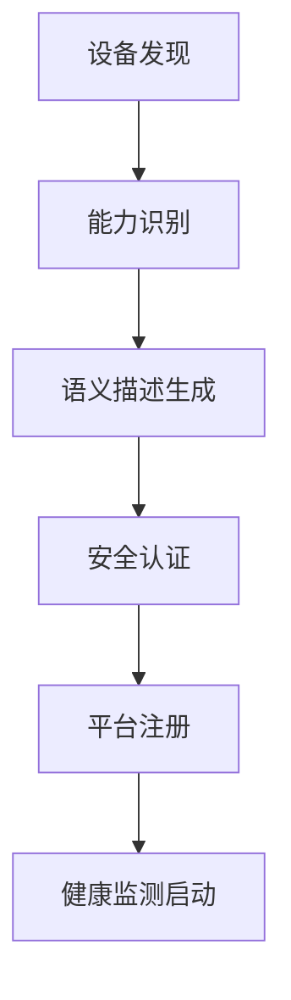

# 设备自注册与健康监测机制

## 1. 理论框架

### 1.1 设备自注册机制

- 设备自动发现、识别、注册到语义互操作平台。
- 支持动态设备加入、离开、更新，实现即插即用。
- 结合语义描述、能力发现、安全认证等机制。

### 1.2 健康监测机制

- 实时监控设备运行状态、性能指标、故障预警。
- 支持多维度健康评估：硬件、软件、网络、数据质量。
- 结合机器学习预测设备寿命、维护需求。

## 2. 算法实现

### 2.1 设备自注册流程



### 2.2 Python代码：设备自注册

```python
import asyncio
import json
from typing import Dict, List
from dataclasses import dataclass

@dataclass
class DeviceCapability:
    capability_id: str
    capability_type: str
    parameters: Dict
    constraints: Dict

@dataclass
class DeviceSemanticDescription:
    device_id: str
    device_type: str
    manufacturer: str
    model: str
    capabilities: List[DeviceCapability]
    semantic_hash: str

class DeviceAutoRegistration:
    def __init__(self):
        self.discovery_service = DeviceDiscoveryService()
        self.semantic_generator = SemanticDescriptionGenerator()
        self.security_validator = SecurityValidator()
        self.health_monitor = HealthMonitor()
    
    async def register_device(self, device_info: Dict) -> Dict:
        """设备自注册主流程"""
        try:
            # 1. 设备发现与识别
            discovered_device = await self.discovery_service.discover_device(device_info)
            
            # 2. 能力识别
            capabilities = await self.identify_capabilities(discovered_device)
            
            # 3. 语义描述生成
            semantic_description = await self.semantic_generator.generate_description(
                discovered_device, capabilities
            )
            
            # 4. 安全认证
            auth_result = await self.security_validator.authenticate_device(discovered_device)
            if not auth_result['authenticated']:
                raise Exception(f"Device authentication failed: {auth_result['reason']}")
            
            # 5. 平台注册
            registration_result = await self.register_to_platform(semantic_description)
            
            # 6. 启动健康监测
            health_monitor_id = await self.health_monitor.start_monitoring(
                discovered_device['device_id']
            )
            
            return {
                'registration_id': registration_result['registration_id'],
                'device_id': discovered_device['device_id'],
                'semantic_description': semantic_description,
                'health_monitor_id': health_monitor_id,
                'status': 'success'
            }
            
        except Exception as e:
            return {
                'status': 'failed',
                'error': str(e)
            }
    
    async def identify_capabilities(self, device: Dict) -> List[DeviceCapability]:
        """识别设备能力"""
        capabilities = []
        
        # 基于设备类型推断能力
        device_type = device.get('device_type', 'unknown')
        if device_type == 'sensor':
            capabilities.append(DeviceCapability(
                capability_id='sensing',
                capability_type='data_collection',
                parameters={'data_types': ['temperature', 'humidity']},
                constraints={'sampling_rate': '1Hz'}
            ))
        elif device_type == 'actuator':
            capabilities.append(DeviceCapability(
                capability_id='actuation',
                capability_type='control',
                parameters={'control_types': ['on_off', 'dimming']},
                constraints={'response_time': '100ms'}
            ))
        
        # 基于设备描述提取能力
        device_description = device.get('description', '')
        if 'communication' in device_description.lower():
            capabilities.append(DeviceCapability(
                capability_id='communication',
                capability_type='data_transmission',
                parameters={'protocols': ['MQTT', 'HTTP']},
                constraints={'bandwidth': '1Mbps'}
            ))
        
        return capabilities

class HealthMonitor:
    def __init__(self):
        self.monitoring_tasks = {}
        self.health_metrics = {}
    
    async def start_monitoring(self, device_id: str) -> str:
        """启动设备健康监测"""
        monitor_id = f"health_monitor_{device_id}"
        
        # 创建监测任务
        task = asyncio.create_task(self.monitor_device_health(device_id))
        self.monitoring_tasks[monitor_id] = task
        
        return monitor_id
    
    async def monitor_device_health(self, device_id: str):
        """设备健康监测主循环"""
        while True:
            try:
                # 1. 收集健康指标
                health_metrics = await self.collect_health_metrics(device_id)
                
                # 2. 评估健康状态
                health_status = await self.evaluate_health_status(health_metrics)
                
                # 3. 更新健康记录
                await self.update_health_record(device_id, health_status)
                
                # 4. 检查是否需要告警
                if health_status['overall_score'] < 0.7:
                    await self.trigger_health_alert(device_id, health_status)
                
                # 5. 等待下次监测
                await asyncio.sleep(60)  # 每分钟监测一次
                
            except Exception as e:
                print(f"Health monitoring error for device {device_id}: {e}")
                await asyncio.sleep(60)
    
    async def collect_health_metrics(self, device_id: str) -> Dict:
        """收集设备健康指标"""
        metrics = {
            'cpu_usage': await self.get_cpu_usage(device_id),
            'memory_usage': await self.get_memory_usage(device_id),
            'network_latency': await self.get_network_latency(device_id),
            'data_quality': await self.get_data_quality(device_id),
            'response_time': await self.get_response_time(device_id),
        }
        return metrics
    
    async def evaluate_health_status(self, metrics: Dict) -> Dict:
        """评估设备健康状态"""
        # 计算各项指标得分
        cpu_score = self.calculate_cpu_score(metrics['cpu_usage'])
        memory_score = self.calculate_memory_score(metrics['memory_usage'])
        network_score = self.calculate_network_score(metrics['network_latency'])
        data_score = self.calculate_data_score(metrics['data_quality'])
        response_score = self.calculate_response_score(metrics['response_time'])
        
        # 综合评分
        overall_score = (cpu_score + memory_score + network_score + 
                        data_score + response_score) / 5
        
        return {
            'overall_score': overall_score,
            'component_scores': {
                'cpu': cpu_score,
                'memory': memory_score,
                'network': network_score,
                'data_quality': data_score,
                'response_time': response_score
            },
            'health_level': self.determine_health_level(overall_score),
            'recommendations': self.generate_recommendations(metrics)
        }
```

### 2.3 Rust伪代码：设备注册与健康监测

```rust
pub struct DeviceAutoRegistration {
    discovery_service: DeviceDiscoveryService,
    semantic_generator: SemanticDescriptionGenerator,
    security_validator: SecurityValidator,
    health_monitor: HealthMonitor,
}

impl DeviceAutoRegistration {
    pub async fn register_device(
        &self,
        device_info: &DeviceInfo,
    ) -> Result<RegistrationResult, RegistrationError> {
        // 1. 设备发现
        let discovered_device = self.discovery_service.discover_device(device_info).await?;
        
        // 2. 能力识别
        let capabilities = self.identify_capabilities(&discovered_device).await?;
        
        // 3. 语义描述生成
        let semantic_description = self.semantic_generator.generate_description(
            &discovered_device,
            &capabilities,
        ).await?;
        
        // 4. 安全认证
        let auth_result = self.security_validator.authenticate_device(&discovered_device).await?;
        if !auth_result.is_authenticated {
            return Err(RegistrationError::AuthenticationFailed(auth_result.reason));
        }
        
        // 5. 平台注册
        let registration = self.register_to_platform(&semantic_description).await?;
        
        // 6. 启动健康监测
        let health_monitor_id = self.health_monitor.start_monitoring(
            &discovered_device.device_id,
        ).await?;
        
        Ok(RegistrationResult {
            registration_id: registration.id,
            device_id: discovered_device.device_id,
            semantic_description,
            health_monitor_id,
            status: RegistrationStatus::Success,
        })
    }
    
    async fn identify_capabilities(
        &self,
        device: &DiscoveredDevice,
    ) -> Result<Vec<DeviceCapability>, RegistrationError> {
        let mut capabilities = Vec::new();
        
        // 基于设备类型推断能力
        match device.device_type.as_str() {
            "sensor" => {
                capabilities.push(DeviceCapability {
                    capability_id: "sensing".to_string(),
                    capability_type: "data_collection".to_string(),
                    parameters: self.extract_sensor_parameters(device).await?,
                    constraints: self.extract_sensor_constraints(device).await?,
                });
            },
            "actuator" => {
                capabilities.push(DeviceCapability {
                    capability_id: "actuation".to_string(),
                    capability_type: "control".to_string(),
                    parameters: self.extract_actuator_parameters(device).await?,
                    constraints: self.extract_actuator_constraints(device).await?,
                });
            },
            _ => {
                // 通用能力识别
                capabilities.extend(self.extract_generic_capabilities(device).await?);
            }
        }
        
        Ok(capabilities)
    }
}

pub struct HealthMonitor {
    monitoring_tasks: HashMap<String, JoinHandle<()>>,
    health_metrics: Arc<RwLock<HashMap<String, HealthMetrics>>>,
}

impl HealthMonitor {
    pub async fn start_monitoring(
        &self,
        device_id: &str,
    ) -> Result<String, HealthMonitorError> {
        let monitor_id = format!("health_monitor_{}", device_id);
        
        // 创建监测任务
        let task_handle = tokio::spawn({
            let device_id = device_id.to_string();
            let health_metrics = Arc::clone(&self.health_metrics);
            
            async move {
                Self::monitor_device_health(&device_id, &health_metrics).await;
            }
        });
        
        // 存储任务句柄
        self.monitoring_tasks.insert(monitor_id.clone(), task_handle);
        
        Ok(monitor_id)
    }
    
    async fn monitor_device_health(
        device_id: &str,
        health_metrics: &Arc<RwLock<HashMap<String, HealthMetrics>>>,
    ) {
        let mut interval = tokio::time::interval(Duration::from_secs(60));
        
        loop {
            interval.tick().await;
            
            match Self::collect_health_metrics(device_id).await {
                Ok(metrics) => {
                    let health_status = Self::evaluate_health_status(&metrics).await;
                    
                    // 更新健康记录
                    let mut metrics_guard = health_metrics.write().await;
                    metrics_guard.insert(device_id.to_string(), health_status);
                    
                    // 检查告警
                    if health_status.overall_score < 0.7 {
                        Self::trigger_health_alert(device_id, &health_status).await;
                    }
                },
                Err(e) => {
                    eprintln!("Health monitoring error for device {}: {}", device_id, e);
                }
            }
        }
    }
    
    async fn collect_health_metrics(device_id: &str) -> Result<HealthMetrics, HealthMonitorError> {
        let cpu_usage = Self::get_cpu_usage(device_id).await?;
        let memory_usage = Self::get_memory_usage(device_id).await?;
        let network_latency = Self::get_network_latency(device_id).await?;
        let data_quality = Self::get_data_quality(device_id).await?;
        let response_time = Self::get_response_time(device_id).await?;
        
        Ok(HealthMetrics {
            cpu_usage,
            memory_usage,
            network_latency,
            data_quality,
            response_time,
        })
    }
}
```

### 2.4 健康预测算法

```python
import numpy as np
from sklearn.ensemble import RandomForestRegressor
from sklearn.preprocessing import StandardScaler

class HealthPredictor:
    def __init__(self):
        self.model = RandomForestRegressor(n_estimators=100)
        self.scaler = StandardScaler()
        self.is_trained = False
    
    def train(self, historical_data: List[Dict]) -> None:
        """训练健康预测模型"""
        # 准备训练数据
        X = []
        y = []
        
        for data_point in historical_data:
            features = [
                data_point['cpu_usage'],
                data_point['memory_usage'],
                data_point['network_latency'],
                data_point['data_quality'],
                data_point['response_time']
            ]
            X.append(features)
            y.append(data_point['health_score'])
        
        # 数据标准化
        X_scaled = self.scaler.fit_transform(X)
        
        # 训练模型
        self.model.fit(X_scaled, y)
        self.is_trained = True
    
    def predict_health_trend(self, current_metrics: Dict, days_ahead: int = 30) -> List[float]:
        """预测未来健康趋势"""
        if not self.is_trained:
            raise Exception("Model not trained yet")
        
        # 基于当前指标预测未来趋势
        current_features = [
            current_metrics['cpu_usage'],
            current_metrics['memory_usage'],
            current_metrics['network_latency'],
            current_metrics['data_quality'],
            current_metrics['response_time']
        ]
        
        # 模拟未来指标变化
        predictions = []
        for day in range(days_ahead):
            # 添加一些随机变化模拟真实情况
            simulated_features = current_features.copy()
            for i in range(len(simulated_features)):
                simulated_features[i] += np.random.normal(0, 0.01)
            
            # 标准化并预测
            features_scaled = self.scaler.transform([simulated_features])
            prediction = self.model.predict(features_scaled)[0]
            predictions.append(max(0.0, min(1.0, prediction)))  # 限制在0-1范围内
        
        return predictions
```

## 3. 测试用例

### 3.1 Python设备注册测试

```python
async def test_device_auto_registration():
    registration = DeviceAutoRegistration()
    device_info = {
        'device_id': 'sensor_001',
        'device_type': 'sensor',
        'manufacturer': 'TestCorp',
        'model': 'TS100',
        'description': 'Temperature sensor with MQTT communication'
    }
    
    result = await registration.register_device(device_info)
    assert result['status'] == 'success'
    assert 'registration_id' in result
    assert 'health_monitor_id' in result
```

### 3.2 Rust健康监测测试

```rust
#[tokio::test]
async fn test_health_monitoring() {
    let health_monitor = HealthMonitor::new();
    let device_id = "test_device_001";
    
    let monitor_id = health_monitor.start_monitoring(device_id).await;
    assert!(monitor_id.is_ok());
    
    // 等待一段时间让监测任务运行
    tokio::time::sleep(Duration::from_secs(2)).await;
    
    // 检查健康指标是否已收集
    let metrics_guard = health_monitor.health_metrics.read().await;
    assert!(metrics_guard.contains_key(device_id));
}
```

### 3.3 Python健康预测测试

```python
def test_health_predictor():
    predictor = HealthPredictor()
    
    // 模拟历史数据
    historical_data = [
        {'cpu_usage': 0.3, 'memory_usage': 0.4, 'network_latency': 50, 
         'data_quality': 0.9, 'response_time': 100, 'health_score': 0.8},
        {'cpu_usage': 0.5, 'memory_usage': 0.6, 'network_latency': 80, 
         'data_quality': 0.7, 'response_time': 150, 'health_score': 0.6},
    ]
    
    predictor.train(historical_data)
    
    current_metrics = {
        'cpu_usage': 0.4,
        'memory_usage': 0.5,
        'network_latency': 60,
        'data_quality': 0.8,
        'response_time': 120
    }
    
    predictions = predictor.predict_health_trend(current_metrics, days_ahead=7)
    assert len(predictions) == 7
    assert all(0.0 <= p <= 1.0 for p in predictions)
```

## 4. 性能与优化建议

- 采用异步处理，提升设备注册和健康监测效率。
- 支持批量设备注册，减少网络开销。
- 健康监测数据压缩存储，节省存储空间。
- 预测模型增量更新，适应设备状态变化。

## 5. 设备寿命、维护、监管的自注册与健康监测递归极限扩展

### 5.1 自注册机制递归扩展

- 设备自注册流程中嵌入寿命、维护、监管信息的自动采集与同步。
- 注册时自动校验设备寿命状态、维护计划、合规性要求。

### 5.2 健康监测与维护递归集成

- 健康监测模块递归集成寿命预测、维护计划、合规性风险预警等功能。
- 支持设备全生命周期的健康、维护、监管信息闭环管理。

### 5.3 监管与合规性递归集成

- 注册与监测流程中自动对接行业监管平台，递归同步合规性与审计信息。
- 支持多行业、多平台、多监管场景的合规性闭环。

### 5.4 行业应用与质量评估

- 工业、医疗、能源等行业的设备自注册与健康监测均需递归集成寿命、维护、监管信息，实现全生命周期闭环。
- 递归评估自注册与健康监测机制的合规性、智能化、可追溯性。

### 5.5 未来展望

- 持续递归扩展，推动自注册、健康监测、维护、监管机制的协同演进。
- 支持AI驱动的自演化设备治理与全生命周期闭环管理。

这个文档提供了设备自注册与健康监测机制的完整实现，包括自注册流程、健康监测、预测算法等核心功能。
