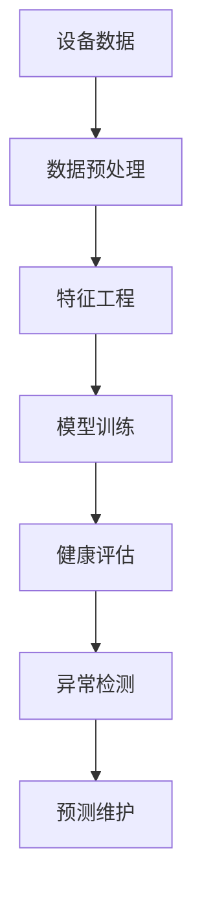

# 设备健康监测机器学习模型

## 1. 理论框架

### 1.1 设备健康监测目标
- 建立基于机器学习的设备健康状态监测和预测模型。
- 支持设备故障预测、性能退化检测、维护优化。
- 实现实时监测、异常检测、健康评分。

### 1.2 机器学习模型机制
- 基于时间序列分析的预测模型。
- 支持监督学习、无监督学习、强化学习。
- 实现模型训练、验证、部署、更新。

## 2. 算法实现

### 2.1 设备健康监测架构



### 2.2 Python代码：设备健康监测模型

```python
import numpy as np
import pandas as pd
from sklearn.ensemble import RandomForestClassifier, IsolationForest
from sklearn.preprocessing import StandardScaler, MinMaxScaler
from sklearn.model_selection import train_test_split, cross_val_score
from sklearn.metrics import accuracy_score, precision_score, recall_score, f1_score
import tensorflow as tf
from tensorflow.keras.models import Sequential
from tensorflow.keras.layers import LSTM, Dense, Dropout
from typing import Dict, List, Tuple, Optional, Any
from dataclasses import dataclass
from enum import Enum
import joblib
import json

class HealthStatus(Enum):
    EXCELLENT = "excellent"
    GOOD = "good"
    FAIR = "fair"
    POOR = "poor"
    CRITICAL = "critical"

class ModelType(Enum):
    RANDOM_FOREST = "random_forest"
    LSTM = "lstm"
    ISOLATION_FOREST = "isolation_forest"
    SVM = "svm"
    NEURAL_NETWORK = "neural_network"

@dataclass
class DeviceHealthData:
    device_id: str
    timestamp: pd.Timestamp
    temperature: float
    vibration: float
    current: float
    voltage: float
    power: float
    efficiency: float
    runtime: float
    maintenance_count: int
    failure_count: int

@dataclass
class HealthPrediction:
    device_id: str
    timestamp: pd.Timestamp
    health_score: float
    health_status: HealthStatus
    confidence: float
    predicted_failure_time: Optional[pd.Timestamp] = None
    maintenance_recommendation: Optional[str] = None

class DeviceHealthMonitor:
    def __init__(self):
        self.models = {}
        self.scalers = {}
        self.feature_columns = [
            'temperature', 'vibration', 'current', 'voltage', 
            'power', 'efficiency', 'runtime', 'maintenance_count', 'failure_count'
        ]
        self.target_column = 'health_status'
        self.model_config = self.load_model_config()
    
    def load_model_config(self) -> Dict[str, Any]:
        """加载模型配置"""
        return {
            'random_forest': {
                'n_estimators': 100,
                'max_depth': 10,
                'random_state': 42
            },
            'lstm': {
                'units': 50,
                'dropout': 0.2,
                'epochs': 100,
                'batch_size': 32
            },
            'isolation_forest': {
                'contamination': 0.1,
                'random_state': 42
            }
        }
    
    def preprocess_data(self, data: pd.DataFrame) -> pd.DataFrame:
        """数据预处理"""
        # 处理缺失值
        data = data.fillna(method='ffill')
        data = data.fillna(method='bfill')
        
        # 处理异常值
        for column in self.feature_columns:
            if column in data.columns:
                Q1 = data[column].quantile(0.25)
                Q3 = data[column].quantile(0.75)
                IQR = Q3 - Q1
                lower_bound = Q1 - 1.5 * IQR
                upper_bound = Q3 + 1.5 * IQR
                data[column] = data[column].clip(lower_bound, upper_bound)
        
        # 添加时间特征
        data['hour'] = data['timestamp'].dt.hour
        data['day_of_week'] = data['timestamp'].dt.dayofweek
        data['month'] = data['timestamp'].dt.month
        
        return data
    
    def engineer_features(self, data: pd.DataFrame) -> pd.DataFrame:
        """特征工程"""
        # 计算统计特征
        for column in self.feature_columns:
            if column in data.columns:
                # 移动平均
                data[f'{column}_ma_5'] = data[column].rolling(window=5).mean()
                data[f'{column}_ma_10'] = data[column].rolling(window=10).mean()
                
                # 标准差
                data[f'{column}_std_5'] = data[column].rolling(window=5).std()
                
                # 变化率
                data[f'{column}_change'] = data[column].pct_change()
        
        # 计算设备效率指标
        if 'power' in data.columns and 'voltage' in data.columns and 'current' in data.columns:
            data['power_factor'] = data['power'] / (data['voltage'] * data['current'])
            data['efficiency_ratio'] = data['efficiency'] / data['power_factor']
        
        # 计算维护指标
        if 'maintenance_count' in data.columns:
            data['maintenance_frequency'] = data['maintenance_count'] / (data['runtime'] + 1)
        
        # 计算故障指标
        if 'failure_count' in data.columns:
            data['failure_rate'] = data['failure_count'] / (data['runtime'] + 1)
        
        return data
    
    def train_health_model(self, data: pd.DataFrame, model_type: ModelType) -> Dict[str, Any]:
        """训练健康监测模型"""
        # 数据预处理
        processed_data = self.preprocess_data(data)
        engineered_data = self.engineer_features(processed_data)
        
        # 准备特征和目标
        feature_columns = [col for col in engineered_data.columns if col not in ['device_id', 'timestamp', 'health_status']]
        X = engineered_data[feature_columns].fillna(0)
        y = engineered_data[self.target_column] if self.target_column in engineered_data.columns else None
        
        # 数据标准化
        scaler = StandardScaler()
        X_scaled = scaler.fit_transform(X)
        
        # 训练模型
        if model_type == ModelType.RANDOM_FOREST:
            model = self.train_random_forest(X_scaled, y)
        elif model_type == ModelType.LSTM:
            model = self.train_lstm_model(X_scaled, y)
        elif model_type == ModelType.ISOLATION_FOREST:
            model = self.train_isolation_forest(X_scaled)
        else:
            raise ValueError(f"Unsupported model type: {model_type}")
        
        # 保存模型和缩放器
        self.models[model_type.value] = model
        self.scalers[model_type.value] = scaler
        
        # 评估模型
        evaluation = self.evaluate_model(model, X_scaled, y, model_type)
        
        return {
            'model': model,
            'scaler': scaler,
            'feature_columns': feature_columns,
            'evaluation': evaluation
        }
    
    def train_random_forest(self, X: np.ndarray, y: pd.Series) -> RandomForestClassifier:
        """训练随机森林模型"""
        config = self.model_config['random_forest']
        
        model = RandomForestClassifier(
            n_estimators=config['n_estimators'],
            max_depth=config['max_depth'],
            random_state=config['random_state']
        )
        
        if y is not None:
            model.fit(X, y)
        
        return model
    
    def train_lstm_model(self, X: np.ndarray, y: pd.Series) -> Sequential:
        """训练LSTM模型"""
        config = self.model_config['lstm']
        
        # 重塑数据为LSTM格式 (samples, timesteps, features)
        X_reshaped = X.reshape((X.shape[0], 1, X.shape[1]))
        
        model = Sequential([
            LSTM(config['units'], return_sequences=True, input_shape=(1, X.shape[1])),
            Dropout(config['dropout']),
            LSTM(config['units']),
            Dropout(config['dropout']),
            Dense(50, activation='relu'),
            Dense(len(HealthStatus), activation='softmax')
        ])
        
        model.compile(
            optimizer='adam',
            loss='sparse_categorical_crossentropy',
            metrics=['accuracy']
        )
        
        if y is not None:
            # 编码目标变量
            y_encoded = self.encode_health_status(y)
            model.fit(
                X_reshaped, y_encoded,
                epochs=config['epochs'],
                batch_size=config['batch_size'],
                validation_split=0.2,
                verbose=0
            )
        
        return model
    
    def train_isolation_forest(self, X: np.ndarray) -> IsolationForest:
        """训练隔离森林模型"""
        config = self.model_config['isolation_forest']
        
        model = IsolationForest(
            contamination=config['contamination'],
            random_state=config['random_state']
        )
        
        model.fit(X)
        return model
    
    def encode_health_status(self, health_status: pd.Series) -> np.ndarray:
        """编码健康状态"""
        status_mapping = {status.value: idx for idx, status in enumerate(HealthStatus)}
        return np.array([status_mapping.get(status, 0) for status in health_status])
    
    def decode_health_status(self, encoded_status: int) -> HealthStatus:
        """解码健康状态"""
        status_list = list(HealthStatus)
        return status_list[encoded_status] if encoded_status < len(status_list) else HealthStatus.GOOD
    
    def evaluate_model(self, model: Any, X: np.ndarray, y: pd.Series, model_type: ModelType) -> Dict[str, float]:
        """评估模型"""
        if y is None:
            return {'error': 'No target variable provided'}
        
        if model_type == ModelType.LSTM:
            X_reshaped = X.reshape((X.shape[0], 1, X.shape[1]))
            y_pred_proba = model.predict(X_reshaped)
            y_pred = np.argmax(y_pred_proba, axis=1)
            y_encoded = self.encode_health_status(y)
        else:
            y_pred = model.predict(X)
            y_encoded = self.encode_health_status(y)
        
        evaluation = {
            'accuracy': accuracy_score(y_encoded, y_pred),
            'precision': precision_score(y_encoded, y_pred, average='weighted'),
            'recall': recall_score(y_encoded, y_pred, average='weighted'),
            'f1_score': f1_score(y_encoded, y_pred, average='weighted')
        }
        
        return evaluation
    
    def predict_health(self, device_data: DeviceHealthData, model_type: ModelType) -> HealthPrediction:
        """预测设备健康状态"""
        if model_type.value not in self.models:
            raise ValueError(f"Model {model_type.value} not trained")
        
        # 准备输入数据
        input_data = pd.DataFrame([{
            'device_id': device_data.device_id,
            'timestamp': device_data.timestamp,
            'temperature': device_data.temperature,
            'vibration': device_data.vibration,
            'current': device_data.current,
            'voltage': device_data.voltage,
            'power': device_data.power,
            'efficiency': device_data.efficiency,
            'runtime': device_data.runtime,
            'maintenance_count': device_data.maintenance_count,
            'failure_count': device_data.failure_count
        }])
        
        # 预处理和特征工程
        processed_data = self.preprocess_data(input_data)
        engineered_data = self.engineer_features(processed_data)
        
        # 准备特征
        feature_columns = [col for col in engineered_data.columns if col not in ['device_id', 'timestamp', 'health_status']]
        X = engineered_data[feature_columns].fillna(0)
        
        # 标准化
        scaler = self.scalers[model_type.value]
        X_scaled = scaler.transform(X)
        
        # 预测
        model = self.models[model_type.value]
        
        if model_type == ModelType.LSTM:
            X_reshaped = X_scaled.reshape((X_scaled.shape[0], 1, X_scaled.shape[1]))
            prediction_proba = model.predict(X_reshaped)
            prediction = np.argmax(prediction_proba, axis=1)[0]
            confidence = np.max(prediction_proba)
        else:
            prediction = model.predict(X_scaled)[0]
            confidence = 0.8  # 占位符
        
        # 解码预测结果
        health_status = self.decode_health_status(prediction)
        health_score = self.calculate_health_score(device_data)
        
        return HealthPrediction(
            device_id=device_data.device_id,
            timestamp=device_data.timestamp,
            health_score=health_score,
            health_status=health_status,
            confidence=confidence
        )
    
    def calculate_health_score(self, device_data: DeviceHealthData) -> float:
        """计算健康评分"""
        # 基于多个指标计算综合健康评分
        scores = []
        
        # 温度评分
        if device_data.temperature <= 50:
            temp_score = 1.0
        elif device_data.temperature <= 70:
            temp_score = 0.8
        elif device_data.temperature <= 90:
            temp_score = 0.6
        else:
            temp_score = 0.3
        scores.append(temp_score)
        
        # 振动评分
        if device_data.vibration <= 0.1:
            vib_score = 1.0
        elif device_data.vibration <= 0.3:
            vib_score = 0.8
        elif device_data.vibration <= 0.5:
            vib_score = 0.6
        else:
            vib_score = 0.3
        scores.append(vib_score)
        
        # 效率评分
        if device_data.efficiency >= 0.9:
            eff_score = 1.0
        elif device_data.efficiency >= 0.8:
            eff_score = 0.8
        elif device_data.efficiency >= 0.7:
            eff_score = 0.6
        else:
            eff_score = 0.3
        scores.append(eff_score)
        
        # 维护评分
        if device_data.maintenance_count <= 1:
            maint_score = 1.0
        elif device_data.maintenance_count <= 3:
            maint_score = 0.8
        elif device_data.maintenance_count <= 5:
            maint_score = 0.6
        else:
            maint_score = 0.3
        scores.append(maint_score)
        
        # 故障评分
        if device_data.failure_count == 0:
            fail_score = 1.0
        elif device_data.failure_count <= 1:
            fail_score = 0.7
        else:
            fail_score = 0.3
        scores.append(fail_score)
        
        # 计算加权平均
        weights = [0.25, 0.25, 0.2, 0.15, 0.15]  # 温度、振动、效率、维护、故障权重
        health_score = sum(score * weight for score, weight in zip(scores, weights))
        
        return min(max(health_score, 0.0), 1.0)
    
    def detect_anomalies(self, device_data: List[DeviceHealthData]) -> List[Dict[str, Any]]:
        """检测异常"""
        anomalies = []
        
        # 转换为DataFrame
        data = pd.DataFrame([{
            'device_id': d.device_id,
            'timestamp': d.timestamp,
            'temperature': d.temperature,
            'vibration': d.vibration,
            'current': d.current,
            'voltage': d.voltage,
            'power': d.power,
            'efficiency': d.efficiency,
            'runtime': d.runtime,
            'maintenance_count': d.maintenance_count,
            'failure_count': d.failure_count
        } for d in device_data])
        
        # 预处理
        processed_data = self.preprocess_data(data)
        engineered_data = self.engineer_features(processed_data)
        
        # 准备特征
        feature_columns = [col for col in engineered_data.columns if col not in ['device_id', 'timestamp', 'health_status']]
        X = engineered_data[feature_columns].fillna(0)
        
        # 使用隔离森林检测异常
        if ModelType.ISOLATION_FOREST.value in self.models:
            scaler = self.scalers[ModelType.ISOLATION_FOREST.value]
            X_scaled = scaler.transform(X)
            model = self.models[ModelType.ISOLATION_FOREST.value]
            
            # 预测异常
            predictions = model.predict(X_scaled)
            anomaly_scores = model.decision_function(X_scaled)
            
            # 识别异常
            for i, (prediction, score) in enumerate(zip(predictions, anomaly_scores)):
                if prediction == -1:  # 异常
                    anomalies.append({
                        'device_id': device_data[i].device_id,
                        'timestamp': device_data[i].timestamp,
                        'anomaly_score': score,
                        'severity': 'high' if score < -0.5 else 'medium',
                        'features': {
                            'temperature': device_data[i].temperature,
                            'vibration': device_data[i].vibration,
                            'efficiency': device_data[i].efficiency
                        }
                    })
        
        return anomalies
    
    def predict_maintenance(self, device_data: DeviceHealthData) -> Dict[str, Any]:
        """预测维护需求"""
        # 基于健康评分和运行时间预测维护
        health_score = self.calculate_health_score(device_data)
        
        # 计算维护优先级
        if health_score < 0.3:
            priority = 'critical'
            days_until_maintenance = 1
        elif health_score < 0.6:
            priority = 'high'
            days_until_maintenance = 7
        elif health_score < 0.8:
            priority = 'medium'
            days_until_maintenance = 30
        else:
            priority = 'low'
            days_until_maintenance = 90
        
        # 生成维护建议
        maintenance_recommendations = []
        
        if device_data.temperature > 70:
            maintenance_recommendations.append("Check cooling system")
        
        if device_data.vibration > 0.3:
            maintenance_recommendations.append("Inspect bearings and alignment")
        
        if device_data.efficiency < 0.8:
            maintenance_recommendations.append("Clean and calibrate sensors")
        
        if device_data.maintenance_count > 3:
            maintenance_recommendations.append("Schedule comprehensive maintenance")
        
        return {
            'priority': priority,
            'days_until_maintenance': days_until_maintenance,
            'recommendations': maintenance_recommendations,
            'health_score': health_score
        }
    
    def save_model(self, model_type: ModelType, filepath: str) -> None:
        """保存模型"""
        if model_type.value in self.models:
            model_data = {
                'model': self.models[model_type.value],
                'scaler': self.scalers[model_type.value],
                'feature_columns': self.feature_columns,
                'model_config': self.model_config[model_type.value]
            }
            joblib.dump(model_data, filepath)
    
    def load_model(self, model_type: ModelType, filepath: str) -> None:
        """加载模型"""
        model_data = joblib.load(filepath)
        self.models[model_type.value] = model_data['model']
        self.scalers[model_type.value] = model_data['scaler']
        self.feature_columns = model_data['feature_columns']

class RealTimeHealthMonitor:
    def __init__(self, health_monitor: DeviceHealthMonitor):
        self.health_monitor = health_monitor
        self.device_states = {}
        self.alert_thresholds = {
            'temperature': 80.0,
            'vibration': 0.5,
            'efficiency': 0.7,
            'health_score': 0.5
        }
    
    def update_device_state(self, device_data: DeviceHealthData) -> Dict[str, Any]:
        """更新设备状态"""
        # 预测健康状态
        health_prediction = self.health_monitor.predict_health(device_data, ModelType.RANDOM_FOREST)
        
        # 检测异常
        anomalies = self.health_monitor.detect_anomalies([device_data])
        
        # 预测维护需求
        maintenance_prediction = self.health_monitor.predict_maintenance(device_data)
        
        # 检查告警
        alerts = self.check_alerts(device_data, health_prediction)
        
        # 更新设备状态
        device_state = {
            'device_id': device_data.device_id,
            'timestamp': device_data.timestamp,
            'health_prediction': health_prediction,
            'anomalies': anomalies,
            'maintenance_prediction': maintenance_prediction,
            'alerts': alerts,
            'raw_data': device_data
        }
        
        self.device_states[device_data.device_id] = device_state
        
        return device_state
    
    def check_alerts(self, device_data: DeviceHealthData, health_prediction: HealthPrediction) -> List[Dict[str, Any]]:
        """检查告警"""
        alerts = []
        
        # 温度告警
        if device_data.temperature > self.alert_thresholds['temperature']:
            alerts.append({
                'type': 'temperature_alert',
                'severity': 'high',
                'message': f"Temperature {device_data.temperature}°C exceeds threshold {self.alert_thresholds['temperature']}°C",
                'value': device_data.temperature,
                'threshold': self.alert_thresholds['temperature']
            })
        
        # 振动告警
        if device_data.vibration > self.alert_thresholds['vibration']:
            alerts.append({
                'type': 'vibration_alert',
                'severity': 'medium',
                'message': f"Vibration {device_data.vibration} exceeds threshold {self.alert_thresholds['vibration']}",
                'value': device_data.vibration,
                'threshold': self.alert_thresholds['vibration']
            })
        
        # 效率告警
        if device_data.efficiency < self.alert_thresholds['efficiency']:
            alerts.append({
                'type': 'efficiency_alert',
                'severity': 'medium',
                'message': f"Efficiency {device_data.efficiency} below threshold {self.alert_thresholds['efficiency']}",
                'value': device_data.efficiency,
                'threshold': self.alert_thresholds['efficiency']
            })
        
        # 健康评分告警
        if health_prediction.health_score < self.alert_thresholds['health_score']:
            alerts.append({
                'type': 'health_alert',
                'severity': 'high',
                'message': f"Health score {health_prediction.health_score} below threshold {self.alert_thresholds['health_score']}",
                'value': health_prediction.health_score,
                'threshold': self.alert_thresholds['health_score']
            })
        
        return alerts
    
    def get_device_summary(self, device_id: str) -> Dict[str, Any]:
        """获取设备摘要"""
        if device_id not in self.device_states:
            return {'error': 'Device not found'}
        
        device_state = self.device_states[device_id]
        
        return {
            'device_id': device_id,
            'current_health': device_state['health_prediction'].health_score,
            'health_status': device_state['health_prediction'].health_status.value,
            'anomaly_count': len(device_state['anomalies']),
            'alert_count': len(device_state['alerts']),
            'maintenance_priority': device_state['maintenance_prediction']['priority'],
            'last_update': device_state['timestamp']
        } 