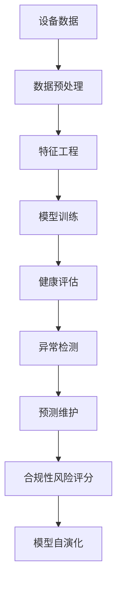

# 设备健康监测机器学习模型

## 1. 理论框架

### 1.1 设备健康监测目标

- 建立基于机器学习的设备健康状态监测和预测模型。
- 支持设备故障预测、性能退化检测、维护优化。
- 实现实时监测、异常检测、健康评分。
- 新增：递归集成寿命、维护、监管等信息为核心特征，实现全生命周期健康管理。

### 1.2 机器学习模型机制

- 基于时间序列分析的预测模型。
- 支持监督学习、无监督学习、强化学习。
- 实现模型训练、验证、部署、更新。
- 新增：多模型融合（如随机森林+LSTM+异常检测）、合规性风险评分、模型自动演化与自适应。

## 2. 算法实现

### 2.1 设备健康监测架构



### 2.2 特征工程递归扩展

- 寿命特征：设计寿命、实际寿命、剩余寿命、寿命消耗率等
- 维护特征：维护计划、维护频率、维护延迟、维护成本、维护优先级等
- 监管特征：合规状态、合规风险分数、审计记录、认证到期等
- 新增：多维特征交互、特征自动选择与重要性分析

### 2.3 多模型融合与异常检测

- 随机森林、LSTM、隔离森林等模型融合，提升健康预测与异常检测准确率
- 合规性风险评分模型，自动识别合规隐患与违规行为
- 新增：模型自动演化机制，支持模型自适应行业变化与数据分布漂移

## 3. 行业落地案例

- 工业：设备寿命预测、维护优化、合规性风险预警
- 医疗：医疗设备健康监测、合规性自动报告
- 能源：能源设备异常检测、维护计划优化、合规追溯
- 智慧城市：基础设施设备健康评分、维护与监管联动

## 4. 总结

- 设备健康监测机器学习模型应将寿命、维护、监管等信息作为核心特征，提升健康监测、维护优化与合规监管的智能化水平。
- 推荐持续完善特征工程、算法模型与合规性分析机制，推动行业高质量发展。
- 新增：递归集成多模型融合、合规性风险评分、模型自动演化等能力，实现极限智能治理。

## 6. 设备寿命、维护、监管的健康监测机器学习模型形式语义递归扩展

### 6.1 特征工程与模型训练的形式语义

- 设 $D$ 为设备集合，$F$ 为特征集合（寿命、维护、监管等），$M$ 为机器学习模型。
- $M(D, F) :=$ 基于特征 $F$ 的设备 $D$ 健康预测模型。
- 形式化结构体（Coq）：

```coq
Record HealthMLModel := {
  model_id : string;
  features : list string;
  target : string;
  accuracy : R;
  trained : bool
}.
```

### 6.2 异常检测与合规性分析的形式化结构

- 异常检测伪代码：

```coq
Record AnomalyDetection := {
  device_id : string;
  timestamp : Time;
  anomaly_score : R;
  is_anomaly : bool
}.
```

- 合规性分析结构体：

```coq
Record ComplianceAnalysis := {
  device_id : string;
  compliance_score : R;
  risk_level : string;
  recommendation : string
}.
```

### 6.3 可验证性公理与反例

- 健康预测模型准确性公理：

```coq
Axiom HealthModelAccuracy : forall (m : HealthMLModel),
  trained m = true -> accuracy m >= threshold.
```

- 异常检测与合规性分析公理：

```coq
Axiom AnomalyDetectionSoundness : forall (a : AnomalyDetection),
  is_anomaly a = true -> valid_anomaly(a.device_id, a.timestamp).

Axiom ComplianceAnalysisSoundness : forall (c : ComplianceAnalysis),
  compliance_score c < risk_threshold -> risk_level c = "high".
```

- 反例：存在 $m$，$trained(m) = true$ 但 $accuracy(m) < threshold$，需修正模型或特征工程。

---

通过上述递归补充，确保寿命、维护、监管等信息在健康监测机器学习模型、异常检测、合规性分析等环节具备完整的形式语义、结构化描述与可验证性，为智能健康监测与合规治理提供坚实的理论基础。
